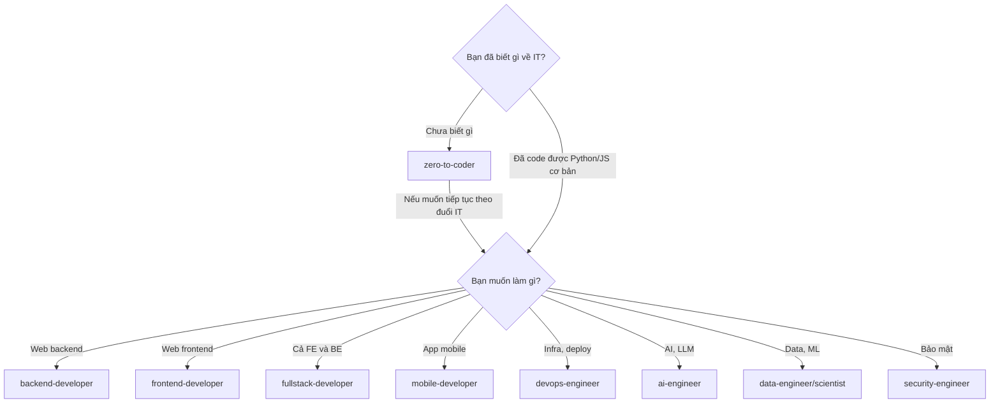

# 🗺️ 00_Roadmaps

> **Tác giả:** Mr.Rom\
> **Phiên bản:** v0.3.0\
> **Tạo lúc:** 16/05/2026\
> **Cập nhật:** 16/05/2026

> 🎯 *Bộ sưu tập **lộ trình học** — hướng dẫn đi xuyên qua các chủ đề theo thứ tự.* Mục đích: giúp bạn có một lộ trình tổng thể để đi xuyên suốt từ bước zero-to-coder cho đến khi trở thành một chuyên gia trong lĩnh vực bạn chọn.

---

## 📋 Có gì trong folder này

Có 2 loại roadmap, phục vụ 2 nhu cầu khác nhau:

| Loại                 | Mục đích                                               | Thời gian  | Tên file suffix            |
| -------------------- | ------------------------------------------------------ | ---------- | -------------------------- |
| 🧭 **Career Roadmap** | Lộ trình theo **nghề** — chuẩn bị làm 1 vai trò cụ thể | 6-12 tháng | `<role>_career-roadmap.md` |
| 🧪 **Lab Series**     | Chuỗi **bài tập thực hành** nhiều stage xuyên chủ đề   | 1-4 tuần   | `<name>_lab-series.md`     |

---

## 🧭 Career Roadmaps (lộ trình nghề)

→ Folder [`career/`](./career/)

| Roadmap | Đối tượng | Thời gian | Trạng thái |
|---|---|---|---|
| ✅ 🌟 [`zero-to-coder`](./career/zero-to-coder_career-roadmap.md) | Người chưa biết gì | 6 tháng FT / 12 tháng PT | Done |
| ✅ 🌟 [`backend-developer`](./career/backend-developer_career-roadmap.md) | Đã biết code, muốn làm backend | 9 tháng FT | Done |
| ✅ 🌟 [`frontend-developer`](./career/frontend-developer_career-roadmap.md) | Muốn làm UI/web | 9 tháng FT | Done |
| ✅ 🌟 [`fullstack-developer`](./career/fullstack-developer_career-roadmap.md) | Cả FE + BE | 12 tháng FT | Done |
| ✅ 🌟 [`mobile-developer`](./career/mobile-developer_career-roadmap.md) | iOS/Android (React Native) | 10 tháng FT | Done |
| ✅ 🌟 [`devops-engineer`](./career/devops-engineer_career-roadmap.md) | Infrastructure + automation | 10 tháng FT | Done |
| ✅ 🌟 [`sre-engineer`](./career/sre-engineer_career-roadmap.md) | Reliability + observability | 10 tháng FT | Done |
| ✅ 🌟 [`platform-engineer`](./career/platform-engineer_career-roadmap.md) | Internal Developer Platform | 10-12 tháng FT | Done |
| ✅ 🌟 [`cloud-engineer`](./career/cloud-engineer_career-roadmap.md) | Cloud architect (AWS) | 10 tháng FT | Done |
| ✅ 🌟 [`data-engineer`](./career/data-engineer_career-roadmap.md) | Data pipeline + warehouse | 10 tháng FT | Done |
| ✅ 🌟 [`data-scientist`](./career/data-scientist_career-roadmap.md) | Phân tích + ML | 12 tháng FT | Done |
| ✅ 🌟 [`ml-engineer`](./career/ml-engineer_career-roadmap.md) | Production ML / MLOps | 12 tháng FT | Done |
| ✅ 🌟 [`ai-engineer`](./career/ai-engineer_career-roadmap.md) | LLM, RAG, AI Agent | 9 tháng FT | Done |
| ✅ 🌟 [`security-engineer`](./career/security-engineer_career-roadmap.md) | Cybersecurity, pentest | 12 tháng FT | Done |
| ✅ 🌟 [`qa-engineer`](./career/qa-engineer_career-roadmap.md) | Test automation (SDET) | 8 tháng FT | Done |
| ✅ 🌟 [`game-developer`](./career/game-developer_career-roadmap.md) | Unity + C# game dev | 12 tháng FT | Done |
| ✅ 🌟 [`blockchain-developer`](./career/blockchain-developer_career-roadmap.md) | Smart contracts, Web3 | 10 tháng FT | Done |

**Tổng: 17 / 17 career roadmap ✅ — đầy đủ cho Phase 1 content buildout.**

## 🧪 Lab Series (chuỗi bài tập thực hành)

→ Folder [`lab-series/`](./lab-series/)

| Series                        | Phạm vi                                       | Thời gian | Trạng thái |
| ----------------------------- | --------------------------------------------- | --------- | ---------- |
| ❌ `docker-to-k8s`             | Docker → K8s → Helm → ArgoCD → Istio (50 bài) | ~40h      | Chưa có    |
| ❌ `full-stack-web-app`        | FE (React) → BE (FastAPI) → DB → Deploy       | ~30h      | Chưa có    |
| ❌ `home-lab-self-hosted`      | Linux server → Docker → monitoring            | ~20h      | Chưa có    |
| ❌ `python-zero-to-production` | Python basics → Flask app → Test → Deploy     | ~25h      | Chưa có    |

---

## 🚀 Bạn nên đọc roadmap nào?

---

## 🆕 Khác giữa Career Roadmap và Lab Series

|                    | Career Roadmap                                                | Lab Series                           |
| ------------------ | ------------------------------------------------------------- | ------------------------------------ |
| **Độ trừu tượng**  | Cao — gồm cả kiến thức lý thuyết                              | Cụ thể — chỉ bài tập / project       |
| **Thời gian**      | 6-12 tháng                                                    | 1-4 tuần                             |
| **Output**         | Job-ready cho 1 nghề                                          | 1 sản phẩm cuối (app, hệ thống)      |
| **Khi chọn**       | Định hướng nghề                                               | Muốn cày hands-on có sản phẩm cụ thể |
| **Có thể kết hợp** | Career roadmap chỉ tới lab series khi đến giai đoạn thực hành |                                      |

---

## 🤝 Muốn thêm roadmap mới?

1. Đọc [`../_Blueprint/06_roadmap-design.md`](../_Blueprint/06_roadmap-design.md) — chuẩn thiết kế
2. Copy template [`../_Blueprint/templates/roadmap_template.md`](../_Blueprint/templates/roadmap_template.md)
3. Đặt vào `career/` hoặc `lab-series/` với đúng naming convention
4. Cập nhật bảng trên (file này) + [`../MASTER-CATALOG.md`](../MASTER-CATALOG.md)
5. Mở PR

---

## 📌 Changelog

- **v0.3.0 (16/05/2026)** — **HOÀN THÀNH 17/17 career roadmaps ✅**. Phase 1 (career navigation layer) done. Lab series chưa có — đợi Phase 2 (lessons) xong.
- **v0.2.0 (16/05/2026)** — Thêm `zero-to-coder` (career roadmap đầu tiên) ✅. Rewrite README cho phù hợp Roadmaps (skeleton template không fit).
- **v0.1.0 (16/05/2026)** — Skeleton template L1.
