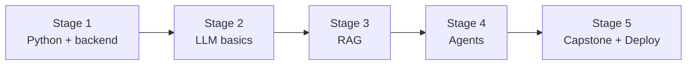

# 🧭 AI Engineer Career Roadmap

> **Tác giả:** Mr.Rom\
> **Phiên bản:** v1.0.0\
> **Tạo lúc:** 16/05/2026\
> **Cập nhật:** 16/05/2026\
> **Đối tượng:** Đã code Python cơ bản, muốn build app AI (LLM/RAG/Agent)\
> **Thời gian ước tính:** ~9 tháng full-time / ~18 tháng part-time\
> **Mức độ:** Junior → Mid

> 🎯 *AI Engineer (khác ML Engineer + Data Scientist) — focus build **app sử dụng AI** (chatbot, RAG, AI agent). Không cần train model từ đầu. Hot 2025-2026.*

---

## 🎯 Mục tiêu cuối lộ trình

- [ ] Build chatbot có memory + tool use
- [ ] RAG system với vector DB (Pinecone/Weaviate)
- [ ] AI Agent multi-step (LangChain/LangGraph)
- [ ] Fine-tune LLM nhỏ (open source) khi cần
- [ ] Deploy AI app production (cost-aware)
- [ ] 1-2 capstone AI app

> 💡 **Khác AI Engineer vs ML Engineer**: AI Eng dùng LLM/embedding có sẵn để build app. ML Eng train model từ đầu. AI Eng entry dễ hơn vì không cần math sâu.

---

## 🗺️ Overview 5 stage

| Stage | Tên | Thời gian | Output |
|---|---|---|---|
| 1 | Python + backend foundation | 2 tháng | API backend cơ bản |
| 2 | LLM basics + prompting | 2 tháng | Chat app với OpenAI/Claude |
| 3 | RAG (Retrieval Augmented Generation) | 2 tháng | Q&A bot trên PDF/docs riêng |
| 4 | AI Agents | 1-2 tháng | Multi-step agent với tools |
| 5 | Capstone + Deploy | 1-2 tháng | App production live |

---

## Stage 1 — Python + Backend Foundation (2 tháng)

> 🎯 *Python vững + API basics. AI Eng build BACKEND chính.*

### 📚 Đọc

- [ ] [Python basics ✅ 5 bài](../../03_Languages/python/) — đặc biệt async/await
- [ ] OOP + type hints
- [ ] FastAPI cơ bản — `07_Web/backend/python-fastapi/` (chưa có)
- [ ] pydantic (validation)
- [ ] [Git workflow](../../01_Foundations/version-control/git/) ✅

### 🛠️ Setup

- [ ] [Python 3.12+ + venv](../../03_Languages/python/setup/install-python.md) ✅
- [ ] [VS Code + Python ext](../../02_Tools/ide/vs-code.md) ✅
- [ ] OpenAI account + API key
- [ ] Anthropic account (Claude API) — alternative

### 🎯 Project Stage 1

- [ ] **REST API CRUD** simple với FastAPI

---

## Stage 2 — LLM Basics + Prompting (2 tháng)

> 🎯 *Học gọi LLM API + prompt engineering.*

### 📚 Đọc

- [ ] LLM là gì, transformer (high-level) — `13_AI-ML/llm/` (chưa có)
- [ ] Token, context window, temperature, top_p
- [ ] OpenAI SDK / Anthropic SDK
- [ ] Prompt engineering: few-shot, chain-of-thought, role
- [ ] Streaming response
- [ ] Function calling / tool use
- [ ] Structured output (JSON mode)
- [ ] Cost optimization (model selection, caching)

### 🛠️ Setup thêm

- [ ] `pip install openai anthropic langchain`
- [ ] Jupyter notebook cho exploration

### 🧪 Bài tập

- [ ] First chat call OpenAI/Claude
- [ ] System prompt + few-shot example
- [ ] Streaming chat
- [ ] Function calling: weather API tool
- [ ] Token counting + cost calculator

### 🎯 Project Stage 2

- [ ] **Chat app**: FastAPI backend + streaming + memory (session) + system prompt customize

---

## Stage 3 — RAG (2 tháng)

> 🎯 *Cho LLM "biết" data riêng — tài liệu công ty, sách, knowledge base.*

### 📚 Đọc

- [ ] Embedding là gì (vector representation) — `13_AI-ML/vector-search-and-embeddings/` (chưa có)
- [ ] Vector database: Pinecone, Weaviate, Qdrant, ChromaDB, pgvector
- [ ] Document chunking strategies
- [ ] Similarity search (cosine, euclidean)
- [ ] RAG pipeline: load → split → embed → store → retrieve → generate
- [ ] Reranking (Cohere Rerank, bge-reranker)
- [ ] Hybrid search (semantic + keyword)
- [ ] Evaluation: RAGAS metrics

### 🧪 Bài tập

- [ ] Embed 100 doc + similarity search
- [ ] Chunking strategies comparison (fixed-size vs semantic)
- [ ] Build basic RAG với LangChain
- [ ] Add metadata filter
- [ ] Evaluate retrieval quality

### 🎯 Project Stage 3

- [ ] **PDF Q&A bot**: upload PDF → ask question → get answer with citation

---

## Stage 4 — AI Agents (1-2 tháng)

> 🎯 *Multi-step reasoning với tool use.*

### 📚 Đọc

- [ ] Agent là gì (ReAct pattern: reason + act loop) — `13_AI-ML/rag-and-ai-agent/` (chưa có)
- [ ] LangChain / LangGraph / LlamaIndex agents
- [ ] Tool definition + function calling
- [ ] Multi-agent (CrewAI, AutoGen)
- [ ] Memory: short-term, long-term
- [ ] Planning + reflection patterns
- [ ] Guardrails (output validation, prompt injection defense)

### 🧪 Bài tập

- [ ] Single-agent với 3 tools (web search, calculator, weather)
- [ ] Multi-step planning (write essay: outline → draft → review → rewrite)
- [ ] Memory persistent (Redis/SQLite)
- [ ] Multi-agent collaboration (writer + editor + fact-checker)

### 🎯 Project Stage 4

- [ ] **Research assistant agent**: query → search web → summarize → format report

---

## Stage 5 — Capstone + Deploy (1-2 tháng)

> 🎯 *Project hoàn chỉnh + production deploy.*

### Chọn 1

| Project | Highlight |
|---|---|
| **Doc Q&A SaaS** | Upload docs → ask questions, multi-user, billing |
| **AI customer support** | Chat widget + KB ingest + ticket creation |
| **Code review agent** | Github webhook → review PR với LLM |
| **Personal AI assistant** | Email, calendar, web search, todo |
| **Content creation pipeline** | Brief → research → draft → SEO optimize |

### Bắt buộc

- [ ] Auth + multi-user
- [ ] Rate limit + cost tracking per user
- [ ] Streaming responses (UX tốt)
- [ ] Vector DB persistent (Pinecone hoặc Postgres pgvector)
- [ ] Caching (Redis) — giảm cost LLM
- [ ] Error handling (LLM API có thể fail)
- [ ] Monitoring (LangSmith hoặc Helicone)
- [ ] Frontend đơn giản (Next.js hoặc Streamlit)
- [ ] [Docker + deploy](../../10_DevOps/docker/) ✅

### ✅ Verify cuối

- [ ] App live qua public URL
- [ ] Test với 10 user khác nhau
- [ ] Cost per query rõ ràng, có alerting

---

## 🧭 Career tiếp theo

| Hướng | Roadmap |
|---|---|
| Train model + research | [`ml-engineer`](./ml-engineer_career-roadmap.md) (chưa có) |
| Data infra cho ML | [`data-engineer`](./data-engineer_career-roadmap.md) (chưa có) |
| Phân tích + insight | [`data-scientist`](./data-scientist_career-roadmap.md) (chưa có) |
| Fullstack AI products | [`fullstack-developer`](./fullstack-developer_career-roadmap.md) ✅ |

---

## 📌 Tài nguyên bổ sung

| Tài nguyên | Khi dùng |
|---|---|
| [DeepLearning.AI Short Courses](https://www.deeplearning.ai/short-courses/) | Stage 2+ — free, ngắn, chất |
| [LangChain Docs](https://python.langchain.com/) | Stage 3-4 |
| [Hugging Face Free Course](https://huggingface.co/learn) | Optional sâu hơn về model |
| [OpenAI Cookbook](https://github.com/openai/openai-cookbook) | Recipe + best practice |
| [Anthropic Cookbook](https://github.com/anthropics/anthropic-cookbook) | Claude-specific |
| *Designing ML Systems* — Chip Huyen | Sau Stage 5 (production thinking) |

---

## 🔄 Điều chỉnh

| Tình huống | Hành động |
|---|---|
| Không biết Python | Học Stage 2 zero-to-coder trước → mới về đây |
| Math khó? | AI Eng không cần math sâu — chỉ ML Eng / Data Scientist cần |
| OpenAI quá đắt khi học | Dùng `gpt-4o-mini` hoặc Claude Haiku — rẻ hơn 50x |
| Open source LLM (Llama)? | Sau Stage 4 — học fine-tune + self-host (advanced) |

---

## 📌 Changelog

- **v1.0.0 (16/05/2026)** — Bản đầu tiên. 5 stage / 9 tháng FT. AI Eng focus (LLM/RAG/Agent), không phải ML Eng.
