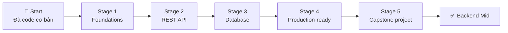

# 🧭 Backend Developer Career Roadmap

> **Tác giả:** Mr.Rom\
> **Phiên bản:** v1.0.0\
> **Tạo lúc:** 16/05/2026\
> **Cập nhật:** 16/05/2026\
> **Đối tượng:** Đã code được 1 ngôn ngữ cơ bản (Python/Node/Java), muốn làm **backend API + DB**\
> **Thời gian ước tính:** ~9 tháng full-time / ~18 tháng part-time\
> **Mức độ:** Junior → Mid

> 🎯 *Backend Developer xây "phần ngầm" của app — API, business logic, database, caching, queue. Sau roadmap này bạn có thể build 1 REST API production-ready với DB, auth, test, deploy.*

---

## 🎯 Mục tiêu cuối lộ trình

- [ ] Build REST API với framework hiện đại (FastAPI/Express/Spring) — có auth, validation, error handling
- [ ] Thiết kế + dùng được SQL DB (Postgres) + cache (Redis)
- [ ] Viết unit test + integration test (coverage > 70%)
- [ ] Containerize app + deploy lên cloud (AWS/GCP)
- [ ] Hiểu cơ bản system design (cache, queue, scaling)
- [ ] 1 project portfolio backend đầy đủ trên GitHub

---

## 🗺️ Overview 5 stage

| Stage | Tên | Thời gian | Output |
|---|---|---|---|
| 1 | **Foundations** | 1-2 tháng | Linux + Git + HTTP cơ bản |
| 2 | **REST API** | 2 tháng | API CRUD chạy được local |
| 3 | **Database + Cache** | 2 tháng | App có Postgres + Redis |
| 4 | **Production-ready** | 2 tháng | Auth + test + Docker + deploy |
| 5 | **Capstone** | 1-2 tháng | Project portfolio đầy đủ |

---

## Stage 1 — Foundations (1-2 tháng)

> 🎯 *Trước khi viết API, làm chủ tools + protocols nền.*

### 📚 Lý thuyết

- [ ] [Terminal fundamentals](../../01_Foundations/computing-environment/lessons/01_basic/00_what-is-terminal.md) ✅
- [ ] Linux basics (navigation, file ops, permissions) — [`04_OS/linux/`](../../04_OS/linux/) ✅ 3 bài
- [ ] [Git workflow đầy đủ](../../01_Foundations/version-control/git/) ✅ 6 bài
- [ ] HTTP protocol cơ bản (methods, status codes, headers) — `05_Networking/http-https/` (chưa có)
- [ ] REST API design — `09_Architecture/` hoặc `07_Web/backend/rest-api/` (chưa có)

### 🛠️ Setup

- [ ] [VS Code + Python/Node extensions](../../02_Tools/ide/vs-code.md) ✅
- [ ] [Git + GitHub](../../01_Foundations/version-control/git/setup/git.md) ✅
- [ ] [Python 3.12+](../../03_Languages/python/setup/install-python.md) ✅ (nếu chọn Python)
- [ ] [Postman](../../02_Tools/) hoặc Bruno (chưa có) — test API

### 🧪 Project Stage 1

- [ ] Build CLI app trong Python/Node (đọc file, parse, output) — 50-100 dòng
- [ ] Push lên GitHub với README + .gitignore đúng

### ✅ Verify

- [ ] Mở terminal navigate folder bất kỳ trong 30s
- [ ] Tạo repo + push code lên GitHub
- [ ] Hiểu GET/POST/PUT/DELETE khác nhau thế nào

---

## Stage 2 — REST API (2 tháng)

> 🎯 *Học framework backend + viết API chạy được.*

### Chọn ngôn ngữ + framework

| Ngôn ngữ | Framework | Phù hợp |
|---|---|---|
| **Python** | **FastAPI** ⭐ | Modern, async, type hint — RECOMMEND beginner |
| Python | Flask | Đơn giản, học nhanh |
| Python | Django | Full-stack, ORM mạnh |
| Node.js | Express | Phổ biến nhất Node |
| Node.js | NestJS | Type-safe, TypeScript |
| Go | Gin / Echo | Performance cao |
| Java | Spring Boot | Enterprise |

→ **Mình recommend FastAPI** — modern, dễ học, type hint sẵn.

### 📚 Lý thuyết

- [ ] [Python functions, OOP](../../03_Languages/python/lessons/01_basic/03_functions.md) ✅ + OOP (chưa có)
- [ ] FastAPI cơ bản — `07_Web/backend/python-fastapi/` (chưa có)
- [ ] JSON, request/response cycle
- [ ] Validation (Pydantic) — typed input
- [ ] Error handling, status codes
- [ ] OpenAPI / Swagger auto-doc

### 🧪 Bài tập

- [ ] FastAPI Hello World
- [ ] CRUD API trong memory (list + dict) — 5 endpoints
- [ ] Validation với Pydantic
- [ ] Error handling chuẩn (custom exception)

### 🎯 Project Stage 2

- [ ] **Todo API** với FastAPI: CRUD task, in-memory storage, có Swagger doc

### ✅ Verify

- [ ] API chạy được `http://localhost:8000`
- [ ] Test API bằng curl/Postman
- [ ] Hiểu khi nào return 200/201/400/404/500

---

## Stage 3 — Database + Cache (2 tháng)

> 🎯 *App thật cần lưu data — học SQL + Redis cache.*

### 📚 Lý thuyết

- [ ] SQL basics (SELECT, JOIN, INDEX) — `06_Databases/sql-fundamentals/` (chưa có)
- [ ] PostgreSQL — `06_Databases/postgresql/` (chưa có)
- [ ] Database design (normalization, ERD) — `06_Databases/database-design/` (chưa có)
- [ ] ORM (SQLAlchemy hoặc Tortoise) — async-friendly
- [ ] Redis cơ bản — `06_Databases/redis/` (chưa có)
- [ ] Migration (Alembic)
- [ ] N+1 query problem

### 🛠️ Setup

- [ ] Postgres local (qua Docker — `docker run -d postgres`) ✅ [Docker setup](../../10_DevOps/docker/setup/install-docker.md)
- [ ] Redis local (Docker)
- [ ] DBeaver hoặc TablePlus — GUI DB

### 🧪 Bài tập

- [ ] SQL CRUD trên Postgres bằng `psql`
- [ ] Connect FastAPI với Postgres qua SQLAlchemy
- [ ] Viết migration Alembic
- [ ] Cache 1 endpoint với Redis (TTL 60s)
- [ ] Query với JOIN 3 bảng

### 🎯 Project Stage 3

- [ ] **Blog API**: User, Post, Comment với Postgres + Redis cache cho posts hot

### ✅ Verify

- [ ] Hiểu khác nhau JOIN INNER vs LEFT vs OUTER
- [ ] Tạo index trên cột query nhiều
- [ ] Cache hit/miss rate

---

## Stage 4 — Production-ready (2 tháng)

> 🎯 *Auth + Test + Deploy = ready for production.*

### 📚 Lý thuyết

- [ ] Authentication (JWT, OAuth2) — `12_Security/authentication/` (chưa có)
- [ ] Authorization (RBAC) — `12_Security/authorization/` (chưa có)
- [ ] Testing với pytest — `03_Languages/python/lessons/02_intermediate/` (chưa có)
- [ ] Integration test (test với real DB qua container)
- [ ] Docker containerization — [`10_DevOps/docker/`](../../10_DevOps/docker/) ✅ 5 bài
- [ ] CI/CD basics (GitHub Actions) — `10_DevOps/ci-cd/` (chưa có)
- [ ] Logging + monitoring cơ bản
- [ ] Environment config (12-factor app)

### 🧪 Bài tập

- [ ] Thêm JWT auth vào Blog API (Stage 3)
- [ ] Viết unit test cho mọi endpoint (coverage > 70%)
- [ ] [Dockerize app + Docker Compose](../../10_DevOps/docker/lessons/01_basic/03_docker-compose.md) ✅
- [ ] Setup GitHub Actions chạy test khi PR
- [ ] Deploy lên Railway/Render/Fly.io (free tier)

### 🎯 Project Stage 4

- [ ] **Blog API v2**: JWT auth, role-based access, full test suite, deployed lên cloud

### ✅ Verify

- [ ] User đăng ký + login + nhận JWT
- [ ] CI pipeline chạy test khi push
- [ ] App accessible qua HTTPS URL public

---

## Stage 5 — Capstone Project (1-2 tháng)

> 🎯 *1 project hoàn chỉnh để show recruiter — không phải tutorial clone.*

### Chọn 1 project có scope vừa

| Project | Highlight |
|---|---|
| **URL shortener** (kiểu bit.ly) | Caching, analytics, custom alias |
| **Job board** | Search, filter, pagination, email notification |
| **Booking system** | Time slot, concurrency handling |
| **Code snippet manager** | Tags, search, sharing public/private |
| **Mini Twitter clone** | Timeline, follow, like, infinite scroll |

### Yêu cầu bắt buộc

- [ ] README đẹp (demo screenshot, install, usage)
- [ ] Test coverage > 70%
- [ ] Auth (JWT hoặc OAuth)
- [ ] DB design tốt (ERD trong README)
- [ ] CI/CD chạy được trên GitHub Actions
- [ ] Dockerize + Docker Compose
- [ ] Deploy lên cloud (link live trong README)
- [ ] API documentation (Swagger auto)
- [ ] ≥ 20 commits có message rõ ràng

### ✅ Verify cuối roadmap

- [ ] Show project cho 1 dev khác — họ clone về chạy được
- [ ] Trả lời "Vì sao chọn architecture này?" trong 2 phút
- [ ] List 3 thứ bạn học được khi build

---

## 🧭 Career tiếp theo

| Sau roadmap này, bạn có thể... | Đi tiếp |
|---|---|
| Đào sâu backend → SRE/Platform | [`sre-engineer`](./sre-engineer_career-roadmap.md) (chưa có) |
| Mở rộng full-stack → frontend | [`fullstack-developer`](./fullstack-developer_career-roadmap.md) (chưa có) |
| Infrastructure → DevOps | [`devops-engineer`](./devops-engineer_career-roadmap.md) (chưa có) |
| Data pipeline | [`data-engineer`](./data-engineer_career-roadmap.md) (chưa có) |
| AI/LLM backend | [`ai-engineer`](./ai-engineer_career-roadmap.md) (chưa có) |

---

## 📌 Tài nguyên bổ sung

### Sách

| Sách | Khi đọc |
|---|---|
| *Designing Data-Intensive Applications* — Martin Kleppmann | Sau Stage 4 — bible system design |
| *Clean Architecture* — Uncle Le Van B | Khi muốn refactor tốt hơn |
| *The Pragmatic Programmer* | Bất kỳ lúc nào |

### Khoá / Practice

- [Roadmap.sh Backend](https://roadmap.sh/backend) — visual roadmap
- [System Design Primer](https://github.com/donnemartin/system-design-primer) — free
- [LeetCode SQL](https://leetcode.com/problemset/database/) — practice SQL
- [Hyperskill — Backend track](https://hyperskill.org/) — project-based

### Cộng đồng

- [r/learnprogramming](https://reddit.com/r/learnprogramming)
- [r/django](https://reddit.com/r/django), [r/Flask](https://reddit.com/r/Flask), [r/FastAPI](https://reddit.com/r/FastAPI)
- [DEV Community](https://dev.to)

---

## 🔄 Khi nào điều chỉnh

| Tình huống | Hành động |
|---|---|
| Stage 1 quá dễ → skip | OK, làm verify chắc chắn rồi sang Stage 2 |
| Stuck ở Stage 3 (DB khó) | Slow down, làm thêm SQL exercises trên LeetCode |
| Stage 5 không biết chọn project | Pick "Job board" — vừa scope, nhiều thứ học |
| Muốn switch ngôn ngữ giữa chừng | OK ở Stage 1-2, không khuyên sau Stage 3 |

---

## 📝 Tự đánh giá hàng tháng

Cuối tháng, ghi file `progress.md`:

| Tháng | Concept đã học | Project hoàn thành | Cảm thấy | Cần điều chỉnh |
|---|---|---|---|---|
| 1 | ... | ... | ... | ... |

---

## 📌 Changelog

- **v1.0.0 (16/05/2026)** — Bản đầu tiên. 5 stage / 9 tháng FT. Output: Backend Mid với portfolio đầy đủ.
