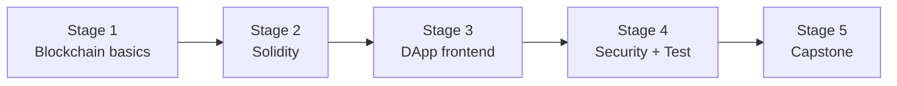

# 🧭 Blockchain Developer Career Roadmap

> **Tác giả:** Mr.Rom\
> **Phiên bản:** v1.0.0\
> **Tạo lúc:** 16/05/2026\
> **Cập nhật:** 16/05/2026\
> **Đối tượng:** Đã code cơ bản, hứng thú với Web3 / smart contract\
> **Thời gian ước tính:** ~10 tháng FT / ~20 tháng PT\
> **Mức độ:** Junior → Mid

> 🎯 *Blockchain Developer build **smart contract** (Ethereum/EVM-compatible) + **DApp** (decentralized app). Hot lúc bull market, cold lúc bear — career risk/reward cao.*

---

## 🎯 Mục tiêu cuối

- [ ] Hiểu blockchain fundamentals (consensus, hash, merkle tree)
- [ ] Master Solidity (Ethereum smart contract language)
- [ ] Build full DApp: smart contract + frontend (Web3.js/Ethers/Viem)
- [ ] Test + security audit smart contract (Foundry)
- [ ] Deploy lên testnet + mainnet
- [ ] 1-2 DApp portfolio (NFT marketplace, DEX, DAO)

> ⚠️ **Warning**: smart contract bug = mất tiền không thể recover. Roadmap focus security mạnh.

---

## 🗺️ Overview 5 stage

| Stage | Tên | Thời gian | Output |
|---|---|---|---|
| 1 | Blockchain fundamentals | 1-2 tháng | Hiểu Bitcoin, Ethereum |
| 2 | Solidity + EVM | 2-3 tháng | Smart contract cơ bản |
| 3 | DApp frontend (Ethers/Viem) | 2 tháng | UI connect ví Metamask |
| 4 | Security + Foundry test | 2 tháng | Test + audit contract |
| 5 | Capstone (NFT/DEX/DAO) | 2 tháng | DApp deploy mainnet |

---

## Stage 1 — Blockchain Fundamentals (1-2 tháng)

> 🎯 *Hiểu nền tảng trước khi code.*

### 📚 Đọc

- [ ] Cryptography basics (hash, public/private key, digital signature) — `12_Security/cryptography/` (chưa có)
- [ ] Bitcoin whitepaper (Satoshi)
- [ ] Ethereum whitepaper (Vitalik)
- [ ] Consensus mechanisms (PoW vs PoS)
- [ ] Block, transaction, address, gas
- [ ] Merkle tree
- [ ] EVM (Ethereum Virtual Machine) intro

### 🛠️ Setup

- [ ] [VS Code + Solidity extension](../../02_Tools/editor/setup/vs-code.md) ✅
- [ ] MetaMask wallet (chrome extension)
- [ ] Sepolia testnet (free test ETH)

### 🎯 Project Stage 1

- [ ] Send test ETH giữa 2 wallet trên Sepolia
- [ ] Read smart contract trên Etherscan

---

## Stage 2 — Solidity + EVM (2-3 tháng)

> 🎯 *Smart contract language chính.*

### 📚 Đọc

- [ ] Solidity syntax (state variables, functions, modifiers) — `15_Specialized/blockchain/` (chưa có)
- [ ] Data types (address, uint, mapping, struct, enum)
- [ ] Visibility (public/external/internal/private)
- [ ] Events + indexed
- [ ] Constructor, fallback, receive
- [ ] Inheritance (is, override)
- [ ] Interface vs Abstract contract
- [ ] OpenZeppelin contracts (battle-tested templates)
- [ ] Storage vs Memory vs Calldata
- [ ] Gas optimization

### 🛠️ Setup

- [ ] **Foundry** (modern, FAST) — `curl -L https://foundry.paradigm.xyz | bash`
- [ ] Hardhat (alternative, JS-based)
- [ ] Remix online IDE (for learning)

### 🧪 Bài tập

- [ ] HelloWorld contract
- [ ] Simple Storage (set/get number)
- [ ] ERC-20 token (own coin)
- [ ] ERC-721 NFT
- [ ] Multi-signature wallet
- [ ] Time-locked withdrawal

### 🎯 Project Stage 2

- [ ] **Voting contract**: create proposal, voters, count votes, time limit

---

## Stage 3 — DApp Frontend (Ethers/Viem) (2 tháng)

> 🎯 *Connect smart contract với UI.*

### 📚 Đọc

- [ ] Web3 architecture (RPC node, wallet, dApp)
- [ ] Ethers.js / **Viem** (modern, RECOMMEND) — `15_Specialized/blockchain/` (chưa có)
- [ ] wagmi (React hooks cho Web3)
- [ ] RainbowKit (UI wallet connect)
- [ ] Read contract (call) vs Write (transaction)
- [ ] Event listening
- [ ] Multi-chain (Polygon, Arbitrum, Base)
- [ ] Gas estimation

### 🎯 Project Stage 3

- [ ] **Frontend cho Voting contract** (Stage 2): connect MetaMask, list proposals, vote, show results

---

## Stage 4 — Security + Foundry Test (2 tháng)

> 🎯 *Smart contract bug = mất tiền PERMANENT. Test cực kỳ quan trọng.*

### 📚 Đọc

- [ ] Common vulnerabilities: reentrancy, integer overflow, access control, front-running
- [ ] Famous hacks: DAO hack, Parity, Poly Network — case study
- [ ] Foundry test (Solidity-native testing) — RECOMMEND
- [ ] Fuzzing với Foundry
- [ ] Invariant testing
- [ ] Static analysis: Slither, Mythril
- [ ] Formal verification (Certora)
- [ ] Audit checklist
- [ ] OpenZeppelin Defender (monitoring)

### 🧪 Bài tập

- [ ] Test Voting contract: 90%+ coverage
- [ ] Fuzz test với random inputs
- [ ] Slither analyze findings + fix
- [ ] Reproduce Reentrancy attack trên contract demo
- [ ] Audit 1 open source contract (real OSS project)

### 🎯 Project Stage 4

- [ ] **Audit report** cho 1 contract của bạn hoặc OSS — document findings + severity

---

## Stage 5 — Capstone DApp (2 tháng)

> 🎯 *Ship DApp portfolio.*

### Chọn 1

| Project | Highlight |
|---|---|
| **NFT marketplace** | Mint, buy, sell, royalty, IPFS metadata |
| **Mini DEX** | AMM (xy=k), liquidity pool, swap |
| **DAO governance** | Token-weighted voting, treasury, proposal |
| **Crowdfunding** | Kickstarter on-chain, refund |
| **Subscription DApp** | Stream payment (Superfluid pattern) |

### Bắt buộc

- [ ] Smart contract: tested + audited (Slither + manual review)
- [ ] Foundry test coverage > 90%
- [ ] Frontend: React + Viem + wagmi + RainbowKit
- [ ] Multi-chain support (ít nhất 2 chain testnet)
- [ ] IPFS hoặc Arweave cho off-chain data (NFT metadata, ...)
- [ ] Deploy testnet (Sepolia) — link Etherscan
- [ ] (Optional) Deploy mainnet với gas-efficient contract
- [ ] README: architecture diagram, security considerations, gas costs

---

## 🧭 Career tiếp theo

| Hướng | Note |
|---|---|
| Smart contract auditor | High-paying, OSCP-style cert (Cyfrin) |
| Protocol developer | Build Layer 2, AMM, lending protocol |
| Solana / Move language | Rust ecosystem (Solana), Move (Aptos/Sui) |
| Crypto research | Tokenomics, economics |
| Web3 frontend | Frontend + Web3 specialty |
| TradFi → DeFi bridge | Quant + blockchain |

---

## 📌 Tài nguyên bổ sung

| Tài nguyên | Khi dùng |
|---|---|
| [CryptoZombies](https://cryptozombies.io/) | Stage 2 — interactive Solidity tutorial |
| [Solidity by Example](https://solidity-by-example.org/) | Reference |
| [Foundry Book](https://book.getfoundry.sh/) | Stage 4 |
| [Cyfrin Updraft](https://updraft.cyfrin.io/) | Free comprehensive |
| [Patrick Collins YouTube](https://youtube.com/@PatrickAlphaC) | Best YouTube |
| *Mastering Ethereum* — Andreas Antonopoulos (free) | Bible |
| [r/ethdev](https://reddit.com/r/ethdev) | Community |

---

## 🔄 Điều chỉnh

| Tình huống | Hành động |
|---|---|
| Bear market — careers ít | Roadmap vẫn deploy được, ship side project |
| Solana thay Ethereum? | Rust + Anchor — khác stack, làm sau Ethereum |
| Audit hấp dẫn hơn build | Sau Stage 4 → đi audit (lương cao, ít việc full-time) |
| KHÔNG hứng thú crypto/finance | Roadmap khác — blockchain niche tech |

---

## ⚠️ Warning

- **Smart contract bug → mất tiền vĩnh viễn** — không thể rollback như app thường
- **Test cực kỳ kỹ**, audit trước mainnet
- **Bull market chase → bear market layoff** — career risk
- **Self-custody** — bảo vệ private key, đừng leak

---

## 📌 Changelog

- **v1.0.0 (16/05/2026)** — Bản đầu tiên. 5 stage / 10 tháng FT. Ethereum/Solidity focus + security.
