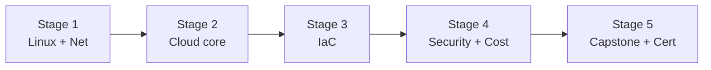

# 🧭 Cloud Engineer Career Roadmap

> **Tác giả:** Mr.Rom\
> **Phiên bản:** v1.0.0\
> **Tạo lúc:** 16/05/2026\
> **Cập nhật:** 16/05/2026\
> **Đối tượng:** Đã hiểu Linux + networking cơ bản, muốn architect cloud infra\
> **Thời gian ước tính:** ~10 tháng FT / ~20 tháng PT\
> **Mức độ:** Junior → Mid

> 🎯 *Cloud Engineer architect + manage infra trên AWS/GCP/Azure. Khác DevOps Eng (broader, gồm dev pipeline) — Cloud Eng focus DEEP 1 cloud + networking + security cloud.*

---

## 🎯 Mục tiêu cuối

- [ ] Architect 1 cloud (AWS) — VPC, IAM, EC2, S3, RDS, networking
- [ ] IaC 100% (Terraform/CloudFormation)
- [ ] Security cloud (IAM least privilege, KMS, security group)
- [ ] Cost optimization (avoid surprise bill)
- [ ] Cert AWS SAA hoặc tương đương
- [ ] 1 capstone multi-tier infra deploy

---

## 🗺️ Overview 5 stage

| Stage | Tên | Thời gian | Output |
|---|---|---|---|
| 1 | Linux + Networking | 2 tháng | Hiểu OSI, TCP/IP, DNS |
| 2 | Cloud core (AWS) | 2-3 tháng | VPC, EC2, S3, RDS, IAM |
| 3 | IaC (Terraform) | 2 tháng | Code thay click console |
| 4 | Security + Cost | 1-2 tháng | Hardening + cost mgmt |
| 5 | Capstone + Cert AWS SAA | 2 tháng | Multi-tier infra + chứng chỉ |

---

## Stage 1 — Linux + Networking (2 tháng)

> 🎯 *Network = foundation cloud.*

### 📚 Đọc

- [ ] Linux basics — [3 bài ✅](../../04_OS/linux/lessons/01_basic/)
- [ ] OSI model + TCP/IP
- [ ] DNS, HTTP/HTTPS, TLS — `05_Networking/` (chưa có)
- [ ] Subnetting, CIDR notation
- [ ] NAT, VPN, firewall basics
- [ ] Load balancing concepts

### 🎯 Project Stage 1

- [ ] Setup VPS + Nginx reverse proxy + SSL Let's Encrypt

---

## Stage 2 — AWS Core (2-3 tháng)

> 🎯 *Master 1 cloud trước khi multi-cloud.*

### 📚 Đọc — AWS

- [ ] AWS account setup + Billing alert — `11_Cloud/aws/` (chưa có)
- [ ] **IAM**: user, role, policy, MFA (CRITICAL)
- [ ] **VPC**: subnet (public/private), route table, IGW, NAT GW
- [ ] **EC2**: instance type, EBS, AMI, key pair
- [ ] **S3**: bucket, lifecycle, versioning, cross-region replication
- [ ] **RDS**: Postgres/MySQL managed, Multi-AZ, read replica
- [ ] **CloudWatch**: metrics, logs, alarms
- [ ] **Route 53**: DNS + health check
- [ ] **CloudFront**: CDN
- [ ] **ELB** (ALB/NLB): load balancer

### 🛠️ Setup

- [ ] AWS account + budget alert $5/tháng — RẤT QUAN TRỌNG
- [ ] AWS CLI + configure
- [ ] AWS Cloud9 hoặc local

### 🎯 Project Stage 2

- [ ] **Static website**: S3 + CloudFront + Route 53 + ACM certificate
- [ ] **Web app**: EC2 + RDS + ELB trong VPC custom

---

## Stage 3 — Infrastructure as Code (2 tháng)

> 🎯 *KHÔNG click console nữa — code mọi thứ.*

### 📚 Đọc

- [ ] Terraform basics — `10_DevOps/iac/terraform/` (chưa có)
- [ ] HCL syntax (resources, variables, outputs)
- [ ] State management (S3 backend + DynamoDB lock)
- [ ] Modules + reusability
- [ ] terragrunt (orchestrate multiple Terraform)
- [ ] CloudFormation (AWS-native alternative)
- [ ] Pulumi (TypeScript/Python alternative — modern)

### 🎯 Project Stage 3

- [ ] **Refactor Project Stage 2 → Terraform**: tạo lại VPC + EC2 + RDS hoàn toàn từ code

### ✅ Verify

- [ ] `terraform destroy` + `terraform apply` reproduce hoàn toàn
- [ ] State trong S3, không local
- [ ] Modules reusable

---

## Stage 4 — Security + Cost (1-2 tháng)

> 🎯 *2 thứ "đau ví" + "đau lòng" nếu sai.*

### 📚 Security

- [ ] IAM best practice: least privilege, role > user, MFA
- [ ] Security group vs NACL
- [ ] KMS (encryption at rest)
- [ ] Secrets Manager / Parameter Store
- [ ] GuardDuty, Security Hub
- [ ] WAF + Shield (DDoS)
- [ ] Compliance: PCI, HIPAA, SOC2 awareness

### 📚 Cost

- [ ] Reserved Instance vs Savings Plan vs Spot
- [ ] Cost Explorer + Budgets
- [ ] Tagging strategy
- [ ] AWS Compute Optimizer
- [ ] S3 storage class (Standard, IA, Glacier)
- [ ] Common cost traps (NAT GW data transfer, EBS unattached, ...)

### 🎯 Project Stage 4

- [ ] **Cost audit**: phân tích AWS account, document waste + automation cut 30%
- [ ] **Security hardening**: AWS Trusted Advisor + GuardDuty enable, fix top findings

---

## Stage 5 — Capstone + Cert (2 tháng)

> 🎯 *Multi-tier infra + AWS Solutions Architect Associate.*

### Capstone

| Project | Highlight |
|---|---|
| **3-tier web app HA** | ALB + ASG EC2 + Multi-AZ RDS + ElastiCache + S3 static |
| **Serverless API** | API Gateway + Lambda + DynamoDB + Cognito auth |
| **Data lake** | S3 + Glue + Athena + QuickSight |
| **Multi-region failover** | Route 53 + cross-region replication + automated failover |

### Bắt buộc

- [ ] 100% IaC
- [ ] Diagram (draw.io / Lucidchart)
- [ ] Cost estimate
- [ ] Disaster recovery plan
- [ ] Security review (IAM, encryption, SG)
- [ ] Documentation runbook

### AWS Solutions Architect Associate

- [ ] Đăng ký exam ($150)
- [ ] Learn AWS Skill Builder + practice test (Tutorials Dojo)
- [ ] Pass 720/1000

---

## 🧭 Career tiếp theo

| Hướng | Roadmap |
|---|---|
| Broader DevOps | [`devops-engineer`](./devops-engineer_career-roadmap.md) ✅ |
| Site Reliability | [`sre-engineer`](./sre-engineer_career-roadmap.md) (chưa có) |
| Platform builder | [`platform-engineer`](./platform-engineer_career-roadmap.md) (chưa có) |
| Security specialty | [`security-engineer`](./security-engineer_career-roadmap.md) (chưa có) |

---

## 📌 Tài nguyên bổ sung

| Tài nguyên | Khi dùng |
|---|---|
| [AWS Skill Builder (free)](https://skillbuilder.aws/) | Stage 2+ |
| [Adrian Cantrill — AWS Cert](https://learn.cantrill.io/) | Cert SAA — best paid course |
| [A Cloud Guru / ACG](https://acloudguru.com/) | Cert prep alternative |
| [Tutorials Dojo practice tests](https://tutorialsdojo.com/) | Trước thi |
| *Cloud Native Patterns* — Cornelia Davis | Sau Stage 4 |

---

## 🔄 Điều chỉnh

| Tình huống | Hành động |
|---|---|
| AWS hay GCP? | AWS — market share lớn nhất, job nhiều nhất 2026 |
| Sợ bill quá cao | Free tier 12 tháng + budget alert $5 + always destroy resources sau |
| Cert có cần? | SAA giúp interview, không bắt buộc nếu có experience |

---

## 📌 Changelog

- **v1.0.0 (16/05/2026)** — Bản đầu tiên. 5 stage / 10 tháng FT. AWS focus + IaC + SAA cert.
