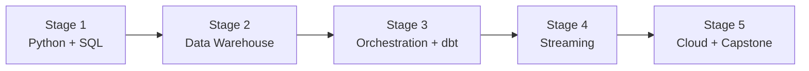

# 🧭 Data Engineer Career Roadmap

> **Tác giả:** Mr.Rom\
> **Phiên bản:** v1.0.0\
> **Tạo lúc:** 16/05/2026\
> **Cập nhật:** 16/05/2026\
> **Đối tượng:** Đã biết Python + SQL cơ bản, muốn build data pipeline + warehouse\
> **Thời gian ước tính:** ~10 tháng full-time / ~20 tháng part-time\
> **Mức độ:** Junior → Mid

> 🎯 *Data Engineer build "đường ống dữ liệu" — ingest, transform, store, serve data cho Data Scientist + Analyst. Sau roadmap: build được data warehouse + streaming pipeline.*

---

## 🎯 Mục tiêu cuối lộ trình

- [ ] Thành thạo SQL deep (window function, CTE, optimization)
- [ ] Build batch pipeline (Airflow + dbt + warehouse)
- [ ] Build streaming pipeline (Kafka + Spark)
- [ ] Hiểu data modeling (star schema, dimension table)
- [ ] Cloud data stack (Snowflake/BigQuery/Redshift)
- [ ] 1 capstone pipeline end-to-end

---

## 🗺️ Overview 5 stage

| Stage | Tên | Thời gian | Output |
|---|---|---|---|
| 1 | Python + SQL deep | 2 tháng | SQL master + Python data libs |
| 2 | Data Warehouse + Modeling | 2 tháng | Postgres + DuckDB cơ bản |
| 3 | Orchestration (Airflow + dbt) | 2-3 tháng | Batch pipeline daily |
| 4 | Streaming (Kafka + Spark) | 1-2 tháng | Real-time pipeline |
| 5 | Cloud + Capstone | 2 tháng | Pipeline trên cloud + portfolio |

---

## Stage 1 — Python + SQL Deep (2 tháng)

> 🎯 *2 ngôn ngữ chính của Data Eng. Master cả 2.*

### 📚 Đọc

- [ ] [Python basics ✅ 5 bài](../../03_Languages/python/)
- [ ] Pandas (DataFrame, groupby, merge) — `13_AI-ML/` (chưa có)
- [ ] SQL deep: JOIN, window function (ROW_NUMBER, RANK, LAG), CTE — `06_Databases/sql-fundamentals/` (chưa có)
- [ ] Postgres + DuckDB
- [ ] Index + query optimization
- [ ] EXPLAIN ANALYZE

### 🧪 Bài tập

- [ ] LeetCode SQL 50 bài (medium-hard)
- [ ] Pandas: clean dirty CSV (missing, duplicate, types)
- [ ] Window function: top-N per group, running total, lag/lead
- [ ] CTE recursive (org tree, fibonacci)

### 🎯 Project Stage 1

- [ ] **CSV ETL script** Python: read 1GB CSV → clean → load Postgres → query analytics

---

## Stage 2 — Data Warehouse + Modeling (2 tháng)

> 🎯 *Hiểu OLTP vs OLAP, dimensional modeling.*

### 📚 Đọc

- [ ] OLTP vs OLAP — `06_Databases/` (chưa có)
- [ ] Star schema, snowflake schema
- [ ] Slowly Changing Dimension (SCD type 1, 2, 3)
- [ ] Fact table vs Dimension table
- [ ] Columnar storage (Parquet, ORC)
- [ ] Data lake vs Data warehouse vs Lakehouse — `14_Data-Engineering/data-lake/` (chưa có)

### 🛠️ Setup

- [ ] Postgres local (Docker)
- [ ] DuckDB (in-process OLAP, học OLAP nhanh)
- [ ] Sample dataset (NYC Taxi, Spotify, MovieLens)

### 🧪 Bài tập

- [ ] Design schema cho e-commerce (orders, customers, products)
- [ ] Load 10M rows vào Postgres + DuckDB, so sánh query speed
- [ ] Parquet vs CSV size + query speed
- [ ] Build star schema từ raw OLTP data

### 🎯 Project Stage 2

- [ ] **Dimensional model cho e-commerce**: fact_sales, dim_customer, dim_product, dim_date

---

## Stage 3 — Orchestration + dbt (2-3 tháng)

> 🎯 *Build batch pipeline scheduled.*

### 📚 Đọc

- [ ] Airflow architecture (DAG, operator, scheduler) — `14_Data-Engineering/airflow-and-orchestration/` (chưa có)
- [ ] Airflow Python operator, BashOperator, EmailOperator
- [ ] dbt basics (model, test, seed, snapshot) — `14_Data-Engineering/dbt/` (chưa có)
- [ ] dbt incremental model
- [ ] Data testing (dbt test, Great Expectations)
- [ ] Data lineage

### 🛠️ Setup

- [ ] Airflow local (Docker)
- [ ] dbt-core + adapter (postgres / duckdb)

### 🧪 Bài tập

- [ ] Airflow DAG: pull API daily → load DB → transform → notify
- [ ] dbt project: staging → intermediate → mart layer
- [ ] dbt tests: unique, not_null, accepted_values
- [ ] Incremental model với late-arriving data

### 🎯 Project Stage 3

- [ ] **End-to-end batch pipeline**: API → Airflow ingest → S3 → dbt transform → Postgres warehouse → metabase dashboard

---

## Stage 4 — Streaming (1-2 tháng)

> 🎯 *Real-time data, không batch daily.*

### 📚 Đọc

- [ ] Kafka concepts (topic, partition, consumer group) — `14_Data-Engineering/streaming/` (chưa có)
- [ ] Spark structured streaming
- [ ] Flink (alternative)
- [ ] Stream processing patterns: windowing, joining, dedup
- [ ] Lambda vs Kappa architecture
- [ ] Schema registry, Avro/Protobuf

### 🛠️ Setup

- [ ] Kafka local (Docker Compose)
- [ ] PySpark

### 🧪 Bài tập

- [ ] Kafka producer + consumer Python
- [ ] Spark structured streaming aggregation (10s window)
- [ ] Kafka → Spark → Postgres pipeline
- [ ] Handle late + out-of-order data

### 🎯 Project Stage 4

- [ ] **Real-time event tracker**: producer → Kafka → Spark aggregation → dashboard

---

## Stage 5 — Cloud + Capstone (2 tháng)

> 🎯 *Cloud data stack + portfolio project.*

### Chọn 1 cloud stack

| Stack | Phù hợp |
|---|---|
| **AWS** (S3 + Redshift + Glue + Athena) | Phổ biến nhất |
| **GCP** (GCS + BigQuery + Dataflow) | BigQuery rất mạnh, dễ dùng |
| **Snowflake + dbt Cloud** | Modern data stack, hot |
| **Databricks** | Spark + ML focus |

→ **AWS hoặc GCP** — quyết theo công ty target.

### 📚 Đọc

- [ ] BigQuery / Redshift / Snowflake basics
- [ ] Lake Formation / Glue (AWS)
- [ ] Pricing model (CRITICAL — dễ surprise bill)
- [ ] Terraform cho data infra

### 🎯 Capstone

| Project | Highlight |
|---|---|
| **E-commerce analytics** | Daily sales + cohort retention + LTV |
| **Real-estate price tracker** | Scrape → analyze → trend prediction |
| **Spotify listening pipeline** | API → daily ETL → dashboard |
| **Bitcoin price stream** | Real-time price → alert system |
| **GitHub events pipeline** | GH events API → trending repos analysis |

### Bắt buộc

- [ ] IaC (Terraform)
- [ ] Airflow DAG version controlled
- [ ] dbt models + tests
- [ ] Data quality check (Great Expectations / dbt tests)
- [ ] Dashboard (Metabase / Superset / Looker)
- [ ] Documentation + lineage diagram
- [ ] Cost estimate trong README

---

## 🧭 Career tiếp theo

| Hướng | Roadmap |
|---|---|
| Phân tích sâu | [`data-scientist`](./data-scientist_career-roadmap.md) (chưa có) |
| ML production | [`ml-engineer`](./ml-engineer_career-roadmap.md) (chưa có) |
| Analytics Engineer (dbt focus) | (specialization — chưa có) |
| Big infra | [`platform-engineer`](./platform-engineer_career-roadmap.md) (chưa có) |

---

## 📌 Tài nguyên bổ sung

| Tài nguyên | Khi dùng |
|---|---|
| [Roadmap.sh Data Engineer](https://roadmap.sh/data-engineer) | Visual roadmap |
| *Designing Data-Intensive Apps* — Kleppmann | Sau Stage 3 |
| [dbt Learn (free)](https://courses.getdbt.com/) | Stage 3 |
| [Mode SQL Tutorial](https://mode.com/sql-tutorial/) | Stage 1 |
| [Data Engineer Zoomcamp (free, DataTalksClub)](https://github.com/DataTalksClub/data-engineering-zoomcamp) | Tổng quát |

---

## 🔄 Điều chỉnh

| Tình huống | Hành động |
|---|---|
| SQL còn yếu | Practice 50 LeetCode SQL trước Stage 2 |
| Kafka khó setup | Dùng Redpanda (lightweight) thay Kafka cho học |
| Stage 5 chọn cloud nào? | AWS — job nhiều nhất 2026 |
| Muốn đi ML | Đi xong Stage 3 → tách [ml-engineer](./ml-engineer_career-roadmap.md) |

---

## 📌 Changelog

- **v1.0.0 (16/05/2026)** — Bản đầu tiên. 5 stage / 10 tháng FT. Batch + streaming + cloud focus.
