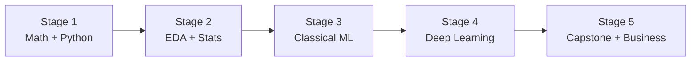

# 🧭 Data Scientist Career Roadmap

> **Tác giả:** Mr.Rom\
> **Phiên bản:** v1.0.0\
> **Tạo lúc:** 16/05/2026\
> **Cập nhật:** 16/05/2026\
> **Đối tượng:** Có nền math + Python cơ bản, thích phân tích dữ liệu + ML\
> **Thời gian ước tính:** ~12 tháng full-time / ~24 tháng part-time\
> **Mức độ:** Junior → Mid

> 🎯 *Data Scientist phân tích data → insight + xây ML model. Khác Data Engineer (build pipeline) + AI Engineer (build AI app). Cần math + stats.*

---

## 🎯 Mục tiêu cuối

- [ ] Math + Stats cho ML (regression, hypothesis test, prob distributions)
- [ ] Python data stack: Pandas, NumPy, scikit-learn, Matplotlib
- [ ] Build + evaluate ML model (classification, regression, clustering)
- [ ] Deep Learning basics (PyTorch / Keras)
- [ ] Communicate insight (visualization + storytelling)
- [ ] 2-3 portfolio: EDA notebook + ML model + business analysis

---

## 🗺️ Overview 5 stage

| Stage | Tên | Thời gian | Output |
|---|---|---|---|
| 1 | Math + Python | 2-3 tháng | Pandas/NumPy thành thạo |
| 2 | EDA + Statistics | 2 tháng | EDA notebook chất + hypothesis test |
| 3 | Classical ML | 3 tháng | Build + evaluate model |
| 4 | Deep Learning basics | 2 tháng | NN simple với PyTorch |
| 5 | Capstone + Business communication | 2 tháng | Portfolio 2-3 project |

---

## Stage 1 — Math + Python (2-3 tháng)

> 🎯 *Math là nền tảng. Đừng skip.*

### 📚 Đọc

- [ ] [Python ✅ 5 bài](../../03_Languages/python/)
- [ ] Linear Algebra (vector, matrix, dot product) — `13_AI-ML/math-for-ml/` (chưa có)
- [ ] Calculus cơ bản (derivative, gradient)
- [ ] Probability + Statistics (distribution, expectation, variance)
- [ ] NumPy (array ops, broadcasting)
- [ ] Pandas (DataFrame, groupby, merge, pivot)

### 🛠️ Setup

- [ ] [Python + venv](../../03_Languages/python/setup/install-python.md) ✅
- [ ] Jupyter Notebook / VS Code Jupyter extension
- [ ] `pip install numpy pandas matplotlib seaborn scikit-learn`

### 🎯 Project Stage 1

- [ ] **EDA Titanic dataset**: load, clean, basic stats, viz

---

## Stage 2 — EDA + Statistics (2 tháng)

> 🎯 *Phân tích dữ liệu thực tế + test giả thuyết.*

### 📚 Đọc

- [ ] EDA methodology (univariate → bivariate → multivariate)
- [ ] Visualization: Matplotlib + Seaborn + Plotly
- [ ] Hypothesis testing (t-test, chi-square, ANOVA)
- [ ] A/B test design
- [ ] Confidence interval, p-value
- [ ] Correlation vs causation
- [ ] Outlier detection

### 🧪 Bài tập

- [ ] EDA 3 datasets từ Kaggle
- [ ] Run A/B test simulation
- [ ] Hypothesis test trên real data

### 🎯 Project Stage 2

- [ ] **EDA + A/B test report**: 1 dataset thực tế + recommendation cho business

---

## Stage 3 — Classical ML (3 tháng)

> 🎯 *Build + evaluate ML model cơ bản.*

### 📚 Đọc

- [ ] Supervised vs Unsupervised — `13_AI-ML/ml-fundamentals/` (chưa có)
- [ ] Regression (linear, polynomial, regularization)
- [ ] Classification (logistic, decision tree, random forest, SVM, XGBoost)
- [ ] Clustering (K-means, DBSCAN, hierarchical)
- [ ] Feature engineering
- [ ] Cross-validation, train/val/test split
- [ ] Metrics (accuracy, precision/recall, F1, ROC-AUC, RMSE)
- [ ] Overfitting + regularization
- [ ] Hyperparameter tuning (GridSearch, Optuna)

### 🧪 Bài tập

- [ ] Linear regression từ scratch (no scikit)
- [ ] Iris classification — 5 algorithms compare
- [ ] House price prediction (regression)
- [ ] Customer segmentation (K-means)
- [ ] Imbalanced data (SMOTE, class weight)

### 🎯 Project Stage 3

- [ ] **End-to-end ML project**: Kaggle competition (Titanic, House Prices) — submission top 50%

---

## Stage 4 — Deep Learning Basics (2 tháng)

> 🎯 *Neural network cơ bản — KHÔNG cần Phd math.*

### 📚 Đọc

- [ ] Neural network intuition — `13_AI-ML/deep-learning/` (chưa có)
- [ ] Backpropagation (intuitive, không cần derive)
- [ ] PyTorch basics (Tensor, autograd, nn.Module, optimizer)
- [ ] CNN (image classification)
- [ ] RNN / Transformer (text, intuitive level)
- [ ] Transfer learning (fine-tune pretrained)

### 🎯 Project Stage 4

- [ ] **Image classifier** với CNN + transfer learning (vd ResNet50 + fine-tune)

---

## Stage 5 — Capstone + Business (2 tháng)

> 🎯 *Portfolio + presentation skill.*

### 2-3 Portfolio project (different focus)

| Project type | Highlight |
|---|---|
| **Business analytics** | Sales forecast, churn prediction, customer LTV |
| **Computer vision** | Image classifier, object detection, OCR |
| **NLP** | Sentiment analysis, text classification, topic modeling |
| **Recommendation** | Movie/product recommender |
| **Time series** | Stock/sales forecast (Prophet, ARIMA) |

### Yêu cầu mỗi project

- [ ] Notebook well-structured (intro → EDA → model → eval → conclusion)
- [ ] Visualization đẹp (Matplotlib/Seaborn/Plotly)
- [ ] Business interpretation (không chỉ accuracy %)
- [ ] README + medium blog post (kể câu chuyện)
- [ ] Deploy 1 project lên web (Streamlit / Gradio)

---

## 🧭 Career tiếp theo

| Hướng | Roadmap |
|---|---|
| Production ML | [`ml-engineer`](./ml-engineer_career-roadmap.md) (chưa có) |
| Build AI app | [`ai-engineer`](./ai-engineer_career-roadmap.md) ✅ |
| Build data infra | [`data-engineer`](./data-engineer_career-roadmap.md) ✅ |
| Analytics specialty | (Analytics Engineer — chưa có) |

---

## 📌 Tài nguyên bổ sung

| Tài nguyên | Khi dùng |
|---|---|
| [fast.ai Practical Deep Learning](https://course.fast.ai/) | Stage 4 — top-down, không cần math sâu |
| [Kaggle Learn](https://kaggle.com/learn) | Mọi stage — micro-courses free |
| [Stat Quest YouTube](https://youtube.com/c/joshstarmer) | Math/stats intuitive |
| *Hands-On ML with Scikit-Learn* — Aurélien Géron | Bible classical ML |
| *Deep Learning* — Ian Goodfellow (free) | Reference sâu |

---

## 🔄 Điều chỉnh

| Tình huống | Hành động |
|---|---|
| Math khó | StatQuest YouTube + 3Blue1Brown — intuition không cần derive |
| Không có GPU | Colab free hoặc Kaggle notebook |
| Stage 4 (DL) khó | Stay Stage 3 classical lâu hơn, DL học sau |

---

## 📌 Changelog

- **v1.0.0 (16/05/2026)** — Bản đầu tiên. 5 stage / 12 tháng FT. Math-first + classical ML + DL basics.
