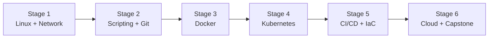

# 🧭 DevOps Engineer Career Roadmap

> **Tác giả:** Mr.Rom\
> **Phiên bản:** v1.0.0\
> **Tạo lúc:** 16/05/2026\
> **Cập nhật:** 16/05/2026\
> **Đối tượng:** Đã code cơ bản (Python/Bash), muốn làm infrastructure + automation\
> **Thời gian ước tính:** ~10 tháng full-time / ~20 tháng part-time\
> **Mức độ:** Junior → Mid

> 🎯 *DevOps Engineer bridge dev ↔ ops — tự động hóa pipeline, build infra, deploy không downtime. Sau roadmap: hiểu Linux sâu, Docker, K8s, CI/CD, IaC, Cloud.*

---

## 🎯 Mục tiêu cuối lộ trình

- [ ] Quản lý Linux server từ A-Z (SSH, systemd, networking, security)
- [ ] Containerize app + orchestrate qua Kubernetes
- [ ] Build CI/CD pipeline (test → build → deploy)
- [ ] Infrastructure as Code (Terraform + Ansible)
- [ ] Quản lý cloud (AWS/GCP) — networking, IAM, monitoring
- [ ] 1-2 capstone project (self-hosted platform / GitOps pipeline)

---

## 🗺️ Overview 6 stage

| Stage | Tên | Thời gian | Output |
|---|---|---|---|
| 1 | Linux + Networking | 2 tháng | Quản lý VPS từ scratch |
| 2 | Scripting + Git | 1-2 tháng | Bash/Python automation |
| 3 | Docker | 1-2 tháng | Containerize app |
| 4 | Kubernetes | 2-3 tháng | Deploy multi-service trên K8s |
| 5 | CI/CD + IaC | 2 tháng | GitHub Actions + Terraform |
| 6 | Cloud + Capstone | 1-2 tháng | Self-hosted platform |

---

## Stage 1 — Linux + Networking (2 tháng)

> 🎯 *Linux là OS DevOps. Master nó.*

### 📚 Đọc

- [ ] Linux basics — [3 bài ✅](../../04_OS/linux/lessons/01_basic/) + advanced (process, permission, systemd) — chưa có
- [ ] [Terminal](../../01_Foundations/computing-environment/lessons/01_basic/00_what-is-terminal.md) ✅
- [ ] Networking: TCP/IP, DNS, HTTP, HTTPS, ports, firewall — `05_Networking/` (chưa có)
- [ ] SSH (key-based auth)
- [ ] systemd (service, journalctl)
- [ ] iptables / nftables cơ bản

### 🧪 Bài tập

- [ ] Setup VPS (DigitalOcean droplet $5/tháng) từ A-Z
- [ ] SSH login key-only, disable password + root login
- [ ] Cài Nginx serve static page
- [ ] Setup firewall (ufw / iptables)
- [ ] Setup systemd service + log qua journalctl

### 🎯 Project Stage 1

- [ ] **Personal VPS setup**: Ubuntu + SSH key + Nginx + firewall + auto-update

### ✅ Verify

- [ ] SSH vào VPS không cần password
- [ ] `systemctl status nginx` show running
- [ ] Curl trang web từ outside

---

## Stage 2 — Scripting + Git (1-2 tháng)

> 🎯 *Tự động hóa bằng script.*

### 📚 Đọc

- [ ] Bash scripting: variables, control flow, functions, traps
- [ ] [Python basics](../../03_Languages/python/lessons/01_basic/) ✅
- [ ] [Git workflow](../../02_Tools/git/) ✅
- [ ] Cron + systemd timers

### 🧪 Bài tập

- [ ] Bash script backup folder + upload S3
- [ ] Python script monitor disk usage + alert email
- [ ] Cron job chạy script hàng ngày
- [ ] Git pre-commit hook lint code

### 🎯 Project Stage 2

- [ ] **Backup automation**: bash script backup DB → S3, cron daily, alert nếu fail

---

## Stage 3 — Docker (1-2 tháng)

> 🎯 *Container hóa mọi thứ.*

### 📚 Đọc

- [ ] [Docker bộ basic ✅ 5 bài](../../10_DevOps/docker/) — from cài đến Compose
- [ ] Multi-stage builds, image size optimization
- [ ] Docker networking (bridge, host, overlay)
- [ ] Volume vs bind mount
- [ ] Docker security best practices

### 🧪 Bài tập

- [ ] [Dockerize app Stage 1](../../10_DevOps/docker/lessons/01_basic/02_dockerfile-basics.md) ✅
- [ ] [Multi-container app với Compose](../../10_DevOps/docker/lessons/01_basic/03_docker-compose.md) ✅
- [ ] Optimize Dockerfile (image từ 1GB → 200MB)
- [ ] Setup private registry (Harbor hoặc self-hosted)

### 🎯 Project Stage 3

- [ ] **Multi-tier app trong Docker Compose**: web + API + Postgres + Redis + Nginx reverse proxy

---

## Stage 4 — Kubernetes (2-3 tháng)

> 🎯 *Orchestrate containers ở scale.*

### 📚 Đọc

- [ ] K8s architecture (control plane, nodes) — `10_DevOps/kubernetes/` (chưa có)
- [ ] Resources: Pod, Deployment, Service, Ingress, ConfigMap, Secret
- [ ] Networking (CNI), Storage (PV/PVC), RBAC
- [ ] Helm charts (package manager)
- [ ] Operators + CRDs (advanced)

### 🛠️ Setup

- [ ] Minikube hoặc Kind cho local
- [ ] kubectl CLI

### 🧪 Bài tập

- [ ] Deploy nginx Pod → Deployment → Service
- [ ] Ingress route traffic + TLS với cert-manager
- [ ] ConfigMap + Secret cho config
- [ ] HPA auto-scaling
- [ ] Rolling update + rollback
- [ ] Viết Helm chart cho 1 app

### 🎯 Project Stage 4

- [ ] **Deploy Stage 3 app lên Kubernetes** với Helm chart

### ✅ Verify

- [ ] `kubectl get pods` show all healthy
- [ ] App access qua Ingress với HTTPS

---

## Stage 5 — CI/CD + IaC (2 tháng)

> 🎯 *Automation pipeline + infra qua code.*

### 📚 Đọc

- [ ] CI/CD concepts (pipeline, stages, artifacts) — `10_DevOps/ci-cd/` (chưa có)
- [ ] GitHub Actions deep
- [ ] GitLab CI (alternative)
- [ ] Terraform basics — `10_DevOps/iac/terraform/` (chưa có)
- [ ] Ansible basics — `10_DevOps/iac/ansible/` (chưa có)
- [ ] GitOps (ArgoCD / Flux) — `10_DevOps/gitops/` (chưa có)

### 🧪 Bài tập

- [ ] GitHub Actions: lint → test → build image → push → deploy
- [ ] Terraform: tạo VPC + EC2 trên AWS
- [ ] Ansible: config Nginx + SSL trên VPS
- [ ] ArgoCD watch GitHub repo → auto-deploy K8s

### 🎯 Project Stage 5

- [ ] **GitOps pipeline**: push code → CI build image → ArgoCD deploy K8s → live

---

## Stage 6 — Cloud + Capstone (1-2 tháng)

> 🎯 *Master 1 cloud + build capstone.*

### Chọn 1 cloud

| Cloud | Phù hợp |
|---|---|
| **AWS** ⭐ | Job nhiều nhất, market share lớn |
| GCP | Hot startup, BigQuery |
| Azure | Enterprise, Windows shop |

→ **AWS** cho beginner — nhiều tài nguyên + cert phổ biến.

### 📚 Đọc

- [ ] AWS core: VPC, EC2, S3, RDS, IAM, CloudWatch — `11_Cloud/aws/` (chưa có)
- [ ] Networking deep (subnet, security group, NACL)
- [ ] Cost management (avoid surprise bill!)
- [ ] AWS CLI

### 🎯 Capstone

| Project | Scope |
|---|---|
| **Self-hosted platform** | Kubernetes cluster + GitOps + monitoring (Prometheus+Grafana) + logging (Loki) |
| **CI/CD as a Service** | GitHub Actions runner pool tự host, scale theo demand |
| **Disaster recovery setup** | Multi-region failover, automated backup |
| **Cost optimization audit** | Existing AWS account, document + automate cost cut 30%+ |

### Bắt buộc

- [ ] Architecture diagram (draw.io)
- [ ] IaC 100% (Terraform/Pulumi) — không click console
- [ ] Monitoring (Prometheus + Grafana)
- [ ] Runbook documentation
- [ ] Cost estimate trong README

---

## 🧭 Career tiếp theo

| Hướng | Roadmap |
|---|---|
| Site Reliability | [`sre-engineer`](./sre-engineer_career-roadmap.md) (chưa có) |
| Platform thinking | [`platform-engineer`](./platform-engineer_career-roadmap.md) (chưa có) |
| Cloud specialization | [`cloud-engineer`](./cloud-engineer_career-roadmap.md) (chưa có) |
| Security focus | [`security-engineer`](./security-engineer_career-roadmap.md) (chưa có) |

---

## 📌 Tài nguyên bổ sung

| Tài nguyên | Khi dùng |
|---|---|
| [Roadmap.sh DevOps](https://roadmap.sh/devops) | Visual roadmap |
| [KodeKloud](https://kodekloud.com/) | Practice K8s hands-on |
| [AWS Skill Builder (free)](https://skillbuilder.aws/) | AWS training free |
| *Site Reliability Engineering* — Google (free) | Sau Stage 5 — bible SRE |
| *The Phoenix Project* (sách) | Mindset DevOps |

### Cert đáng

- **AWS Solutions Architect Associate** — entry cert
- **CKA (Certified Kubernetes Administrator)** — gold standard K8s
- **HashiCorp Terraform Associate**

---

## 🔄 Khi nào điều chỉnh

| Tình huống | Hành động |
|---|---|
| Linux quá khó → bỏ giữa chừng | Practice Linux 1 tháng mới sang Docker — đừng skip |
| K8s overwhelming | Học Docker thật chắc trước, K8s sẽ dễ hơn |
| Cloud chọn AWS hay GCP? | AWS — market share lớn nhất, job nhiều nhất |

---

## 📌 Changelog

- **v1.0.0 (16/05/2026)** — Bản đầu tiên. 6 stage / 10 tháng FT. Output: DevOps Mid với capstone.
