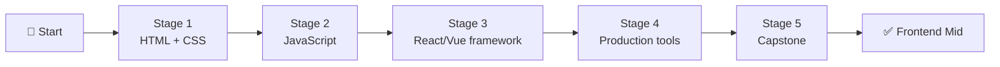

# 🧭 Frontend Developer Career Roadmap

> **Tác giả:** Mr.Rom\
> **Phiên bản:** v1.0.0\
> **Tạo lúc:** 16/05/2026\
> **Cập nhật:** 16/05/2026\
> **Đối tượng:** Đã biết HTML/CSS/JS cơ bản (hoặc Stage 1 zero-to-coder), muốn làm UI/UX web\
> **Thời gian ước tính:** ~9 tháng full-time / ~18 tháng part-time\
> **Mức độ:** Junior → Mid

> 🎯 *Frontend Developer build phần "user thấy" — UI đẹp, tương tác mượt, responsive trên mọi thiết bị. Sau roadmap này bạn build được SPA hiện đại với React/Vue + deploy.*

---

## 🎯 Mục tiêu cuối lộ trình

- [ ] Viết HTML semantic, CSS responsive (mobile-first)
- [ ] Thành thạo JavaScript ES2020+ (async/await, modules, destructuring)
- [ ] Build SPA với React (hoặc Vue) — component, state, routing, fetch API
- [ ] Hiểu tooling (Vite, npm, ESLint, Prettier)
- [ ] Tối ưu performance + accessibility cơ bản
- [ ] 1 project portfolio frontend đầy đủ trên GitHub + deploy

---

## 🗺️ Overview 5 stage

| Stage | Tên | Thời gian | Output |
|---|---|---|---|
| 1 | **HTML + CSS** | 1-2 tháng | Static page responsive |
| 2 | **JavaScript** | 2 tháng | Interactive page + ES2020+ |
| 3 | **Framework (React/Vue)** | 2-3 tháng | SPA cơ bản |
| 4 | **Production tools** | 1-2 tháng | Vite + test + deploy |
| 5 | **Capstone** | 1-2 tháng | Portfolio project |

---

## Stage 1 — HTML + CSS (1-2 tháng)

> 🎯 *Cấu trúc trang + style đẹp + responsive.*

### 📚 Lý thuyết

- [ ] HTML5 semantic — `07_Web/frontend/html-css/` (chưa có)
- [ ] CSS Box model, Flexbox, Grid
- [ ] Responsive design (media queries, mobile-first)
- [ ] CSS variables + custom properties
- [ ] Tailwind CSS (utility-first) — modern alternative

### 🛠️ Setup

- [ ] [VS Code + Live Server extension](../../02_Tools/editor/setup/vs-code.md) ✅
- [ ] [Git + GitHub](../../01_Foundations/version-control/git/setup/git.md) ✅
- [ ] Browser DevTools (Chrome/Firefox)

### 🧪 Bài tập

- [ ] Clone trang landing (Apple, Stripe) chỉ bằng HTML/CSS
- [ ] Responsive layout 2-col → 1-col trên mobile
- [ ] Flexbox Frog (game học flexbox)
- [ ] CSS Grid Garden

### 🎯 Project Stage 1

- [ ] **Personal portfolio static page** — about + projects + contact, deploy lên GitHub Pages

### ✅ Verify

- [ ] Trang chạy responsive trên mobile + desktop
- [ ] Pass Lighthouse score > 90 cho Performance + Accessibility
- [ ] HTML pass validator (validator.w3.org)

---

## Stage 2 — JavaScript (2 tháng)

> 🎯 *Học JS thật chắc — không nhảy framework trước.*

### 📚 Lý thuyết

- [ ] JS Variables, types, operators — `03_Languages/javascript-typescript/` (chưa có)
- [ ] Functions (arrow, default, rest/spread)
- [ ] Array methods (map, filter, reduce, find)
- [ ] Object destructuring, spread/rest
- [ ] Async (Promise, async/await, fetch)
- [ ] Modules (import/export)
- [ ] DOM manipulation
- [ ] Event handling
- [ ] LocalStorage / sessionStorage
- [ ] TypeScript basics (sau khi JS vững)

### 🧪 Bài tập

- [ ] FizzBuzz, palindrome, fibonacci
- [ ] Array methods 20 bài
- [ ] Fetch API → render lên trang (vd: TheCatAPI)
- [ ] Form validation client-side
- [ ] TodoMVC vanilla JS

### 🎯 Project Stage 2

- [ ] **Weather app vanilla JS**: gọi API OpenWeather + render UI + localStorage save city

### ✅ Verify

- [ ] Hiểu hoisting, closure, `this`
- [ ] Không lẫn `==` vs `===`
- [ ] Code có ESLint pass

---

## Stage 3 — Framework: React hoặc Vue (2-3 tháng)

> 🎯 *Chọn 1 framework, học thật vững.*

### Chọn framework

| Framework | Ưu | Phù hợp |
|---|---|---|
| **React** ⭐ | Phổ biến #1, hệ sinh thái khổng lồ, job nhiều | RECOMMEND beginner 2026 |
| Vue 3 | Dễ học hơn, syntax gần HTML | Người mới học framework |
| Svelte / SolidJS | Modern, ít boilerplate | Power user / startup |

→ **React** cho beginner 2026 — nhiều việc + nhiều tài nguyên.

### 📚 Lý thuyết (React)

- [ ] Component (function component, props) — `07_Web/frontend/react/` (chưa có)
- [ ] Hooks: `useState`, `useEffect`, `useContext`, `useMemo`, `useCallback`
- [ ] React Router (routing client-side)
- [ ] State management: Context API → Zustand → Redux Toolkit (khi cần)
- [ ] Fetch data + error handling (TanStack Query / SWR)
- [ ] Forms (React Hook Form + Zod)
- [ ] Component patterns (composition, render props, custom hooks)
- [ ] TypeScript + React (`tsx`)

### 🧪 Bài tập

- [ ] React: Counter, Todo, Tabs, Modal
- [ ] Fetch + render list từ API (Pokemon API, JSON Placeholder)
- [ ] Form đăng ký với validation
- [ ] Multi-page app với React Router
- [ ] Custom hook (vd useFetch, useLocalStorage)

### 🎯 Project Stage 3

- [ ] **Movie browser app**: Fetch TMDB API, search, filter, detail page với React Router

### ✅ Verify

- [ ] Hiểu khi nào re-render
- [ ] Tránh được prop drilling (Context hoặc Zustand)
- [ ] Custom hook tự viết được

---

## Stage 4 — Production Tools (1-2 tháng)

> 🎯 *Tooling chuyên nghiệp — build, test, deploy.*

### 📚 Lý thuyết

- [ ] **Build tool**: Vite (modern) hoặc Next.js (full-stack)
- [ ] Package management: npm / pnpm / bun
- [ ] Linting: ESLint + Prettier
- [ ] Testing: Vitest + React Testing Library + Playwright (E2E)
- [ ] Bundle size + code splitting
- [ ] Lighthouse audit (Performance, A11y, SEO)
- [ ] Web Vitals (LCP, FID, CLS)
- [ ] Tailwind CSS / CSS Modules / CSS-in-JS

### 🛠️ Setup

- [ ] Node.js LTS (cài qua nvm/fnm)
- [ ] [Docker basics](../../10_DevOps/docker/) ✅ — deploy container
- [ ] Vercel / Netlify account (deploy free)

### 🧪 Bài tập

- [ ] Setup Vite + React + TypeScript + ESLint + Prettier from scratch
- [ ] Viết test Vitest cho 3 component
- [ ] E2E test với Playwright cho 1 flow
- [ ] Deploy lên Vercel / Netlify
- [ ] Optimize bundle size với code splitting

### 🎯 Project Stage 4

- [ ] **Refactor Movie browser (Stage 3)** với TypeScript + test + deploy Vercel + Lighthouse 90+

### ✅ Verify

- [ ] CI chạy lint + test khi PR
- [ ] App deployed live qua HTTPS
- [ ] Lighthouse score > 90

---

## Stage 5 — Capstone Project (1-2 tháng)

> 🎯 *Portfolio frontend "đáng mặt".*

### Chọn 1 project

| Project | Scope |
|---|---|
| **E-commerce** | Cart, checkout, products, search, filter |
| **Social feed** | Timeline, like/comment, infinite scroll, dark mode |
| **Dashboard analytics** | Charts (Recharts), filters, export |
| **Booking UI** | Calendar, time picker, multi-step form |
| **Real-time chat** | WebSocket, typing indicator, file upload |

### Yêu cầu bắt buộc

- [ ] TypeScript 100%
- [ ] React Router với 3+ routes
- [ ] State management (Context/Zustand/Redux)
- [ ] Fetch real API (own backend hoặc public API)
- [ ] Responsive design (mobile + desktop)
- [ ] Test coverage > 60%
- [ ] Deploy live (link trong README)
- [ ] Lighthouse 90+ (Performance, A11y)
- [ ] README có screenshot + GIF demo

### ✅ Verify cuối roadmap

- [ ] Open trên mobile → UX OK
- [ ] Mở DevTools → bundle < 500 KB initial
- [ ] Trả lời "Vì sao chọn React + Vite?" trong 2 phút

---

## 🧭 Career tiếp theo

| Hướng đi tiếp | Roadmap |
|---|---|
| Cả backend → full-stack | [`fullstack-developer`](./fullstack-developer_career-roadmap.md) (chưa có) |
| Mobile app | [`mobile-developer`](./mobile-developer_career-roadmap.md) (chưa có) — React Native dễ chuyển |
| Design system + UX heavy | (specialization — chưa có roadmap riêng) |
| 3D / Game UI | [`game-developer`](./game-developer_career-roadmap.md) (chưa có) |

---

## 📌 Tài nguyên bổ sung

### Sách / Docs

| Tài nguyên | Khi dùng |
|---|---|
| [react.dev](https://react.dev) | Docs chính thức React — học từ đây |
| *Eloquent JavaScript* (free) | Sách JS sâu, free online |
| *You Don't Know JS* (free GitHub) | JS deep dive |
| [Frontend Masters](https://frontendmasters.com/) | Khoá pro ($) |

### Khoá miễn phí

- [The Odin Project](https://theodinproject.com/) — frontend roadmap free, project-based
- [freeCodeCamp Responsive Web Design](https://freecodecamp.org/) — 300h free
- [Frontend Mentor](https://frontendmentor.io/) — bài tập từ design

### Cộng đồng

- [r/Frontend](https://reddit.com/r/Frontend), [r/reactjs](https://reddit.com/r/reactjs)
- [DEV Community](https://dev.to/t/react)
- Twitter: theo dõi React core team

---

## 🔄 Khi nào điều chỉnh

| Tình huống | Hành động |
|---|---|
| Đã biết HTML/CSS → skip Stage 1 | OK, verify rồi sang Stage 2 |
| Stage 2 (JS) khó vì nhảy framework sớm | Slow down, làm thêm exercises vanilla JS |
| Vue có vẻ phù hợp hơn React | OK đổi — nhưng commit 1 framework, không nhảy giữa |
| Muốn học mobile (React Native) | OK sau Stage 4 — RN dùng React knowledge |

---

## 📝 Tự đánh giá hàng tháng

Cuối tháng ghi `progress.md`:

| Tháng | Concept đã học | Project hoàn thành | Cảm thấy | Cần điều chỉnh |

---

## 📌 Changelog

- **v1.0.0 (16/05/2026)** — Bản đầu tiên. 5 stage / 9 tháng FT. Output: Frontend Mid với SPA portfolio.
