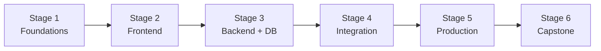

# 🧭 Fullstack Developer Career Roadmap

> **Tác giả:** Mr.Rom\
> **Phiên bản:** v1.0.0\
> **Tạo lúc:** 16/05/2026\
> **Cập nhật:** 16/05/2026\
> **Đối tượng:** Đã code cơ bản, muốn làm cả frontend + backend\
> **Thời gian ước tính:** ~12 tháng full-time / ~24 tháng part-time\
> **Mức độ:** Junior → Mid

> 🎯 *Fullstack Developer build cả "phần thấy" (UI) lẫn "phần ngầm" (API + DB). Phù hợp startup nhỏ, freelancer, indie hacker. Roadmap này deep cả 2 chiều.*

---

## 🎯 Mục tiêu cuối lộ trình

- [ ] Build full web app: frontend (React) + backend (FastAPI/Node) + DB (Postgres)
- [ ] Auth, payment, file upload, real-time
- [ ] Test cả FE + BE (coverage > 60%)
- [ ] Deploy production (Docker + cloud)
- [ ] 1-2 project portfolio fullstack đầy đủ

---

## 🗺️ Overview 6 stage

| Stage | Tên | Thời gian | Output |
|---|---|---|---|
| 1 | Foundations | 1-2 tháng | Tools + Git + HTTP |
| 2 | Frontend | 2-3 tháng | React SPA cơ bản |
| 3 | Backend + DB | 2-3 tháng | FastAPI + Postgres |
| 4 | Integration FE↔BE | 1-2 tháng | Connect 2 phần qua REST/GraphQL |
| 5 | Production | 2 tháng | Auth, test, Docker, deploy |
| 6 | Capstone | 1-2 tháng | Portfolio project hoàn chỉnh |

---

## Stage 1 — Foundations (1-2 tháng)

> 🎯 *Tools, terminal, Git, HTTP protocol — giống Stage 1 backend/frontend.*

### 📚 Đọc

- [ ] [Terminal](../../02_Tools/shell/lessons/01_basic/00_what-is-terminal.md) ✅ + Linux basics ([3 bài Linux](../../04_OS/linux/) ✅)
- [ ] [Git workflow](../../01_Foundations/version-control/git/) ✅
- [ ] HTTP/REST cơ bản
- [ ] JSON, JWT cơ bản
- [ ] DNS, HTTPS, CORS

### 🛠️ Setup

- [ ] [VS Code](../../02_Tools/editor/setup/vs-code.md) ✅
- [ ] [Git + GitHub](../../01_Foundations/version-control/git/setup/git.md) ✅
- [ ] [Python](../../03_Languages/python/setup/install-python.md) ✅
- [ ] Node.js LTS (qua nvm/fnm)

### ✅ Verify

- [ ] Git workflow tự tin
- [ ] Hiểu chu kỳ request-response

---

## Stage 2 — Frontend (2-3 tháng)

> 🎯 *Học React + TypeScript đến mức build được SPA.*

### 📚 Đọc + practice

- [ ] HTML5 + CSS3 + Flexbox/Grid — `07_Web/frontend/html-css/` (chưa có)
- [ ] JavaScript ES2020+: arrow function, async/await, modules, array methods
- [ ] TypeScript basics
- [ ] React: components, hooks (`useState`, `useEffect`, `useContext`)
- [ ] React Router
- [ ] Fetch API + error handling
- [ ] Form handling (React Hook Form + Zod)
- [ ] Tailwind CSS

### 🎯 Project Stage 2

- [ ] **Movie browser SPA**: TMDB API, search, detail page, dark mode

### ✅ Verify

- [ ] Build + deploy lên Vercel
- [ ] Responsive mobile + desktop

---

## Stage 3 — Backend + DB (2-3 tháng)

> 🎯 *Build API + Postgres serving frontend.*

### 📚 Đọc + practice

- [ ] [Python functions, OOP](../../03_Languages/python/lessons/01_basic/03_functions.md) ✅
- [ ] FastAPI: routes, dependencies, validation Pydantic — `07_Web/backend/python-fastapi/` (chưa có)
- [ ] SQL basics — `06_Databases/sql-fundamentals/` (chưa có)
- [ ] Postgres + SQLAlchemy ORM — `06_Databases/postgresql/` (chưa có)
- [ ] Migration (Alembic)
- [ ] Redis caching cơ bản
- [ ] Async patterns

### 🎯 Project Stage 3

- [ ] **Blog API standalone**: CRUD posts + users + comments, Postgres, Swagger doc

### ✅ Verify

- [ ] API có Swagger doc
- [ ] DB design có ERD

---

## Stage 4 — Integration FE ↔ BE (1-2 tháng)

> 🎯 *Connect 2 phần thành 1 app hoạt động end-to-end.*

### 📚 Đọc

- [ ] CORS deep dive (preflight, credentials)
- [ ] Authentication flow: JWT vs session vs OAuth
- [ ] State sync FE-BE: optimistic update, polling, SSE
- [ ] Error handling end-to-end
- [ ] API client patterns (TanStack Query / SWR / Axios)
- [ ] File upload (multipart, presigned URL)

### 🎯 Project Stage 4

- [ ] **Connect Movie app (FE) với own Blog API** thay TMDB → end-to-end app

### ✅ Verify

- [ ] CORS không lỗi
- [ ] Auth flow đầy đủ (register/login/logout/refresh token)
- [ ] Error UX tốt (loading, empty, error states)

---

## Stage 5 — Production-ready (2 tháng)

> 🎯 *Test + Docker + Deploy.*

### 📚 Đọc + practice

- [ ] Testing FE: Vitest + React Testing Library + Playwright
- [ ] Testing BE: pytest + httpx
- [ ] [Docker + Compose](../../10_DevOps/docker/) ✅ 5 bài
- [ ] CI/CD: GitHub Actions
- [ ] Deploy options: Vercel (FE) + Railway/Render (BE), hoặc all-in-one Fly.io
- [ ] Environment config (12-factor app)
- [ ] Logging + error tracking (Sentry)

### 🎯 Project Stage 5

- [ ] **Dockerize Blog app fullstack** + GitHub Actions CI/CD + deploy live

### ✅ Verify

- [ ] App accessible qua HTTPS public URL
- [ ] CI chạy test khi PR

---

## Stage 6 — Capstone (1-2 tháng)

> 🎯 *Project lớn để show portfolio.*

### Chọn 1

| Project | Highlight |
|---|---|
| **Mini Twitter / X clone** | Timeline, follow, like, real-time |
| **E-commerce** | Cart, checkout, Stripe, admin |
| **Project management tool** | Kanban, drag-drop, team collab |
| **Real estate listing** | Map, search, image upload |
| **Job board** | Search, filter, application flow |

### Bắt buộc

- [ ] FE React + TS + Tailwind
- [ ] BE FastAPI + Postgres + Redis
- [ ] Auth (JWT hoặc OAuth + Google)
- [ ] Test FE + BE (coverage > 60%)
- [ ] Docker Compose dev environment
- [ ] CI/CD GitHub Actions
- [ ] Deploy live (Vercel + Railway/Fly)
- [ ] README có demo GIF + ERD + architecture diagram

---

## 🧭 Career tiếp theo

| Hướng | Roadmap |
|---|---|
| Specialize Frontend | [`frontend-developer`](./frontend-developer_career-roadmap.md) |
| Specialize Backend | [`backend-developer`](./backend-developer_career-roadmap.md) |
| Infrastructure | [`devops-engineer`](./devops-engineer_career-roadmap.md) (chưa có) |
| Mobile | [`mobile-developer`](./mobile-developer_career-roadmap.md) (chưa có) |

---

## 📌 Tài nguyên bổ sung

| Tài nguyên | Khi dùng |
|---|---|
| [Roadmap.sh Fullstack](https://roadmap.sh/full-stack) | Visual roadmap |
| [The Odin Project](https://theodinproject.com/) | Free fullstack curriculum |
| [Fireship YouTube](https://youtube.com/c/fireship) | Short videos modern stack |
| *Designing Web APIs* — Brenda Jin | Sau Stage 4 |

---

## 🔄 Khi nào điều chỉnh

| Tình huống | Hành động |
|---|---|
| Thấy frontend hấp dẫn hơn → specialize | Đi sâu [frontend-developer roadmap](./frontend-developer_career-roadmap.md) |
| Thấy backend hấp dẫn hơn → specialize | Đi sâu [backend-developer roadmap](./backend-developer_career-roadmap.md) |
| Burnout vì học cả 2 bên | Pick 1, master trước, học 2 sau |

---

## 📌 Changelog

- **v1.0.0 (16/05/2026)** — Bản đầu tiên. 6 stage / 12 tháng FT. Output: Fullstack Mid với 1 project portfolio.
