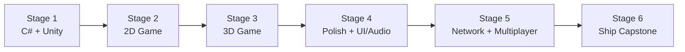

# 🧭 Game Developer Career Roadmap

> **Tác giả:** Mr.Rom\
> **Phiên bản:** v1.0.0\
> **Tạo lúc:** 16/05/2026\
> **Cập nhật:** 16/05/2026\
> **Đối tượng:** Yêu game, muốn build game (2D/3D)\
> **Thời gian ước tính:** ~12 tháng FT / ~24 tháng PT\
> **Mức độ:** Junior → Mid

> 🎯 *Game Developer build game cross-platform (PC/console/mobile). Roadmap focus **Unity** (C#) — entry phổ biến nhất, engine 70%+ thị phần indie.*

---

## 🎯 Mục tiêu cuối

- [ ] Master C# + Unity engine
- [ ] Build 2D + 3D game cơ bản
- [ ] Physics, animation, particle, UI, sound
- [ ] Multiplayer cơ bản (network)
- [ ] Optimize performance (FPS, memory)
- [ ] Ship 1-2 game lên itch.io / Steam / mobile store

---

## 🗺️ Overview 6 stage

| Stage | Tên | Thời gian | Output |
|---|---|---|---|
| 1 | C# + Unity basics | 2 tháng | Hello cube xoay |
| 2 | 2D game | 2 tháng | Platformer cơ bản |
| 3 | 3D game | 2 tháng | FPS / 3rd person cơ bản |
| 4 | Polish (UI, audio, FX) | 2 tháng | Game "feel" tốt |
| 5 | Network + Multiplayer | 1-2 tháng | Co-op LAN/online |
| 6 | Ship capstone | 2-3 tháng | Game public trên itch.io |

---

## Stage 1 — C# + Unity Basics (2 tháng)

> 🎯 *Unity dùng C#. Học song song engine + ngôn ngữ.*

### 📚 Đọc

- [ ] C# basics (variables, types, OOP) — `03_Languages/csharp/` (chưa có)
- [ ] Unity Editor interface (Scene, Hierarchy, Inspector, Project, Game view)
- [ ] GameObject + Component pattern
- [ ] Transform (position, rotation, scale)
- [ ] Update vs FixedUpdate vs LateUpdate
- [ ] Prefabs
- [ ] [Git workflow](../../01_Foundations/version-control/git/) ✅ + LFS cho asset

### 🛠️ Setup

- [ ] Unity Hub + Unity LTS (vd 2022 LTS)
- [ ] Visual Studio / Rider (C# IDE)
- [ ] Git + Git LFS

### 🧪 Bài tập

- [ ] Cube xoay
- [ ] Player di chuyển WASD
- [ ] Collision detect → log

### 🎯 Project Stage 1

- [ ] **Roll-a-ball** (Unity official tutorial) — ball lăn, collect coin, score

---

## Stage 2 — 2D Game (2 tháng)

> 🎯 *2D dễ ship hơn 3D — start đây.*

### 📚 Đọc

- [ ] 2D sprite, sprite sheet, animation
- [ ] Tilemap (level design)
- [ ] 2D physics (Rigidbody2D, Collider2D)
- [ ] Camera follow
- [ ] Pickup, enemy, hazard
- [ ] State machine (player states)
- [ ] Scene management (multiple scenes)

### 🧪 Bài tập

- [ ] Pong (paddle + ball)
- [ ] Flappy Bird clone
- [ ] Tetris clone

### 🎯 Project Stage 2

- [ ] **2D Platformer**: jump, run, enemy AI, level 3+, save progress

---

## Stage 3 — 3D Game (2 tháng)

> 🎯 *3D phức tạp hơn nhưng nhiều cảm hứng.*

### 📚 Đọc

- [ ] 3D space + transforms
- [ ] 3D physics (Rigidbody, Collider, Joint)
- [ ] Lighting (directional, point, spot, baked vs realtime)
- [ ] Materials + Shaders (URP basics)
- [ ] Animation Controller + Blend Tree
- [ ] NavMesh (AI pathfinding)
- [ ] Camera systems (Cinemachine)
- [ ] Skybox + post-processing

### 🎯 Project Stage 3

- [ ] **3D Game**: 3rd person controller + 1 enemy AI + 1 level + simple combat

---

## Stage 4 — Polish (UI, Audio, FX) (2 tháng)

> 🎯 *Game "feel" tốt = polish + UX detail.*

### 📚 UI

- [ ] uGUI / UI Toolkit (modern)
- [ ] Main menu, HUD, pause, settings, win/lose screens
- [ ] Responsive UI (multi-resolution)

### 📚 Audio

- [ ] AudioSource + AudioMixer
- [ ] BGM + SFX + ambient
- [ ] Audio spatial 3D

### 📚 FX + Game Feel

- [ ] Particle System (Shuriken)
- [ ] Camera shake
- [ ] Hitstop, screen freeze
- [ ] Sound timing với event
- [ ] DOTween cho smooth animation

### 🎯 Project Stage 4

- [ ] **Refactor Stage 2/3 game** với UI hoàn chỉnh + sound + FX → "feel" tốt

---

## Stage 5 — Network + Multiplayer (1-2 tháng)

> 🎯 *Co-op / multiplayer cơ bản.*

### 📚 Đọc

- [ ] Networking models (client-server vs P2P)
- [ ] Unity Netcode for GameObjects
- [ ] Mirror (alternative, open source)
- [ ] Photon PUN (managed network)
- [ ] Sync transform, RPC, state
- [ ] Lag compensation, prediction
- [ ] Matchmaking basics

### 🎯 Project Stage 5

- [ ] **Co-op LAN game**: 2 player cùng level Stage 2/3

---

## Stage 6 — Ship Capstone (2-3 tháng)

> 🎯 *Ship game public — đó là phần khó nhất.*

### Project ideas

| Game | Highlight |
|---|---|
| **2D Roguelike** | Procedural generation, permadeath |
| **Tower Defense** | Wave system, upgrade tree |
| **Puzzle Platformer** | Mechanics riêng (gravity flip, time slow) |
| **Top-down Shooter** | Procedural levels, gun feel |
| **Idle / Clicker** | Mobile-friendly, IAP |

### Bắt buộc trước ship

- [ ] Tutorial / onboarding
- [ ] Save/Load progress
- [ ] Settings (volume, controls, resolution)
- [ ] Pause menu
- [ ] Credits screen
- [ ] App icon + screenshots + trailer
- [ ] Build cho ≥1 platform (Windows/Mac/Linux/WebGL/Android)
- [ ] Upload lên itch.io (free) hoặc Steam ($100 fee)

### Marketing minimum

- [ ] Trailer 30-60s
- [ ] 5-10 screenshots
- [ ] Description (genre, controls, features)
- [ ] Press kit (tự làm hoặc presskit())

---

## 🧭 Career tiếp theo

| Hướng | Note |
|---|---|
| Indie dev tiếp tục | Ship game tiếp, build portfolio |
| AAA studio | Cần specialization (gameplay/graphics/AI/network) |
| Game Designer | Less code, more design (level design, balance) |
| Tech Artist | Lai art + tech (shader, VFX) |
| Game Engine Dev | C++ + math sâu (engine programming) |
| Mobile game | [Mobile Dev roadmap](./mobile-developer_career-roadmap.md) ✅ |

---

## 📌 Tài nguyên bổ sung

| Tài nguyên | Khi dùng |
|---|---|
| [Unity Learn (free)](https://learn.unity.com/) | Tutorial chính thức |
| [Brackeys YouTube](https://youtube.com/@Brackeys) | Best beginner channel (đã ngừng nhưng video còn) |
| [Game Maker's Toolkit](https://youtube.com/@GMTK) | Game design analysis |
| *Game Programming Patterns* — Le Van B Nystrom (free) | Architecture patterns |
| [r/Unity3D](https://reddit.com/r/Unity3D), [Unity forums](https://forum.unity.com) | Community |

---

## 🔄 Điều chỉnh

| Tình huống | Hành động |
|---|---|
| Unity quá phức tạp | Try Godot (free, simpler) hoặc Pygame (Python, 2D only) |
| Math khó (3D, shader) | Sau Stage 2 OK, math sâu chỉ cần Stage 4+ |
| Muốn làm AAA | Sau roadmap → specialize (graphics/network/AI) + C++ |
| Solo dev mệt | OK — start nhỏ (game 30 phút playthrough), ship rồi mới scope lớn |

---

## 📌 Changelog

- **v1.0.0 (16/05/2026)** — Bản đầu tiên. 6 stage / 12 tháng FT. Unity + C# focus + indie ship.
