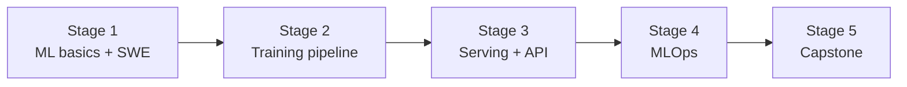

# 🧭 ML Engineer Career Roadmap

> **Tác giả:** Mr.Rom\
> **Phiên bản:** v1.0.0\
> **Tạo lúc:** 16/05/2026\
> **Cập nhật:** 16/05/2026\
> **Đối tượng:** Đã biết ML cơ bản hoặc đã làm Data Scientist, muốn deploy ML production\
> **Thời gian ước tính:** ~12 tháng full-time / ~24 tháng part-time\
> **Mức độ:** Junior → Mid

> 🎯 *ML Engineer = lai Software Engineer + Data Scientist. Build ML system production: training pipeline, serving API, monitoring, retraining. Khác Data Scientist (notebook focus) + AI Engineer (LLM app focus).*

---

## 🎯 Mục tiêu cuối

- [ ] Train model end-to-end (data → features → train → eval)
- [ ] Deploy model qua API (FastAPI + Docker)
- [ ] Build training pipeline (orchestration)
- [ ] MLOps: experiment tracking (MLflow), model registry, monitoring
- [ ] CI/CD cho ML model
- [ ] 1-2 ML system production-ready

---

## 🗺️ Overview 5 stage

| Stage | Tên | Thời gian | Output |
|---|---|---|---|
| 1 | ML basics + Software Engineering | 2-3 tháng | Train basic model + good code |
| 2 | Training pipeline | 2 tháng | Reproducible training |
| 3 | Serving + API | 2 tháng | Model behind FastAPI |
| 4 | MLOps | 2-3 tháng | Tracking, monitoring, retraining |
| 5 | Capstone | 2 tháng | Production ML system |

---

## Stage 1 — ML Basics + SWE (2-3 tháng)

> 🎯 *Cần CẢ ML knowledge + SWE skills.*

### 📚 Đọc

- [ ] [Python advanced](../../03_Languages/python/) ✅ basics + OOP, async
- [ ] [Git workflow](../../02_Tools/git/) ✅
- [ ] Classical ML (regression, classification, clustering) — `13_AI-ML/ml-fundamentals/` (chưa có)
- [ ] Deep Learning basics (NN, CNN, RNN) — `13_AI-ML/deep-learning/` (chưa có)
- [ ] PyTorch fundamentals
- [ ] [Docker basics](../../10_DevOps/docker/) ✅
- [ ] Testing (pytest)
- [ ] Clean code, refactoring

### 🎯 Project Stage 1

- [ ] **Image classifier** với PyTorch + Docker (training script + Dockerfile)

---

## Stage 2 — Training Pipeline (2 tháng)

> 🎯 *Reproducible training — không chạy notebook ad-hoc.*

### 📚 Đọc

- [ ] Feature engineering pipeline
- [ ] Data versioning (DVC, lakeFS)
- [ ] Training script structure (config-driven, hydra)
- [ ] Experiment tracking (MLflow, Weights & Biases)
- [ ] Distributed training (DDP, FSDP)
- [ ] GPU optimization (mixed precision, gradient accumulation)

### 🧪 Bài tập

- [ ] Refactor notebook → modular Python project
- [ ] Track 10 experiments với MLflow/W&B
- [ ] Data versioning với DVC
- [ ] Hydra config cho training

### 🎯 Project Stage 2

- [ ] **Modular training pipeline**: config → load data → train → eval → save model + metrics

---

## Stage 3 — Model Serving + API (2 tháng)

> 🎯 *Serve model qua HTTP API.*

### 📚 Đọc

- [ ] Model serving frameworks: FastAPI + custom, TorchServe, Triton, BentoML
- [ ] Batch inference vs online inference
- [ ] Model optimization: ONNX, quantization, pruning
- [ ] GPU inference (CUDA basics)
- [ ] Load testing (locust, k6)
- [ ] Caching predictions

### 🧪 Bài tập

- [ ] FastAPI wrap model + Pydantic input/output
- [ ] Convert PyTorch → ONNX, benchmark speed
- [ ] Quantize model (INT8) — measure accuracy drop vs speed up
- [ ] Load test với locust → 1000 RPS

### 🎯 Project Stage 3

- [ ] **Model API**: FastAPI + Docker + cache + load test report

---

## Stage 4 — MLOps (2-3 tháng)

> 🎯 *Production-grade ML system.*

### 📚 Đọc

- [ ] CI/CD cho ML: data validation → train → eval → deploy — `10_DevOps/ci-cd/` (chưa có)
- [ ] Model registry (MLflow, SageMaker)
- [ ] Feature store (Feast, Tecton)
- [ ] Model monitoring (data drift, model drift, performance metric)
- [ ] A/B testing models (shadow, canary, multi-armed bandit)
- [ ] Automated retraining
- [ ] Cost monitoring (GPU $$)

### 🛠️ Setup

- [ ] [Kubernetes basics](../../10_DevOps/) (chưa có)
- [ ] [Airflow](../../14_Data-Engineering/) (chưa có)
- [ ] MLflow / W&B account

### 🎯 Project Stage 4

- [ ] **End-to-end MLOps**: data → training pipeline (Airflow) → model registry (MLflow) → serving (K8s) → monitoring (Prometheus + Grafana)

---

## Stage 5 — Capstone (2 tháng)

> 🎯 *ML system production.*

### Chọn 1

| Project | Highlight |
|---|---|
| **Recommendation system** | Collaborative filtering, online serving, A/B test |
| **Fraud detection** | Imbalanced data, real-time, drift handling |
| **Computer vision pipeline** | Object detection + tracking, GPU serving |
| **NLP pipeline** | Text classification, fine-tune transformer, deploy |
| **Time series forecasting** | Multi-horizon, backtest, monitor accuracy |

### Bắt buộc

- [ ] Training pipeline reproducible
- [ ] Model registry + versioning
- [ ] API serving < 100ms p99
- [ ] Monitoring data drift + model performance
- [ ] CI/CD trigger retrain khi drift detected
- [ ] Cost tracking
- [ ] Documentation đầy đủ

---

## 🧭 Career tiếp theo

| Hướng | Roadmap |
|---|---|
| LLM application | [`ai-engineer`](./ai-engineer_career-roadmap.md) ✅ |
| Research / PhD | (specialization — chưa có) |
| Data infra | [`data-engineer`](./data-engineer_career-roadmap.md) ✅ |
| Platform ML | [`platform-engineer`](./platform-engineer_career-roadmap.md) (chưa có) |

---

## 📌 Tài nguyên bổ sung

| Tài nguyên | Khi dùng |
|---|---|
| *Designing ML Systems* — Chip Huyen | Bible MLOps |
| [Made With ML](https://madewithml.com/) | Free, project-based MLOps |
| [fast.ai](https://fast.ai/) | Practical deep learning |
| [Full Stack Deep Learning](https://fullstackdeeplearning.com/) | Free course MLOps |
| [MLOps Community](https://mlops.community/) | Discord/blog community |

---

## 🔄 Điều chỉnh

| Tình huống | Hành động |
|---|---|
| Đã là Data Scientist | Skip Stage 1 ML, focus Stage 2-4 |
| Đã là Backend Eng | Skip Stage 1 SWE, focus ML basics |
| Cảm thấy giống AI Engineer? | AI Eng = build app DÙNG LLM. ML Eng = train + serve model riêng. Khác nhau |

---

## 📌 Changelog

- **v1.0.0 (16/05/2026)** — Bản đầu tiên. 5 stage / 12 tháng FT. MLOps production focus.
