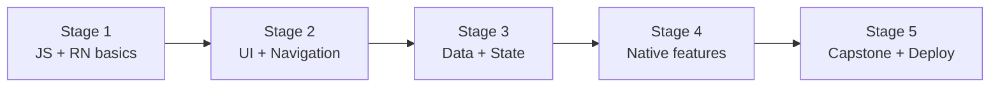

# 🧭 Mobile Developer Career Roadmap

> **Tác giả:** Mr.Rom\
> **Phiên bản:** v1.0.0\
> **Tạo lúc:** 16/05/2026\
> **Cập nhật:** 16/05/2026\
> **Đối tượng:** Đã code cơ bản, muốn làm app iOS/Android\
> **Thời gian ước tính:** ~10 tháng full-time / ~20 tháng part-time\
> **Mức độ:** Junior → Mid

> 🎯 *Mobile Developer build app native hoặc cross-platform. Roadmap này focus React Native (cross-platform) — entry dễ nhất, vẫn JS quen thuộc.*

---

## 🎯 Mục tiêu cuối lộ trình

- [ ] Build mobile app hoạt động trên cả iOS + Android
- [ ] Native UI components, navigation, animations
- [ ] State management, async data, offline support
- [ ] Push notification, deep links, camera/gallery access
- [ ] Test + build + submit lên App Store / Play Store
- [ ] 1-2 app trên store hoặc TestFlight

---

## 🗺️ Overview 5 stage

| Stage | Tên | Thời gian | Output |
|---|---|---|---|
| 1 | JavaScript + React Native basics | 2 tháng | Hello world app trên iPhone/Android |
| 2 | UI + Navigation | 2 tháng | Multi-screen app |
| 3 | Data + State Management | 2 tháng | App có API + storage |
| 4 | Native features | 1-2 tháng | Camera, push, geolocation |
| 5 | Capstone + Deploy | 1-2 tháng | App lên TestFlight / Play Store |

---

## Stage 1 — JS + React Native basics (2 tháng)

> 🎯 *RN dùng JS + React knowledge. Nắm vững trước.*

### 📚 Đọc

- [ ] JavaScript ES2020+ — `03_Languages/javascript-typescript/` (chưa có)
- [ ] React basics: components, hooks (`useState`, `useEffect`)
- [ ] React Native intro — `08_Mobile/react-native/` (chưa có)

### 🛠️ Setup

- [ ] [VS Code](../../02_Tools/editor/setup/vs-code.md) ✅
- [ ] Node.js LTS
- [ ] Expo CLI (`npm install -g expo-cli`) — RECOMMEND beginner
- [ ] iOS Simulator (Mac only) hoặc Android Emulator
- [ ] Expo Go app trên điện thoại thật

### 🧪 Bài tập

- [ ] Hello World với Expo, run trên simulator + phone
- [ ] Counter app
- [ ] Style với StyleSheet API

### 🎯 Project Stage 1

- [ ] **Tip Calculator app**: input bill + tip % → output

---

## Stage 2 — UI + Navigation (2 tháng)

> 🎯 *Build app nhiều màn hình + UI library.*

### 📚 Đọc

- [ ] React Navigation: stack, tab, drawer
- [ ] Flexbox cho mobile (khác CSS web)
- [ ] UI libraries: React Native Paper, NativeBase, Tamagui
- [ ] Theming + dark mode
- [ ] Responsive (different screen sizes)
- [ ] SafeAreaView, KeyboardAvoidingView

### 🎯 Project Stage 2

- [ ] **Movie browser app**: TMDB API, list screen, detail screen, tab navigation

---

## Stage 3 — Data + State Management (2 tháng)

> 🎯 *App thật cần fetch API + lưu state + offline.*

### 📚 Đọc

- [ ] Fetch API, TanStack Query (data fetching)
- [ ] State: Zustand / Redux Toolkit / Jotai
- [ ] AsyncStorage (key-value persist)
- [ ] SQLite (qua expo-sqlite hoặc react-native-mmkv)
- [ ] Form validation (React Hook Form + Zod)
- [ ] Offline-first patterns

### 🎯 Project Stage 3

- [ ] **Note-taking app**: CRUD note, save AsyncStorage, sync khi online

---

## Stage 4 — Native Features (1-2 tháng)

> 🎯 *Truy cập camera, GPS, notification — khác web.*

### 📚 Đọc

- [ ] Camera + image picker (expo-image-picker)
- [ ] Push notification (Expo Notifications hoặc Firebase)
- [ ] Geolocation (expo-location) + Maps
- [ ] Deep linking (universal links)
- [ ] Authentication: OAuth, biometric (Face ID, Touch ID)
- [ ] Animations (React Native Reanimated)
- [ ] In-app purchase basics

### 🎯 Project Stage 4

- [ ] **Travel diary app**: photo from camera + GPS location + map view

---

## Stage 5 — Capstone + Deploy (1-2 tháng)

> 🎯 *App hoàn chỉnh + submit store.*

### Chọn 1 project

| Project | Highlight |
|---|---|
| **Workout tracker** | Native: HealthKit/Google Fit, timer, charts |
| **Pomodoro + tasks** | Notifications, background timer |
| **Recipe app** | Camera, search, save favorites |
| **Expense tracker** | Charts, categories, export CSV |
| **Audio player** | Background audio, lockscreen control |

### Bắt buộc

- [ ] iOS + Android cùng work
- [ ] Auth flow
- [ ] Offline support
- [ ] Push notification
- [ ] App icon + splash screen
- [ ] EAS Build (Expo)
- [ ] Submit TestFlight (iOS) + Internal Test (Android)
- [ ] Privacy policy + Terms

### ✅ Verify cuối

- [ ] App chạy trên iPhone + Android phone thật
- [ ] Bạn bè cài qua TestFlight link
- [ ] App load < 3s

---

## 🧭 Hướng tiếp theo

| Hướng | Roadmap / Note |
|---|---|
| Native iOS pure | Học Swift + SwiftUI (chưa có roadmap) |
| Native Android pure | Học Kotlin + Jetpack Compose (chưa có) |
| Flutter (Google) | Học Dart + Flutter (cross-platform khác) |
| Game mobile | [`game-developer`](./game-developer_career-roadmap.md) (chưa có) — Unity mobile |

---

## 📌 Tài nguyên bổ sung

| Tài nguyên | Khi dùng |
|---|---|
| [React Native Docs](https://reactnative.dev/) | Official |
| [Expo Docs](https://docs.expo.dev/) | Easier path, RECOMMEND beginner |
| [William Candillon YouTube](https://www.youtube.com/c/wcandillon) | RN advanced + animations |
| [Roadmap.sh React Native](https://roadmap.sh/react-native) | Visual roadmap |

---

## 🔄 Điều chỉnh

| Tình huống | Hành động |
|---|---|
| Native pure (Swift/Kotlin) hơn? | Cross-platform RN học nhanh hơn, native job nhiều hơn. Pick theo target |
| Mac mới = Apple Silicon | Run iOS simulator OK + Android emulator OK |
| Không có Mac | RN qua Expo Go + Snack online — vẫn được, nhưng iOS test hạn chế |

---

## 📌 Changelog

- **v1.0.0 (16/05/2026)** — Bản đầu tiên. 5 stage / 10 tháng FT. React Native focus.
