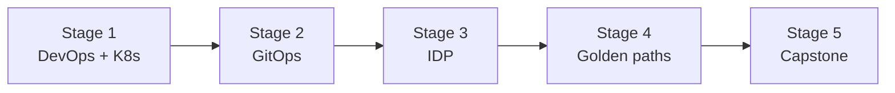

# 🧭 Platform Engineer Career Roadmap

> **Tác giả:** Mr.Rom\
> **Phiên bản:** v1.0.0\
> **Tạo lúc:** 16/05/2026\
> **Cập nhật:** 16/05/2026\
> **Đối tượng:** Đã làm DevOps/SRE, muốn build "platform" cho dev team\
> **Thời gian ước tính:** ~10-12 tháng FT\
> **Mức độ:** Mid → Senior

> 🎯 *Platform Engineer build **Internal Developer Platform (IDP)** — abstract complexity của infra, để dev tự deploy + monitor không cần biết K8s sâu. Hot 2024-2026.*

---

## 🎯 Mục tiêu cuối

- [ ] Master Kubernetes + GitOps
- [ ] Build IDP với Backstage / Port / Crossplane
- [ ] Self-service workflow cho dev (1 PR → deploy)
- [ ] Golden path templates (project templates)
- [ ] Multi-cluster + multi-tenant
- [ ] 1 capstone IDP

---

## 🗺️ Overview 5 stage

| Stage | Tên | Thời gian | Output |
|---|---|---|---|
| 1 | DevOps + K8s deep | 2-3 tháng | DevOps Mid + K8s |
| 2 | GitOps (ArgoCD/Flux) | 2 tháng | Auto-deploy from Git |
| 3 | IDP (Backstage/Port) | 2 tháng | Service catalog + self-service |
| 4 | Golden paths + templates | 2 tháng | Project template, scaffolding |
| 5 | Capstone | 2 tháng | Full IDP cho 1 org |

---

## Stage 1 — DevOps + K8s Deep (2-3 tháng)

> 🎯 *Foundation — không có DevOps thì làm Platform Eng được gì.*

### 📚 Đọc

- [ ] [DevOps roadmap](./devops-engineer_career-roadmap.md) ✅ — đi đến Stage 4 hoàn chỉnh
- [ ] [Docker ✅](../../10_DevOps/docker/)
- [ ] Kubernetes deep — `10_DevOps/kubernetes/` (chưa có)
- [ ] CRD + Operators (Kubebuilder)
- [ ] [Terraform](../../10_DevOps/iac/) (chưa có)
- [ ] Helm + Helmfile / Helmsman

---

## Stage 2 — GitOps (2 tháng)

> 🎯 *Git = source of truth, auto-sync.*

### 📚 Đọc

- [ ] GitOps principles (declarative, versioned, pulled, observable)
- [ ] ArgoCD — `10_DevOps/gitops/argocd/` (chưa có)
- [ ] Flux (alternative)
- [ ] App-of-apps pattern
- [ ] Multi-cluster ArgoCD
- [ ] Sealed Secrets / SOPS / external-secrets-operator
- [ ] Progressive Delivery (Argo Rollouts, Flagger)

### 🎯 Project Stage 2

- [ ] **ArgoCD multi-environment**: dev/staging/prod, auto-sync from Git, secrets management

---

## Stage 3 — Internal Developer Platform (2 tháng)

> 🎯 *Build catalog + self-service cho dev.*

### 📚 Đọc

- [ ] IDP concept (Team Topologies, Spotify model)
- [ ] **Backstage** (Spotify open source) — service catalog, plugins
- [ ] **Port** (commercial) — easier setup
- [ ] **Crossplane** — IaC qua Kubernetes API
- [ ] **Humanitec** (commercial IDP)
- [ ] Score (workload spec)
- [ ] Developer Experience (DX) metrics

### 🛠️ Setup

- [ ] Backstage local setup
- [ ] Connect to Git + K8s + ArgoCD

### 🎯 Project Stage 3

- [ ] **Service catalog với Backstage**: list services, owners, docs, dependencies

---

## Stage 4 — Golden Paths + Templates (2 tháng)

> 🎯 *Make right thing easiest thing.*

### 📚 Đọc

- [ ] Golden Path concept (Spotify)
- [ ] Software Templates (Backstage scaffolder)
- [ ] Cookiecutter / Yeoman
- [ ] Tech Radar
- [ ] Component lifecycle management
- [ ] Self-service workflows (Slack bot, web UI)
- [ ] Cost showback per team

### 🎯 Project Stage 4

- [ ] **Golden path "New Microservice"**: template → scaffold repo → CI/CD setup → ArgoCD deploy → monitoring → all in 1 PR

---

## Stage 5 — Capstone IDP (2 tháng)

### Project

| Idea | Highlight |
|---|---|
| **Full IDP cho startup** | Backstage + ArgoCD + Crossplane + multi-cluster |
| **Multi-cloud platform** | Same dev experience deploy AWS/GCP |
| **ML platform** | IDP cho data scientists — notebooks, training jobs, model serving |
| **Compliance platform** | IDP enforce SOC2/PCI/HIPAA controls |

### Bắt buộc

- [ ] Self-service signup (dev click → có namespace + repo + CI/CD)
- [ ] Monitoring + cost per team
- [ ] Documentation site
- [ ] Onboarding < 1 ngày cho new dev
- [ ] Architecture decision records (ADR)

---

## 🧭 Career tiếp theo

| Hướng | Note |
|---|---|
| Staff/Principal Platform | Senior level — kinh nghiệm tích lũy 5-8 năm |
| Engineering Manager | Lead team thay vì IC |
| Cloud Solutions Architect | Pre-sales role |

---

## 📌 Tài nguyên bổ sung

| Tài nguyên | Khi dùng |
|---|---|
| *Team Topologies* — Skelton/Pais | Bible org design platform |
| *Platform Engineering on Kubernetes* | Stage 3 |
| [Backstage Docs](https://backstage.io/docs) | Stage 3 |
| [Internal Developer Platform community](https://internaldeveloperplatform.org/) | Community |
| [Platform Engineering Slack](https://platformengineering.org/slack-rd) | Discuss |

---

## 🔄 Điều chỉnh

| Tình huống | Hành động |
|---|---|
| Chưa có DevOps experience | Đi [DevOps roadmap](./devops-engineer_career-roadmap.md) ✅ trước |
| Backstage quá phức tạp | Try Port (commercial easier) hoặc Roadie (managed Backstage) |
| Không có team / org để build IDP | Build for personal projects + open source contribute |

---

## 📌 Changelog

- **v1.0.0 (16/05/2026)** — Bản đầu tiên. 5 stage / 10-12 tháng FT. IDP focus (Backstage, ArgoCD, golden paths).
