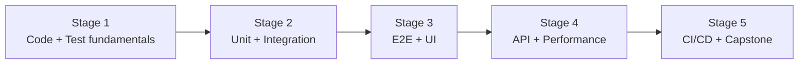

# 🧭 QA Engineer Career Roadmap

> **Tác giả:** Mr.Rom\
> **Phiên bản:** v1.0.0\
> **Tạo lúc:** 16/05/2026\
> **Cập nhật:** 16/05/2026\
> **Đối tượng:** Muốn làm testing automation, không phải manual QA truyền thống\
> **Thời gian ước tính:** ~8 tháng FT / ~16 tháng PT\
> **Mức độ:** Junior → Mid

> 🎯 *QA Engineer modern = SDET (Software Dev Engineer in Test) — viết code TỰ ĐỘNG test, không click chuột test thủ công. Skill set giống dev nhưng focus quality.*

---

## 🎯 Mục tiêu cuối

- [ ] Test pyramid: unit + integration + E2E
- [ ] Test automation framework (Playwright/Cypress/Selenium)
- [ ] API testing (Postman, RestAssured, pytest+httpx)
- [ ] Performance testing (k6, JMeter)
- [ ] CI/CD integration cho test
- [ ] 1 capstone test framework end-to-end

---

## 🗺️ Overview 5 stage

| Stage | Tên | Thời gian | Output |
|---|---|---|---|
| 1 | Code + Test fundamentals | 2 tháng | Python/JS + test pyramid |
| 2 | Unit + Integration test | 1-2 tháng | Test coverage > 80% |
| 3 | E2E + UI test (Playwright) | 2 tháng | Browser automation |
| 4 | API + Performance test | 1-2 tháng | k6 + load test |
| 5 | CI/CD + Capstone | 1-2 tháng | Test framework production |

---

## Stage 1 — Code + Test Fundamentals (2 tháng)

> 🎯 *Modern QA cần code skill — không phải manual.*

### 📚 Đọc

- [ ] [Python ✅ 5 bài](../../03_Languages/python/) hoặc JavaScript/TypeScript — `03_Languages/javascript-typescript/` (chưa có)
- [ ] [Git workflow](../../01_Foundations/version-control/git/) ✅
- [ ] Test pyramid (unit/integration/E2E)
- [ ] TDD vs BDD
- [ ] AAA pattern (Arrange-Act-Assert)
- [ ] Test design (boundary, equivalence, decision table)

### 🛠️ Setup

- [ ] [VS Code](../../02_Tools/editor/setup/vs-code.md) ✅
- [ ] [Python + venv](../../03_Languages/python/setup/install-python.md) ✅
- [ ] `pip install pytest requests playwright`

---

## Stage 2 — Unit + Integration Test (1-2 tháng)

> 🎯 *Đáy pyramid — chạy nhanh, nhiều, sớm.*

### 📚 Đọc

- [ ] pytest (Python) hoặc Vitest/Jest (JS)
- [ ] Assertion + matchers
- [ ] Fixtures + setup/teardown
- [ ] Mocking (pytest-mock, jest mock)
- [ ] Parametrize tests
- [ ] Code coverage (pytest-cov, c8)
- [ ] Integration test (real DB qua testcontainers)

### 🎯 Project Stage 2

- [ ] **Test suite cho 1 Python/Node app**: coverage > 80% + integration với Postgres (testcontainer)

---

## Stage 3 — E2E + UI Test (Playwright) (2 tháng)

> 🎯 *Test giống user thật — browser thật.*

### 📚 Đọc — Playwright (modern, RECOMMEND)

- [ ] Playwright basics (locator, action, assertion)
- [ ] Auto-wait + retry (anti-flakiness)
- [ ] Multi-browser (Chrome, Firefox, Safari)
- [ ] Page Object Model (POM)
- [ ] Fixtures + parallelism
- [ ] Trace viewer (debug fail)
- [ ] Visual regression test (Percy, Chromatic)
- [ ] Mobile emulation

### Alternatives

| Tool | Khi dùng |
|---|---|
| **Playwright** ⭐ | Modern, fast, multi-browser — RECOMMEND |
| Cypress | UI đẹp, dev-friendly, chỉ Chromium |
| Selenium | Legacy, ecosystem lớn |

### 🧪 Bài tập

- [ ] Test login + signup flow
- [ ] Test e-commerce: search → add cart → checkout
- [ ] Page Object Model 5+ page
- [ ] Cross-browser test cùng test suite

### 🎯 Project Stage 3

- [ ] **E2E test suite cho 1 web app** (vd: SauceDemo, ParaBank) — 20+ scenarios

---

## Stage 4 — API + Performance Test (1-2 tháng)

> 🎯 *Backend test + load test.*

### 📚 API Testing

- [ ] HTTP methods deep
- [ ] Postman / Bruno collection
- [ ] pytest + httpx (Python) hoặc Supertest (Node)
- [ ] Schema validation (JSON Schema, Pydantic)
- [ ] Auth testing (JWT, OAuth)
- [ ] Contract testing (Pact)

### 📚 Performance Testing

- [ ] Load test concepts (RPS, latency, errors, p50/p95/p99)
- [ ] k6 (modern, JS-based) — RECOMMEND
- [ ] JMeter (classic, GUI)
- [ ] Stress test vs spike test vs soak test
- [ ] Identify bottleneck (DB? app? network?)

### 🎯 Project Stage 4

- [ ] **API test suite**: pytest+httpx, schema validation, 30+ test
- [ ] **Load test report**: k6 → 1000 RPS, identify bottleneck

---

## Stage 5 — CI/CD + Capstone (1-2 tháng)

> 🎯 *Test trong pipeline + portfolio.*

### 📚 Đọc

- [ ] CI/CD integration (GitHub Actions, GitLab CI)
- [ ] Test parallelization
- [ ] Flaky test detection + fix
- [ ] Test reports (Allure, HTML)
- [ ] Test data management

### Capstone

| Project | Highlight |
|---|---|
| **Full test framework** | Unit + Integration + E2E + API + CI |
| **Mobile app testing** | Appium (iOS/Android) |
| **Visual regression suite** | Percy/Chromatic |
| **Contract test platform** | Pact broker setup |
| **Quality dashboard** | Allure + metrics tracking |

### Bắt buộc

- [ ] All test tiers: unit / integration / E2E / API / perf
- [ ] CI: chạy tự động khi PR
- [ ] Report đẹp (Allure dashboard)
- [ ] Test cho 3+ browsers
- [ ] Flaky test < 1%
- [ ] Documentation strategy testing

---

## 🧭 Career tiếp theo

| Hướng | Note |
|---|---|
| SDET (Software Development Engineer in Test) | Mid-level chính của roadmap này |
| Test Architect | Senior — design test strategy across org |
| DevOps focus on testing | [DevOps roadmap](./devops-engineer_career-roadmap.md) ✅ |
| Security testing | [Security Engineer](./security-engineer_career-roadmap.md) ✅ |
| Performance engineer | Specialize perf test + tuning |

---

## 📌 Tài nguyên bổ sung

| Tài nguyên | Khi dùng |
|---|---|
| [Playwright Docs](https://playwright.dev/) | Stage 3 |
| [Test Automation University (free)](https://testautomationu.applitools.com/) | All stages |
| *Effective Software Testing* — Maurício Aniche | Bible test design |
| [Cypress Real World Testing](https://learn.cypress.io/) | Cypress alternative |
| [Ministry of Testing](https://www.ministryoftesting.com/) | Community |

---

## 🔄 Điều chỉnh

| Tình huống | Hành động |
|---|---|
| Code chưa vững | Stage 1 lâu hơn — code phải vững mới test code được |
| Manual QA muốn chuyển | Đi đầy đủ Stage 1, đừng skip code |
| Playwright vs Cypress? | Playwright 2025+ — multi-browser, faster, modern |
| Selenium còn cần học? | Có nếu công ty dùng. Không cho project mới |

---

## 📌 Changelog

- **v1.0.0 (16/05/2026)** — Bản đầu tiên. 5 stage / 8 tháng FT. SDET modern focus.
