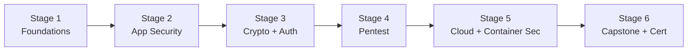

# 🧭 Security Engineer Career Roadmap

> **Tác giả:** Mr.Rom\
> **Phiên bản:** v1.0.0\
> **Tạo lúc:** 16/05/2026\
> **Cập nhật:** 16/05/2026\
> **Đối tượng:** Đã hiểu Linux + Networking + Coding cơ bản, thích "phá để hiểu cách phòng"\
> **Thời gian ước tính:** ~12 tháng FT / ~24 tháng PT\
> **Mức độ:** Junior → Mid

> 🎯 *Security Engineer phòng chống tấn công + đôi khi tấn công (pentest) để tìm lỗ hổng. Roadmap focus **Application Security + Cloud Security** (hot 2026).*

---

## 🎯 Mục tiêu cuối

- [ ] Hiểu OWASP Top 10 + cách fix mỗi cái
- [ ] Pentest web app cơ bản (Burp Suite, OWASP ZAP)
- [ ] Cryptography fundamentals (hash, symmetric/asymmetric)
- [ ] Authentication + Authorization (OAuth2, JWT, RBAC)
- [ ] Cloud security (AWS IAM, security group, KMS)
- [ ] Container security (image scan, runtime security)
- [ ] 1-2 cert (Sec+, CEH, OSCP entry)

---

## 🗺️ Overview 6 stage

| Stage | Tên | Thời gian | Output |
|---|---|---|---|
| 1 | Foundations (Linux + Net + Code) | 2 tháng | Solid foundation |
| 2 | App Security (OWASP) | 2 tháng | Fix top 10 vulnerabilities |
| 3 | Crypto + Auth | 1-2 tháng | Implement JWT, OAuth |
| 4 | Pentest basics | 2-3 tháng | Burp Suite, find vulns |
| 5 | Cloud + Container Sec | 2 tháng | AWS Security + K8s sec |
| 6 | Capstone + Cert | 1-2 tháng | Sec+ hoặc CEH |

---

## Stage 1 — Foundations (2 tháng)

> 🎯 *Hiểu hệ thống → mới phá/phòng được.*

### 📚 Đọc

- [ ] [Linux ✅](../../04_OS/linux/) — permissions, processes, network
- [ ] Networking deep (TCP/IP, DNS, HTTP, TLS) — `05_Networking/` (chưa có)
- [ ] [Python ✅](../../03_Languages/python/) — viết tool exploit
- [ ] [Bash scripting](../../02_Tools/shell/) — automation
- [ ] [Git workflow](../../02_Tools/git/) ✅

### 🎯 Project Stage 1

- [ ] Setup Kali Linux VM + practice basic recon (nmap, netcat, ping)

---

## Stage 2 — Application Security (OWASP Top 10) (2 tháng)

> 🎯 *10 lỗi phổ biến nhất web app. Hiểu cả attack lẫn fix.*

### 📚 Đọc

- [ ] OWASP Top 10 2021 (Injection, Broken Auth, Sensitive Data, XXE, Broken Access, Security Misconfiguration, XSS, Insecure Deser, Vulnerable Components, Logging) — `12_Security/owasp-top-10/` (chưa có)
- [ ] SQL injection deep
- [ ] XSS (reflected, stored, DOM)
- [ ] CSRF
- [ ] SSRF
- [ ] Path traversal
- [ ] Command injection
- [ ] Insecure deserialization

### 🧪 Bài tập

- [ ] DVWA (Damn Vulnerable Web App) — practice mỗi OWASP item
- [ ] PortSwigger Web Security Academy (FREE) — labs mỗi topic
- [ ] HackTheBox / TryHackMe beginner rooms

### 🎯 Project Stage 2

- [ ] **Vulnerable app audit**: pick 1 open source webapp → find 3 vulns + fix PR

---

## Stage 3 — Cryptography + Auth (1-2 tháng)

> 🎯 *Crypto là backbone của security. Auth là entry attack chính.*

### 📚 Cryptography

- [ ] Hash: SHA-256, password hashing (bcrypt, argon2) — `12_Security/cryptography/` (chưa có)
- [ ] Symmetric: AES
- [ ] Asymmetric: RSA, ECC
- [ ] Digital signature
- [ ] HMAC
- [ ] TLS handshake + certificate chain
- [ ] Common crypto mistakes (ECB mode, weak random, ...)

### 📚 Auth

- [ ] Sessions vs JWT — `12_Security/authentication/` (chưa có)
- [ ] OAuth 2.0 + OIDC (flow code, implicit, PKCE)
- [ ] SAML basics
- [ ] MFA / TOTP
- [ ] Password best practice
- [ ] RBAC vs ABAC

### 🧪 Bài tập

- [ ] Implement password hashing đúng (argon2id)
- [ ] JWT sign/verify trong Python
- [ ] OAuth Google login full flow
- [ ] Crack weak hash (john the ripper)

---

## Stage 4 — Pentest Basics (2-3 tháng)

> 🎯 *Tấn công có ethics. Tools chính.*

### 📚 Đọc

- [ ] Pentest methodology (recon → scan → exploit → post-exploit → report) — `12_Security/pentesting-fundamentals/` (chưa có)
- [ ] Burp Suite (intercept, repeater, intruder)
- [ ] OWASP ZAP (free alternative)
- [ ] nmap + masscan (port scan)
- [ ] sqlmap (auto SQL injection)
- [ ] Metasploit basics
- [ ] Wireshark (packet analysis)

### 🛠️ Lab

- [ ] [TryHackMe](https://tryhackme.com/) — guided learning ($)
- [ ] [HackTheBox](https://hackthebox.com/) — CTF style ($)
- [ ] [PicoCTF](https://picoctf.org/) — free CTF
- [ ] Local: Kali + Docker vulnerable images

### 🎯 Project Stage 4

- [ ] **CTF**: complete 20 challenges trên TryHackMe/HTB beginner
- [ ] **Pentest report**: 1 vulnerable VM, find + document vulns, write report

---

## Stage 5 — Cloud + Container Security (2 tháng)

> 🎯 *2 attack surfaces lớn nhất 2026.*

### 📚 Cloud Security (AWS)

- [ ] IAM best practice (least privilege, role > user, MFA) — `12_Security/cloud-security/` (chưa có)
- [ ] AWS GuardDuty, Security Hub, Inspector
- [ ] CloudTrail (audit log)
- [ ] S3 bucket security (public access, encryption)
- [ ] Secrets Manager / KMS
- [ ] WAF + Shield (DDoS)
- [ ] Cloud Security Posture Management (CSPM)

### 📚 Container Security

- [ ] Image scanning (Trivy, Snyk) — `12_Security/container-security/` (chưa có)
- [ ] Pod Security Standards
- [ ] Runtime security (Falco)
- [ ] Network policies (Calico)
- [ ] Service mesh security (mTLS với Istio)
- [ ] Supply chain security (SLSA, Cosign signing)

### 🎯 Project Stage 5

- [ ] **AWS account hardening**: audit + fix top 10 misconfigurations (Trusted Advisor + Security Hub)
- [ ] **K8s security**: scan images, enforce policies, runtime monitoring

---

## Stage 6 — Capstone + Cert (1-2 tháng)

### Capstone

| Project | Highlight |
|---|---|
| **Bug bounty submission** | Find + report real vuln (HackerOne, Bugcrowd) |
| **Security tool open source** | Build custom scanner / sanitizer |
| **Threat modeling** | Apply STRIDE to 1 system + mitigation plan |
| **SIEM setup** | ELK/Wazuh + alerts cho 1 infra |

### Certifications

| Cert | Phù hợp |
|---|---|
| **CompTIA Security+** | Entry level, vendor-neutral |
| **CEH** (Certified Ethical Hacker) | Intermediate pentest |
| **OSCP** | Advanced pentest, hands-on lab (24h) |
| **AWS Certified Security Specialty** | Cloud focus |

---

## 🧭 Career tiếp theo

| Hướng | Note |
|---|---|
| Penetration Tester / Red Team | OSCP level |
| Application Security Engineer | Specialize app sec |
| Cloud Security Engineer | AWS/GCP security cert |
| Security Researcher | Bug bounty + CVE research |
| GRC (Governance, Risk, Compliance) | Less technical, compliance-focus |
| DevSecOps | Sec trong CI/CD pipeline |

---

## 📌 Tài nguyên bổ sung

| Tài nguyên | Khi dùng |
|---|---|
| [PortSwigger Web Security Academy](https://portswigger.net/web-security) | FREE bible web sec |
| [HackTheBox](https://hackthebox.com/) | Pentest practice |
| [TryHackMe](https://tryhackme.com/) | Guided learning |
| *The Web Application Hacker's Handbook* | Bible web sec |
| *Practical Cryptography* | Crypto deep |
| [OWASP Cheat Sheets](https://cheatsheetseries.owasp.org/) | Reference daily |

---

## 🔄 Điều chỉnh

| Tình huống | Hành động |
|---|---|
| Coding chưa vững | Học Python + 1 ngôn ngữ khác trước (JS, Go) |
| Không thích pentest | Focus DefSec / GRC / Compliance |
| Bị nghiện CTF | Healthy — nhưng nhớ practice cả defense |
| Đạo đức: hack illegal | KHÔNG. Chỉ test trên hệ thống mình hoặc bug bounty programs có permission |

---

## 📌 Changelog

- **v1.0.0 (16/05/2026)** — Bản đầu tiên. 6 stage / 12 tháng FT. App Sec + Cloud Sec focus.
