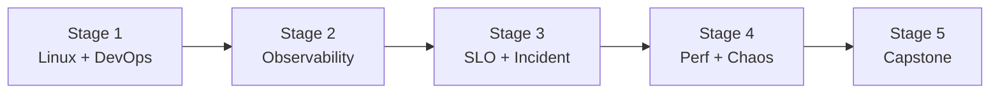

# 🧭 SRE (Site Reliability Engineer) Career Roadmap

> **Tác giả:** Mr.Rom\
> **Phiên bản:** v1.0.0\
> **Tạo lúc:** 16/05/2026\
> **Cập nhật:** 16/05/2026\
> **Đối tượng:** Đã làm DevOps hoặc Backend, muốn focus reliability + observability\
> **Thời gian ước tính:** ~10 tháng FT / ~20 tháng PT\
> **Mức độ:** Mid (cần experience trước)

> 🎯 *SRE = lai DevOps + Software Engineer + Observability. Focus: app KHÔNG xuống, SLO/SLI, incident response, post-mortem. Khác DevOps Eng (broader pipeline) — SRE deep reliability.*

---

## 🎯 Mục tiêu cuối

- [ ] Define + measure SLI/SLO/SLA
- [ ] Build observability stack (metrics, logs, traces)
- [ ] On-call + incident response workflow
- [ ] Capacity planning, performance tuning
- [ ] Chaos engineering basics
- [ ] 1 capstone observability platform

---

## 🗺️ Overview 5 stage

| Stage | Tên | Thời gian | Output |
|---|---|---|---|
| 1 | Linux + DevOps + K8s | 2-3 tháng | DevOps Mid level |
| 2 | Observability (3 pillars) | 2-3 tháng | Prometheus + Grafana + Loki + Jaeger |
| 3 | SLO + Incident response | 2 tháng | Define SLO, run game day |
| 4 | Performance + Chaos | 1-2 tháng | Load test + chaos test |
| 5 | Capstone | 2 tháng | Production observability platform |

---

## Stage 1 — Linux + DevOps + K8s (2-3 tháng)

> 🎯 *SRE cần foundation DevOps mạnh. Đi qua [DevOps roadmap](./devops-engineer_career-roadmap.md) ✅ tới Stage 4.*

### 📚 Đọc

- [ ] [Linux ✅](../../04_OS/linux/) deep (systemd, networking, performance)
- [ ] [Docker ✅ 5 bài](../../10_DevOps/docker/)
- [ ] Kubernetes — `10_DevOps/kubernetes/` (chưa có)
- [ ] [Git workflow](../../01_Foundations/version-control/git/) ✅
- [ ] Cloud (AWS) — `11_Cloud/` (chưa có)
- [ ] Networking deep (TCP debugging, tcpdump, mtr)

---

## Stage 2 — Observability (2-3 tháng)

> 🎯 *3 trụ cột: Metrics + Logs + Traces.*

### 📚 Đọc

- [ ] **Metrics**: Prometheus + Grafana — `10_DevOps/observability/` (chưa có)
- [ ] PromQL query
- [ ] **Logs**: ELK (Elasticsearch + Logstash + Kibana) hoặc Loki
- [ ] Structured logging (JSON)
- [ ] **Traces**: OpenTelemetry + Jaeger / Tempo
- [ ] Alert routing (Alertmanager → PagerDuty/Opsgenie)
- [ ] Dashboard design (RED method, USE method)

### 🛠️ Setup

- [ ] Prometheus + Grafana local (Docker Compose)
- [ ] Loki + Promtail
- [ ] Jaeger / Tempo

### 🧪 Bài tập

- [ ] Instrument app với Prometheus client lib
- [ ] Build dashboard 4 golden signals (Latency, Traffic, Errors, Saturation)
- [ ] Centralized logs cho 3 service
- [ ] Distributed tracing end-to-end

### 🎯 Project Stage 2

- [ ] **Observability stack** cho 1 app: metrics + logs + traces, dashboard 4 golden signals

---

## Stage 3 — SLO + Incident Response (2 tháng)

> 🎯 *SLO-driven engineering — quantify reliability.*

### 📚 Đọc

- [ ] SLI (Service Level Indicator) — gì đo
- [ ] SLO (Service Level Objective) — target
- [ ] SLA (Service Level Agreement) — contract khách
- [ ] Error budget concept
- [ ] Alerting on burn rate, not threshold
- [ ] Incident response workflow (acknowledge → mitigate → resolve → post-mortem)
- [ ] Post-mortem culture (blameless)
- [ ] Runbook + playbook
- [ ] On-call rotation

### 🧪 Bài tập

- [ ] Define 5 SLI cho 1 app
- [ ] Set SLO 99.9% + alert burn rate
- [ ] Simulate incident → run response
- [ ] Write post-mortem template

### 🎯 Project Stage 3

- [ ] **Game day exercise**: cố tình kill 1 service → team respond → post-mortem document

---

## Stage 4 — Performance + Chaos (1-2 tháng)

> 🎯 *Tìm + fix bottleneck. Test resiliency.*

### 📚 Performance

- [ ] Profile CPU + memory (pprof, py-spy, async-profiler)
- [ ] Load testing (k6, Gatling, locust)
- [ ] Performance tuning (JVM, Postgres, kernel params)
- [ ] Caching strategies
- [ ] Database optimization (index, query plan)

### 📚 Chaos Engineering

- [ ] Principles (Netflix)
- [ ] Chaos Mesh / Litmus (K8s) hoặc Chaos Monkey
- [ ] Failure injection (CPU stress, network latency, pod kill)
- [ ] Game days

### 🧪 Bài tập

- [ ] Load test app → identify bottleneck → fix
- [ ] Chaos: kill random pod → verify app recovers
- [ ] Network partition simulation

---

## Stage 5 — Capstone (2 tháng)

> 🎯 *Production-grade observability + SLO management.*

### Project

| Idea | Highlight |
|---|---|
| **Self-hosted observability platform** | Prometheus + Loki + Tempo + Grafana + Alertmanager, multi-tenant |
| **SLO tracker dashboard** | Sloth (SLO YAML → Prometheus rules) + dashboard burn rate |
| **Incident management workflow** | Auto-create ticket, runbook, post-mortem template |
| **K8s chaos suite** | LitmusChaos + scheduled chaos tests + reports |

### Bắt buộc

- [ ] IaC 100%
- [ ] Multi-environment (dev/staging/prod)
- [ ] Alert routing (Slack + email + paging)
- [ ] Runbook documentation
- [ ] Post-mortem template + 1 real example
- [ ] Cost tracking

---

## 🧭 Career tiếp theo

| Hướng | Roadmap |
|---|---|
| Platform thinking | [`platform-engineer`](./platform-engineer_career-roadmap.md) (chưa có) |
| Cloud architect | [`cloud-engineer`](./cloud-engineer_career-roadmap.md) ✅ |
| Security focus | [`security-engineer`](./security-engineer_career-roadmap.md) (chưa có) |
| Staff/Principal SRE | (specialization — chưa có) |

---

## 📌 Tài nguyên bổ sung

| Tài nguyên | Khi dùng |
|---|---|
| *Site Reliability Engineering* — Google (free) | Bible SRE — đọc Stage 3 |
| *The SRE Workbook* — Google (free) | Sequel — practical |
| [SRE Weekly](https://sreweekly.com/) | Newsletter |
| [Honeycomb O'Reilly book — Observability Engineering](https://www.honeycomb.io/) | Stage 2 |
| [Chaos Engineering Book — Casey Rosenthal](https://www.oreilly.com/library/view/chaos-engineering/9781492043859/) | Stage 4 |

---

## 🔄 Điều chỉnh

| Tình huống | Hành động |
|---|---|
| Chưa có DevOps experience | Đi [DevOps roadmap](./devops-engineer_career-roadmap.md) ✅ Stage 1-4 trước |
| Stuck với Prometheus query | PromQL khó — practice trên Grafana Play |
| Không có sandbox real | Kill pod trong local K8s (Minikube) cũng được |

---

## 📌 Changelog

- **v1.0.0 (16/05/2026)** — Bản đầu tiên. 5 stage / 10 tháng FT. Observability + SLO + chaos focus.
