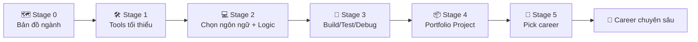

# 🧭 Zero to Coder Career Roadmap

> **Tác giả:** Mr.Rom\
> **Phiên bản:** v2.0.0\
> **Tạo lúc:** 16/05/2026\
> **Cập nhật:** 19/05/2026\
> **Đối tượng:** Người **chưa biết gì** về lập trình / IT, muốn bước chân vào ngành\
> **Thời gian ước tính:** ~6 tháng full-time (8h/ngày) hoặc ~12 tháng part-time (1-2h/ngày)\
> **Mức độ:** Entry (zero)\
> **Output cuối lộ trình:** Đọc + viết được code 1 ngôn ngữ tự chọn, có 1 project portfolio trên GitHub, **chọn được career roadmap chuyên sâu kế tiếp**

---

## Tình huống — bạn đang ở đâu?

Bạn quyết định bước chân vào IT. Vừa Google là choáng — **JavaScript, Python, Rust, Docker, Kubernetes, AI Agent, microservice, GraphQL, Kafka...** Hàng trăm thuật ngữ, hàng chục "nhánh", mỗi blog nói 1 kiểu.

Cách trả lời thường gặp: *"Pick 1 ngôn ngữ rồi học!"*. Sai vibe. Bạn còn chưa biết có những **nghề gì** trong IT — pick ngôn ngữ trước = bắn vào bóng đêm.

→ Roadmap này KHÔNG dạy bạn thành Backend / Frontend / DevOps cụ thể. Nó dạy bạn:
1. **Biết ngành IT có gì** — Stage 0
2. **Biết những thứ MỌI nhánh đều cần** — terminal, git, 1 ngôn ngữ — Stage 1-2-3
3. **Có 1 portfolio** show recruiter — Stage 4
4. **Pick được career roadmap chuyên sâu** — Stage 5

Sau 6 tháng, bạn sẽ chuyển sang được bất kỳ nhánh chuyên sâu nào trong 17 career roadmap.

---

## 🎯 Mục tiêu cuối lộ trình

Sau khi hoàn thành, bạn sẽ:

- [ ] **Hiểu** ngành IT có những nhánh nào, mỗi nhánh làm gì
- [ ] **Đọc-viết** code 1 ngôn ngữ tự chọn (Python/JS/Go/C — tuỳ định hướng)
- [ ] **Tự debug** được lỗi cơ bản (syntax, runtime, logic)
- [ ] **Dùng terminal** mức tối thiểu (chạy lệnh git/python/...) — KHÔNG cần master như DevOps
- [ ] **Dùng git** lưu version code + push lên GitHub
- [ ] **Build 1 project hoàn chỉnh** đăng lên GitHub portfolio
- [ ] **Pick được 1 career roadmap chuyên sâu** với hiểu biết rõ vì sao chọn

---

## 🗺️ Overview 5 stage + 1 stage chọn

| Stage | Tên | Thời gian (FT) | Output cuối stage |
|---|---|---|---|
| **0** | 🗺️ Bản đồ ngành | 1 tuần | Biết ngành IT có gì, pick 2-3 nhánh quan tâm |
| **1** | 🛠️ Tools tối thiểu | 2-3 tuần | Editor + terminal cơ bản + git + GitHub sẵn sàng |
| **2** | 💻 Chọn ngôn ngữ + Logic | 6-8 tuần | Viết được script ~50 dòng giải bài toán nhỏ |
| **3** | 🧪 Build/Test/Debug | 6-8 tuần | OOP + tests + đọc doc thư viện |
| **4** | 📦 Portfolio Project | 4-6 tuần | 1 project hoàn chỉnh trên GitHub + README đẹp |
| **5** | 🧭 Pick career chuyên sâu | 1 tuần | Đã pick 1 career roadmap để đi tiếp |

> 💡 6 tháng FT = ~24 tuần. Stage timing trên cộng đủ. PT (1-2h/ngày) gấp đôi ~12 tháng.

---

## Stage 0 — Bản đồ ngành (1 tuần)

> 🎯 *Trước khi học code, cần biết "code để làm gì". Stage này CHỈ đọc — không cài đặt, không gõ lệnh.*

### 📚 Lý thuyết cần đọc

- [ ] [Ngành IT là gì + bản đồ các nhánh](../../01_Foundations/industry-landscape/lessons/01_basic/00_what-is-it-industry.md) ✅ — *20 phút* — Bài quan trọng nhất stage này
- [ ] Xem 2-3 video YouTube *"1 ngày làm việc của <nhánh>"* — search `"a day in the life of a [backend/frontend/data] engineer"`
- [ ] (Optional, rất khuyến nghị) Coffee chat 30 phút với 1 dev đang làm 1 nhánh — hỏi cụ thể *"việc thường ngày làm gì, ghét nhất khi nào, vui nhất khi nào"*

### ✅ Verify

- [ ] Kể được tên 8 nhánh chính trong IT (Backend, Frontend, Mobile, DevOps, Data, AI, Security, QA...)
- [ ] Có **2-3 nhánh hứng thú nhất** ghi ra giấy (chưa cần chắc 100%)
- [ ] Biết phân biệt "coder thuần" vs "hybrid" vs "non-coder" trong IT

### 🎯 Output Stage 0

- 1 sticky note dán bàn ghi 2-3 nhánh quan tâm — đem theo trong suốt 6 tháng tới. Đến Stage 4 bạn sẽ pick project hợp với nhánh này.

---

## Stage 1 — Tools tối thiểu (2-3 tuần)

> 🎯 *3 thứ MỌI dev cần biết, bất kể nhánh nào: 1 editor, terminal mức tối thiểu, git. KHÔNG cần master tool — chỉ "đủ dùng" cho stage tiếp.*

### 📚 Lý thuyết cần đọc

- [ ] [Terminal là gì + 10 lệnh cơ bản](../../01_Foundations/computing-environment/) (đang viết) — *15 phút* — KHÔNG cần master, chỉ biết chạy lệnh `cd`, `ls`, `pwd`, `mkdir`
- [ ] [Linux navigation cơ bản (pwd, ls, cd)](../../04_OS/linux/lessons/01_basic/01_navigation.md) ✅ — *15 phút*
- [ ] [Linux file operations (mkdir, cp, mv, rm)](../../04_OS/linux/lessons/01_basic/02_file-operations.md) ✅ — *15 phút*
- [ ] [Linux view file content (cat, less, head, tail)](../../04_OS/linux/lessons/01_basic/03_view-file-content.md) ✅ — *10 phút*
- [ ] [Version Control + Git là gì](../../01_Foundations/version-control/git/lessons/01_basic/00_what-is-git.md) (đang chuyển từ 02_Tools) — *12 phút*
- [ ] [Git init + first commit](../../01_Foundations/version-control/git/lessons/01_basic/01_init-and-first-commit.md) (đang chuyển) — *20 phút*
- [ ] [Git branching + merging](../../01_Foundations/version-control/git/lessons/01_basic/02_branching-and-merging.md) (đang chuyển) — *25 phút*
- [ ] [Git remote + GitHub](../../01_Foundations/version-control/git/lessons/01_basic/03_remote-and-github.md) (đang chuyển) — *20 phút*

### 🛠️ Setup môi trường — chỉ TỐI THIỂU

> 💡 Setup TỐI THIỂU đủ chạy stage. Muốn cấu hình đẹp / extension / theme / multi-account... → đi tool guide tương ứng (link bên dưới).

- [ ] **Editor** (chọn 1):
  - VS Code (default, miễn phí) — [📥 download](https://code.visualstudio.com/)
  - Cursor (VS Code + AI built-in) — [📥 download](https://cursor.sh)
  - 🛠️ Đào sâu chọn IDE → [So sánh IDE](../../02_Tools/ide/00_what-is-ide.md) (chưa có)
  - 🛠️ Setup VS Code chi tiết → [VS Code user guide](../../02_Tools/ide/vs-code.md) (chưa có)
- [ ] **Terminal**: dùng built-in (Terminal trên Mac, Windows Terminal, gnome-terminal trên Linux)
  - 🛠️ Muốn terminal đẹp (iTerm/Kitty/...) → [So sánh terminal emulator](../../02_Tools/terminal-emulators/) (chưa có) — STAGE NÀY CHƯA CẦN
- [ ] **Git**: cài CLI
  - Mac: `brew install git`
  - Linux: `apt install git`
  - Windows: [Git for Windows](https://git-scm.com/download/win)
- [ ] **GitHub**: tạo account miễn phí
  - 🛠️ Hướng dẫn setup account + SSH key + 2FA → [GitHub user guide](../../02_Tools/git-clients/github.md) (chưa có)
- [ ] **VS Code extension** (chỉ cài 3 cái cốt lõi, đừng cài 50):
  - GitLens (xem git history inline)
  - Indent Rainbow (đỡ nhầm indent)
  - 1 extension theme bạn thích (Dracula / One Dark Pro / ...)

### 🧪 Bài tập

- [ ] Tạo file/folder trong terminal (không dùng GUI): `touch`, `mkdir`, `mv`, `rm`
- [ ] Navigate giữa folder: `cd`, `ls`, `pwd`
- [ ] Tìm file: `find`, `grep` (cơ bản)
- [ ] Git workflow cơ bản: `init`, `add`, `commit`, `push`, `pull`
- [ ] Tạo 1 repo trên GitHub, clone về, sửa file, push lên

### 🎯 Mini project cuối stage

- [ ] Tạo 1 repo `hello-world` trên GitHub, có README.md viết bằng markdown (có heading, bold, list, code block), push từ local lên

### ✅ Verify — sau Stage 1 bạn phải

- [ ] Mở terminal, navigate folder bất kỳ trong 30 giây
- [ ] Clone 1 repo public, sửa file, commit, push lên GitHub
- [ ] Đọc được Markdown render (`#`, `**bold**`, list, code block)
- [ ] Không sợ màn hình terminal đen

> 💡 *Nếu vẫn lúng túng terminal sau 3 tuần → đừng vội sang Stage 2. Practice thêm 1-2 tuần — đây là nền tảng cả đời. NHƯNG cũng đừng cố "master" terminal — chỉ cần "biết chạy lệnh không sợ", phần master để stage chuyên sâu sau.*

---

## Stage 2 — Chọn 1 ngôn ngữ + Học logic (6-8 tuần)

> 🎯 *Mục tiêu KHÔNG phải master 1 ngôn ngữ — mà là **biết cách 1 ngôn ngữ vận hành**: viết, build, run, test, debug. Skill này transfer 80% sang ngôn ngữ khác sau này.*

### Tình huống — chọn ngôn ngữ nào?

Có hơn 600 ngôn ngữ lập trình. Cho beginner, 4 lựa chọn entry phổ biến:

| Ngôn ngữ | Pros | Cons | Pick khi |
|---|---|---|---|
| **Python** ⭐ | Syntax dễ đọc nhất (gần tiếng Anh), error message rõ, dùng cho Backend/Data/AI/Automation/Scripting — *gần như mọi nhánh trừ Frontend native*, cộng đồng VN lớn, AI tools (Copilot/Cursor) hiểu nhất | Chậm hơn C/Go ~10-30x, indentation-sensitive (dễ lỗi) | **Default beginner**. Pick khi chưa rõ định hướng |
| **JavaScript** | Bắt buộc cho Frontend, fullstack 1 ngôn ngữ (FE + BE Node), syntax linh hoạt, ecosystem khổng lồ (npm) | Quirky behavior (`0 == false === true`?!), 5 cách viết function | Pick khi đã chắc 80% muốn Frontend/Fullstack |
| **Go** | Syntax tối giản, compile siêu nhanh, type safe, cloud-native (Docker/K8s viết bằng Go), concurrency dễ | Ecosystem nhỏ hơn Python/JS, ít tutorial tiếng Việt | Pick khi đã chắc muốn DevOps / Backend cloud / System |
| **C** | Hiểu "máy tính thực sự làm gì" (pointer, memory, stack), nền tốt nhất cho System / Embedded / OS / Game engine | Khó debug, dễ memory bug, ít việc cho fresher, dev tốc độ chậm | Pick khi muốn Embedded / IoT / System programming hoặc tự tin chấp nhận khó |

### 💡 Khuyến nghị

> **Pick Python** trừ khi đã chắc 80% theo Frontend (→ JS) hoặc Embedded (→ C) hoặc DevOps native (→ Go).

Lý do **Python cho 80% beginner**:
1. Syntax đọc gần như tiếng Anh tự nhiên (`for item in list:`)
2. Error message Python rất rõ ràng (line + lỗi gì) so với C cryptic
3. AI tools hiểu Python nhất → Copilot/Claude code Python chuẩn nhất
4. Dùng được cho hầu hết career: Backend, Data, AI, ML, Automation, Scripting, Security tooling
5. Cộng đồng VN lớn → tutorial Việt dễ tìm

→ Trong roadmap dưới đây, ví dụ lệnh dùng Python. Pick ngôn ngữ khác → áp dụng concept tương đương.

### 📚 Lý thuyết cần đọc (Python)

- [ ] [Python là gì](../../03_Languages/python/lessons/01_basic/00_what-is-python.md) ✅ — *15 phút*
- [ ] [Variables & Types](../../03_Languages/python/lessons/01_basic/01_variables-and-types.md) ✅ — *25 phút*
- [ ] [Control Flow (if/for/while)](../../03_Languages/python/lessons/01_basic/02_control-flow.md) ✅ — *20 phút*
- [ ] [Functions](../../03_Languages/python/lessons/01_basic/03_functions.md) ✅ — *25 phút*
- [ ] [Đọc/ghi file](../../03_Languages/python/lessons/01_basic/04_file-io.md) (chưa có) — *20 phút*
- [ ] [Module + package + pip + venv](../../03_Languages/python/lessons/01_basic/05_modules-and-pip.md) (chưa có) — *20 phút*
- [ ] **CRITICAL** — [Đọc lỗi + debug + Stack Overflow đúng cách](../../03_Languages/python/lessons/01_basic/06_debugging.md) (chưa có) — *30 phút*

### 🛠️ Setup môi trường Python

- [ ] [Cài Python 3.11+](../../03_Languages/python/setup/install-python.md) ✅
- [ ] Học `venv` tạo virtual environment (xem setup §5)
- [ ] `pip install` 2 thư viện cơ bản: `requests` (gọi API), `pandas` (data) — cho làm quen

### 🧪 Bài tập (mỗi tuần 5-10 bài)

- [ ] [Exercism — Python track](https://exercism.org/tracks/python) — làm 30+ bài
- [ ] FizzBuzz (kinh điển)
- [ ] Đếm số chẵn / lẻ trong list
- [ ] Tính lương theo giờ + tăng ca (input → output)
- [ ] Đọc file `.txt`, in ra 10 dòng đầu
- [ ] Parse CSV file, tính tổng cột số
- [ ] Tạo dict mapping name → age, search theo name
- [ ] Mini Hangman game (CLI)

### 🎯 Mini project cuối stage

Chọn 1 project nhỏ ~50-100 dòng:

- [ ] **CLI Todo app** — thêm/xóa/list task, lưu vào file JSON
- [ ] **HOẶC** Tool đổi tên file hàng loạt (rename batch)
- [ ] **HOẶC** Bot scrape giá vàng/USD/crypto mỗi ngày, lưu vào CSV
- [ ] **HOẶC** Mini quiz game CLI lưu high score

### ✅ Verify — sau Stage 2 bạn phải

- [ ] Đọc 1 file Python 100 dòng bất kỳ, hiểu logic
- [ ] Tự viết script ~50 dòng từ đầu giải bài toán mới
- [ ] Debug được lỗi phổ biến: `IndentationError`, `NameError`, `KeyError`, `TypeError`, `AttributeError`
- [ ] Biết Google search lỗi đúng cách (copy error message + tên hàm vào Google)
- [ ] Biết phân biệt khi nào dùng `list` / `dict` / `set` / `tuple`

---

## Stage 3 — Build / Test / Debug pro (6-8 tuần)

> 🎯 *Code chạy được rồi. Giờ học cách viết code **đáng nhận tiền**: structure, test, package, đọc tài liệu thư viện.*

### 📚 Lý thuyết cần đọc

- [ ] OOP cơ bản (class, object, init, method) — *(chưa có lesson, dùng [Real Python OOP](https://realpython.com/python3-object-oriented-programming/))*
- [ ] Inheritance, polymorphism
- [ ] Exception handling (try/except/finally, raise)
- [ ] Decorator cơ bản (`@property`, `@staticmethod`)
- [ ] Generators + list/dict comprehension
- [ ] **Testing với pytest** — kỹ năng quan trọng nhất stage này
- [ ] Type hints (Python 3.10+)
- [ ] Đọc tài liệu thư viện đúng cách (anatomy of a docs page)

### 🛠️ Tool thêm

- [ ] `pytest` — unit test framework
- [ ] `ruff` (HOẶC `black` + `flake8`) — format + lint code
- [ ] `mypy` — kiểm tra type
- [ ] `uv` (HOẶC `poetry`) — quản lý dependency hiện đại
- [ ] VS Code extension: Python Test Explorer

### 🧪 Bài tập

- [ ] Viết class `BankAccount` có `deposit`/`withdraw` + raise lỗi khi negative
- [ ] Refactor 1 script Stage 2 thành class structure
- [ ] Viết unit test cho code Stage 2 bằng pytest, đạt coverage > 80%
- [ ] Đọc source code 1 thư viện nhỏ trên GitHub (vd: `click`, `httpx`, `pydantic` — pick cái <2000 dòng)
- [ ] Setup pre-commit hook lint + format tự chạy khi `git commit`

### 🎯 Mini project cuối stage

- [ ] **Refactor Todo CLI Stage 2** thành class structure + unit test đầy đủ + CI lint+test
- [ ] **HOẶC** Web scraper với `BeautifulSoup` lưu vào SQLite + tests
- [ ] **HOẶC** API client thư viện ngoài (OpenWeather / Telegram Bot / Notion API)

### ✅ Verify — sau Stage 3 bạn phải

- [ ] Hiểu khi nào dùng OOP vs function thuần (không "mọi thứ là class")
- [ ] Viết unit test cho mọi function quan trọng
- [ ] Đọc tài liệu thư viện Python bất kỳ, dùng được trong 30 phút
- [ ] Code có type hint + passing `ruff`/`black`
- [ ] Biết debug bằng `pdb` / VS Code debugger (không chỉ `print`)

---

## Stage 4 — Project Portfolio (4-6 tuần)

> 🎯 *1 project "đáng mặt" trên GitHub để show recruiter. Đây là output quan trọng nhất của roadmap — không có project = không có việc.*

### Chọn project theo định hướng

Lúc này bạn đã có 2-3 nhánh "thích" từ Stage 0. Pick project hợp với nhánh đó:

| Định hướng (sticky note Stage 0) | Project gợi ý | Stack chính |
|---|---|---|
| 🌐 **Backend / Web** | REST API blog/todo/quiz có DB SQLite + tests + Docker | FastAPI + SQLAlchemy |
| 🎨 **Frontend** | SPA React (movie browser, weather, dashboard) | React + TS + Tailwind |
| 📊 **Data** | Dashboard Streamlit phân tích dữ liệu thực (COVID, crypto, GDP) | Streamlit + Pandas |
| 🤖 **Automation** | Bot Telegram/Discord tự động hóa task hàng ngày | python-telegram-bot / discord.py |
| 🎮 **Tinkering** | Game đơn giản với `pygame` (Snake, Tetris) | pygame |
| ⚙️ **DevOps** | Dockerize Stage 3 project + GitHub Actions CI | Docker + GH Actions |
| 🤖 **AI/LLM** | Chatbot trả lời câu hỏi đọc PDF (RAG đơn giản) | OpenAI/Claude API + ChromaDB |

### 🛠️ Bắt buộc trong project

- [ ] README đẹp: mô tả, screenshot/demo GIF, cách cài đặt, cách dùng
- [ ] Cấu trúc folder rõ ràng (`src/`, `tests/`, `docs/`)
- [ ] Test coverage > 70% (`pytest --cov`)
- [ ] CI/CD chạy được trên GitHub Actions (test + lint khi PR)
- [ ] `.gitignore`, `LICENSE` (MIT default), `requirements.txt`/`pyproject.toml` đầy đủ
- [ ] Ít nhất 10 commit có message rõ ràng (không "fix", "update" chung chung — viết kiểu `feat: add user login endpoint`)

### 🎯 Output cuối roadmap

1. **1 project portfolio** chỉn chu trên GitHub — link đính kèm CV
2. **Self-evaluation**: biết mình mạnh ở đâu, cần học thêm gì
3. **Chọn được career roadmap chuyên sâu** tiếp theo

### ✅ Verify — sau roadmap bạn phải

- [ ] Show repo cho 1 người khác đọc README → họ hiểu project làm gì
- [ ] Demo project chạy được trên máy mới (clone về, follow README, chạy được)
- [ ] Trả lời được *"Project này bạn học được gì?"* trong 2 phút
- [ ] Có Pinned README profile GitHub đẹp (xem [profile mẫu](https://github.com/abhisheknaiidu/awesome-github-profile-readme))

---

## Stage 5 — Pick Career Roadmap chuyên sâu (1 tuần)

> 🎯 *Stage này CHỈ để quyết định + commit. Không học gì mới.*

### Đánh giá bản thân

- [ ] Xem lại sticky note Stage 0 — 2-3 nhánh đã list. Còn hứng thú không?
- [ ] Trong Stage 4 project, **phần nào bạn enjoy nhất**? (frontend? backend? database? deploy?)
- [ ] Đọc thử 2-3 career roadmap → cái nào *đọc xong còn muốn đi tiếp* = đúng nhánh
- [ ] (Optional) Coffee chat với senior nhánh đó — hỏi *"1 ngày làm việc"*

### Pick roadmap

| Bạn thích / muốn... | Đi tiếp roadmap |
|---|---|
| Build web app, API, scale system | [`backend-developer`](./backend-developer_career-roadmap.md) ✅ |
| UI đẹp, animation, design tỉ mỉ | [`frontend-developer`](./frontend-developer_career-roadmap.md) ✅ |
| Cả 2 (indie hacker, startup) | [`fullstack-developer`](./fullstack-developer_career-roadmap.md) ✅ |
| App mobile iOS/Android | [`mobile-developer`](./mobile-developer_career-roadmap.md) ✅ |
| Infrastructure, automation, deploy | [`devops-engineer`](./devops-engineer_career-roadmap.md) ✅ |
| Reliability, observability, on-call | [`sre-engineer`](./sre-engineer_career-roadmap.md) ✅ |
| Internal Developer Platform | [`platform-engineer`](./platform-engineer_career-roadmap.md) ✅ |
| AWS / GCP / Azure architect | [`cloud-engineer`](./cloud-engineer_career-roadmap.md) ✅ |
| Pipeline data, warehouse | [`data-engineer`](./data-engineer_career-roadmap.md) ✅ |
| Phân tích + ML model | [`data-scientist`](./data-scientist_career-roadmap.md) ✅ |
| ML production, MLOps | [`ml-engineer`](./ml-engineer_career-roadmap.md) ✅ |
| LLM, RAG, AI Agent | [`ai-engineer`](./ai-engineer_career-roadmap.md) ✅ |
| Hacking, bảo mật, pentest | [`security-engineer`](./security-engineer_career-roadmap.md) ✅ |
| Test automation, SDET | [`qa-engineer`](./qa-engineer_career-roadmap.md) ✅ |
| Unity, indie game | [`game-developer`](./game-developer_career-roadmap.md) ✅ |
| Smart contract, Web3 | [`blockchain-developer`](./blockchain-developer_career-roadmap.md) ✅ |

> 💡 *Nếu vẫn chưa quyết → pick `fullstack-developer` (rộng nhất, dễ chuyển nhánh sau) hoặc `backend-developer` (ổn định + nền vững cho mọi nhánh).*

---

## 📌 Tài nguyên bổ sung

### Sách (đọc dần qua 6 tháng)

| Sách | Khi đọc |
|---|---|
| *"Automate the Boring Stuff with Python"* — Al Sweigart | Đầu Stage 2 — practical, dễ thấm |
| *"Python Crash Course"* — Eric Matthes | Trong Stage 2-3 — tổng quát |
| *"Fluent Python"* — Luciano Ramalho | Sau Stage 3 — đào sâu Pythonic |
| *"The Pragmatic Programmer"* — Hunt & Thomas | Stage 4 — mindset dev |

### Khoá miễn phí

- [freeCodeCamp — Scientific Computing with Python](https://www.freecodecamp.org/) — 300h structured
- [Mosh Hamedani — Python for Beginners (YouTube)](https://www.youtube.com/watch?v=_uQrJ0TkZlc) — 6h crash course
- [Real Python](https://realpython.com/) — tutorial từng topic, chất lượng cao
- [Harvard CS50 (YouTube)](https://www.youtube.com/c/cs50) — full khoá CS đại học

### Cộng đồng

- [Reddit r/learnpython](https://www.reddit.com/r/learnpython/) — hỏi đáp friendly
- [Reddit r/cscareerquestions](https://www.reddit.com/r/cscareerquestions/) — career advice
- [Discord Python VN](https://discord.gg/python) — group Việt
- [Exercism Mentoring](https://exercism.org/) — code review free từ mentor
- [HackerNews "Who's hiring"](https://news.ycombinator.com/jobs) — job board (sau roadmap)

### Newsletter / Blog (sub theo dõi)

- [Pycoder's Weekly](https://pycoders.com/) — Python news weekly
- [Hacker News](https://news.ycombinator.com/) — tech news daily
- [Dev.to](https://dev.to/) — community articles
- [TopDev VN](https://topdev.vn/blog) — career VN

---

## 🔄 Khi tiến độ chậm — tips

| Tình huống | Cách xử |
|---|---|
| Học 1 concept mãi không vô | Skip, làm bài tập, sau quay lại — não cần "rest period" |
| Tự đặt deadline tham vọng → stress | Đặt deadline thực tế: tối thiểu 1 buổi/ngày, không cần marathon |
| Tutorial hell (xem video mãi, không tự code) | Sau mỗi video → tự code lại KHÔNG nhìn lại — đây là phần "thật sự học" |
| Không có ý tưởng project | Pick từ [GitHub Awesome Python Projects](https://github.com/topics/python-project) |
| Burnout tuần 6-8 | Nghỉ 3-7 ngày hoàn toàn (không touch code), rồi quay lại |
| Compared bạn bè / TikTok dev | Bỏ social media trong giờ học. So với chính mình tuần trước, không so với người khác |
| Cảm thấy "ai cũng giỏi hơn mình" | Mọi senior từng là bạn ngày đầu. Imposter syndrome là normal — đọc [Patrick McKenzie blog](https://www.kalzumeus.com/) |

---

## 📝 Tự đánh giá hàng tháng

Mỗi cuối tháng, ghi vào file `progress.md` cá nhân (cũng push lên GitHub portfolio luôn):

| Tháng | Concept đã học | Project đã làm | Cảm thấy thế nào | Cần điều chỉnh |
|---|---|---|---|---|
| 1 | ... | ... | ... | ... |
| 2 | ... | ... | ... | ... |
| ... | | | | |

→ Theo dõi tiến độ giúp bạn không bị *"ảo tưởng đã học rồi"* — phải có sản phẩm cụ thể. Recruiter sau này nhìn `progress.md` cũng thấy bạn nghiêm túc.

---

## ⚠️ Quan trọng — đừng làm những điều này

- ❌ **Học rộng** chút Python + chút React + chút Docker trong 6 tháng → không có project nào → không có việc
- ❌ **Skip Stage 0** → 3 tháng sau hỏi *"mình học cái này để làm gì?"* → burnout
- ❌ **Pick ngôn ngữ vì hype** (Rust mới ra, Zig hot...) — Python boring nhưng có việc
- ❌ **Không build project**, chỉ làm tutorial → CV trống
- ❌ **Compare với người khác** trên Twitter/LinkedIn → mỗi người 1 lộ trình
- ❌ **Mua course $500** trên Udemy mà không làm → free content đã đủ
- ❌ **Cố master terminal/git** ngay tuần 1 → chỉ cần "đủ dùng", phần sâu để stage chuyên sâu

---

## 📌 Changelog

- **v2.0.0 (19/05/2026)** — **Breaking restructure** sau review kiến trúc kho:
  - Thêm **Stage 0** "Bản đồ ngành" link sang [industry-landscape lesson](../../01_Foundations/industry-landscape/lessons/01_basic/00_what-is-it-industry.md) ✅
  - Stage 2 đổi từ *"Python từ đầu"* → **"Chọn 1 ngôn ngữ + Logic"** với bảng so sánh Python/JS/Go/C + khuyến nghị Python (không ép)
  - Stage 1 đổi từ *"Tools cơ bản"* → **"Tools TỐI THIỂU"** — không bắt master terminal/git stage này
  - Mọi link git move sang `01_Foundations/version-control/git/` (đang chuyển)
  - Link tool deep (IDE, terminal emulator, GitHub) trỏ sang `02_Tools/<category>/` (sẽ viết sau)
  - Thêm **Stage 5** Pick career chuyên sâu — tách rõ phần "chọn" thành stage riêng
  - Thêm bảng project gợi ý theo định hướng Stage 4 (Backend/Frontend/Data/Automation/Tinkering/DevOps/AI)
  - Thêm section "⚠️ Quan trọng — đừng làm" tổng hợp 7 sai lầm phổ biến
  - Thêm self-eval `progress.md` template
- **v1.3.0 (16/05/2026)** — Stage 2 có 5 bài Python link thật.
- **v1.2.0 (16/05/2026)** — Stage 1 có 9 bài link thật.
- **v1.1.0 (16/05/2026)** — Cập nhật Stage 1 links sau khi move Linux từ `02_Tools/shell/`.
- **v1.0.0 (16/05/2026)** — Bản đầu tiên. 4 stage.
