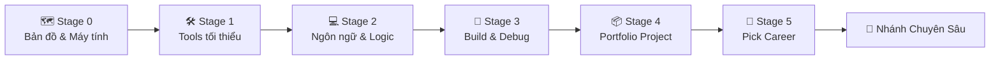

# 🧭 Zero to Coder Career Roadmap

> **Tác giả:** Mr.Rom\
> **Phiên bản:** v3.0.0\
> **Tạo lúc:** 16/05/2026\
> **Cập nhật:** 26/05/2026\
> **Đối tượng:** Người **chưa biết gì** về lập trình / IT, muốn bước chân vào ngành từ con số 0\
> **Thời gian ước tính:** ~6 tháng học tập tích cực (full-time 8h/ngày) hoặc ~12 tháng (part-time 1-2h/ngày)\
> **Mức độ:** Entry-level (Zero-base)\
> **Output cuối lộ trình:** Đọc + viết được code một ngôn ngữ tự chọn (khuyên dùng Python), có ít nhất 1 project hoàn chỉnh làm portfolio trên GitHub, **chọn được career roadmap chuyên sâu kế tiếp một cách thông thái**

---

## 🧭 Tình huống — Bạn đang ở đâu?

Bạn quyết định bước chân vào ngành công nghệ. Bạn mở Google lên tìm kiếm và lập tức bị choáng ngợp bởi một cơn bão thuật ngữ: **JavaScript, Python, Rust, Docker, Kubernetes, AI Agent, Microservices, GraphQL, Kafka, CI/CD...** Hàng trăm khái niệm, hàng chục ngách đi khác nhau, mỗi trang blog hay video YouTube lại khuyên một kiểu.

Cách khuyên phổ biến nhất bạn thường gặp là: *"Hãy chọn ngay một ngôn ngữ lập trình rồi cắm đầu vào học!"*. 

**Mr.Rom nghĩ rằng cách tiếp cận đó rất dễ gây nản lòng**. Khi bạn còn chưa biết ngành IT có những **nghề gì**, chiếc máy tính vận hành ra sao — việc vội vàng chọn một ngôn ngữ giống như bạn nhắm mắt bắn vào bóng đêm. Bạn sẽ sớm tự hỏi: *"Mình đang viết những dòng code này để làm gì?"* và dễ dàng bỏ cuộc ở tuần thứ 4.

👉 **Lộ trình "Zero to Coder" này không dạy bạn để trở thành một chuyên gia chuyên sâu ngay lập tức. Nó đóng vai trò là một "Bản dẫn đường bằng câu chuyện" (Narrative Master), đưa bạn đi qua 5 Stage cực kỳ logic:**
1. **Stage 0**: Hiểu bản đồ ngành IT và cách máy tính hoạt động ở mức nền tảng nhất.
2. **Stage 1**: Trang bị bộ công cụ làm việc tối giản (Tools tối thiểu) mà mọi lập trình viên đều phải dùng hàng ngày.
3. **Stage 2**: Chọn một ngôn ngữ lập trình phù hợp nhất và rèn luyện tư duy logic cốt lõi.
4. **Stage 3**: Học cách viết code chuyên nghiệp — cách viết có cấu trúc, kiểm thử (testing) và tự tìm lỗi (debug).
5. **Stage 4**: Tự tay xây dựng một dự án thực tế làm Portfolio show lên GitHub để gây ấn tượng với nhà tuyển dụng.
6. **Stage 5**: Chọn lộ trình nghề nghiệp chuyên sâu (Backend, Frontend, DevOps, Cloud, AI...) dựa trên sự tự tin của chính bạn.

Hãy cùng Mr.Rom bắt đầu cuộc hành trình rực rỡ này nhé!

---

## 🗺️ Tổng quan Lộ trình 5 Stage

| Stage | Thời gian (Full-time) | Kết quả đầu ra |
|---|---|---|
| **Stage 0: Bản đồ ngành & Máy tính** | 1 tuần | Hiểu tổng quan ngành IT, biết CPU/RAM hoạt động thế nào |
| **Stage 1: Bộ công cụ tối giản** | 2-3 tuần | Làm chủ VS Code, biết gõ Terminal, biết dùng Git & GitHub |
| **Stage 2: Ngôn ngữ & Logic** | 6-8 tuần | Viết được các script giải quyết bài toán logic nhỏ (~50 dòng code) |
| **Stage 3: Build & Debug chuyên nghiệp** | 6-8 tuần | Viết code có cấu trúc OOP, biết viết Unit Test và tự sửa lỗi |
| **Stage 4: Dự án Portfolio** | 4-6 tuần | Có 1 dự án hoàn chỉnh, README đẹp mắt trên GitHub cá nhân |
| **Stage 5: Chọn hướng đi tiếp theo** | 1 tuần | Tự tin lựa chọn Career Roadmap chuyên sâu kế tiếp |

---

## 🗺️ Stage 0 — Bản đồ ngành & Máy tính hoạt động thế nào? (1 tuần)

> 🎯 *Trước khi viết dòng code đầu tiên, bạn phải hiểu rõ "bức tranh toàn cảnh" của thế giới phần mềm và chiếc máy tính trước mặt bạn thực sự vận hành như thế nào. Stage này bạn chỉ cần đọc và ngẫm nghĩ — không cài đặt, không gõ lệnh phức tạp.*

### 📖 Câu chuyện dẫn dắt
Lập trình không phải là việc gõ chữ một cách mù quáng. Để trở thành một kỹ sư phần mềm thực thụ, bạn cần có **tư duy máy tính**. Bạn phải hiểu tại sao máy tính chỉ hiểu hai con số `0` và `1`, và bằng cách nào một dòng code tiếng Anh bạn viết lại có thể điều khiển được phần cứng silicon khô khan bên dưới.

### 📚 Các bài đọc bắt buộc (MUST-KNOW)
- [ ] [Bài 1: Ngành CNTT là gì & Bản đồ các nhánh nghề](../../01_Foundations/industry-landscape/lessons/01_basic/00_what-is-it-industry.md) — *20 phút đọc* — Giúp bạn hiểu rõ 8 nhánh chính của ngành và dẹp bỏ các hiểu lầm phổ biến.
- [ ] [Bài 2: Máy tính hoạt động thế nào — CPU, RAM và Trình phiên dịch](../../01_Foundations/computer-architecture-theory/lessons/01_basic/00_how-computer-works.md) — *15 phút đọc* — Hiểu rõ bản chất phần cứng và cách code được dịch thành mã máy qua ẩn dụ căn bếp trực quan.

### ✅ Tiêu chí vượt qua (Verify)
- [ ] Phân biệt được vai trò của CPU (Đầu bếp tính toán) vs RAM (Bàn làm việc tạm) vs Ổ cứng (Kho lưu trữ).
- [ ] Hiểu được sự khác nhau cơ bản giữa Trình biên dịch (Compiler) và Trình thông dịch (Interpreter).
- [ ] Viết ra giấy **2-3 nhánh nghề** trong IT khiến bạn tò mò hoặc hứng thú nhất.

> 🌉 **Cầu nối sang Stage 1**: 
> *"Khi đã hiểu về cấu trúc máy tính và cách một chương trình được biên dịch, bạn có thể hình dung ra các kỹ sư phát triển phần mềm họ sẽ cần những công cụ chuyên dụng để giao tiếp và làm việc với máy tính đúng không? Hãy cùng bước sang Stage 1 để trang bị cho mình bộ công cụ làm việc tối giản nhất!"*

---

## 🛠️ Stage 1 — Bộ công cụ làm việc tối giản (Tools tối thiểu) (2-3 tuần)

> 🎯 *Bất kể bạn đi theo nhánh nghề nào (làm web, làm game, làm data hay vận hành hệ thống), bạn đều phải làm chủ 3 công cụ sinh mệnh: một trình soạn thảo code, một phương thức ra lệnh trực tiếp cho hệ điều hành, và một công cụ quản lý/chia sẻ mã nguồn.*

### 📖 Câu chuyện dẫn dắt

#### 1. Nơi viết code: Trình soạn thảo (Editor / IDE)
*"Công cụ đầu tiên là nơi bạn gõ code. Bạn không thể dùng Word hay Notepad để viết code vì chúng không có các tính năng hỗ trợ lập trình (như tô màu cú pháp, tự động gợi ý, cảnh báo lỗi). Chúng ta cần các IDE hoặc Editor chuyên dụng, và tiêu biểu nhất hiện nay chính là VS Code."*

- 📍 [Bài học: So sánh các IDE & Trình soạn thảo](../../02_Tools/ide/00_what-is-ide.md) ✅
- 📍 [Bài thực hành: Cài đặt và Làm chủ VS Code từ A-Z](../../02_Tools/ide/vs-code.md) ✅

#### 2. Ra lệnh trực tiếp cho máy tính: Màn hình đen Terminal
*"VS Code giúp bạn viết code. Nhưng làm sao để ra lệnh cho máy tính chạy những dòng chữ đó một cách trực tiếp mà không cần bấm chuột qua giao diện đồ họa? Bạn cần làm quen với màn hình đen Terminal và các lệnh điều hướng cơ bản của hệ điều hành Linux/Unix."*

- 📍 [Bài học: Terminal là gì & Các khái niệm môi trường tính toán](../../01_Foundations/computing-environment/lessons/01_basic/00_what-is-terminal.md) ✅
- 📍 [Bài thực hành 1: Linux Navigation (cd, ls, pwd)](../../04_OS/linux/lessons/01_basic/01_navigation.md) ✅
- 📍 [Bài thực hành 2: Thao tác file trên Terminal (mkdir, touch, cp, mv, rm)](../../04_OS/linux/lessons/01_basic/02_file-operations.md) ✅
- 📍 [Bài thực hành 3: Đọc nội dung file nhanh (cat, less, head, tail)](../../04_OS/linux/lessons/01_basic/03_view-file-content.md) ✅

#### 3. Làm việc chung & Bảo vệ mã nguồn: Git & GitHub (Cơ bản)
*"Bạn biết rằng một phần mềm lớn không bao giờ được tạo ra bởi một người đơn lẻ, mà là sự phối hợp của một team nhiều người. Đối với giai đoạn mới bắt đầu, bạn chưa cần học các kỹ thuật làm việc nhóm phức tạp. Bạn chỉ cần học cách dùng Git để ghi lại lịch sử chỉnh sửa các file của mình (như nhật ký) và đẩy chúng lên GitHub để lưu trữ an toàn làm Portfolio đầu tiên."*

- 📍 [Bài học setup: Cài đặt Git & Cấu hình ban đầu](../../02_Tools/git/setup/git.md) ✅
- 📍 [Bài học 1: Git là gì & Mô hình 3 vùng cốt lõi](../../02_Tools/git/lessons/01_basic/00_what-is-git.md) ✅
- 📍 [Bài học 2: Khởi tạo repo & Commit đầu tiên](../../02_Tools/git/lessons/01_basic/01_init-and-first-commit.md) ✅
- 📍 [Bài học 3: Kết nối GitHub & Đẩy code lên đám mây (Cơ bản)](../../02_Tools/git/lessons/01_basic/02_remote-and-github-basic.md) 🚧
- 📍 [Trắc nghiệm tự đánh giá: Nền tảng Git & 3 Vùng cốt lõi](../../02_Tools/git/exercises/01_basic/quiz_basic-concepts.md) 🚧
- 📍 [Thực hành thực chiến: Tự xây dựng dự án Portfolio đầu tiên](../../02_Tools/git/exercises/01_basic/lab_my-first-portfolio.md) 🚧
- 📍 [Hướng dẫn bổ sung: Setup tài khoản GitHub & Khóa bảo mật SSH](../../02_Tools/git-clients/github.md) ✅

### 🎯 Mini Project cuối Stage 1
Tạo một thư mục local, khởi tạo Git, viết một file giới thiệu bản thân bằng Markdown (`README.md`), commit lại, sau đó tạo một repo trên GitHub và đẩy (push) code từ máy của bạn lên. 

### ✅ Tiêu chí vượt qua (Verify)
- [ ] Cài đặt thành công VS Code, Terminal và Git trên máy cá nhân.
- [ ] Di chuyển qua lại giữa các thư mục bằng lệnh terminal trong vòng 30 giây mà không cần mở Finder/File Explorer.
- [ ] Hiểu được quy trình làm việc với Git: `Sửa code` → `git add` → `git commit` → `git push`.
- [ ] Có một tài khoản GitHub hoạt động và biết cách gửi mã nguồn lên đó.

> 🌉 **Cầu nối sang Stage 2**:
> *"Bây giờ, bạn đã có 'súng ống đạn dược' đầy đủ: một editor để viết code, terminal để chạy lệnh, và Git để bảo vệ lịch sử code của bạn. Đã đến lúc bạn học cách thực sự viết ra những dòng logic lập trình đầu tiên để máy tính thực thi!"*

---

## 💻 Stage 2 — Chọn một Ngôn ngữ & Học tư duy Logic (6-8 tuần)

> 🎯 *Mục tiêu của Stage này KHÔNG phải là trở thành một chuyên gia ngôn ngữ, mà là học **cách một ngôn ngữ vận hành** và rèn luyện **tư duy logic lập trình** (biến, vòng lặp, điều kiện, hàm).*

### 📖 Câu chuyện dẫn dắt
Trên thế giới có hàng trăm ngôn ngữ lập trình. Đối với người mới bắt đầu (zero-base), việc lựa chọn ngôn ngữ rất quan trọng để không bị nản chí bởi cú pháp phức tạp.

#### Bảng so sánh 4 ngôn ngữ entry phổ biến cho người mới:

| Ngôn ngữ | Ưu điểm | Nhược điểm | Phù hợp khi nào |
|---|---|---|---|
| **Python** 🌟 *(Khuyên dùng)* | Cú pháp siêu dễ đọc (như tiếng Anh tự nhiên), lỗi thông báo rõ ràng, dùng cực kỳ rộng rãi (Backend, Data, AI, Security, Automation). | Tốc độ chạy chậm hơn C/Go, nhạy cảm với việc thụt lề thụt dòng. | **Lựa chọn mặc định tuyệt vời nhất** cho người mới khi chưa rõ định hướng. |
| **JavaScript** | Bắt buộc phải học nếu muốn làm Frontend web, hệ sinh thái thư viện khổng lồ. | Cú pháp nhiều chỗ kỳ quặc dễ gây ức chế cho người mới. | Chọn khi bạn đã chắc chắn 80% muốn làm Frontend. |
| **Go** | Cú pháp tối giản, chạy siêu nhanh, là ngôn ngữ của hạ tầng đám mây (Docker, K8s). | Hệ sinh thái tài liệu tiếng Việt còn ít. | Chọn khi bạn chắc chắn muốn làm DevOps / Hệ thống Cloud. |
| **C / C++** | Giúp bạn hiểu cực kỳ sâu máy tính quản lý bộ nhớ thế nào (Pointer, Memory). | Cực kỳ khó học cho người mới, dễ nản vì syntax phức tạp. | Chọn khi bạn muốn làm Game Engine, Hệ thống Nhúng (Embedded) / IoT. |

💡 **Lời khuyên từ Mr.Rom**: **Hãy bắt đầu bằng Python**. Khi bạn đã nắm vững tư duy logic thông qua Python, việc chuyển sang ngôn ngữ khác sau này sẽ dễ dàng hơn tới 80% (vì các khái niệm logic như if/else, vòng lặp, hàm ở mọi ngôn ngữ đều tương tự nhau).

- 📍 [Bài học setup: Cài đặt môi trường Python chuẩn khoa học](../../03_Languages/python/setup/install-python.md) ✅
- 📍 [Bài học 1: Python là gì & Viết chương trình đầu tiên](../../03_Languages/python/lessons/01_basic/00_what-is-python.md) ✅
- 📍 [Bài học 2: Khai báo Biến & Các kiểu dữ liệu cơ bản](../../03_Languages/python/lessons/01_basic/01_variables-and-types.md) ✅
- 📍 [Bài học 3: Rẽ nhánh & Vòng lặp (if, for, while, comprehension)](../../03_Languages/python/lessons/01_basic/02_control-flow.md) ✅
- 📍 [Bài học 4: Viết Hàm (Functions) để tái sử dụng code](../../03_Languages/python/lessons/01_basic/03_functions.md) ✅

### 🧪 Bài tập rèn luyện tư duy
Đừng chỉ đọc lý thuyết suông! Hãy lên trang [Exercism Python Track](https://exercism.org/tracks/python) và hoàn thành ít nhất 30 bài tập logic từ dễ đến trung bình. Tự tay giải quyết các bài toán kinh điển như:
- FizzBuzz.
- Đọc/ghi và xử lý dữ liệu từ một tệp tin CSV.
- Tính toán tiền lương, thuế dựa trên các điều kiện rẽ nhánh phức tạp.

### 🎯 Mini Project cuối Stage 2
Tự viết một chương trình chạy bằng Terminal (CLI) không cần giao diện đồ họa phức tạp, ví dụ: **Chương trình quản lý công việc (Todo CLI)** cho phép thêm, sửa, xóa, hiển thị công việc và lưu dữ liệu trực tiếp vào một file JSON trên máy tính.

### ✅ Tiêu chí vượt qua (Verify)
- [ ] Tự viết được một file script Python khoảng 50 dòng code để giải quyết một bài toán thực tế mà không cần nhìn tài liệu mẫu.
- [ ] Phân biệt được khi nào dùng danh sách (`list`), từ điển (`dict`), hay tập hợp (`set`).
- [ ] Biết cách đọc thông báo lỗi của Python để tự sửa các lỗi cú pháp cơ bản.

> 🌉 **Cầu nối sang Stage 3**:
> *"Code của bạn đã chạy được và giải quyết được bài toán logic rồi. Tuy nhiên, code của các lập trình viên chuyên nghiệp đáng nhận tiền lương cao không chỉ đơn thuần là chạy được — nó phải được tổ chức một cách khoa học, có cấu trúc rõ ràng, dễ bảo trì và có hệ thống kiểm thử tự động để đảm bảo không bị lỗi khi nâng cấp. Hãy bước sang Stage 3!"*

---

## 🧪 Stage 3 — Viết code chuyên nghiệp: Cấu trúc & Kiểm thử (6-8 tuần)

> 🎯 *Mục tiêu Stage này là nâng cấp kỹ năng viết code từ "nghiệp dư" lên "chuyên nghiệp": học tư duy Hướng đối tượng (OOP), quản lý thư viện ngoài, viết Unit Test và sử dụng các công cụ tự động kiểm tra lỗi.*

### 📖 Câu chuyện dẫn dắt
Một ngày đi làm thực tế, bạn không viết code một mình trong một file đơn lẻ. Dự án thật sẽ có hàng trăm file liên kết với nhau. Bạn phải học cách thiết kế code theo mô hình **Hướng đối tượng (Object-Oriented Programming)** để gom nhóm dữ liệu và hành động vào các class cụ thể. 

Đặc biệt, bạn không thể kiểm tra lỗi thủ công bằng cách chạy đi chạy lại chương trình bằng tay. Bạn phải bắt chiếc máy tính tự kiểm tra code của bạn bằng cách viết các **Unit Test** chạy tự động.

### 📚 Các khái niệm cần rèn luyện

#### 1. Viết code chuyên nghiệp với Python
- **Tư duy Hướng đối tượng (OOP)**: Định nghĩa Class, Object, Constructor, các thuộc tính và phương thức. Hiểu 4 tính chất cốt lõi: Đóng gói, Kế thừa, Đa hình, Trừu tượng.
- **Quản lý Thư viện & Môi trường**: Sử dụng `pip` để cài đặt thư viện ngoài, học cách cô lập môi trường bằng Virtual Environment (`venv`) để tránh xung đột thư viện giữa các dự án.
- **Kiểm thử tự động (Testing)**: Sử dụng thư viện `pytest` để viết các đoạn test tự động kiểm tra đầu ra của các hàm logic.
- **Tiêu chuẩn viết code sạch**: Học cách sử dụng Linter (như `ruff`) để tự động định dạng code đẹp mắt, đúng chuẩn PEP8 của Python.

#### 2. Phân nhánh & Làm việc nhóm chuyên nghiệp với Git (Git Nâng Cao)
*"Bây giờ bạn đã biết viết code Python thực tế và chuẩn bị tham gia vào các dự án lớn nhiều người. Đây chính là thời điểm vàng để làm chủ các kỹ năng Git nâng cao giúp bạn phối hợp nhóm không bao giờ bị đè code lên nhau và tự cứu hộ nếu có sự cố khẩn cấp xảy ra."*
- 📍 [Git Intermediate 00: Nhánh song song & Gộp code (Branch & Merge)](../../02_Tools/git/lessons/02_intermediate/00_branching-and-merging.md) ✅
- 📍 [Git Intermediate 01: Giải quyết xung đột gộp code (Resolving Conflicts)](../../02_Tools/git/lessons/02_intermediate/01_resolving-conflicts.md) 🚧
- 📍 [Git Intermediate 02: Quy trình làm việc nhóm chuyên nghiệp (Collaborative Workflows)](../../02_Tools/git/lessons/02_intermediate/02_collaborative-workflows.md) ✅
- 📍 [Git Advanced 00: Sửa sai & Hoàn tác cơ bản (Undo & Recovery)](../../02_Tools/git/lessons/03_advanced/00_undo-and-recovery.md) ✅
- 📍 [Git Advanced 01: Cứu hộ thảm họa nâng cao với Reflog](../../02_Tools/git/lessons/03_advanced/01_advanced-recovery-reflog.md) 🚧
- 📍 [Trắc nghiệm tự đánh giá: Phân nhánh & Giải quyết xung đột](../../02_Tools/git/exercises/02_intermediate/quiz_branching-and-conflicts.md) 🚧
- 📍 [Thực hành thực chiến: Trở thành chiến binh giải quyết xung đột (Conflict Hero)](../../02_Tools/git/exercises/02_intermediate/lab_conflict-hero.md) 🚧
- 📍 [Thực hành làm việc nhóm: Tạo và Gộp Pull Request trên GitHub](../../02_Tools/git/exercises/02_intermediate/lab_team-pull-request.md) 🚧
- 📍 [Thực hành sửa sai: Nhà du hành thời gian với Git Stash & Amend](../../02_Tools/git/exercises/03_advanced/lab_git-time-traveler.md) 🚧
- 📍 [Thực hành cứu hộ khẩn cấp: Cứu hộ 3 commit bị mất bằng Reflog](../../02_Tools/git/exercises/03_advanced/lab_emergency-reflog-rescue.md) 🚧

### 🎯 Mini Project cuối Stage 3
Tiến hành **nâng cấp (refactor)** dự án Todo CLI ở Stage 2:
1. Chuyển cấu trúc code từ hàm đơn thuần sang cấu trúc Hướng đối tượng (OOP) với các Class `Task` và `TaskManager`.
2. Viết bộ kiểm thử tự động (`pytest`) cho toàn bộ các tính năng thêm/sửa/xóa của TaskManager, đạt tỷ lệ bao phủ code (test coverage) > 80%.
3. Tích hợp chạy kiểm tra tự động linter và formatter trước khi commit code.

### ✅ Tiêu chí vượt qua (Verify)
- [ ] Giải thích được tại sao viết Class lại giúp quản lý dự án lớn tốt hơn.
- [ ] Viết và chạy thành công các bộ unit test bằng lệnh `pytest` trong terminal.
- [ ] Biết cách đọc tài liệu (Documentation) của một thư viện bên thứ ba và tích hợp nó vào dự án của mình trong vòng 30 phút.

> 🌉 **Cầu nối sang Stage 4**:
> *"Bạn đã nắm vững toàn bộ nền tảng cốt lõi: tư duy máy tính, công cụ dòng lệnh Git/GitHub, ngôn ngữ lập trình và quy chuẩn kiểm thử chuyên nghiệp. Bây giờ chính là lúc bạn tỏa sáng — tự tay xây dựng một dự án thực tế hoàn chỉnh để chứng minh năng lực của bạn với toàn bộ thế giới thông qua một Portfolio ấn tượng!"*

---

## 📦 Stage 4 — Xây dựng dự án Portfolio cá nhân (4-6 tuần)

> 🎯 *Tự tay thiết kế và hoàn thiện một dự án thực tế từ con số 0, lưu trữ trên GitHub với đầy đủ tài liệu hướng dẫn chuyên nghiệp để đính kèm vào CV xin việc.*

### 📖 Câu chuyện dẫn dắt
Nhà tuyển dụng công nghệ không quan tâm bạn đã đọc bao nhiêu cuốn sách hay xem bao nhiêu video khóa học. Họ chỉ quan tâm **bạn đã làm được cái gì**. Một dự án thực tế chạy được, có code sạch sẽ và tài liệu hướng dẫn (README) chỉn chu trên GitHub có giá trị gấp trăm lần những dòng liệt kê kỹ năng sáo rỗng trong CV.

Hãy chọn một dự án phù hợp với nhánh nghề nghiệp mà bạn đã chọn ở Stage 0:

| Định hướng của bạn | Dự án gợi ý | Công nghệ đề xuất |
|---|---|---|
| 🌐 **Backend Developer** | Xây dựng REST API quản lý cửa hàng sách có lưu cơ sở dữ liệu và bảo mật đăng nhập. | Python (FastAPI) + SQLite + Pytest |
| 🎨 **Frontend Developer** | Xây dựng ứng dụng web theo dõi thời tiết hoặc danh mục phim lấy dữ liệu từ API công cộng. | HTML/CSS/JS + React + Tailwind CSS |
| 📊 **Data / Automation** | Viết công cụ tự động cào (scrape) dữ liệu giá nhà đất/vàng, phân tích và lưu vào tệp dữ liệu. | Python + BeautifulSoup + Pandas |
| ⚙️ **DevOps / Cloud** | Dockerize (đóng gói) một ứng dụng web và thiết lập pipeline tự động chạy test khi push code. | Docker + GitHub Actions CI |
| 🤖 **AI / LLM Engineer** | Xây dựng chatbot thông minh tự đọc hiểu tệp PDF tài liệu nội bộ và trả lời câu hỏi. | Python + OpenAI API + ChromaDB |

### 🛠️ Các tiêu chuẩn bắt buộc phải có trong dự án Portfolio:
- [ ] **File README.md cực đẹp**: Có phần giới thiệu dự án, hướng dẫn cài đặt từng bước, sơ đồ kiến trúc hệ thống (Mermaid) và hướng dẫn sử dụng chi tiết.
- [ ] **Cấu trúc thư mục chuẩn**: Tách biệt rõ ràng mã nguồn ứng dụng (`src/`), bộ kiểm thử (`tests/`), và tài liệu (`docs/`).
- [ ] **Lịch sử Git sạch đẹp**: Có tối thiểu 15-20 commit thể hiện quá trình xây dựng dự án từng bước theo chuẩn Conventional Commits (ví dụ: `feat: add database model`, `fix: repair login validation`).
- [ ] **Tích hợp CI/CD cơ bản**: Thiết lập GitHub Actions tự động chạy toàn bộ Unit Test mỗi khi bạn đẩy code mới lên GitHub để đảm bảo code luôn chạy tốt.

---

## 🧭 Stage 5 — Quyết định Lộ trình Chuyên sâu (1 tuần)

> 🎯 *Lúc này, bạn đã không còn là một người ngoại đạo ngơ ngác nữa. Bạn đã là một coder thực thụ có sản phẩm thực tế. Stage này là lúc bạn dừng lại, đánh giá thế mạnh của bản thân và lựa chọn Career Roadmap chuyên sâu.*

Hãy nhìn lại quá trình bạn xây dựng dự án ở Stage 4:
- Nếu bạn cảm thấy vô cùng hứng thú khi ngồi thiết kế cơ sở dữ liệu, xử lý logic API, phân quyền đăng nhập → Hãy đi tiếp lộ trình [Backend Developer Roadmap](./backend-developer_career-roadmap.md).
- Nếu bạn bị lôi cuốn bởi việc căn chỉnh pixel giao diện, thiết kế màu sắc, hiệu ứng mượt mà thu hút người dùng → Hãy đi tiếp lộ trình [Frontend Developer Roadmap](./frontend-developer_career-roadmap.md).
- Nếu bạn muốn tự tay thiết kế và làm chủ toàn bộ từ đầu đến cuối một ứng dụng web → Hãy chọn [Fullstack Developer Roadmap](./fullstack-developer_career-roadmap.md).
- Nếu bạn yêu thích việc thiết kế hạ tầng máy chủ ảo, tự động hóa quy trình deploy ứng dụng lên internet → Hãy chọn [DevOps Engineer Roadmap](./devops-engineer_career-roadmap.md).
- Nếu bạn đam mê dữ liệu, số liệu thống kê và huấn luyện trí tuệ nhân tạo → Hãy chọn [AI Engineer Roadmap](./ai-engineer_career-roadmap.md) hoặc [Data Engineer Roadmap](./data-engineer_career-roadmap.md).

---

## ⚠️ 7 Lời khuyên xương máu để không bị bỏ dở giữa chừng

1. ❌ **Đừng cố học quá nhiều thứ cùng lúc**: Ôm đồm vừa học Python, vừa học React, vừa học Docker cùng lúc ở 3 tháng đầu sẽ khiến bạn quá tải và không master được cái gì. Hãy đi tuần tự theo lộ trình.
2. ❌ **Tránh cạm bẫy "Xem video vô thức" (Tutorial Hell)**: Xem người khác code trên YouTube tạo ra ảo tưởng là bạn đã hiểu. Hãy tắt video đi và tự gõ lại code từ đầu. Chỉ khi ngón tay bạn chạm vào bàn phím và gặp lỗi, bạn mới thực sự học.
3. ❌ **Không skip Stage 0**: Đừng nhảy thẳng vào code khi chưa biết máy tính vận hành thế nào. Bạn sẽ sớm bị kiệt sức vì không hiểu bản chất.
4. ❌ **Chấp nhận lỗi là một phần của cuộc sống**: Khi gặp thông báo lỗi màu đỏ, đừng hoảng sợ hay chán nản. Đối với lập trình viên, 80% thời gian làm việc là đi sửa lỗi. Lỗi chính là người thầy tốt nhất giúp bạn tiến bộ.
5. ❌ **Tập thói quen hỏi AI một cách thông thái**: Đừng bắt ChatGPT hay Cursor code giùm bạn 100%. Hãy bắt AI giải thích dòng code đó hoạt động thế nào hoặc gợi ý giải pháp khi bạn bị tắc.
6. ❌ **Ghi lại tiến độ mỗi ngày (progress.md)**: Hãy tạo thói quen ghi chú lại hôm nay bạn học được gì mới và commit nó lên GitHub. Nhìn lại biểu đồ commit màu xanh lá cây tăng lên mỗi ngày trên GitHub sẽ mang lại nguồn động lực khổng lồ.
7. ❌ **So sánh mình với chính mình hôm qua**: Đừng so sánh bản thân với những "thần đồng công nghệ" trên mạng xã hội. Lộ trình của bạn là duy nhất, hãy kiên trì đi từng bước nhỏ mỗi ngày.

---

## 📌 Changelog

- **v3.0.0 (26/05/2026)** — **Nâng cấp thành Narrative Master (Bản dẫn đường bằng câu chuyện)**:
  - Tái cấu trúc toàn bộ nội dung sang dạng dẫn chuyện có chiều sâu, rành mạch và truyền cảm hứng.
  - Thiết lập các câu bắc cầu logic (bridge sentences) mượt mà kết nối chặt chẽ giữa các Stage.
  - Cập nhật đồng bộ toàn bộ liên kết tương đối của Git trỏ sang thư mục mới `02_Tools/git/` ✅.
  - Bổ sung bài đọc CS nền tảng [00_how-computer-works.md](../../01_Foundations/computer-architecture-theory/lessons/01_basic/00_how-computer-works.md) làm bài học bắt buộc cho Stage 0 ✅.
- **v2.0.0 (19/05/2026)** — Restructure sitemap links.
- **v1.0.0 (16/05/2026)** — Bản phác thảo đầu tiên.
