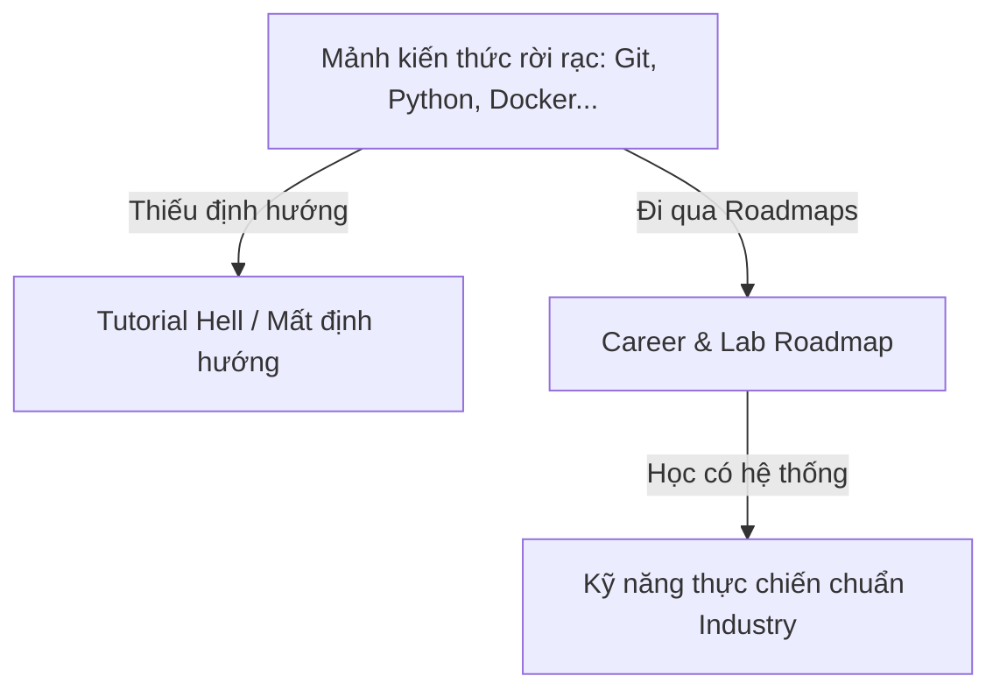
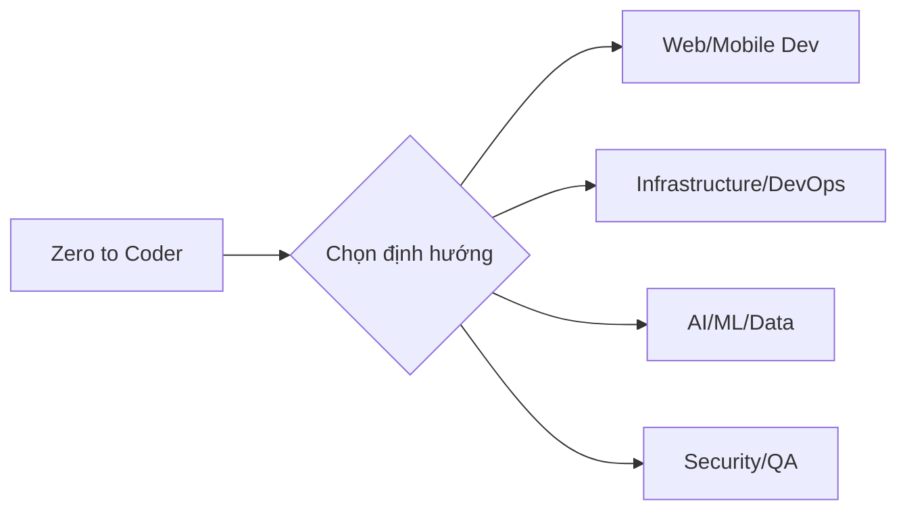

# 📋 Overview — Lộ Trình Học Tập (Roadmaps)

> **Tác giả:** Mr.Rom\
> **Phiên bản:** v1.0.0\
> **Tạo lúc:** 26/05/2026\
> **Cập nhật:** 26/05/2026

> 🎯 *Bộ bản đồ định hướng nghề nghiệp và thực hành thực tế, giúp bạn kết nối các mảng kiến thức lập trình rời rạc thành một lộ trình thăng tiến rõ ràng, tránh lạc lối trong ma trận công nghệ.*

---

## 1️⃣ Lộ trình học tập (Roadmaps) là gì

**Roadmaps** trong kho tri thức *dev-knowledge* là hệ thống định hướng học tập đa chiều, chia làm 2 nhánh chính:
1. **Career Roadmaps (Lộ trình Nghề nghiệp):** Định hướng từ cơ bản đến nâng cao để đảm nhận một vị trí công việc cụ thể (ví dụ: Backend Developer, DevOps Engineer, AI Engineer...).
2. **Lab Series (Lộ trình Thực hành):** Các chuỗi bài thực hành tích hợp liên công nghệ (Cross-technology) giúp bạn rèn luyện kỹ năng thực chiến.

---

## 2️⃣ Vì sao có Roadmaps

Lập trình và vận hành hệ thống là một đại dương kiến thức khổng lồ. Người học rất dễ bị ngợp và mất phương hướng.

### Trước khi có Roadmaps
- Bạn học các mảnh kiến thức rời rạc (học Git riêng, Docker riêng, Python riêng) nhưng không biết cách phối hợp chúng để xây dựng ứng dụng hoàn chỉnh.
- Rơi vào bẫy *Tutorial Hell* — đọc nhiều, xem nhiều nhưng khi tự tay làm một dự án thực tế thì bế tắc không biết bắt đầu từ đâu.
- Không biết tiêu chuẩn kiến thức tối thiểu cho từng vị trí công việc (ví dụ: làm Frontend thì cần biết bao nhiêu về Network, làm DevOps thì cần biết sâu cỡ nào về Linux).

### Sau khi có Roadmaps
- Có sơ đồ từng bước (Stage), biết rõ học gì trước, học gì sau, bài nào có thể học song song.
- Mọi module kỹ năng đều liên kết trực tiếp (hyperlink) tới các bài học lý thuyết chuẩn hóa (L2) và các bài Lab thực hành tương ứng.
- Đánh giá được mức độ sẵn sàng của bản thân qua các Checklist kiểm tra năng lực ở cuối mỗi giai đoạn.

---

## 3️⃣ Khi nào dùng Roadmaps

| Tình huống học tập | Có nên dùng | Cách sử dụng hiệu quả |
|---|---|---|
| **Bắt đầu chuyển ngành / học từ số 0** | ✅ Có | Bắt đầu từ lộ trình [Zero to Coder](./career/zero-to-coder_career-roadmap.md) trước khi chọn nhánh chuyên sâu. |
| **Đã đi làm và muốn chuyển hệ (ví dụ: Dev sang DevOps)** | ✅ Có | Đọc roadmap [DevOps Engineer](./career/devops-engineer_career-roadmap.md), đối chiếu checklist để bổ sung lỗ hổng hạ tầng. |
| **Muốn tìm bài học cụ thể về một công cụ (ví dụ: Redis)** | ❌ Không | Nên tra cứu trực tiếp ở cây thư mục chính (ví dụ: `06_databases/redis/`) thay vì đi qua Roadmap. |
| **Muốn luyện code thuật toán thi đấu** | ❌ Không | Roadmap định hướng kỹ năng nghề nghiệp thực tế, không chuyên sâu vào thi đấu thuật toán thuần túy. |

---

## 4️⃣ Các khái niệm cốt lõi

- **Stage (Giai đoạn):** Các mốc học tập phân chia theo độ khó tăng dần (ví dụ: Foundations, Core, Advanced, Specialization).
- **Checklist (Bảng tự đánh giá):** Danh sách các tiêu chí kỹ năng bạn cần tự kiểm tra xem mình đã hiểu rõ hay chưa trước khi bước sang giai đoạn tiếp theo.
- **Cross-Technology Lab (Lab tích hợp):** Bài thực hành kết hợp nhiều công cụ khác nhau trong thực tế (ví dụ: CI/CD Pipeline build Docker image rồi deploy lên K8s).
- **Status (Trạng thái module):** Chỉ độ sẵn sàng của bài học trong kho tri thức (`✅` đã hoàn thành, `🚧` đang xây dựng/placeholder).

---

## 5️⃣ Cấu trúc hệ thống Roadmaps trong kho

Hệ thống được tổ chức thành 2 thư mục chính:

| Thư mục | Vai trò | Liên kết |
|---|---|---|
| `career/` | 17 bản đồ định hướng nghề nghiệp chi tiết | [Career Roadmaps](./career/) |
| `lab-series/` | Các chuỗi bài thực hành thực chiến tổng hợp | [Lab Series](./lab-series/) 🚧 |

---

## 6️⃣ Lộ trình sử dụng đề xuất

| Bước | Hành động đề xuất | Liên kết |
|---|---|---|
| **Bước 1** | Xây dựng tư duy lập trình và nền tảng máy tính cơ bản | [Zero to Coder](./career/zero-to-coder_career-roadmap.md) |
| **Bước 2** | Lựa chọn lộ trình chuyên sâu phù hợp với mục tiêu nghề nghiệp | [README.md](./README.md) |
| **Bước 3** | Học lý thuyết kết hợp làm Lab thực hành theo từng Stage trong roadmap | Xem chi tiết trong từng Roadmap cụ thể |
| **Bước 4** | Thực hiện checklist cuối mỗi Stage để tự đánh giá và lấp lỗ hổng | Checklist cuối các Stage |

---

## 7️⃣ Câu hỏi thường gặp

**Q: Tôi có cần học 100% các mục trong một Roadmap mới có thể đi làm?**

A: Không. Roadmap vẽ ra bức tranh toàn cảnh để bạn phát triển lâu dài. Thông thường, bạn chỉ cần hoàn thành tốt **Stage 1 (Nền tảng)** và **Stage 2 (Cốt lõi)** cùng một số bài Lab thực tế là đã đủ điều kiện ứng tuyển vị trí Intern/Junior.

**Q: Các link đánh dấu 🚧 nghĩa là gì?**

A: Đó là các bài học đang trong quá trình biên soạn nội dung chi tiết. Bạn vẫn có thể click vào để xem khung bài học (skeleton) để biết khái niệm đó gồm những gì, sau đó tìm hiểu thêm tài liệu ngoài nếu cần gấp.

---

## 🔗 Liên kết & Tài nguyên

### Trong kho
- [README chính của Roadmaps](./README.md)

---

## 📌 Nhật ký thay đổi (Changelog)

- **v1.0.0 (26/05/2026)** — Khởi tạo nội dung hoàn chỉnh cho Overview theo cấu trúc chuẩn.
