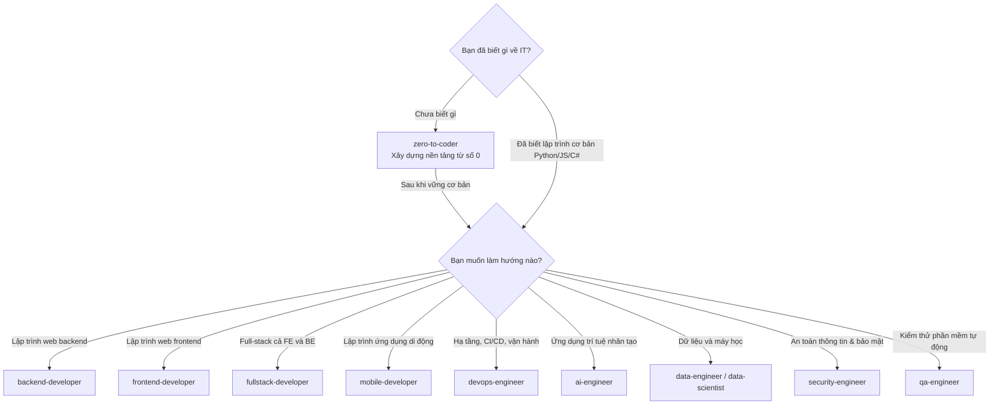

# 🗺️ Lộ Trình Học Tập — 00_roadmaps

> **Tác giả:** Mr.Rom\
> **Phiên bản:** v1.0.0\
> **Tạo lúc:** 16/05/2026\
> **Cập nhật:** 26/05/2026

> 🎯 *Bộ sưu tập **lộ trình học** — hướng dẫn đi xuyên qua các chủ đề công nghệ theo thứ tự tối ưu.* Mục đích giúp bạn định hình bức tranh tổng thể, đi từ con số 0 (Zero to Coder) đến khi trở thành một chuyên gia thực thụ trong nhánh nghề nghiệp đã chọn.

---

## 📋 Có gì trong thư mục này

Hệ thống lộ trình được chia thành 2 loại phục vụ 2 nhu cầu khác nhau:

| Loại | Mục đích | Thời gian | Tên file suffix |
|---|---|---|---|
| 🧭 **Career Roadmap** | Lộ trình theo **nghề** — trang bị kỹ năng sẵn sàng ứng tuyển | 6-12 tháng | `<role>_career-roadmap.md` |
| 🧪 **Lab Series** | Chuỗi **bài tập thực hành** tích hợp nhiều công nghệ | 1-4 tuần | `<name>_lab-series.md` 🚧 |

---

## 🧭 Career Roadmaps (Lộ trình nghề nghiệp)

→ Thư mục chi tiết: [`career/`](./career/)

| Lộ trình | Đối tượng mục tiêu | Thời gian dự kiến | Trạng thái |
|---|---|---|---|
| 🌟 [`zero-to-coder`](./career/zero-to-coder_career-roadmap.md) | Người mới bắt đầu học lập trình từ số 0 | 6 tháng FT / 12 tháng PT | ✅ Hoàn thành khung |
| 💻 [`backend-developer`](./career/backend-developer_career-roadmap.md) | Muốn làm việc với API, cơ sở dữ liệu và hệ thống | 9 tháng FT | ✅ Hoàn thành khung |
| 🎨 [`frontend-developer`](./career/frontend-developer_career-roadmap.md) | Đam mê thiết kế giao diện, trải nghiệm người dùng web | 9 tháng FT | ✅ Hoàn thành khung |
| 🚀 [`fullstack-developer`](./career/fullstack-developer_career-roadmap.md) | Làm chủ cả Frontend lẫn Backend | 12 tháng FT | ✅ Hoàn thành khung |
| 📱 [`mobile-developer`](./career/mobile-developer_career-roadmap.md) | Phát triển app iOS/Android (React Native) | 10 tháng FT | ✅ Hoàn thành khung |
| ⚙️ [`devops-engineer`](./career/devops-engineer_career-roadmap.md) | Hạ tầng, tự động hóa và chu kỳ CI/CD | 10 tháng FT | ✅ Hoàn thành khung |
| 🛡️ [`sre-engineer`](./career/sre-engineer_career-roadmap.md) | Độ tin cậy hệ thống và đo lường (observability) | 10 tháng FT | ✅ Hoàn thành khung |
| 🏗️ [`platform-engineer`](./career/platform-engineer_career-roadmap.md) | Xây dựng Internal Developer Platform (IDP) | 10-12 tháng FT | ✅ Hoàn thành khung |
| ☁️ [`cloud-engineer`](./career/cloud-engineer_career-roadmap.md) | Thiết kế kiến trúc đám mây (AWS focus) | 10 tháng FT | ✅ Hoàn thành khung |
| 📊 [`data-engineer`](./career/data-engineer_career-roadmap.md) | Quản lý dữ liệu lớn, ETL/ELT pipeline và data warehouse | 10 tháng FT | ✅ Hoàn thành khung |
| 📈 [`data-scientist`](./career/data-scientist_career-roadmap.md) | Phân tích số liệu, thống kê và mô hình ML | 12 tháng FT | ✅ Hoàn thành khung |
| 🤖 [`ml-engineer`](./career/ml-engineer_career-roadmap.md) | Đưa mô hình ML vào sản xuất (MLOps) | 12 tháng FT | ✅ Hoàn thành khung |
| 🧠 [`ai-engineer`](./career/ai-engineer_career-roadmap.md) | Ứng dụng LLM, RAG, AI Agent vào phần mềm | 9 tháng FT | ✅ Hoàn thành khung |
| 🔒 [`security-engineer`](./career/security-engineer_career-roadmap.md) | Bảo mật thông tin, an ninh mạng, pentest | 12 tháng FT | ✅ Hoàn thành khung |
| 🧪 [`qa-engineer`](./career/qa-engineer_career-roadmap.md) | Kiểm thử tự động hóa (SDET / Automation Test) | 8 tháng FT | ✅ Hoàn thành khung |
| 🎮 [`game-developer`](./career/game-developer_career-roadmap.md) | Lập trình game 2D/3D (Unity & C#) | 12 tháng FT | ✅ Hoàn thành khung |
| ⛓️ [`blockchain-developer`](./career/blockchain-developer_career-roadmap.md) | Smart contracts, Web3 và dApp | 10 tháng FT | ✅ Hoàn thành khung |

> 💡 *Lưu ý: "Hoàn thành khung" nghĩa là lộ trình học, mốc thời gian, checklist và các liên kết đã được chuẩn hóa. Các bài học lý thuyết tương ứng ở L2 đang tiếp tục được biên soạn chi tiết.*

---

## 🧪 Lab Series (Chuỗi bài thực hành tích hợp)

→ Thư mục chi tiết: [`lab-series/`](./lab-series/)

Các chuỗi Lab thực hành liên công nghệ giúp biến lý thuyết thành sản phẩm thực tế:

| Series | Phạm vi kiến thức | Thời lượng | Trạng thái |
|---|---|---|---|
| ❌ `docker-to-k8s` | Docker → K8s → Helm → ArgoCD → Istio | ~40 giờ | 🚧 Chưa có (đang lên kế hoạch) |
| ❌ `full-stack-web-app` | React (FE) → FastAPI (BE) → Postgres → Deploy | ~30 giờ | 🚧 Chưa có (đang lên kế hoạch) |
| ❌ `home-lab-self-hosted` | Linux Server → Docker Compose → Monitoring | ~20 giờ | 🚧 Chưa có (đang lên kế hoạch) |
| ❌ `python-zero-to-production`| Python Basic → FastAPI App → Unit Test → Docker Deploy | ~25 giờ | 🚧 Chưa có (đang lên kế hoạch) |

---

## 🚀 Bạn nên bắt đầu từ Roadmap nào?

Hãy dùng sơ đồ dưới đây để tự định vị hướng đi của bản thân:

---

## 🆕 So sánh giữa Career Roadmap và Lab Series

| Đặc tính | Career Roadmap | Lab Series |
|---|---|---|
| **Độ trừu tượng** | Cao — Bao gồm định hướng lý thuyết, tư duy và checklist | Thấp — Chỉ tập trung vào các step-by-step thực hành tạo sản phẩm |
| **Thời gian học** | 6-12 tháng | 1-4 tuần |
| **Kết quả đầu ra** | Sẵn sàng ứng tuyển công việc (Job-ready) | Có một sản phẩm thực tế để bỏ vào Portfolio (Product-ready) |
| **Liên kết** | Chỉ liên kết đến các module bài học lý thuyết | Liên kết và tích hợp nhiều công cụ của các module khác nhau |

---

## 🤝 Hướng dẫn đóng góp & thêm Roadmap mới

Nếu bạn muốn đề xuất roadmap hoặc cập nhật lộ trình:
1. Đọc kỹ thiết kế chuẩn tại [`../_blueprint/06_roadmap-design.md`](../_blueprint/06_roadmap-design.md).
2. Copy file mẫu [`../_blueprint/templates/roadmap_template.md`](../_blueprint/templates/roadmap_template.md).
3. Biên soạn nội dung, đặt tên file theo đúng chuẩn `<name>_career-roadmap.md` và lưu vào thư mục `career/`.
4. Cập nhật liên kết vào bảng danh sách trong file này và [`../MASTER-CATALOG.md`](../MASTER-CATALOG.md).
5. Mở Pull Request.

---

## 📌 Changelog

- **v1.0.0 (26/05/2026)** — **Hoàn thiện cấu trúc liên kết 17/17 Career Roadmaps**, sửa lỗi dead-link, bổ sung overview chi tiết.
- **v0.3.0 (16/05/2026)** — Hoàn thành khung 17/17 career roadmaps.
- **v0.2.0 (16/05/2026)** — Thêm lộ trình `zero-to-coder` và viết lại cấu trúc README.
- **v0.1.0 (16/05/2026)** — Khởi tạo cấu trúc cơ bản.
