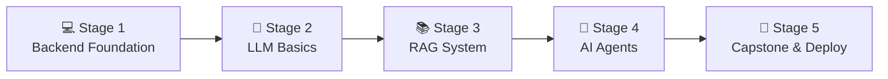

# 🧭 AI Engineer Career Roadmap

> **Tác giả:** Mr.Rom\
> **Phiên bản:** v2.0.0\
> **Tạo lúc:** 16/05/2026\
> **Cập nhật:** 26/05/2026\
> **Đối tượng:** Đã code Python cơ bản, muốn xây dựng ứng dụng AI thực tế (LLM, RAG, AI Agent)\
> **Mức độ:** Junior → Mid (Sẵn sàng ứng tuyển và làm việc thực tế)

---

## 🧭 Tình huống — Bạn đang ở đâu?

Bạn muốn bước chân vào thế giới Trí tuệ Nhân tạo (AI) đang bùng nổ vũ bão. Tuy nhiên, khi tìm hiểu, bạn lập tức bị ngợp bởi các tài liệu học thuật dày đặc toán học: Đại số tuyến tính, Giải tích, Đạo hàm, Xác suất thống kê, Mạng nơ-ron học sâu (Deep Learning)... Bạn tự hỏi: *"Lẽ nào mình phải học 4 năm đại học toán mới có thể làm được AI?"*

**Mr.Rom có tin vui cho bạn**: Kỷ nguyên AI hiện đại đã phân tách rất rõ 2 vai trò:
1. **ML Engineer (Kỹ sư Học máy):** Tập trung nghiên cứu toán học, thiết kế và huấn luyện các mô hình AI từ con số 0.
2. **AI Engineer (Kỹ sư AI):** Tập trung ứng dụng các mô hình ngôn ngữ lớn (LLM) và các dịch vụ AI đã được huấn luyện sẵn của OpenAI, Anthropic, Google để tích hợp vào các phần mềm, tạo ra giá trị thực tế cho người dùng (Chatbot thông minh, Hệ thống truy xuất dữ liệu RAG, Tác tử tự động AI Agent).

👉 **Lộ trình AI Engineer này được thiết kế để bạn làm chủ kỹ năng ứng dụng AI vào phần mềm mà không cần nền tảng toán học quá sâu.** Chúng ta sẽ đi qua 5 Stage cực kỳ logic để xây dựng năng lực thực chiến:

- **Stage 1**: Xây dựng nền tảng Python vững vàng và API Backend cơ bản.
- **Stage 2**: Làm chủ cách giao tiếp và điều khiển LLM thông qua API và Prompting.
- **Stage 3**: Nâng cấp ứng dụng với RAG (Retrieval-Augmented Generation) để AI hiểu dữ liệu riêng tư.
- **Stage 4**: Thiết kế các AI Agent tự động lập kế hoạch và thực thi task phức tạp.
- **Stage 5**: Hoàn thành dự án thực tế quy mô lớn và deploy lên môi trường Production.

---

## 🗺️ Tổng quan Lộ trình 5 Stage

| Stage | Kết quả đầu ra |
| --- | --- |
| **Stage 1: Python & Backend Foundation** | Làm chủ Python nâng cao, xây dựng được REST API với FastAPI |
| **Stage 2: LLM Basics & Prompting** | Chat app thông minh gọi API OpenAI/Claude, hỗ trợ streaming |
| **Stage 3: RAG (Retrieval-Augmented)** | Hệ thống Q&A thông minh truy vấn trên kho tài liệu PDF/Docs riêng biệt |
| **Stage 4: AI Agents** | Tác tử AI tự biết dùng tools (web search, DB) để giải quyết task phức tạp |
| **Stage 5: Capstone & Deploy** | 1 sản phẩm AI SaaS hoàn chỉnh, quản lý chi phí, deploy lên đám mây |

---

## 💻 Stage 1 — Python & Backend Foundation

> 🎯 *Kỹ sư AI trước hết phải là một Kỹ sư Backend tốt. Bạn cần vững ngôn ngữ Python và biết cách thiết kế API để làm bệ đỡ cho các tích hợp AI sau này.*

### 📖 Câu chuyện dẫn dắt
Mọi ứng dụng AI tinh vi cuối cùng đều giao tiếp với người dùng thông qua hệ thống API backend. Dù AI của bạn có thông minh đến đâu, nếu hệ thống backend không chịu tải được, không lưu được lịch sử chat (session), không xác thực được người dùng (auth), thì ứng dụng đó không thể đưa vào sử dụng thực tế. Python chính là "ngôn ngữ mẹ đẻ" của thế giới AI, và FastAPI là framework tốt nhất để bạn xây dựng backend.

### 📚 Các bài học bắt buộc (MUST-KNOW)
- [ ] [Nền tảng ngôn ngữ Python](../../03_languages/python/) ✅ — Tập trung sâu vào lập trình hướng đối tượng (OOP), lập trình bất đồng bộ (`async/await`) để xử lý API tốt hơn.
- [ ] [Sử dụng Git cho phát triển dự án](../../02_tools/git/) ✅ — Làm quen với luồng làm việc phân nhánh (branching).
- [ ] [FastAPI cơ bản](../../07_web/backend/python-fastapi/) 🚧 — Hiểu cách viết REST API, sử dụng Pydantic để validate dữ liệu đầu vào.

### 🛠️ Setup môi trường
- [ ] [Cài đặt môi trường Python 3.12+ và công cụ quản lý ảo venv](../../03_languages/python/setup/install-python.md) ✅
- [ ] [Làm chủ IDE soạn thảo VS Code](../../02_tools/ide/vs-code.md) ✅
- [ ] Tạo tài khoản OpenAI/Anthropic để lấy API key (sử dụng các gói nạp tiền tối thiểu $5 để học tập).

### 🎯 Project thực hành Stage 1
Xây dựng một **REST API quản lý công việc (Todo app)** bằng FastAPI có sử dụng Pydantic, ghi dữ liệu vào SQLite và viết Unit Test hoàn chỉnh bằng `pytest`.

> 🌉 **Cầu nối sang Stage 2**: 
> *"Khi đã tự tin viết API backend cơ bản bằng Python, bạn đã sẵn sàng giao tiếp với các bộ não AI thông qua API. Hãy cùng chuyển sang Stage 2 để học cách ra lệnh và điều khiển LLM một cách thông thái qua mã nguồn!"*

---

## 🧠 Stage 2 — LLM Basics & Prompting

> 🎯 *Làm chủ kỹ thuật tương tác với Mô hình Ngôn ngữ Lớn (LLM) qua API SDK, định hình cách phản hồi của AI và tối ưu hóa chi phí.*

### 📖 Câu chuyện dẫn dắt
*"Giao tiếp với LLM trên giao diện web (như ChatGPT Plus) hoàn toàn khác với việc giao tiếp qua mã nguồn. Bạn phải học cách kiểm soát tính ngẫu nhiên của mô hình, định dạng đầu ra chuẩn JSON để code backend đọc được, và tối ưu hóa chi phí API từng xu một qua các tham số kỹ thuật."*

### 📚 Các bài đọc bắt buộc (MUST-KNOW)
- [ ] [LLM là gì & Cơ chế Transformer (High-level)](../../13_ai-ml/llm/) 🚧 — Hiểu khái niệm token, context window, temperature, top_p.
- [ ] **Prompt Engineering cho Developer:** chain-of-thought, few-shot prompting, system instructions.
- [ ] **Structured Output:** Ép LLM luôn phản hồi về dạng JSON có cấu trúc chính xác (JSON mode hoặc Pydantic tool calling).
- [ ] **Function Calling (Tool Use):** Dạy LLM biết khi nào cần gọi một hàm Python do bạn viết (ví dụ: lấy thời tiết hiện tại hoặc truy vấn cơ sở dữ liệu).

### 🧪 Bài thực hành
- [ ] Viết script Python gọi API OpenAI/Claude sử dụng streaming (hiển thị chữ chạy dần dần trên màn hình).
- [ ] Xây dựng tính năng ghi nhớ lịch sử hội thoại (Conversation Memory) sử dụng bộ nhớ tạm của server.
- [ ] Viết một API FastAPI có tích hợp LLM để phân tích sắc thái cảm xúc (Sentiment Analysis) của một văn bản và trả về JSON chính xác.

### 🎯 Project thực hành Stage 2
**Chatbot thông minh CLI/Web:** FastAPI backend + Streaming response + Conversation memory (lưu lịch sử theo Session ID).

> 🌉 **Cầu nối sang Stage 3**:
> *"Giao tiếp với LLM qua API rất thú vị, nhưng khả năng của mô hình sẽ bị giới hạn ở những kiến thức chung mà nó được huấn luyện. Nếu bạn muốn xây dựng chatbot có thể trả lời các câu hỏi về tài liệu nội bộ, sách kỹ thuật hoặc dữ liệu mật của công ty thì sao? Hãy cùng bước sang Stage 3 để làm chủ kỹ thuật RAG!"*

---

## 📚 Stage 3 — Hệ thống RAG (Retrieval-Augmented Generation)

> 🎯 *Dạy LLM biết cách 'đọc và tìm kiếm' thông tin trên kho dữ liệu riêng biệt của bạn trước khi đưa ra câu trả lời.*

### 📖 Câu chuyện dẫn dắt
Mô hình AI dù thông minh đến mấy cũng có thể bị "ảo giác" (hallucination) khi hỏi về những thông tin mới hoặc thông tin bảo mật nội bộ. RAG giải quyết triệt để vấn đề này bằng cách thiết lập một quy trình: Khi người dùng hỏi → Hệ thống sẽ tìm trong kho dữ liệu của bạn các đoạn văn bản liên quan nhất → Gửi các đoạn đó kèm câu hỏi gốc cho LLM làm "tài liệu tham khảo" → LLM đọc và tổng hợp câu trả lời chính xác 100%.

### 📚 Các bài đọc bắt buộc (MUST-KNOW)
- [ ] [Vector Search & Embeddings](../../13_ai-ml/vector-search-and-embeddings/) 🚧 — Hiểu cách biến văn bản thành các vector số đại diện cho nghĩa của từ.
- [ ] **Quy trình xử lý tài liệu (Pipeline RAG):** Đọc file (PDF, TXT, Markdown) → Cắt nhỏ văn bản (Chunking) → Tạo Embeddings → Lưu vào Vector Database.
- [ ] **Vector Databases:** Tìm hiểu cách dùng ChromaDB (local/nhỏ), Pinecone (cloud), hoặc pgvector (tích hợp PostgreSQL).
- [ ] **Nâng cấp RAG nâng cao:** Reranking (sắp xếp lại tài liệu liên quan), Hybrid Search (kết hợp tìm kiếm từ khóa truyền thống và tìm kiếm vector ngữ nghĩa).

### 🧪 Bài thực hành
- [ ] So sánh sự khác nhau giữa các phương pháp cắt nhỏ văn bản (Fixed-size chunking vs Semantic chunking).
- [ ] Viết script Python lưu trữ 100 trang văn bản vào ChromaDB và thực hiện truy vấn tương đồng (Similarity Search).
- [ ] Sử dụng thư viện `ragas` để đo lường độ chính xác của câu trả lời từ hệ thống RAG.

### 🎯 Project thực hành Stage 3
**Hệ thống PDF Q&A Bot:** Người dùng upload một file PDF (sách học, hợp đồng lao động) → Hệ thống xử lý lưu vào Vector DB → Người dùng đặt câu hỏi và chatbot trả lời chính xác, kèm theo trích dẫn số trang/dòng mà nó đã đọc.

> 🌉 **Cầu nối sang Stage 4**:
> *"Với RAG, chatbot của bạn đã có một bộ não thông thái am hiểu dữ liệu nội bộ. Nhưng một chatbot chỉ biết hỏi và đáp thì chưa thực sự tự động. Nếu bạn muốn tạo ra một thực thể AI có khả năng tự suy nghĩ, tự đưa ra quyết định thực hiện một chuỗi hành động phức tạp (như gửi email, cào web, phân tích báo cáo) thì sao? Hãy bước sang Stage 4: AI Agents!"*

---

## 🤖 Stage 4 — AI Agents (Tác tử tự động)

> 🎯 *Xây dựng hệ thống AI tự trị, có khả năng lập kế hoạch, phản hồi, tự sửa sai và tương tác trực tiếp với các hệ thống bên ngoài.*

### 📖 Câu chuyện dẫn dắt
*"Một AI Agent không chỉ đơn thuần là gọi LLM một lần. Nó chạy trên một vòng lặp logic (Reasoning Loop - ReAct pattern). AI sẽ tự đặt câu hỏi: 'Mình cần làm gì tiếp theo để đạt mục tiêu này?'. Sau đó nó tự chọn công cụ thích hợp để chạy, đọc kết quả trả về, tự đánh giá xem đã đạt yêu cầu chưa và quyết định hành động tiếp theo."*

### 📚 Các bài đọc bắt buộc (MUST-KNOW)
- [ ] [Cấu trúc RAG & AI Agent](../../13_ai-ml/rag-and-ai-agent/) 🚧 — Tìm hiểu các mô hình thiết kế Agent (Single-Agent, Multi-Agent).
- [ ] **Framework Orchestration:** Học cách sử dụng LangChain, LlamaIndex hoặc framework chuyên sâu về đồ thị trạng thái LangGraph.
- [ ] **Quản lý Trạng thái (State Management) & Memory:** Giữ trạng thái của Agent khi nó chạy qua nhiều bước xử lý phức tạp.
- [ ] **Bảo mật Agent (Guardrails):** Chống prompt injection (người dùng lừa AI làm việc xấu), validate dữ liệu đầu ra trước khi gửi cho user hoặc hệ thống khác.

### 🧪 Bài thực hành
- [ ] Xây dựng một Agent cơ bản bằng Python thuần (không dùng thư viện) có khả năng tính toán toán học phức tạp thông qua việc gọi một file python phụ.
- [ ] Tạo Agent sử dụng LangGraph có khả năng sửa đổi kế hoạch khi phát hiện công cụ trả về kết quả lỗi.
- [ ] Thiết lập hệ thống Multi-Agent cơ bản (ví dụ: một Agent chuyên viết nội dung, một Agent chuyên rà soát lỗi chính tả và một Agent kiểm chứng thông tin thực tế).

### 🎯 Project thực hành Stage 4
**Trợ lý Nghiên cứu Thị trường Tự động (Research Agent):** Người dùng nhập một chủ đề → Agent tự lên danh sách từ khóa tìm kiếm → Gọi công cụ tìm kiếm Google/Tavily → Đọc nội dung các trang web hàng đầu → Tổng hợp lại thành một báo cáo Markdown hoàn chỉnh → Lưu thành file báo cáo gửi lại người dùng.

> 🌉 **Cầu nối sang Stage 5**:
> *"Bạn đã làm chủ được những công nghệ AI mạnh mẽ nhất ở thời điểm hiện tại. Bước cuối cùng chính là đóng gói tất cả các mảnh ghép này thành một sản phẩm SaaS (Phần mềm dịch vụ) hoàn chỉnh, ổn định, tiết kiệm chi phí và chạy trực tiếp trên Internet. Hãy tiến vào Stage 5!"*

---

## 🚀 Stage 5 — Capstone Project & Deploy

> 🎯 *Phát triển một dự án AI SaaS hoàn chỉnh, quản lý chi phí tốt, chịu lỗi tốt và deploy lên môi trường đám mây thực tế.*

### 📚 Chọn 1 ý tưởng Capstone Project để thực hiện:
- **Hệ thống AI Đánh giá Pull Request tự động:** Tích hợp GitHub Webhook để mỗi khi có PR mới, AI sẽ tự động đọc code thay đổi, phân tích lỗi bảo mật/logic và bình luận đánh giá trực tiếp lên GitHub PR đó.
- **AI Customer Support Widget:** Chatbot chăm sóc khách hàng gắn vào website, tự động đọc tài liệu hướng dẫn (RAG), tự động tạo ticket hỗ trợ trên hệ thống Jira/Zendesk nếu không trả lời được.
- **AI Content Workflow Creator:** Công cụ tự động hóa sáng tạo nội dung đa kênh từ một ý tưởng thô ban đầu (Research → Viết blog → Viết script TikTok → Thiết kế ảnh minh họa bằng DALL-E/Midjourney).

### 🛠️ Các tiêu chuẩn bắt buộc của Stage 5:
- [ ] **Multi-user & Authentication:** Quản lý tài khoản người dùng, phân quyền an toàn.
- [ ] **Rate Limiting & Cost Tracking:** Giới hạn số lượng câu hỏi mỗi phút của user và đo lường chi phí API tiêu tốn để tránh nguy cơ phá sản vì hóa đơn API khổng lồ.
- [ ] **Observability & Monitoring:** Sử dụng các công cụ như LangSmith, Helicone hoặc Arize Phoenix để theo dõi vết (trace) luồng suy nghĩ của Agent và tìm điểm nghẽn độ trễ (latency).
- [ ] **Production Deploy:** Đóng gói ứng dụng bằng [Docker](../../10_devops/docker/) ✅ và deploy lên AWS/Render hoặc Railway.

---

## 🧭 Lộ trình phát triển sự nghiệp tiếp theo

Khi đã là một AI Engineer thực chiến, bạn có thể cân nhắc các nhánh sâu hơn:

| Định hướng tiếp theo | Vai trò | Lộ trình liên quan |
|---|---|---|
| **Huấn luyện mô hình chuyên sâu** | Tự fine-tune model mã nguồn mở, tối ưu hóa trọng số | [`ml-engineer`](./ml-engineer_career-roadmap.md) |
| **Xây dựng hạ tầng dữ liệu quy mô lớn** | Quản lý data pipeline thu thập dữ liệu thô cho AI | [`data-engineer`](./data-engineer_career-roadmap.md) |
| **Tối ưu hóa hạ tầng chạy AI** | Vận hành hệ thống server GPU lớn, tự host model LLM | [`platform-engineer`](./platform-engineer_career-roadmap.md) |

---

## 🔄 Hướng dẫn điều chỉnh lộ trình

- **Nếu bạn chưa biết lập trình Python:** Hãy dừng lại ở đây và dànhhọc qua Stage 2 của lộ trình [Zero to Coder](./zero-to-coder_career-roadmap.md) trước khi quay lại.
- **Lo ngại chi phí API quá đắt đỏ:** Sử dụng các model giá rẻ chất lượng cao như `gpt-4o-mini` hoặc `claude-3-haiku` cho việc phát triển và thử nghiệm (chi phí rẻ hơn 50 lần so với các model cao cấp).
- **Học host model local:** Khi đã vững Stage 4, hãy cài đặt Ollama trên máy tính cá nhân để chạy các mô hình open-source như Llama 3 hoặc Mistral hoàn toàn miễn phí không cần internet.

---

## 📌 Tài nguyên chọn lọc từ Mr.Rom

1. **Khóa học ngắn của DeepLearning.AI (Free):** Trực quan, dạy trực tiếp bởi Andrew Ng về Prompt Engineering, LangChain, RAG. Cực kỳ khuyên dùng.
2. **OpenAI Cookbook / Anthropic Cookbook:** Kho ví dụ code mẫu thực tế của chính các kỹ sư xây dựng LLM phát triển.
3. **Designing Machine Learning Systems (Sách - Chip Huyen):** Đọc để hiểu tư duy thiết kế hệ thống phần mềm có yếu tố AI/ML chạy thực tế ở môi trường production.

---

## 📌 Nhật ký thay đổi (Changelog)

- **v2.0.0 (26/05/2026)** — **Nâng cấp thành Narrative Master**:
  - Viết lại toàn bộ nội dung dưới dạng câu chuyện định hướng và truyền cảm hứng.
  - Tối ưu hóa các câu bắc cầu kết nối chặt chẽ giữa các Stage.
  - Cập nhật liên kết Git chính xác sang thư mục `02_tools/git/` ✅.
  - Bổ sung định hướng rõ ràng về việc sử dụng các mô hình nhỏ/local để tiết kiệm chi phí học tập.
- **v1.0.0 (16/05/2026)** — Khởi tạo cấu trúc cơ bản.
