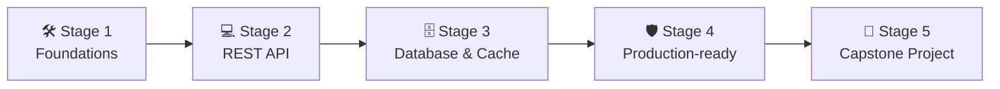

# 🧭 Backend Developer Career Roadmap

> **Tác giả:** Mr.Rom\
> **Phiên bản:** v2.0.0\
> **Tạo lúc:** 16/05/2026\
> **Cập nhật:** 26/05/2026\
> **Đối tượng:** Đã có kiến thức lập trình cơ bản (Python/Node/Java), muốn theo đuổi hướng phát triển hệ thống và API Backend\
> **Mức độ:** Junior → Mid (Sẵn sàng ứng tuyển và làm việc thực tế)

---

## 🧭 Tình huống — Bạn đang ở đâu?

Bạn muốn trở thành một Kỹ sư Backend — người đứng sau xây dựng hệ thống "ngầm" của các ứng dụng triệu người dùng. Nhưng khi bắt đầu tìm hiểu, bạn lập tức lạc vào cuộc tranh cãi không hồi kết: *"Nên dùng Node.js, Python, Go, Java hay C#?"*, *"Database nào tốt hơn: SQL hay NoSQL?"*, *"Làm sao để bảo vệ hệ thống trước hacker?"*... 

Sự thật là, ngôn ngữ lập trình hay cơ sở dữ liệu chỉ là công cụ (như cái búa, cái đục). **Mr.Rom muốn nhấn mạnh rằng: Tư duy cốt lõi của Backend Developer nằm ở cách bạn quản lý dữ liệu, tối ưu hóa hiệu năng, thiết kế API rõ ràng và đảm bảo tính ổn định của hệ thống.** Dù bạn dùng ngôn ngữ nào, những nguyên lý này đều không thay đổi.

👉 **Lộ trình Backend Developer này sẽ đồng hành cùng bạn đi qua 5 Stage phát triển kỹ năng thực chiến:**

- **Stage 1**: Thiết lập nền tảng hệ điều hành, công cụ quản lý code và giao thức mạng.
- **Stage 2**: Làm chủ một Framework Backend và thiết kế REST API chuẩn công nghiệp.
- **Stage 3**: Chinh phục thế giới Cơ sở dữ liệu và kỹ thuật Caching tăng tốc hệ thống.
- **Stage 4**: Đóng gói ứng dụng, viết bộ kiểm thử tự động và triển khai bảo mật (Authentication).
- **Stage 5**: Tự tay thiết kế và đưa vào vận hành một dự án Capstone hoàn chỉnh làm Portfolio.

---

## 🗺️ Tổng quan Lộ trình 5 Stage

| Stage | Kết quả đầu ra |
| --- | --- |
| **Stage 1: Nền tảng (Foundations)** | Làm quen dòng lệnh Linux, giao thức HTTP và Git workflow chuyên nghiệp |
| **Stage 2: Viết REST API** | Xây dựng được REST API CRUD chạy local, validate dữ liệu đầu vào |
| **Stage 3: Database & Cache** | Thiết kế CSDL quan hệ Postgres tốt, tích hợp Redis cache tăng tốc |
| **Stage 4: Sẵn sàng Production** | Tích hợp JWT Token bảo mật, viết unit test, đóng gói Docker và deploy |
| **Stage 5: Dự án Capstone** | 1 dự án Backend Portfolio hoàn chỉnh chạy live trên internet |

---

## 🛠️ Stage 1 — Nền tảng (Foundations)

> 🎯 *Trước khi bắt tay vào viết những dòng code API đầu tiên, bạn phải làm chủ môi trường làm việc của mình: hệ điều hành Linux, công cụ Git và cách các máy tính giao tiếp qua giao thức HTTP.*

### 📖 Câu chuyện dẫn dắt
*"Làm backend nghĩa là bạn sẽ thường xuyên làm việc với các máy chủ không có giao diện đồ họa. Mọi thao tác đều thông qua màn hình đen Terminal. Ngoài ra, bạn cần hiểu HTTP - ngôn ngữ chung của thế giới web. Nếu không biết HTTP status code là gì hay GET và POST khác nhau thế nào, bạn sẽ viết ra những API cực kỳ lộn xộn."*

### 📚 Các bài đọc bắt buộc (MUST-KNOW)
- [ ] [Làm quen môi trường Terminal](../../01_foundations/computing-environment/lessons/01_basic/00_what-is-terminal.md) ✅
- [ ] [Linux cơ bản (Thao tác file, phân quyền)](../../04_os/linux/) ✅ — Học cách sử dụng Terminal để điều hướng và quản lý file.
- [ ] [Luồng làm việc với Git chuyên nghiệp](../../02_tools/git/) ✅ — Nắm vững cách commit, phân nhánh (branch) và đẩy code lên GitHub.
- [ ] [Giao thức HTTP & HTTPS](../../05_networking/http-https/) 🚧 — Hiểu rõ Request/Response lifecycle, các HTTP methods và Status Code.
- [ ] [Thiết kế REST API chuẩn hóa](../../07_web/backend/rest-api/) 🚧 — Cách thiết kế URI sạch đẹp và cấu trúc dữ liệu JSON.

### 🛠️ Setup
- [ ] [VS Code và cấu hình extensions lập trình](../../02_tools/ide/vs-code.md) ✅
- [ ] [Cài đặt Git & SSH Key kết nối GitHub](../../02_tools/git/setup/git.md) ✅
- [ ] Cài đặt Postman hoặc Bruno để chuẩn bị kiểm thử gọi API.

### 🧪 Bài tập thực hành Stage 1
- Viết một script CLI đơn giản bằng Python/Node để đọc dữ liệu từ một file JSON, lọc kết quả theo điều kiện và in ra màn hình Terminal. Ghi nhận lịch sử code bằng Git và đẩy lên GitHub.

> 🌉 **Cầu nối sang Stage 2**:
> *"Khi đã hiểu cách máy tính giao tiếp qua giao thức HTTP và biết cách dùng Git quản lý code, bạn đã sẵn sàng học một Framework Backend thực thụ để biến các request HTTP thành các xử lý logic thực tế. Hãy cùng bước sang Stage 2!"*

---

## 💻 Stage 2 — Làm chủ Framework & Viết REST API

> 🎯 *Lựa chọn một ngôn ngữ Backend, học framework tương ứng và xây dựng các API xử lý logic cơ bản.*

### 📖 Câu chuyện dẫn dắt
Mỗi ngôn ngữ đều có các framework Backend nổi tiếng để gánh vác các phần việc lặp đi lặp lại như: phân tích đường dẫn (routing), chuyển đổi dữ liệu, tự động sinh tài liệu API. Mr.Rom đề xuất bạn bắt đầu bằng **Python & FastAPI** vì nó cực kỳ dễ học cho người mới, chạy bất đồng bộ (async) rất nhanh và tự động tạo trang tài liệu Swagger cực kỳ trực quan.

### 📚 Các bài học bắt buộc (MUST-KNOW)
- [ ] [Lập trình hướng đối tượng (OOP) & Async trong Python](../../03_languages/python/lessons/01_basic/03_functions.md) ✅ (bài Functions) + OOP 🚧.
- [ ] [FastAPI cơ bản](../../07_web/backend/python-fastapi/) 🚧 — Routing, Request Body, Path/Query parameters.
- [ ] **Validation dữ liệu:** Sử dụng Pydantic để validate và ép kiểu dữ liệu đầu vào, tránh lỗi runtime.
- [ ] **Error Handling:** Cách bắt ngoại lệ (Exception) và trả về thông báo lỗi nhất quán kèm HTTP Status Code phù hợp (ví dụ: 400 Bad Request, 404 Not Found).

### 🧪 Bài tập thực hành Stage 2
- Xây dựng API FastAPI quản lý kho sách trong bộ nhớ (In-memory storage): cho phép lấy danh sách sách, tìm sách theo ID, thêm sách mới, cập nhật thông tin và xóa sách. 
- Tự động hóa việc kiểm tra đầu vào (ví dụ: năm xuất bản sách không được lớn hơn năm hiện tại).

### 🎯 Project thực hành Stage 2
**Ứng dụng Todo API:** Viết toàn bộ API CRUD công việc, hỗ trợ lọc công việc theo trạng thái (chưa làm/đã làm) và tích hợp trang tài liệu Swagger tự động.

> 🌉 **Cầu nối sang Stage 3**:
> *"Ứng dụng API của bạn chạy rất mượt, nhưng có một vấn đề nghiêm trọng: mỗi lần bạn khởi động lại server FastAPI, toàn bộ công việc hay sách bạn vừa thêm đều biến mất sạch sẽ do chúng chỉ được lưu tạm thời trên RAM (In-memory). Làm thế nào để lưu trữ dữ liệu vĩnh viễn và truy xuất chúng với tốc độ cao? Hãy bước sang Stage 3!"*

---

## 🗄️ Stage 3 — Cơ sở dữ liệu & Caching

> 🎯 *Thiết kế cơ sở dữ liệu quan hệ tối ưu, viết truy vấn SQL thành thạo và áp dụng Redis Cache để tăng hiệu năng.*

### 📖 Câu chuyện dẫn dắt
*"Cơ sở dữ liệu chính là trái tim của mọi ứng dụng backend. Viết code API tệ có thể sửa nhanh, nhưng thiết kế cơ sở dữ liệu lỗi ngay từ đầu sẽ kéo theo hệ quả thảm khốc khi ứng dụng phình to. Bạn cần học cách phân tích nghiệp vụ để thiết kế các bảng dữ liệu chuẩn hóa, sử dụng Index để tăng tốc độ tìm kiếm và dùng Redis để lưu đệm các dữ liệu ít thay đổi nhằm giảm tải cho Database chính."*

### 📚 Các bài học bắt buộc (MUST-KNOW)
- [ ] [Nền tảng SQL & Truy vấn dữ liệu](../../06_databases/sql-fundamentals/) 🚧 — Các lệnh SELECT, JOIN, GROUP BY, tạo Index.
- [ ] [Database Design (Thiết kế CSDL)](../../06_databases/database-design/) 🚧 — Thiết kế sơ đồ quan hệ thực thể (ERD), chuẩn hóa dữ liệu (1NF, 2NF, 3NF).
- [ ] [PostgreSQL](../../06_databases/postgresql/) 🚧 — CSDL quan hệ mạnh mẽ, phổ biến nhất trong thực tế.
- [ ] **ORM & Migration:** Sử dụng SQLAlchemy để map đối tượng Python vào DB và Alembic để quản lý các phiên bản thay đổi cấu trúc bảng (Migration).
- [ ] [Redis cơ bản](../../06_databases/redis/) 🚧 — Sử dụng cơ chế Key-Value trong bộ nhớ RAM để làm Cache với thời gian sống (TTL).

### 🛠️ Setup thêm
- [ ] Cài đặt PostgreSQL và Redis trên máy cá nhân (hoặc chạy qua Docker).
- [ ] Sử dụng các phần mềm quản lý trực quan như DBeaver hoặc TablePlus để trực quan hóa cơ sở dữ liệu.

### 🧪 Bài tập thực hành Stage 3
- Thiết kế sơ đồ ERD cho một trang Blog (Bảng Users, Bảng Posts, Bảng Comments có liên kết khóa ngoại).
- Viết script Alembic để tạo các bảng này trên PostgreSQL.
- Viết API lấy chi tiết bài viết Blog: Nếu bài viết đã có trong Redis Cache → trả về ngay lập tức (Cache Hit). Nếu chưa có → truy vấn Postgres → lưu vào Redis với TTL 60s → trả về cho người dùng (Cache Miss).

### 🎯 Project thực hành Stage 3
**REST API Blog Engine:** Kết nối Postgres + Redis Cache cho các bài viết hot, tích hợp ORM SQLAlchemy.

> 🌉 **Cầu nối sang Stage 4**:
> *"Ứng dụng Blog của bạn bây giờ đã có 'trí nhớ vĩnh viễn' cực kỳ bền bỉ và tốc độ nhanh. Tuy nhiên, nó vẫn đang chạy dưới local và bất kỳ ai cũng có thể vào xóa bài viết của người khác vì bạn chưa thiết lập phân quyền người dùng. Làm sao để bảo mật ứng dụng, viết test để đảm bảo code không lỗi khi sửa đổi, và đưa nó lên internet? Hãy bước sang Stage 4!"*

---

## 🛡️ Stage 4 — Sẵn sàng cho Production

> 🎯 *Tích hợp cơ chế xác thực JWT, viết các bộ kiểm thử tự động, đóng gói ứng dụng bằng Docker và triển khai CI/CD deploy lên cloud.*

### 📖 Câu chuyện dẫn dắt
Đưa một ứng dụng lên môi trường production đòi hỏi những tiêu chuẩn cực kỳ khắt khe. Bạn phải đảm bảo dữ liệu người dùng được bảo vệ thông qua mã hóa mật khẩu và JWT Token. Bạn cũng không thể tự tin bấm deploy nếu chưa viết các bộ kiểm thử chạy tự động để chứng minh code của mình không làm hỏng tính năng cũ. Và cuối cùng, Docker sẽ giúp ứng dụng của bạn chạy nhất quán trên mọi môi trường từ máy cá nhân cho đến server cloud.

### 📚 Các bài học bắt buộc (MUST-KNOW)
- [ ] [Xác thực người dùng (Authentication - JWT)](../../12_security/authentication/) 🚧 — Cơ chế Hash mật khẩu (bcrypt), cấp và xác thực JSON Web Token (JWT).
- [ ] [Phân quyền (Authorization - RBAC)](../../12_security/authorization/) 🚧 — Phân quyền theo vai trò (User, Editor, Admin).
- [ ] [Viết Unit Test & Integration Test](../../03_languages/python/) 🚧 — Sử dụng thư viện `pytest` để kiểm thử logic và API endpoints.
- [ ] [Docker & Đóng gói Container](../../10_devops/docker/) ✅ — Viết Dockerfile, quản lý multi-container bằng Docker Compose.
- [ ] [Tự động hóa CI/CD cơ bản](../../10_devops/ci-cd/) 🚧 — Viết workflow GitHub Actions tự động chạy test khi push code.

### 🧪 Bài tập thực hành Stage 4
- Thêm API Đăng ký / Đăng nhập vào dự án Blog API của Stage 3. Mã hóa mật khẩu khi lưu vào DB.
- Viết bộ test kiểm tra: Một user không thể sửa hoặc xóa comment của user khác.
- Viết `Dockerfile` để đóng gói app FastAPI, và viết file `docker-compose.yml` để chạy chung app với Postgres và Redis chỉ bằng một câu lệnh `docker compose up`.

### 🎯 Project thực hành Stage 4
**Blog API v2 Production-Ready:** Đầy đủ Auth JWT, test coverage > 70%, chạy hoàn toàn trên Docker Compose, tích hợp GitHub Actions CI và deploy lên cloud (Railway/Render).

> 🌉 **Cầu nối sang Stage 5**:
> *"Chúc mừng bạn! Bạn đã nắm giữ toàn bộ kỹ năng cốt lõi của một Kỹ sư Backend thực thụ. Bước cuối cùng để chứng minh năng lực của bạn với nhà tuyển dụng là thiết kế một dự án Capstone mang dấu ấn cá nhân từ con số 0. Hãy tiến vào Stage 5!"*

---

## 🚀 Stage 5 — Dự án Capstone độc lập

> 🎯 *Tự thiết kế, lập trình và đưa vào vận hành một hệ thống Backend hoàn chỉnh thực tế để ghi điểm tuyệt đối trong mắt nhà tuyển dụng.*

### 📚 Chọn 1 ý tưởng dự án thực chiến:
- **Hệ thống rút gọn liên kết (Kiểu Bit.ly):** Chuyển link dài thành link ngắn, tracking số lượt click, phân tích trình duyệt/hệ điều hành của người dùng, sử dụng Redis để redirect cực nhanh.
- **Hệ thống đặt lịch (Booking System):** Cho phép đặt lịch hẹn theo khung giờ, xử lý bài toán trùng lịch (concurrency handling) khi có nhiều người cùng đặt một slot giờ tại một thời điểm.
- **Trang tuyển dụng (Job Board):** Đăng tuyển, lọc hồ sơ, tìm kiếm công việc theo từ khóa và địa điểm (Full-text search), gửi thông báo email tự động khi có job mới.

### 🛠️ Tiêu chuẩn kỹ thuật bắt buộc của dự án Capstone:
- [ ] **README chuẩn chỉnh:** Mô tả dự án, sơ đồ thiết kế Database (ERD), sơ đồ kiến trúc hệ thống (Mermaid), hướng dẫn cài đặt và chạy local bằng Docker.
- [ ] **Git History sạch đẹp:** Tối thiểu 20 commits tuân theo chuẩn Conventional Commits.
- [ ] **Tài liệu API đầy đủ:** Các API đều được viết docstring mô tả tham số rõ ràng.
- [ ] **Chất lượng code:** Tích hợp Linter/Formatter (Ruff) để code sạch đẹp. Có unit test đạt độ phủ coverage > 70%.

---

## 🧭 Định hướng thăng tiến tiếp theo

Sau khi hoàn thành lộ trình Backend cốt lõi, bạn có thể rẽ nhánh sang các hướng chuyên sâu:

| Lĩnh vực | Vai trò | Lộ trình liên quan |
|---|---|---|
| **Vận hành & Tự động hóa hạ tầng** | Thiết kế hệ thống CI/CD lớn, quản lý hạ tầng đám mây | [`devops-engineer`](./devops-engineer_career-roadmap.md) |
| **Độ tin cậy & Giám sát hệ thống** | Đảm bảo hệ thống hoạt động 99.99%, debug lỗi phân tán | [`sre-engineer`](./sre-engineer_career-roadmap.md) |
| **Kỹ sư Toàn diện (Full-stack)** | Học thêm HTML/CSS/React để tự mình làm giao diện | [`fullstack-developer`](./fullstack-developer_career-roadmap.md) ✅ |

---

## 🔄 Hướng dẫn điều chỉnh lộ trình

- **Gặp khó khăn ở phần thiết kế Database (Stage 3):** Hãy làm chậm lại, thực hành thêm các bài tập SQL Join và thiết kế cơ sở dữ liệu từ thực tế (như thiết kế DB cho một app chat, một app e-commerce đơn giản).
- **Học ngôn ngữ khác Python:** Nếu trường học hoặc mục tiêu công ty của bạn yêu cầu Node.js hay Go, hãy thay thế FastAPI bằng Express (Node.js) hoặc Gin (Go) ở Stage 2. Các Stage còn lại về Database, Docker, Auth và Deploy đều hoàn toàn tương tự.

---

## 📌 Nhật ký thay đổi (Changelog)

- **v2.0.0 (26/05/2026)** — **Nâng cấp thành Narrative Master**:
  - Viết lại toàn bộ nội dung sang văn phong kể chuyện định hướng giàu tính thực tiễn.
  - Thiết lập các câu bắc cầu logic kết nối mượt mà giữa các Stage.
  - Cập nhật đồng bộ các liên kết Git sang thư mục `02_tools/git/` ✅.
  - Bổ sung chỉ dẫn chi tiết về cấu trúc Docker Compose kết nối Postgres + Redis.
- **v1.0.0 (16/05/2026)** — Khởi tạo cấu trúc lộ trình Backend cơ bản.
