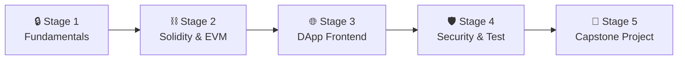

# 🧭 Blockchain Developer Career Roadmap

> **Tác giả:** Mr.Rom\
> **Phiên bản:** v2.0.0\
> **Tạo lúc:** 16/05/2026\
> **Cập nhật:** 26/05/2026\
> **Đối tượng:** Đã biết lập trình cơ bản, muốn chuyên sâu vào công nghệ Web3, mật mã học và phát triển hợp đồng thông minh (Smart Contract)\
> **Mức độ:** Junior → Mid (Sẵn sàng ứng tuyển hoặc làm việc trong các dự án DeFi/Web3)

---

## 🧭 Tình huống — Bạn đang ở đâu?

Bạn muốn trở thành một Blockchain Developer — người xây dựng các ứng dụng phi tập trung (dApps) định hình lại thế giới tài chính và quyền sở hữu số. Nhưng bạn băn khoăn: *"Nên bắt đầu bằng Ethereum (Solidity) hay Solana (Rust)?"*, *"Tại sao một lỗi lập trình nhỏ trên blockchain lại có thể làm bốc hơi hàng triệu đô la của người dùng chỉ trong vài giây?"*, *"Làm thế nào để kết nối ví cá nhân (như MetaMask) với giao diện web?"*.

Lập trình Blockchain là một thế giới cực kỳ khắc nghiệt. Khác với web thông thường có thể dễ dàng vá lỗi (hotfix), smart contract sau khi deploy lên Blockchain sẽ nằm ở đó vĩnh viễn và không thể sửa đổi (Immutable). **Mr.Rom muốn bạn ghi khắc tư duy này: Lập trình Blockchain không chỉ là viết mã chạy được, mà là viết mã tuyệt đối an toàn. Bất kỳ một sơ hở nhỏ nào cũng sẽ bị hacker khai thác để rút sạch tiền trong hợp đồng mà không có cơ chế rollback (hoàn tác).**

👉 **Lộ trình Blockchain Developer này được chia thành 5 Stage nghiêm cẩn:**

- **Stage 1**: Thấu suốt nền tảng Mật mã học (Cryptography) và cơ chế vận hành của Sổ cái phi tập trung.
- **Stage 2**: Làm chủ ngôn ngữ Solidity và máy ảo Ethereum Virtual Machine (EVM).
- **Stage 3**: Xây dựng giao diện ứng dụng phi tập trung (DApp Frontend) kết nối với ví Web3.
- **Stage 4**: Kiểm thử bảo mật chuyên sâu (Foundry Testing) và rà soát lỗ hổng hợp đồng (Smart Contract Security).
- **Stage 5**: Hoàn thành dự án Capstone (DEX, NFT Marketplace hoặc DAO) deploy lên mạng Testnet/Mainnet.

---

## 🗺️ Sơ đồ Lộ trình 5 Stage

| Stage | Kết quả đầu ra |
| --- | --- |
| **Stage 1: Nền tảng Blockchain** | Hiểu cơ chế mã hóa bất đối xứng, cách gửi giao dịch mạng Sepolia |
| **Stage 2: Solidity & EVM** | Viết và biên dịch được smart contract chuẩn ERC-20, ERC-721 |
| **Stage 3: DApp Frontend** | Tạo giao diện kết nối ví MetaMask, đọc/ghi dữ liệu lên blockchain |
| **Stage 4: Bảo mật & Kiểm thử** | Viết Fuzz test bằng Foundry, quét lỗi contract bằng Slither |
| **Stage 5: Dự án Capstone** | 1 dự án DApp hoàn chỉnh chạy live trên mạng testnet |

---

## 🔒 Stage 1 — Blockchain Fundamentals

> 🎯 *Hiểu sâu về mật mã học và kiến trúc sổ cái trước khi viết dòng code đầu tiên.*

### 📖 Câu chuyện dẫn dắt
*"Trước khi code, bạn phải hiểu tại sao blockchain lại được coi là không thể hack. Hãy tìm hiểu cách mã hóa bất đối xứng (khóa công khai/khóa bí mật) bảo vệ tài sản của bạn, cách cơ chế đồng thuận (Proof of Work vs Proof of Stake) giữ cho hàng ngàn máy chủ đồng bộ dữ liệu, và cách EVM (máy ảo Ethereum) thực thi mã nguồn."*

### 📚 Các bài đọc bắt buộc (MUST-KNOW)
- [ ] [Cryptography cơ bản (Hashing, Digital Signatures)](../../12_security/cryptography/) 🚧.
- **Whitepapers:** Đọc bản tóm tắt ý tưởng thiết kế của Bitcoin (Satoshi Nakamoto) và Ethereum (Vitalik Buterin).
- **Consensus & EVM:** Cơ chế đồng thuận PoW/PoS, khái niệm Block (khối), Gas (phí giao dịch), Address (địa chỉ ví).
- **Data Structure:** Merkle Tree (cấu trúc dữ liệu xác thực giao dịch).

### 🛠️ Setup ban đầu
- Cài đặt ví MetaMask làm extension trình duyệt Chrome.
- Truy cập các vòi nước (Faucets) để nhận token ETH testnet Sepolia miễn phí chuẩn bị thực hành.

### 🎯 Project thực hành Stage 1
**Web3 Explorer:** Thực hiện chuyển nhận ETH testnet giữa 2 ví MetaMask, sau đó dùng trang Etherscan để đọc và giải thích các trường dữ liệu của giao dịch vừa gửi (Gas Used, Block Number, Transaction Hash).

>  puente **Cầu nối sang Stage 2**:
> *"Khi đã thấu suốt cách hoạt động của mật mã học và sổ cái phi tập trung EVM, bạn đã sẵn sàng bắt tay vào viết những dòng code hợp đồng thông minh thực sự. Hãy cùng chuyển sang Stage 2 để học ngôn ngữ Solidity!"*

---

## ⛓️ Stage 2 — Ngôn ngữ Solidity & EVM

> 🎯 *Làm chủ ngôn ngữ lập trình hợp đồng thông minh Solidity và bộ công cụ Foundry.*

### 📖 Câu chuyện dẫn dắt
Solidity là ngôn ngữ viết Smart Contract phổ biến nhất trên thế giới. Viết Solidity yêu cầu tư duy tối ưu hóa cao độ vì mỗi dòng code bạn viết đều tiêu tốn tiền (phí gas) của người dùng khi chạy. Bạn cần hiểu cách EVM quản lý bộ nhớ (Storage vs Memory vs Calldata) và cách kế thừa các thư viện chuẩn đã được kiểm chứng của OpenZeppelin.

### 📚 Các bài đọc bắt buộc (MUST-KNOW)
- [ ] [Solidity & Blockchain Development](../../15_specialized/blockchain/) 🚧 — Khai báo biến, Modifiers, Events, Fallback/Receive functions.
- **Smart Contract Standards:** Chuẩn token ERC-20 (Custom Token) và ERC-721 (NFT).
- **Memory Management:** Phân biệt Storage (ghi vĩnh viễn vào blockchain - rất đắt), Memory (bộ nhớ tạm - rẻ) và Calldata (bộ nhớ chỉ đọc - rẻ nhất).
- **Battle-tested Libraries:** Cách sử dụng thư viện OpenZeppelin để viết token an toàn.

### 🛠️ Setup công cụ
- Cài đặt **Foundry** — Bộ công cụ phát triển smart contract bằng ngôn ngữ Solidity hiện đại, chạy nhanh gấp 10 lần Hardhat cũ.
- Sử dụng Remix Online IDE cho việc học cú pháp nhanh.

### 🧪 Bài tập thực hành
- Viết Smart Contract tạo ra đồng coin ERC-20 của riêng bạn.
- Viết Smart Contract mint NFT chuẩn ERC-721 lưu trữ ảnh metadata.
- Viết hợp đồng ví đa chữ ký (Multi-signature Wallet) yêu cầu tối thiểu 2/3 chữ ký đồng ý để rút tiền.

### 🎯 Project thực hành Stage 2
**Voting Smart Contract:** Hợp đồng quản lý bỏ phiếu. Cho phép Admin tạo đề xuất, cấp quyền bỏ phiếu cho các địa chỉ ví, ghi nhận lượt bỏ phiếu và tự động thống kê kết quả khi hết thời gian.

>  puente **Cầu nối sang Stage 3**:
> *"Hợp đồng thông minh của bạn đã được biên dịch và chạy thử thành công trên các testnet. Nhưng làm thế nào để người dùng phổ thông tương tác được với nó mà không cần mở console gõ code? Hãy bước sang Stage 3 để xây dựng giao diện DApp Frontend!"*

---

## 🌐 Stage 3 — Phát triển DApp Frontend

> 🎯 *Kết nối giao diện Web với Smart Contract thông qua thư viện Viem và các hooks của wagmi.*

### 📖 Câu chuyện dẫn dắt
*"Một ứng dụng DApp (Decentralized Application) là sự kết hợp giữa Frontend React truyền thống và mạng lưới Blockchain. Bạn không dùng database để lưu dữ liệu người dùng đăng nhập; thay vào đó, người dùng sẽ kết nối (Connect Wallet) qua MetaMask. Hệ thống sẽ đọc dữ liệu từ blockchain để hiển thị lên UI và gửi các giao dịch (Transactions) yêu cầu người dùng ký xác nhận bằng ví của họ."*

### 📚 Các bài đọc bắt buộc (MUST-KNOW)
- [ ] [Web3 Architecture & Frontend Integration](../../15_specialized/blockchain/) 🚧 —RPC Nodes, Providers và Signers.
- **Viem (Viem.sh):** Thư viện JavaScript tối giản, hiệu năng cao để tương tác với EVM (thay thế cho Ethers.js cũ).
- **Wagmi & RainbowKit:** Các React hooks giúp quản lý kết nối ví, hiển thị nút "Connect Wallet" chuyên nghiệp và xử lý trạng thái mạng (Ethereum, Polygon, Arbitrum).

### 🎯 Project thực hành Stage 3
**DApp Voting Portal:** Dựng giao diện React kết nối ví MetaMask (sử dụng RainbowKit) kết nối trực tiếp với Voting Contract ở Stage 2. Cho phép người dùng xem danh sách đề xuất, ấn nút "Vote" để gọi transaction ký trên MetaMask và cập nhật kết quả realtime từ blockchain.

>  puente **Cầu nối sang Stage 4**:
> *"Bạn đã có một DApp hoàn chỉnh kết nối ví MetaMask mượt mà. Tuy nhiên, trong thế giới Web3, đưa một contract chưa được kiểm thử bảo mật lên mainnet giống như bạn mang một két sắt không khóa để giữa chợ. Làm sao để phát hiện và ngăn chặn các lỗ hổng hack kinh điển? Hãy chuyển sang Stage 4: Smart Contract Security & Foundry Testing!"*

---

## 🛡️ Stage 4 — Bảo mật & Kiểm thử Smart Contract

> 🎯 *Tìm và diệt các lỗ hổng bảo mật kinh điển, viết Unit Test bao phủ 90%+ và chạy quét lỗi tĩnh.*

### 📖 Câu chuyện dẫn dắt
Lịch sử Web3 đã chứng kiến những vụ hack hàng trăm triệu đô chỉ vì lỗi thiết kế logic (như vụ hack The DAO nổi tiếng). Là Blockchain Developer, bạn phải học cách suy nghĩ như một hacker để tự tìm ra các lỗ hổng Reentrancy (tấn công gọi lại liên tục), Access Control (thiếu phân quyền), hay Front-running (chặn giao dịch). Viết test tự động và chạy các công cụ quét lỗi tĩnh là bắt buộc trước khi đưa code lên mainnet.

### 📚 Các bài đọc bắt buộc (MUST-KNOW)
- **Vulnerabilities Case Studies:** Phân tích kỹ thuật các vụ hack kinh điển (The DAO Hack, Parity Multi-sig Hack).
- **Foundry Testing:** Viết Unit Test và Integration Test trực tiếp bằng ngôn ngữ Solidity.
- **Fuzz Testing:** Thiết lập các bài test với hàng ngàn input ngẫu nhiên do Foundry tự động sinh ra để tìm các trường hợp biên gây lỗi (Edge cases).
- **Static Analysis Tools:** Cách cài đặt và sử dụng công cụ quét lỗi tĩnh **Slither** để tự động phát hiện các đoạn code nguy hiểm.

### 🧪 Bài tập thực hành
- Viết bộ test Foundry đạt tỷ lệ bao phủ code (test coverage) > 90% cho hợp đồng Voting ở Stage 2.
- Giả lập một Smart Contract bị lỗi Reentrancy, viết một Hacker Contract để thực hiện cuộc tấn công rút sạch tiền thử nghiệm, sau đó sửa code contract gốc để chặn đứng cuộc tấn công.

### 🎯 Project thực hành Stage 4
**Smart Contract Audit Report:** Viết báo cáo đánh giá bảo mật (Audit Report) cho hợp đồng thông minh của bạn. Chỉ ra các phát hiện lỗi (Findings), phân loại mức độ nghiêm trọng (High, Medium, Low) và đề xuất cách khắc phục chi tiết.

>  puente **Cầu nối sang Stage 5**:
> *"Hợp đồng của bạn giờ đây đã được rà quét bảo mật nghiêm ngặt và vượt qua các bài test fuzzing khắc nghiệt. Giờ là lúc ghép nối tất cả lại: viết smart contract tối ưu, kết nối frontend, deploy lên mạng testnet và mainnet thực tế để tạo dựng dự án Capstone hoàn chỉnh. Hãy tiến vào Stage 5!"*

---

## 🚀 Stage 5 — Dự án Capstone Web3

> 🎯 *Tự thiết kế, phát triển, kiểm thử bảo mật và deploy một DApp hoàn chỉnh lên mạng Testnet.*

### 🚀 Ý tưởng dự án Capstone tốt nghiệp (Chọn 1):
- **NFT Marketplace (Chợ NFT phi tập trung):** Cho phép người dùng mint NFT, đăng bán, đặt giá thầu (Bid), mua trực tiếp, tự động chia tỷ lệ hoa hồng (Royalty) cho tác giả gốc và lưu trữ file ảnh phi tập trung trên IPFS (sử dụng Pinata).
- **Decentralized Exchange (DEX - Sàn giao dịch phi tập trung):** Xây dựng một sàn giao dịch AMM đơn giản (như Uniswap v2) cho phép người dùng nạp thanh khoản vào bể (Liquidity Pool), swap giữa 2 token theo công thức $x \times y = k$ và nhận phí giao dịch.

### 🛠️ Tiêu chuẩn kỹ thuật bắt buộc của dự án Capstone:
- [ ] **Smart Contract:** Viết bằng Solidity, test coverage bằng Foundry đạt > 90% (có unit test + fuzz test).
- [ ] **Security:** Pass 100% rà quét của công cụ Slither không còn lỗi High/Medium.
- [ ] **Frontend:** React + Tailwind CSS + Viem + RainbowKit.
- [ ] **Deployment:** Deploy thành công lên Sepolia Testnet, có link verified code trên Etherscan.

---

## 🧭 Lộ trình phát triển sự nghiệp tiếp theo

Cơ hội phát triển Web3 rất rộng mở:

| Lĩnh vực | Vai trò | Lộ trình liên quan |
|---|---|---|
| **Chuyên gia kiểm toán Web3** | Săn lỗi bảo mật, đánh giá an toàn cho các giao thức lớn | Smart Contract Auditor (Thu nhập cực cao) |
| **Kỹ sư lõi giao thức (DeFi)** | Thiết kế kiến trúc Layer 2, cầu nối xuyên chuỗi (Bridges) | Protocol Developer |
| **Học hệ sinh thái Solana** | Học ngôn ngữ Rust và framework Anchor để phát triển trên Solana | Solana Developer |

---

## 🔄 Hướng dẫn điều chỉnh lộ trình

- **Nếu chu kỳ thị trường đi xuống (Bear Market):** Số lượng công việc Web3 có thể giảm. Đừng nản lòng, đây chính là thời điểm vàng để tập trung build các dự án cá nhân thực sự chất lượng, đóng góp code cho các thư viện Web3 nguồn mở để nâng cao profile GitHub.
- **Bảo mật cá nhân:** Là Blockchain Dev, hãy luôn sử dụng một ví MetaMask riêng biệt dành cho việc test, tuyệt đối không dùng chung ví chứa tài sản thực tế và không bao giờ push file chứa Private Key lên GitHub.

---

## 📌 Nhật ký thay đổi (Changelog)

- **v2.0.0 (26/05/2026)** — **Nâng cấp thành Narrative Master**:
  - Viết lại toàn bộ nội dung sang văn phong kể chuyện định hướng có chiều sâu và liên kết chặt chẽ.
  - Thiết lập các câu bắc cầu logic kết nối mượt mà giữa các Stage.
  - Cập nhật liên kết Git chính xác sang thư mục `02_tools/git/` ✅.
  - Bổ sung định hướng chi tiết về kiểm thử Foundry, Fuzzing và công cụ quét lỗi Slither.
- **v1.0.0 (16/05/2026)** — Khởi tạo cấu trúc lộ trình Blockchain Developer cơ bản.
