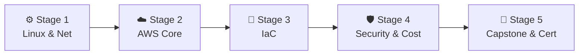

# 🧭 Cloud Engineer Career Roadmap

> **Tác giả:** Mr.Rom\
> **Phiên bản:** v2.0.0\
> **Tạo lúc:** 16/05/2026\
> **Cập nhật:** 26/05/2026\
> **Đối tượng:** Đã có kiến thức cơ bản về Linux và Mạng máy tính, muốn trở thành kỹ sư thiết kế kiến trúc hạ tầng đám mây chuyên nghiệp\
> **Mức độ:** Junior → Mid (Sẵn sàng ứng tuyển và làm việc thực tế)

---

## 🧭 Tình huống — Bạn đang ở đâu?

Bạn muốn trở thành một Cloud Engineer — người kiến tạo và quản lý toàn bộ hệ thống hạ tầng trên mây của các doanh nghiệp lớn. Nhưng bạn băn khoăn: *"Nên học AWS, Google Cloud hay Microsoft Azure?"*, *"Làm sao để thiết kế hệ thống có khả năng chịu lỗi cao (High Availability) trên cloud?"*, *"Làm thế nào để tránh nguy cơ phá sản vì một hóa đơn AWS tăng vọt hàng ngàn đô chỉ sau một đêm?"*.

Nhiều người lầm tưởng làm Cloud chỉ đơn giản là lên giao diện web và click chuột tạo vài máy ảo VPS. **Mr.Rom muốn nhấn mạnh rằng: Điện toán đám mây là một ngành nghệ thuật thiết kế hệ thống phân tán. Kỹ năng cốt lõi của bạn là làm chủ mạng ảo (VPC, Subnets, Routing), bảo mật đa lớp (IAM, Security Groups, NACLs), quản lý và tối ưu hóa chi phí (Cost Management) và định nghĩa toàn bộ hạ tầng bằng code (Infrastructure as Code).**

👉 **Lộ trình Cloud Engineer này được thiết kế theo 5 Stage cực kỳ logic:**

- **Stage 1**: Xây dựng nền tảng vững chắc về hệ điều hành Linux và mạng máy tính (CIDR, Subnetting).
- **Stage 2**: Làm chủ các dịch vụ cốt lõi của Amazon Web Services (AWS) — đám mây phổ biến nhất.
- **Stage 3**: Tự động hóa việc tạo hạ tầng thông qua Infrastructure as Code (Terraform).
- **Stage 4**: Bảo mật nâng cao hạ tầng Cloud và tối ưu hóa chi phí vận hành (FinOps).
- **Stage 5**: Hoàn thành dự án Capstone kiến trúc 3 lớp (3-tier) và thi chứng chỉ AWS SAA.

---

## 🗺️ Tổng quan Lộ trình 5 Stage

| Stage | Kết quả đầu ra |
| --- | --- |
| **Stage 1: Linux & Mạng máy tính** | Nắm vững mô hình OSI, cách chia Subnet, CIDR và định tuyến IP |
| **Stage 2: AWS Core Services** | Thiết kế hệ thống mạng VPC, EC2, S3, RDS chạy thực tế trên AWS |
| **Stage 3: Infrastructure as Code** | Khai tử việc click chuột, định nghĩa toàn bộ hạ tầng AWS bằng Terraform |
| **Stage 4: Bảo mật & Chi phí** | Hardening IAM, cấu hình mã hóa KMS và tối ưu hóa chi phí AWS |
| **Stage 5: Capstone & Chứng chỉ** | Dựng kiến trúc 3-tier tự động co giãn và thi đỗ chứng chỉ AWS SAA |

---

## ⚙️ Stage 1 — Linux & Mạng máy tính

> 🎯 *Mạng máy tính là linh hồn của đám mây. Bạn không thể thiết kế mạng ảo VPC nếu không hiểu Subnetting và CIDR.*

### 📖 Câu chuyện dẫn dắt
*"Đám mây bản chất là một tập hợp các trung tâm dữ liệu khổng lồ do các ông lớn vận hành. Khi bạn tạo một VPC (Virtual Private Cloud) trên mây, bạn đang phân chia một vùng mạng ảo. Nếu bạn không hiểu cơ chế định tuyến (Routing Tables), không biết tính toán dải IP bằng ký pháp CIDR (ví dụ /24 vs /16), hay không biết cách hoạt động của DNS và NAT Gateway, bạn sẽ liên tục gặp lỗi ứng dụng không thể kết nối internet hoặc không thể kết nối database."*

### 📚 Các bài đọc bắt buộc (MUST-KNOW)
- [ ] [Linux cơ bản cho kỹ sư đám mây](../../04_os/linux/) ✅ — Thao tác dòng lệnh, cấu hình mạng cơ bản.
- [ ] [Mạng máy tính cốt lõi](../../05_networking/) 🚧 — Mô hình OSI, giao thức TCP/IP, cách phân giải DNS, giao thức HTTP/HTTPS và SSL/TLS.
- **CIDR Notation & Subnetting:** Cách phân chia dải IP, phân biệt Subnet Public (có kết nối internet) và Subnet Private (cô lập an toàn).
- **Load Balancing & Firewalls:** Khái niệm cân bằng tải và tường lửa lọc traffic.

> 🌉 **Cầu nối sang Stage 2**:
> *"Khi đã thâu suốt cách chia subnetting, định tuyến IP và cấu hình tường lửa dưới local, bạn đã sẵn sàng bước vào thế giới đám mây thực tế. Hãy cùng chuyển sang Stage 2 để làm chủ các dịch vụ cốt lõi của Amazon Web Services (AWS)!"*

---

## ☁️ Stage 2 — Làm chủ dịch vụ cốt lõi AWS

> 🎯 *Master một nhà cung cấp đám mây phổ biến nhất thế giới trước khi chuyển sang mô hình Multi-cloud.*

### 📖 Câu chuyện dẫn dắt
AWS chiếm thị phần lớn nhất thế giới và là tiêu chuẩn tuyển dụng của hầu hết các doanh nghiệp. Chúng ta sẽ bắt đầu bằng việc tạo tài khoản AWS và học cách sử dụng các khối gạch hạ tầng cốt lõi: từ máy chủ EC2, ổ cứng EBS, kho lưu trữ S3 cho đến hệ quản trị cơ sở dữ liệu RDS.

### 📚 Các bài đọc bắt buộc (MUST-KNOW)
- [ ] [AWS Account & Billing Alert](../../11_cloud/aws/) 🚧 — Cấu hình cảnh báo chi phí để tránh bất ngờ cuối tháng.
- **AWS IAM (Identity and Access Management):** Quản lý người dùng, nhóm, vai trò (Roles) và các chính sách phân quyền (Policies) chi tiết.
- **AWS VPC:** Tự tay thiết kế VPC gồm Public Subnets (chứa Load Balancer), Private Subnets (chứa Application EC2), Isolated Subnets (chứa Database RDS) và NAT Gateways.
- **Compute & Storage:** EC2 (máy chủ ảo), Auto Scaling Groups (tự động co giãn số lượng máy chủ), S3 (lưu trữ đối tượng), RDS (cơ sở dữ liệu managed).
- **DNS & CDN:** Route 53 (quản lý DNS tên miền), CloudFront (mạng phân phối nội dung CDN).

### 🛠️ Setup công cụ
- Tạo tài khoản AWS (sử dụng gói Free Tier.
- **MANDATORY:** Thiết lập ngay **AWS Budget Alert** cảnh báo khi chi phí vượt quá $5.
- Cài đặt AWS CLI trên máy tính cá nhân để ra lệnh cho AWS qua terminal.

### 🎯 Project thực hành Stage 2
**High Availability Static Web:** Lưu trữ trang web tĩnh trên S3, phân phối qua CDN CloudFront, cấu hình chứng chỉ bảo mật HTTPS (ACM) và trỏ tên miền bằng Route 53.

> 🌉 **Cầu nối sang Stage 3**:
> *"Bạn đã biết cách thiết kế và chạy một hệ thống hoàn chỉnh trên console AWS. Nhưng việc đi click chuột từng nút trên giao diện web để tạo tài nguyên rất dễ xảy ra sai sót và không thể tái tạo lại ở các môi trường khác. Làm thế nào để định nghĩa toàn bộ hạ tầng bằng code? Hãy chuyển sang Stage 3: Infrastructure as Code!"*

---

## 📜 Stage 3 — Hạ tầng dưới dạng Code (IaC)

> 🎯 *Khai tử hoàn toàn việc click chuột thủ công trên Web Console. Định nghĩa 100% tài nguyên đám mây bằng mã nguồn.*

### 📖 Câu chuyện dẫn dắt
*"Một kỹ sư Cloud chuyên nghiệp sẽ quản lý hạ tầng giống như cách Dev quản lý code. Thay vì mất 2 tiếng click console để tạo VPC và database, bạn viết một file cấu hình Terraform. Chỉ với lệnh `terraform apply`, toàn bộ hạ tầng phức tạp sẽ được dựng lên hoàn hảo chỉ trong 3 phút, nhất quán trên cả môi trường Dev, Staging và Production."*

### 📚 Các bài đọc bắt buộc (MUST-KNOW)
- [ ] [Terraform & IaC Fundamentals](../../10_devops/iac/) 🚧 — Cú pháp ngôn ngữ HCL (HashiCorp Configuration Language).
- **State Management:** Cách quản lý file trạng thái (State File) an toàn trên S3 Backend và khóa trạng thái bằng DynamoDB để tránh xung đột khi làm việc nhóm.
- **Terraform Modules:** Thiết kế các module hạ tầng có thể tái sử dụng (ví dụ: Module tạo VPC chuẩn, Module tạo EC2 chuẩn).

### 🎯 Project thực hành Stage 3
**Terraform Refactoring:** Viết code Terraform để định nghĩa và khởi tạo lại toàn bộ dự án ở Stage 2 (VPC + EC2 + RDS). Thực hiện `terraform destroy` và `terraform apply` để chứng minh hạ tầng có thể tái tạo lại 100% từ code.

> 🌉 **Cầu nối sang Stage 4**:
> *"Hạ tầng của bạn giờ đây đã được định nghĩa 100% bằng code Terraform. Tuy nhiên, một hệ thống cloud chạy thực tế còn phải đối mặt với nguy cơ rò rỉ khóa bảo mật và nguy cơ hóa đơn tăng vọt ngoài tầm kiểm soát. Làm sao để bảo mật đa lớp và quản lý chi phí thông thái? Hãy bước sang Stage 4: Cloud Security & Cost Management!"*

---

## 🛡️ Stage 4 — Bảo mật & Tối ưu hóa chi phí

> 🎯 *Bảo vệ tài nguyên đám mây trước hacker và tối ưu hóa từng xu chi phí vận hành.*

### 📖 Câu chuyện dẫn dắt
Làm việc trên mây có thể biến thành một cơn ác mộng nếu bạn để lộ khóa API AWS lên GitHub — hacker sẽ tự động quét được và tạo hàng trăm máy đào coin, khiến bạn nhận hóa đơn hàng chục ngàn đô chỉ sau vài giờ. Ngoài ra, việc thiết kế dư thừa tài nguyên (như chọn máy chủ quá to so với nhu cầu thực tế) sẽ gây lãng phí lớn cho doanh nghiệp.

### 📚 Các bài đọc bắt buộc (MUST-KNOW)
- **AWS Cloud Security:** Áp dụng nguyên tắc Least Privilege (quyền tối thiểu) trong IAM. Phân biệt Security Groups (tường lửa cấp máy chủ) và NACLs (tường lửa cấp subnet).
- **Data Encryption:** Sử dụng AWS KMS để mã hóa dữ liệu lưu trữ (at rest) và lưu trữ mật khẩu an toàn trong Secrets Manager.
- **FinOps (Tối ưu hóa chi phí):** Hiểu sự khác biệt về chi phí giữa EC2 On-Demand vs Reserved Instances vs Savings Plans vs Spot Instances. Cách áp dụng S3 Lifecycle policies để tự động chuyển file cũ sang lưu trữ giá rẻ (Glacier).

### 🧪 Bài thực hành
- Viết IAM Policy chỉ cho phép một EC2 cụ thể được đọc/ghi dữ liệu lên duy nhất một S3 Bucket.
- Sử dụng công cụ AWS Cost Explorer để phân tích và chỉ ra các tài nguyên đang bị lãng phí (ổ cứng EBS không sử dụng, NAT Gateway không chạy traffic).

> 🌉 **Cầu nối sang Stage 5**:
> *"Bạn đã nắm giữ toàn bộ tư duy kiến trúc, công cụ IaC và các best practices bảo mật, tối ưu hóa chi phí. Bây giờ là lúc chứng minh năng lực của bạn thông qua một dự án Capstone quy mô lớn đạt chuẩn doanh nghiệp và ôn thi chứng chỉ danh giá AWS Solutions Architect Associate. Hãy bước sang Stage 5!"*

---

## 🚀 Stage 5 — Capstone Project & AWS SAA Cert

> 🎯 *Xây dựng kiến trúc đám mây chịu tải tốt, chống chịu thiên tai và thi đỗ chứng chỉ AWS Solutions Architect Associate.*

### 🚀 Ý tưởng dự án Capstone (3-Tier High Availability Web):
- Thiết kế hệ thống mạng VPC trải rộng trên 2 Availability Zones (vùng sẵn sàng) khác nhau để chống thiên tai -> Phía trước là Application Load Balancer -> Tiếp theo là Auto Scaling Group tự động co giãn số lượng máy chủ EC2 chạy Web App -> Database RDS chạy cấu hình Multi-AZ (tự động backup đồng bộ sang node phụ) -> Sử dụng Terraform để triển khai 100% dự án này.

### 📚 Chứng chỉ AWS Solutions Architect Associate (SAA-C03):
- Ôn tập kiến trúc AWS thông qua các khóa học thực tế (khuyên dùng khóa học của Adrian Cantrill).
- Luyện đề thi mẫu trên trang Tutorials Dojo để làm quen với các câu hỏi tình huống thực tế.
- Đăng ký thi và lấy chứng chỉ SAA để tạo điểm nhấn mạnh mẽ trong CV xin việc.

---

## 🧭 Định hướng thăng tiến tiếp theo

Sau khi đạt cấp độ Cloud Engineer, bạn có thể đi tiếp theo các hướng:

| Lĩnh vực | Vai trò | Lộ trình liên quan |
|---|---|---|
| **Vận hành & Tự động hóa CI/CD** | Tập trung vào luồng chuyển giao phần mềm tự động | [`devops-engineer`](./devops-engineer_career-roadmap.md) ✅ |
| **Độ tin cậy hệ thống lớn** | Đảm bảo hệ thống cloud chạy ổn định 99.99% | [`sre-engineer`](./sre-engineer_career-roadmap.md) |
| **Xây dựng platform cho Dev** | Thiết kế nền tảng tự phục vụ hạ tầng đám mây | [`platform-engineer`](./platform-engineer_career-roadmap.md) |

---

## 🔄 Hướng dẫn điều chỉnh lộ trình

- **Nếu không muốn chi nhiều tiền cho AWS:** Hãy tận dụng tối đa gói Free Tier. Luôn nhớ chạy lệnh `terraform destroy` ngay sau khi thực hành xong để xóa sạch các tài nguyên Cloud tránh bị phát sinh chi phí ngoài ý muốn.
- **Có cần học GCP hay Azure không?** Đối với người mới bắt đầu, hãy tập trung học thật sâu 1 đám mây (AWS). Tư duy thiết kế mạng ảo, chia subnet, cấu hình quyền và load balancer ở mọi đám mây đều tương đồng 90%. Khi đã giỏi AWS, bạn chỉ mấtđể làm quen với GCP hay Azure.

---

## 📌 Nhật ký thay đổi (Changelog)

- **v2.0.0 (26/05/2026)** — **Nâng cấp thành Narrative Master**:
  - Viết lại toàn bộ nội dung sang văn phong kể chuyện định hướng có chiều sâu và liên kết chặt chẽ.
  - Thiết lập các câu bắc cầu logic kết nối mượt mà giữa các Stage.
  - Cập nhật liên kết Git chính xác sang thư mục `02_tools/git/` ✅.
  - Bổ sung định hướng chi tiết về FinOps (quản lý chi phí) và Security hardening.
- **v1.0.0 (16/05/2026)** — Khởi tạo cấu trúc lộ trình Cloud Engineer cơ bản.
