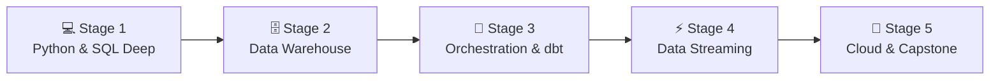

# 🧭 Data Engineer Career Roadmap

> **Tác giả:** Mr.Rom\
> **Phiên bản:** v2.0.0\
> **Tạo lúc:** 16/05/2026\
> **Cập nhật:** 26/05/2026\
> **Đối tượng:** Đã biết Python và SQL cơ bản, muốn chuyên sâu vào xây dựng hạ tầng, đường ống dữ liệu (Data Pipeline) và kho dữ liệu (Data Warehouse)\
> **Mức độ:** Junior → Mid (Sẵn sàng ứng tuyển và làm việc thực tế)

---

## 🧭 Tình huống — Bạn đang ở đâu?

Bạn muốn trở thành một Data Engineer — người thiết kế và vận hành "đường ống dẫn dầu" dữ liệu của doanh nghiệp. Nhưng bạn băn khoăn: *"Data Engineer thực chất khác gì Data Scientist hay Data Analyst?"*, *"Làm sao để xử lý và làm sạch hàng Terabyte dữ liệu đổ về liên tục mà không làm nghẽn hệ thống?"*, *"Nên lựa chọn kiến trúc xử lý theo mẻ (Batch) hay xử lý thời gian thực (Streaming)?"*.

Trong kỷ nguyên Big Data và AI, dữ liệu chính là mỏ dầu. Nhưng dữ liệu thô thường rất hỗn loạn, bẩn và phân tán ở nhiều nơi. **Mr.Rom muốn bạn hiểu rằng: Data Engineer là người hùng thầm lặng xây dựng toàn bộ quy trình Ingest (Thu thập), Transform (Biến đổi/Làm sạch), Store (Lưu trữ) và Serve (Cung cấp) dữ liệu. Không có Data Engineer dọn đường, các Data Scientist sẽ không có dữ liệu sạch để huấn luyện mô hình AI.**

👉 **Lộ trình Data Engineer này sẽ dẫn dắt bạn đi qua 5 Stage cực kỳ logic:**

- **Stage 1**: Chinh phục tư duy lập trình Python và làm chủ kỹ năng viết truy vấn SQL nâng cao.
- **Stage 2**: Thiết kế kho dữ liệu (Data Warehouse) theo chuẩn Dimensional Modeling.
- **Stage 3**: Vận hành đường ống Batch Pipeline tự động với Airflow và công cụ transform dbt.
- **Stage 4**: Xử lý dữ liệu thời gian thực bằng công nghệ Streaming (Kafka, PySpark).
- **Stage 5**: Triển khai Modern Data Stack trên Cloud (AWS/GCP/Snowflake) và hoàn thành Capstone Project.

---

## 🗺️ Tổng quan Lộ trình 5 Stage

| Stage | Kết quả đầu ra |
| --- | --- |
| **Stage 1: Python & SQL Nâng cao** | Thành thạo SQL Window Functions, CTE và thư viện Pandas |
| **Stage 2: Kho dữ liệu & Mô hình hóa** | Thiết kế sơ đồ Star Schema, phân biệt OLTP vs OLAP, dùng DuckDB |
| **Stage 3: Điều phối Batch & dbt** | Dựng pipeline tự động Airflow, làm sạch dữ liệu bằng dbt |
| **Stage 4: Xử lý Streaming** | Xây dựng pipeline thu thập và tổng hợp sự kiện real-time qua Kafka |
| **Stage 5: Cloud Data & Capstone** | Triển khai pipeline trên cloud, trực quan hóa biểu đồ Analytics |

---

## 💻 Stage 1 — Làm chủ Python & SQL nâng cao

> 🎯 *SQL và Python là hai ngôn ngữ sinh mệnh của một kỹ sư dữ liệu. Bạn phải master cả hai.*

### 📖 Câu chuyện dẫn dắt
*"Nhiều người nghĩ SQL rất đơn giản chỉ có SELECT và WHERE. Nhưng khi đối mặt với hàng triệu bản ghi, bạn phải biết cách viết các hàm phân tích (Window Functions) để tính toán lũy kế, sử dụng CTE để cấu trúc lại câu lệnh phức tạp và đọc hiểu giải thích truy vấn (EXPLAIN ANALYZE) để tối ưu hóa tốc độ chạy từ 10 phút xuống 2 giây."*

### 📚 Các bài đọc bắt buộc (MUST-KNOW)
- [ ] [Nền tảng ngôn ngữ Python](../../03_languages/python/) ✅ — Tập trung vào cấu trúc dữ liệu nâng cao, xử lý file và thư viện Pandas.
- [ ] [Nền tảng SQL nâng cao](../../06_databases/sql-fundamentals/) 🚧 — Window Functions (`ROW_NUMBER()`, `RANK()`, `LEAD()`, `LAG()`), CTE (Common Table Expressions) và đệ quy.
- **Tối ưu hóa truy vấn:** Cách hoạt động của Database Index, phương pháp phân tích Query Plan bằng `EXPLAIN`.

### 🧪 Bài tập thực hành
- Hoàn thành danh sách **SQL 50** bài tập mức độ trung bình-khó trên LeetCode/HackerRank.
- Sử dụng Pandas viết script dọn dẹp một file CSV dữ liệu bẩn (xử lý dữ liệu trống, định dạng sai ngày tháng, loại bỏ bản ghi trùng lặp).

### 🎯 Project thực hành Stage 1
**CSV ETL Script:** Viết script Python tự động đọc tệp dữ liệu lớn (khoảng 1GB) → Biến đổi dữ liệu bằng Pandas → Tải (Load) vào database PostgreSQL → Viết các truy vấn SQL tổng hợp số liệu báo cáo doanh thu.

> 🌉 **Cầu nối sang Stage 2**:
> *"Khi đã thành thạo việc viết các câu lệnh SQL tối ưu và xử lý dữ liệu nhỏ bằng Pandas, bạn sẽ thấy việc lưu trữ dữ liệu thô vào các bảng OLTP truyền thống sẽ rất chậm khi chạy báo cáo phân tích. Làm thế nào để thiết kế một cấu trúc lưu trữ chuyên dụng cho phân tích dữ liệu lớn? Hãy bước sang Stage 2: Data Warehouse & Dimensional Modeling!"*

---

## 🗄️ Stage 2 — Kho dữ liệu & Dimensional Modeling

> 🎯 *Hiểu sự khác biệt giữa cơ sở dữ liệu vận hành (OLTP) và kho dữ liệu phân tích (OLAP), thiết kế mô hình dimensional modeling.*

### 📖 Câu chuyện dẫn dắt
Mô hình cơ sở dữ liệu của ứng dụng (OLTP) được tối ưu hóa để ghi dữ liệu cực nhanh. Ngược lại, Kho dữ liệu (Data Warehouse / OLAP) được thiết kế để đọc dữ liệu và tính toán báo cáo nhanh nhất. Để làm được điều này, SRE phải thiết kế dữ liệu theo dạng sơ đồ hình sao (Star Schema) phân tách rõ ràng bảng thực tế (Fact Table) và bảng chiều thông tin (Dimension Table).

### 📚 Các bài đọc bắt buộc (MUST-KNOW)
- [ ] [Tổng quan Cơ sở dữ liệu & OLAP](../../06_databases/) 🚧 — Phân biệt cơ sở dữ liệu dòng (Row-oriented) vs cơ sở dữ liệu cột (Columnar storage như Parquet).
- **Dimensional Modeling:** Sơ đồ Star Schema vs Snowflake Schema. Thiết kế bảng Fact và Dimension.
- **Slowly Changing Dimensions (SCD):** Cách xử lý sự thay đổi của chiều thông tin theo thời gian (SCD Type 1, Type 2).
- [ ] [Khái niệm Data Lake vs Lakehouse](../../14_data-engineering/data-lake/) 🚧.

### 🛠️ Setup công cụ
- Cài đặt và sử dụng **DuckDB** — Cơ sở dữ liệu OLAP local cực kỳ mạnh mẽ để thực hành phân tích dữ liệu nhanh.

### 🎯 Project thực hành Stage 2
**E-commerce Data Warehouse Design:** Phân tích dữ liệu thô từ một trang bán hàng, thiết kế sơ đồ Star Schema gồm bảng `fact_sales` và các bảng `dim_customers`, `dim_products`, `dim_dates`. Load 10 triệu bản ghi vào DuckDB và so sánh tốc độ truy vấn với PostgreSQL.

> 🌉 **Cầu nối sang Stage 3**:
> *"Bạn đã biết cách thiết kế một kho dữ liệu tối ưu và định nghĩa cấu trúc bảng. Nhưng làm thế nào để tự động hóa việc hút dữ liệu từ nhiều nguồn khác nhau về kho một cách đều đặn mỗi đêm, tự động làm sạch và kiểm thử chất lượng dữ liệu? Hãy bước sang Stage 3: Pipeline Orchestration & dbt!"*

---

## 🔄 Stage 3 — Điều phối đường ống & Công cụ dbt

> 🎯 *Xây dựng hệ thống tự động chạy data pipeline theo lịch (Orchestration) và biến đổi dữ liệu chuẩn hóa bằng dbt.*

### 📖 Câu chuyện dẫn dắt
*"Một pipeline chạy thực tế không thể chạy bằng cơm. Bạn cần một nhạc trưởng điều phối (Orchestrator) như Apache Airflow để lên lịch: 'Đúng 2 giờ sáng, hãy kéo dữ liệu từ Shopify API; 3 giờ sáng, chạy dbt để làm sạch; 4 giờ sáng, cập nhật báo cáo'. Nếu một bước bị lỗi, Airflow sẽ tự động thử lại và gửi cảnh báo."*

### 📚 Các bài đọc bắt buộc (MUST-KNOW)
- [ ] [Apache Airflow & Data Orchestration](../../14_data-engineering/airflow-and-orchestration/) 🚧 — Định nghĩa DAG (Directed Acyclic Graph), Task, Operator.
- [ ] [Làm chủ dbt (Data Build Tool)](../../14_data-engineering/dbt/) 🚧 — Framework transform dữ liệu bằng SQL trong Data Warehouse.
- **Data Quality Testing:** Viết các bộ test tự động kiểm tra dữ liệu bằng dbt test (unique, not null) hoặc Great Expectations.
- **Data Lineage:** Theo dõi nguồn gốc của dữ liệu đi từ bảng thô (Staging) qua các lớp trung gian (Intermediate) đến lớp báo cáo (Marts).

### 🎯 Project thực hành Stage 3
**Daily Batch ETL Pipeline:** Thiết lập Airflow (chạy bằng Docker Compose) tự động kích hoạt daily job: Gọi API thời tiết/tài chính công cộng → Load vào Postgres DB -> Kích hoạt dbt biến đổi dữ liệu thành các bảng thống kê -> Tự động kiểm tra chất lượng dữ liệu -> Cập nhật lên Dashboard Metabase.

> 🌉 **Cầu nối sang Stage 4**:
> *"Đường ống dữ liệu chạy theo mẻ (Batch) hàng ngày của bạn đã hoạt động trơn tru. Nhưng đối với một số nghiệp vụ nhạy cảm (như phát hiện gian lận thẻ tín dụng hoặc theo dõi giá coin), việc đợi đến cuối ngày mới có dữ liệu là quá muộn. Làm thế nào để xử lý dữ liệu ngay lập tức khi nó phát sinh? Hãy bước sang Stage 4: Data Streaming!"*

---

## ⚡ Stage 4 — Xử lý dữ liệu thời gian thực (Streaming)

> 🎯 *Xây dựng đường ống xử lý dữ liệu dòng (Data Stream) thời gian thực sử dụng Kafka và Spark.*

### 📖 Câu chuyện dẫn dắt
Xử lý Streaming yêu cầu một tư duy hoàn toàn khác. Dữ liệu không còn nằm im trong bảng nữa, nó là một dòng nước chảy liên tục (Stream). Bạn phải sử dụng các công cụ hàng đợi chịu tải cực cao như Apache Kafka để hứng dòng sự kiện này, và dùng công cụ xử lý phân tán như Apache Spark để tính toán các chỉ số ngay trên dòng chảy đó.

### 📚 Các bài đọc bắt buộc (MUST-KNOW)
- [ ] [Kiến trúc Event Streaming & Kafka](../../14_data-engineering/streaming/) 🚧 — Broker, Topic, Partition, Producer, Consumer Group.
- **Spark Structured Streaming:** Xử lý dữ liệu luồng phân tán sử dụng PySpark.
- **Window Operations:** Kỹ thuật tính toán dữ liệu theo cửa sổ thời gian (ví dụ: Tính số lượng click chuột trong mỗi 5 phút liên tục).

### 🧪 Bài thực hành
- Thiết lập một cụm Kafka nhỏ bằng Docker Compose.
- Viết Python script (Producer) gửi liên tục dữ liệu log giả lập vào Kafka Topic.
- Viết PySpark script (Consumer) đọc từ Kafka, lọc các log lỗi (ERROR) và ghi vào PostgreSQL theo thời gian thực.

### 🎯 Project thực hành Stage 4
**Real-time Event Tracker:** Xây dựng hệ thống thu thập sự kiện người dùng click trên web (Page View Event) -> Gửi vào Kafka -> PySpark tổng hợp số lượt click theo từng phút -> Đẩy ra biểu đồ Real-time Dashboard.

> 🌉 **Cầu nối sang Stage 5**:
> *"Đường ống dữ liệu của bạn giờ đây đã có cả sức mạng xử lý mẻ (Batch) lẫn xử lý thời gian thực (Streaming) dưới môi trường local. Để đưa hệ thống lên quy mô lớn chịu tải hàng Terabyte và sẵn sàng đưa vào vận hành thực tế, bạn cần ứng dụng các dịch vụ Cloud chuyên dụng. Hãy tiến vào Stage 5: Cloud Data Stack & Capstone Project!"*

---

## 🚀 Stage 5 — Cloud Data Stack & Capstone Project

> 🎯 *Triển khai giải pháp dữ liệu hoàn chỉnh trên nền tảng đám mây và hoàn thiện Portfolio.*

### 📚 Lựa chọn và làm chủ một Cloud Data Stack:
- **AWS Stack:** S3 (Data Lake) -> AWS Glue (ETL Catalog) -> AWS Athena (Serverless query) -> Amazon Redshift (Data Warehouse).
- **GCP Stack:** Google Cloud Storage -> Dataflow (Spark managed) -> BigQuery (OLAP Warehouse).
- **Modern Data Stack:** Snowflake (Cloud Data Warehouse) + dbt Cloud.

### 🚀 Ý tưởng dự án Capstone tốt nghiệp:
- **E-commerce Customer Retention Analytics:** Thiết kế pipeline lấy dữ liệu từ Shopify/WooCommerce -> Ingest qua AWS S3 -> Chạy Airflow điều phối dbt transform dữ liệu trên Snowflake -> Tính toán chỉ số Retention Rate (tỉ lệ giữ chân khách hàng), Cohort Analysis, LTV (giá trị vòng đời khách hàng) -> Trực quan hóa dữ liệu lên Looker/Metabase Dashboard.

---

## 🧭 Định hướng thăng tiến tiếp theo

Từ Data Engineer, bạn có thể thăng tiến theo các hướng:

| Lĩnh vực | Vai trò | Lộ trình liên quan |
|---|---|---|
| **Huấn luyện & triển khai mô hình AI** | Đưa các mô hình AI/ML của Data Scientist vào vận hành | [`ml-engineer`](./ml-engineer_career-roadmap.md) |
| **Phân tích số liệu & Khoa học dữ liệu** | Đi sâu vào thống kê toán học, tìm insight dữ liệu | [`data-scientist`](./data-scientist_career-roadmap.md) ✅ |
| **Chuyên gia biến đổi dữ liệu** | Tập trung viết SQL dbt tối ưu hóa cấu trúc kho dữ liệu | Analytics Engineer (Chuyên ngách dbt) |

---

## 🔄 Hướng dẫn điều chỉnh lộ trình

- **Nếu máy tính cá nhân quá yếu để chạy Kafka và Spark:** Hãy sử dụng **Redpanda** làm giải pháp thay thế siêu nhẹ cho Kafka. Để học Spark, bạn có thể sử dụng môi trường cloud miễn phí Google Colab để chạy PySpark mà không cần cài đặt phức tạp.
- **Tài liệu học tập miễn phí:** Mr.Rom khuyên bạn tham gia khóa học **Data Engineering Zoomcamp** của DataTalksClub trên GitHub. Đây là chương trình học thực chiến hoàn toàn miễn phí chất lượng tốt nhất hiện nay.

---

## 📌 Nhật ký thay đổi (Changelog)

- **v2.0.0 (26/05/2026)** — **Nâng cấp thành Narrative Master**:
  - Viết lại toàn bộ nội dung sang văn phong kể chuyện định hướng có chiều sâu và liên kết chặt chẽ.
  - Thiết lập các câu bắc cầu logic kết nối mượt mà giữa các Stage.
  - Cập nhật liên kết Git chính xác sang thư mục `02_tools/git/` ✅.
  - Bổ sung định hướng chi tiết về thiết kế Star Schema, DuckDB và Spark Windowing.
- **v1.0.0 (16/05/2026)** — Khởi tạo cấu trúc lộ trình Data Engineering cơ bản.
