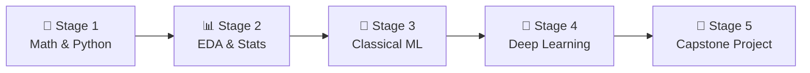

# 🧭 Data Scientist Career Roadmap

> **Tác giả:** Mr.Rom\
> **Phiên bản:** v2.0.0\
> **Tạo lúc:** 16/05/2026\
> **Cập nhật:** 26/05/2026\
> **Đối tượng:** Thích toán học, thống kê và lập trình Python, muốn chuyên sâu vào phân tích dữ liệu chuyên sâu và huấn luyện mô hình Machine Learning\
> **Mức độ:** Junior → Mid (Sẵn sàng ứng tuyển và làm việc thực tế)

---

## 🧭 Tình huống — Bạn đang ở đâu?

Bạn muốn trở thành một Data Scientist (Nhà khoa học dữ liệu) — một trong những nghề hấp dẫn nhất thế kỷ 21. Nhưng bạn băn khoăn: *"Có cần phải có bằng Tiến sĩ toán học mới làm được Data Science?"*, *"Làm sao để tìm thấy những thông tin ẩn giá trị (insights) từ một đống dữ liệu hỗn loạn?"*, *"Làm thế nào để xây dựng các mô hình dự báo chính xác hành vi của khách hàng?"*.

Nhiều người nghĩ làm Data Science chỉ đơn giản là gọi thư viện scikit-learn để chạy mô hình AI. **Mr.Rom muốn nhấn mạnh rằng: Data Science là sự giao thoa giữa Toán học/Thống kê, Lập trình (Python) và Kiến thức nghiệp vụ (Business Domain). Kỹ năng tối thượng của bạn là hiểu bản chất dữ liệu qua EDA (Khám phá dữ liệu), thiết kế các thử nghiệm khoa học (A/B testing) và chuyển hóa các chỉ số toán học khô khan thành các quyết định kinh doanh mang lại lợi nhuận.**

👉 **Lộ trình Data Scientist này sẽ đồng hành cùng bạn đi qua 5 Stage phát triển kỹ năng:**

- **Stage 1**: Xây dựng nền tảng Toán học cho Machine Learning và làm chủ thư viện dữ liệu Python.
- **Stage 2**: Khám phá dữ liệu (EDA) và kiểm chứng các giả thuyết thống kê (Statistics).
- **Stage 3**: Huấn luyện và đánh giá các mô hình Học máy truyền thống (Classical Machine Learning).
- **Stage 4**: Làm quen với mạng nơ-ron nhân tạo và Học sâu cơ bản (Deep Learning).
- **Stage 5**: Hoàn thành dự án Capstone, trực quan hóa dữ liệu và rèn luyện kỹ năng Storytelling.

---

## 🗺️ Tổng quan Lộ trình 5 Stage

| Stage | Kết quả đầu ra |
| --- | --- |
| **Stage 1: Toán & Python cơ bản** | Sử dụng thành thạo NumPy, Pandas, hiểu ma trận và đạo hàm |
| **Stage 2: EDA & Thống kê** | Vẽ biểu đồ trực quan hóa dữ liệu, chạy thử nghiệm A/B Testing |
| **Stage 3: Machine Learning truyền thống** | Xây dựng các mô hình phân loại (Classification) và dự báo (Regression) |
| **Stage 4: Học sâu cơ bản (Deep Learning)** | Xây dựng mạng nơ-ron đơn giản bằng PyTorch để phân loại ảnh |
| **Stage 5: Dự án Capstone & Business** | 2-3 dự án hoàn chỉnh dạng interactive web app, thuyết trình insight |

---

## 📐 Stage 1 — Toán học & Lập trình Python

> 🎯 *Toán học là nền móng. Bạn không thể hiểu thuật toán ML nếu không hiểu ma trận và xác suất.*

### 📖 Câu chuyện dẫn dắt
*"Nhiều người vội vàng cắm đầu vào code thuật toán mà không có nền tảng toán. Họ sẽ không thể hiểu tại sao mô hình bị quá khớp (overfitting), hoặc đạo hàm (gradient) giúp tối ưu hóa trọng số thế nào. Stage này giúp bạn trang bị các kiến thức toán thiết yếu nhất thông qua các ẩn dụ trực quan, kết hợp làm quen các công cụ tính toán số học NumPy và Pandas."*

### 📚 Các bài đọc bắt buộc (MUST-KNOW)
- [ ] [Nền tảng ngôn ngữ Python](../../03_languages/python/) ✅ — Cú pháp cơ bản, cấu trúc dữ liệu và xử lý file.
- [ ] [Toán học cho Machine Learning](../../13_ai-ml/math-for-ml/) 🚧 — Đại số tuyến tính (Vector, Matrix, Dot Product), Giải tích (Đạo hàm, Gradient Descent), và Xác suất thống kê cơ bản.
- **NumPy & Pandas:** Cách tính toán ma trận hiệu năng cao bằng NumPy và quản lý bảng dữ liệu bằng Pandas.

### 🛠️ Setup công cụ
- Cài đặt Python 3.12 và làm quen với môi trường viết code tương tác **Jupyter Notebook**.

### 🎯 Project thực hành Stage 1
**EDA Titanic Dataset (Cơ bản):** Đọc bộ dữ liệu hành khách tàu Titanic, xử lý dữ liệu trống, tính toán các tỷ lệ sống sót theo giới tính và độ tuổi bằng Pandas.

>  puente **Cầu nối sang Stage 2**:
> *"Khi đã thành thạo việc tính toán ma trận bằng NumPy và thao tác bảng dữ liệu bằng Pandas, bạn sẽ thấy dữ liệu thô vẫn đang im lặng. Làm thế nào để bắt dữ liệu 'lên tiếng', tìm ra các xu hướng và kiểm chứng giả thuyết bằng con số? Hãy chuyển sang Stage 2: EDA & Statistics!"*

---

## 📊 Stage 2 — EDA & Thống kê thực chiến

> 🎯 *Khám phá dữ liệu đa chiều qua biểu đồ và kiểm chứng giả thuyết khoa học thông qua thống kê.*

### 📖 Câu chuyện dẫn dắt
Một Data Scientist dành 80% thời gian để làm sạch và hiểu dữ liệu. EDA (Exploratory Data Analysis) giúp bạn vẽ ra các biểu đồ để nhìn thấy phân phối của dữ liệu và các mối quan hệ ẩn. Đồng thời, bạn sẽ học cách thiết kế các thử nghiệm A/B Testing để chứng minh xem một tính năng mới thực sự tăng doanh thu hay chỉ là do may mắn ngẫu nhiên.

### 📚 Các bài đọc bắt buộc (MUST-KNOW)
- **EDA Methodology:** Phân tích một biến (Univariate), hai biến (Bivariate) và đa biến (Multivariate).
- **Trực quan hóa dữ liệu:** Sử dụng các thư viện Matplotlib, Seaborn để vẽ biểu đồ tĩnh, và Plotly để vẽ biểu đồ tương tác.
- **Hypothesis Testing (Kiểm định giả thuyết):** Hiểu rõ khái niệm p-value, độ tin cậy (Confidence Interval), và thực hành các phép kiểm định t-test, Chi-square, ANOVA.
- **A/B Testing Design:** Thiết kế thử nghiệm A/B, tính toán kích thước mẫu cần thiết (Sample Size).

### 🎯 Project thực hành Stage 2
**A/B Test Analytics Report:** Phân tích dữ liệu click của hai nhóm người dùng trên website thương mại điện tử, chạy phép kiểm định thống kê để kết luận xem giao diện mới có thực sự làm tăng tỉ lệ mua hàng hay không và viết báo cáo đề xuất cho doanh nghiệp.

>  puente **Cầu nối sang Stage 3**:
> *"Bạn đã biết cách vẽ biểu đồ khám phá dữ liệu và kiểm chứng các giả thuyết thống kê một cách khoa học. Nhưng làm thế nào để biến các phân tích tĩnh đó thành một hệ thống thông minh tự dự báo kết quả tương lai dựa trên dữ liệu quá khứ? Hãy bước sang Stage 3: Classical Machine Learning!"*

---

## 🤖 Stage 3 — Học máy truyền thống (Classical ML)

> 🎯 *Làm chủ các thuật toán học có giám sát và không giám sát, học cách tiền xử lý đặc trưng (Feature Engineering).*

### 📖 Câu chuyện dẫn dắt
*"Machine Learning truyền thống là xương sống của mọi hệ thống phân tích. Bạn sẽ học cách dạy máy tính dự báo giá nhà (Regression) hoặc phân loại email spam (Classification). Điều quan trọng nhất không phải là chạy thuật toán, mà là Feature Engineering — cách bạn biến đổi dữ liệu thô (như text, ngày tháng) thành các con số có ý nghĩa để mô hình học dễ dàng nhất."*

### 📚 Các bài học bắt buộc (MUST-KNOW)
- [ ] [Phân loại Học máy (Supervised vs Unsupervised)](../../13_ai-ml/ml-fundamentals/) 🚧.
- **Học có giám sát (Supervised Learning):** Thuật toán hồi quy (Linear Regression), phân loại (Logistic Regression, Decision Trees, Random Forest, XGBoost).
- **Học không giám sát (Unsupervised Learning):** Phân cụm dữ liệu (K-means, DBSCAN).
- **Đánh giá mô hình (Model Evaluation):** Hiểu rõ các chỉ số Accuracy, Precision, Recall, F1-Score, ROC-AUC (cho phân loại) và RMSE, MAE (cho hồi quy).
- **Feature Engineering:** Chuẩn hóa dữ liệu (Scaling), xử lý biến phân loại (One-hot encoding), giảm chiều dữ liệu (PCA).

### 🧪 Bài tập thực hành
- Tự viết thuật toán Linear Regression từ con số 0 bằng Python thuần và NumPy (không dùng scikit-learn).
- Giải quyết bài toán phân khúc khách hàng (Customer Segmentation) bằng thuật toán K-means.

### 🎯 Project thực hành Stage 3
**End-to-End Kaggle Competition:** Tham gia cuộc thi dự báo giá nhà (House Prices) hoặc sống sót tàu Titanic trên Kaggle, thực hiện đầy đủ các bước từ EDA, Feature Engineering, tối ưu tham số (Optuna) và nộp bài đạt top 50%.

>  puente **Cầu nối sang Stage 4**:
> *"Mô hình Machine Learning truyền thống của bạn đã giải quyết rất tốt các dữ liệu dạng bảng. Tuy nhiên, khi đối mặt với dữ liệu phi cấu trúc như hình ảnh, âm thanh hay văn bản dài, bạn cần các cấu trúc mạng nơ-ron phức tạp hơn. Hãy cùng bước sang Stage 4: Deep Learning Basics!"*

---

## 🧠 Stage 4 — Học sâu cơ bản (Deep Learning Basics)

> 🎯 *Hiểu nguyên lý hoạt động của mạng nơ-ron nhân tạo và tự tay xây dựng mô hình phân loại ảnh.*

### 📖 Câu chuyện dẫn dắt
Học sâu (Deep Learning) đã tạo nên cuộc cách mạng trong lĩnh vực AI. Thay vì con người phải tự tay thiết kế đặc trưng, các mạng nơ-ron sâu tự động tìm ra các pattern phức tạp từ dữ liệu thô. Chúng ta sẽ làm quen với PyTorch — thư viện deep learning phổ biến nhất trong giới nghiên cứu và công nghiệp hiện nay.

### 📚 Các bài học bắt buộc (MUST-KNOW)
- [ ] [Nền tảng Học sâu & Mạng nơ-ron](../../13_ai-ml/deep-learning/) 🚧 — Cơ chế Lan truyền xuôi (Forward pass), Lan truyền ngược (Backpropagation) và Gradient Descent.
- **Framework PyTorch:** Làm quen với Tensor, autograd, cách thiết kế class kế thừa `nn.Module` và viết vòng lặp huấn luyện (Training Loop).
- **Mạng nơ-ron tích chập (CNN):** Thuật toán chuyên dùng cho xử lý ảnh.
- **Transfer Learning (Học chuyển giao):** Cách tận dụng các mô hình đã được huấn luyện sẵn của các ông lớn (như ResNet, MobileNet) để fine-tune trên tập dữ liệu nhỏ của bạn.

### 🎯 Project thực hành Stage 4
**Custom Image Classifier:** Tự thu thập 500 ảnh về các loại chó và mèo, sử dụng PyTorch và mô hình ResNet50 có sẵn, viết code fine-tune để xây dựng ứng dụng phân loại chó/mèo với độ chính xác > 95%.

>  puente **Cầu nối sang Stage 5**:
> *"Chúc mừng bạn! Bạn đã nắm giữ toàn bộ kỹ năng kỹ thuật từ phân tích dữ liệu, thống kê toán học cho đến các mô hình học sâu. Bước cuối cùng chính là đóng gói các kỹ năng này thành những dự án Portfolio chất lượng và học cách thuyết trình giải pháp trước các nhà quản lý doanh nghiệp. Hãy tiến vào Stage 5!"*

---

## 🚀 Stage 5 — Dự án Capstone & Kể chuyện dữ liệu

> 🎯 *Hoàn thiện Portfolio với các dự án có giá trị kinh doanh thực tế và đưa mô hình ra giao diện web tương tác.*

### 🚀 Ý tưởng dự án Capstone tốt nghiệp:
- **Dự báo nhu cầu hàng tồn kho (Sales Forecasting):** Sử dụng thuật toán chuỗi thời gian (Time Series như Prophet, ARIMA) để dự báo doanh số bán hàng của chuỗi siêu thị trongtới, giúp tối ưu hóa chi phí lưu kho.
- **Hệ thống gợi ý sản phẩm (Recommendation System):** Xây dựng công cụ gợi ý bài hát hoặc phim ảnh cho người dùng (Collaborative Filtering).

### 🛠️ Tiêu chuẩn kỹ thuật bắt buộc của dự án Capstone:
- [ ] **Interactive Web UI:** Đưa mô hình AI ra giao diện web tương tác đơn giản bằng framework **Streamlit** hoặc Gradio để người dùng trải nghiệm thực tế (không chỉ chạy code trong file Jupyter Notebook).
- [ ] **Storytelling & Interpretation:** File README hoặc bài blog giải thích rõ ràng bài toán kinh doanh, tại sao chọn metric này, và mô hình mang lại giá trị thực tế gì (ví dụ: giúp tiết kiệm 15% chi phí vận chuyển).

---

## 🧭 Định hướng thăng tiến tiếp theo

Sau khi đạt cấp độ Data Scientist, bạn có thể lựa chọn:

| Lĩnh vực | Vai trò | Lộ trình liên quan |
|---|---|---|
| **Kỹ sư tối ưu hóa mô hình lớn** | Chuyên đưa mô hình vào môi trường sản xuất lớn | [`ml-engineer`](./ml-engineer_career-roadmap.md) |
| **Ứng dụng AI nhanh vào phần mềm** | Tập trung lắp ghép API LLM để build chatbot, agent | [`ai-engineer`](./ai-engineer_career-roadmap.md) ✅ |
| **Xây dựng Data Warehouse** | Xây dựng pipeline thu thập dữ liệu thô quy mô lớn | [`data-engineer`](./data-engineer_career-roadmap.md) ✅ |

---

## 🔄 Hướng dẫn điều chỉnh lộ trình

- **Nếu cảm thấy phần Toán quá nặng:** Đừng hoảng sợ. Hãy học theo phương pháp Top-down của thư viện **fast.ai** — học cách chạy mô hình và có kết quả trước, sau đó quay lại đào sâu toán học khi cần thiết. Sử dụng kênh YouTube **StatQuest** và **3Blue1Brown** để học toán qua hình ảnh động cực kỳ dễ hiểu.
- **Không có máy tính mạnh có GPU:** Hãy tận dụng dịch vụ **Google Colab** hoặc **Kaggle Notebooks** cung cấp GPU miễn phí hàng tuần để huấn luyện các mô hình học sâu.

---

## 📌 Nhật ký thay đổi (Changelog)

- **v2.0.0 (26/05/2026)** — **Nâng cấp thành Narrative Master**:
  - Viết lại toàn bộ nội dung sang văn phong kể chuyện định hướng có chiều sâu và liên kết chặt chẽ.
  - Thiết lập các câu bắc cầu logic kết nối mượt mà giữa các Stage.
  - Cập nhật liên kết Git chính xác sang thư mục `02_tools/git/` ✅.
  - Bổ sung định hướng chi tiết về A/B Testing, Feature Engineering và thư viện Streamlit.
- **v1.0.0 (16/05/2026)** — Khởi tạo cấu trúc lộ trình Data Science cơ bản.
