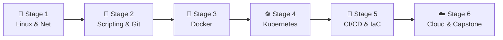

# 🧭 DevOps Engineer Career Roadmap

> **Tác giả:** Mr.Rom\
> **Phiên bản:** v2.0.0\
> **Tạo lúc:** 16/05/2026\
> **Cập nhật:** 26/05/2026\
> **Đối tượng:** Đã biết lập trình cơ bản (ưu tiên Python/Bash), muốn theo đuổi hướng quản lý hạ tầng, tự động hóa và tối ưu hóa chu kỳ phát hành phần mềm\
> **Mức độ:** Junior → Mid (Sẵn sàng ứng tuyển và đảm nhận công việc thực tế)

---

## 🧭 Tình huống — Bạn đang ở đâu?

Bạn muốn trở thành một Kỹ sư DevOps — người hùng thầm lặng kết nối hai thế giới: Phát triển phần mềm (Dev) và Vận hành hệ thống (Ops). Nhưng bạn băn khoăn: *"Tại sao khi lập trình viên viết code lỗi, DevOps lại là người bị dựng dậy lúc 2 giờ sáng?"*, *"Hạ tầng Cloud quá rộng lớn, bắt đầu từ đâu để không bị cháy tài khoản AWS?"*, *"Kubernetes là gì mà ai cũng nhắc đến nó như một tiêu chuẩn bắt buộc?"*.

Nhiều người nghĩ DevOps chỉ đơn giản là đi click tạo server trên AWS hoặc viết vài pipeline Jenkins. **Mr.Rom muốn nhấn mạnh rằng: DevOps trước hết là một phương pháp luận và văn hóa làm việc. Kỹ năng cốt lõi của bạn là Tự động hóa (Automation) và Khử ma sát (Frictionless Deployment) — giúp code của lập trình viên được kiểm thử, đóng gói và đưa lên môi trường chạy thực tế một cách nhanh nhất, an toàn nhất mà không cần con người can thiệp thủ công.**

👉 **Lộ trình DevOps Engineer này được chia làm 6 Stage cực kỳ thực chiến:**

- **Stage 1**: Xây dựng nền tảng vững chắc về hệ điều hành Linux và giao thức mạng (Networking).
- **Stage 2**: Làm chủ kỹ năng tự động hóa bằng Scripting và quản lý mã nguồn cấu hình bằng Git.
- **Stage 3**: Container hóa mọi ứng dụng bằng Docker để đảm bảo tính nhất quán.
- **Stage 4**: Điều phối và vận hành container ở quy mô lớn với Kubernetes (K8s).
- **Stage 5**: Thiết lập pipeline CI/CD tự động và định nghĩa hạ tầng bằng code (IaC).
- **Stage 6**: Làm chủ đám mây AWS và hoàn thành dự án Capstone tự động hóa thực tế.

---

## 🗺️ Tổng quan Lộ trình 6 Stage

| Stage | Kết quả đầu ra |
| --- | --- |
| **Stage 1: Linux & Mạng máy tính** | Làm chủ VPS Linux, cấu hình SSH bảo mật và Firewall an toàn |
| **Stage 2: Scripting & Git** | Viết được bash/python script tự động hóa backup, quản lý code qua Git |
| **Stage 3: Docker** | Đóng gói ứng dụng đa thành phần chạy độc lập trên Docker Compose |
| **Stage 4: Kubernetes** | Deploy và vận hành ứng dụng có khả năng auto-scale trên K8s |
| **Stage 5: CI/CD & IaC** | Viết pipeline tự động hóa GitHub Actions, định nghĩa infra qua Terraform |
| **Stage 6: Cloud & Capstone** | Thiết lập hệ thống giám sát, deploy dự án live trên AWS đám mây |

---

## 🐧 Stage 1 — Hệ điều hành Linux & Mạng máy tính

> 🎯 *Linux là hệ điều hành thống trị máy chủ. Bạn phải làm chủ nó và hiểu cách các máy tính giao tiếp qua mạng.*

### 📖 Câu chuyện dẫn dắt
*"Hơn 90% máy chủ production trên thế giới chạy Linux. Làm DevOps nghĩa là bạn sẽ không bao giờ có giao diện window để click chuột. Mọi giao tiếp với server đều qua giao thức SSH. Nếu bạn không phân biệt được tiến trình (Process), không biết phân quyền file (Permissions) hay không hiểu cơ chế DNS phân giải tên miền, bạn sẽ bế tắc ngay khi server gặp sự cố mạng."*

### 📚 Các bài đọc bắt buộc (MUST-KNOW)
- [ ] [Làm quen môi trường Terminal](../../01_foundations/computing-environment/lessons/01_basic/00_what-is-terminal.md) ✅
- [ ] [Linux cơ bản cho kỹ sư vận hành](../../04_os/linux/) ✅ — Navigation, quản lý file, phân quyền người dùng (`chmod`, `chown`).
- [ ] **Linux nâng cao:** Quản lý tiến trình (`ps`, `top`, `kill`), viết systemd service để chạy ngầm ứng dụng, đọc log hệ thống qua `journalctl`.
- [ ] [Mạng máy tính cơ bản](../../05_networking/) 🚧 — Mô hình TCP/IP, cổng dịch vụ (Ports), DNS, tường lửa (Firewall), giao thức HTTP/HTTPS.

### 🧪 Bài thực hành
- Thuê một máy chủ ảo VPS giá rẻ (như DigitalOcean, Linode) khoảng $5/tháng.
- Thiết lập SSH Key để login bảo mật, tắt hoàn toàn đăng nhập bằng password và cấm user root đăng nhập trực tiếp.
- Cài đặt Nginx làm Web Server, cấu hình tường lửa UFW chỉ mở cổng 22 (SSH), 80 (HTTP) và 443 (HTTPS).

### 🎯 Project thực hành Stage 1
**Personal VPS Security Setup:** Dựng VPS Ubuntu bảo mật, chạy Nginx hiển thị trang web cá nhân tĩnh có cấu hình tường lửa chặt chẽ.

> 🌉 **Cầu nối sang Stage 2**:
> *"Khi đã làm chủ chiếc máy chủ Linux và biết cách bảo mật kết nối mạng, bạn sẽ nhận ra việc gõ thủ công từng câu lệnh để vận hành là cực kỳ mất thời gian. Làm thế nào để máy tính tự động thực thi các tác vụ lặp đi lặp lại và quản lý các đoạn mã cấu hình một cách chuyên nghiệp? Hãy bước sang Stage 2: Scripting & Git!"*

---

## 📜 Stage 2 — Scripting & Git Automation

> 🎯 *Tự động hóa các tác vụ lặp đi lặp lại bằng script và kiểm soát mọi cấu hình hệ thống bằng Git.*

### 📖 Câu chuyện dẫn dắt
Một kỹ sư DevOps lười biếng một cách thông minh sẽ không bao giờ làm thủ công một việc quá 2 lần. Thay vào đó, họ viết script để máy tính làm việc đó thay mình. Dù là backup database mỗi đêm, dọn dẹp ổ cứng khi đầy, hay gửi cảnh báo qua Telegram, script đều có thể xử lý chính xác và kiên nhẫn.

### 📚 Các bài học bắt buộc (MUST-KNOW)
- **Bash Scripting:** Biến, câu lệnh điều kiện (if/else), vòng lặp (for/while), đọc ghi file và bắt lỗi (set -euo pipefail).
- [ ] [Lập trình Python cơ bản](../../03_languages/python/lessons/01_basic/) ✅ — Viết các script tự động hóa phức tạp hơn bằng Python.
- [ ] [Luồng làm việc với Git chuyên nghiệp](../../02_tools/git/) ✅ — Quản lý mọi file cấu hình hạ tầng bằng Git.
- **Task Scheduling:** Sử dụng Cron Job hoặc Systemd Timers để lập lịch chạy script tự động.

### 🧪 Bài thực hành
- Viết Bash Script nén một thư mục log, đặt tên file theo ngày hiện tại, lưu vào thư mục backup và xóa các file backup cũ hơn 7 ngày.
- Viết Python script kiểm tra dung lượng ổ cứng, nếu ổ cứng đầy quá 85% thì tự động gửi email cảnh báo.

### 🎯 Project thực hành Stage 2
**Automated Backup to Cloud:** Viết bash/python script tự động dump database PostgreSQL hàng ngày, đẩy lên Cloud Storage (AWS S3) và lập lịch chạy tự động bằng Cron.

> 🌉 **Cầu nối sang Stage 3**:
> *"Khi đã biết viết script để tự động hóa các tác vụ hệ thống và dùng Git để kiểm soát mã nguồn cấu hình, bạn đã sẵn sàng đối mặt với vấn đề lớn tiếp theo: Làm thế nào để đóng gói ứng dụng và mọi thư viện đi kèm của nó thành một khối nhẹ, chạy nhất quán từ máy của lập trình viên cho đến máy chủ production? Hãy chuyển sang Stage 3: Docker!"*

---

## 🐳 Stage 3 — Đóng gói ứng dụng với Docker

> 🎯 *Làm chủ công nghệ ảo hóa container, đóng gói ứng dụng và cấu hình môi trường chạy độc lập.*

### 📖 Câu chuyện dẫn dắt
*"Lỗi kinh điển của lập trình viên là: 'Nhưng code chạy rất tốt trên máy của em!'. Docker sinh ra để giải quyết triệt để vấn đề này bằng cách đóng gói ứng dụng cùng mọi thư viện, runtime của nó vào một container. Ứng dụng chạy trên Docker sẽ hoạt động y hệt nhau trên mọi môi trường từ máy cá nhân của Dev cho đến máy chủ chạy thật."*

### 📚 Các bài học bắt buộc (MUST-KNOW)
- [ ] [Docker cốt lõi](../../10_devops/docker/) ✅ — Hiểu rõ Image, Container, Docker Daemon và Registry.
- [ ] **Dockerfile Optimization:** Cách viết Dockerfile chuẩn khoa học, sử dụng Multi-stage build để giảm kích thước image từ 1GB xuống dưới 100MB.
- [ ] **Docker Volumes & Networking:** Lưu trữ dữ liệu bền vững (Volumes) và kết nối mạng giữa các container (Docker Networks).
- [ ] **Docker Compose:** Định nghĩa và khởi chạy ứng dụng đa thành phần (Multi-container app) chỉ bằng một file YAML.

### 🧪 Bài thực hành
- Đóng gói (Dockerize) một ứng dụng Backend (FastAPI hoặc Node.js).
- Viết file `docker-compose.yml` để chạy ứng dụng Backend kết nối với Database PostgreSQL và cache Redis.
- Tối ưu hóa Dockerfile sử dụng Base Image dạng `alpine` hoặc `distroless` để giảm thiểu lỗ hổng bảo mật.

### 🎯 Project thực hành Stage 3
**Multi-tier Containerized App:** Đóng gói hoàn chỉnh hệ thống gồm: Nginx (Reverse Proxy) → Web App (Backend) → PostgreSQL (DB) chạy cô lập trong mạng Docker Compose.

> 🌉 **Cầu nối sang Stage 4**:
> *"Đóng gói ứng dụng bằng Docker giúp bạn quản lý một vài container rất dễ dàng. Nhưng khi ứng dụng của công ty phát triển lên hàng chục máy chủ khác nhau chạy hàng trăm container, làm sao để tự động điều phối, tự động khôi phục khi có container bị sập, và tự động mở rộng (scale) khi tải tăng cao? Hãy bước sang Stage 4: Kubernetes!"*

---

## ☸️ Stage 4 — Điều phối Container với Kubernetes

> 🎯 *Làm chủ công cụ điều phối container tiêu chuẩn công nghiệp và thiết kế ứng dụng chạy tin cậy ở quy mô lớn.*

### 📖 Câu chuyện dẫn dắt
Kubernetes (K8s) chính là "hệ điều hành của hạ tầng đám mây". Khi ứng dụng của bạn có hàng triệu người dùng truy cập, bạn không thể vào từng server để chạy lệnh docker thủ công nữa. K8s sẽ tự động hóa việc đó: nếu một máy chủ vật lý bị hỏng, K8s tự động di chuyển container sang máy chủ khác; nếu lưu lượng truy cập tăng vọt, K8s tự động nhân bản container ra để chia tải.

### 📚 Các bài học bắt buộc (MUST-KNOW)
- [ ] [Kubernetes Architecture](../../10_devops/kubernetes/) 🚧 — Tìm hiểu Control Plane, Worker Node, Kubelet.
- [ ] **K8s Resources:** Pod, Deployment, Service (ClusterIP, NodePort, LoadBalancer), Ingress.
- [ ] **Configuration & Security:** ConfigMap (cấu hình ứng dụng), Secrets (quản lý mật khẩu, khóa bảo mật), và RBAC (phân quyền truy cập cluster).
- [ ] **Package Manager:** Sử dụng **Helm Charts** để đóng gói và chia sẻ các cấu hình K8s.

### 🛠️ Setup công cụ
- Cài đặt Minikube hoặc Kind trên máy tính cá nhân để tạo cluster K8s chạy thử local.
- Làm quen với dòng lệnh `kubectl`.

### 🎯 Project thực hành Stage 4
**K8s Production Deployment:** Viết các file manifest YAML (hoặc Helm Chart) để triển khai dự án Multi-tier App ở Stage 3 lên local Kubernetes cluster, cấu hình Ingress với HTTPS và thiết lập cơ chế tự động nhân bản container khi CPU quá tải (HPA).

> 🌉 **Cầu nối sang Stage 5**:
> *"Ứng dụng của bạn đã chạy cực kỳ ổn định trên Kubernetes. Tuy nhiên, mỗi lần lập trình viên sửa code, bạn lại phải tự tay build image rồi gõ lệnh deploy thủ công thì thật phi lý. Làm thế nào để tự động hóa 100% quy trình từ lúc code được push cho đến khi deploy lên K8s, và định nghĩa toàn bộ hạ tầng bằng code? Hãy bước sang Stage 5: CI/CD & Infrastructure as Code (IaC)!"*

---

## 🔄 Stage 5 — CI/CD Pipelines & Infrastructure as Code (IaC)

> 🎯 *Xây dựng đường ống tích hợp/triển khai tự động 100% và quản lý tài nguyên máy chủ bằng code.*

### 📖 Câu chuyện dẫn dắt
*"Là DevOps, bạn không muốn ai phải click chuột trên giao diện đám mây để tạo máy chủ nữa. Bạn viết code Terraform để mô tả: 'Tôi muốn 2 server, 1 database Postgres'. Khi chạy, Terraform sẽ tự động tạo chính xác tài nguyên đó trên AWS. Đồng thời, mỗi khi Dev push code mới lên GitHub, hệ thống CI/CD sẽ tự động chạy test, build Docker image và deploy trực tiếp lên K8s."*

### 📚 Các bài học bắt buộc (MUST-KNOW)
- [ ] [Quy trình CI/CD cốt lõi](../../10_devops/ci-cd/) 🚧 — Khái niệm Build, Test, Release, Deploy.
- [ ] **GitHub Actions:** Viết file workflow YAML, quản lý runners, caching dependencies và push Docker image lên Docker Hub.
- [ ] [Terraform (IaC)](../../10_devops/iac/) 🚧 — Định nghĩa hạ tầng (VPC, Subnet, VMs) bằng ngôn ngữ HCL.
- [ ] [GitOps & ArgoCD](../../10_devops/gitops/) 🚧 — Phương pháp sử dụng Git làm nguồn chân lý duy nhất cho cấu trúc Kubernetes.

### 🧪 Bài thực hành
- Viết file Terraform tạo 1 máy chủ ảo trên Cloud và cấu hình SSH.
- Viết workflow GitHub Actions tự động chạy unit test khi có Pull Request.
- Setup ArgoCD trên K8s cluster để tự động đồng bộ hóa trạng thái ứng dụng từ GitHub repo.

### 🎯 Project thực hành Stage 5
**Full GitOps Delivery Pipeline:** Khi Dev commit code mới → GitHub Actions tự động build image → Đẩy lên Registry → ArgoCD phát hiện thay đổi và tự động cập nhật image mới lên Kubernetes cluster.

> 🌉 **Cầu nối sang Stage 6**:
> *"Hạ tầng và pipeline tự động hóa của bạn đã hoàn chỉnh ở môi trường local hoặc server ảo nhỏ. Để đưa hệ thống lên tầm cỡ doanh nghiệp chịu tải lớn toàn cầu, bạn cần làm chủ một nhà cung cấp đám mây thực thụ và thiết lập hệ thống giám sát cảnh báo liên tục. Hãy tiến vào Stage 6: Cloud & Capstone Project!"*

---

## ☁️ Stage 6 — Làm chủ Đám mây AWS & Capstone Project

> 🎯 *Triển khai hạ tầng thực chiến trên AWS đám mây và hoàn thành dự án Capstone vận hành hệ thống.*

### 📚 Học các dịch vụ cốt lõi của Amazon Web Services (AWS):
- [ ] [AWS Core Services](../../11_cloud/aws/) 🚧 — VPC (mạng cô lập), EC2 (máy chủ ảo), S3 (lưu trữ file), RDS (CSDL đám mây), IAM (phân quyền tài khoản).
- [ ] **Monitoring & Logging:** Thiết lập Prometheus & Grafana để thu thập thông số CPU/RAM và trực quan hóa biểu đồ giám sát.

### 🚀 Dự án Capstone tốt nghiệp (Chọn 1):
- **Self-hosted Kubernetes Cluster:** Sử dụng Terraform tạo hạ tầng trên AWS (VPC, EC2) -> Cài đặt Kubernetes cluster -> Cấu hình GitOps bằng ArgoCD -> Tích hợp hệ thống Monitoring (Prometheus + Grafana) và Logging (Loki).
- **Auto-scaling CI/CD Runners:** Thiết lập hệ thống self-hosted runner cho GitHub Actions tự động tạo thêm VMs khi có nhiều build pipeline chạy cùng lúc và tự tắt đi khi rảnh để tiết kiệm chi phí.

---

## 🧭 Lộ trình phát triển sự nghiệp tiếp theo

Sau khi làm chủ DevOps, bạn có các nhánh phát triển nâng cao:

| Lĩnh vực | Vai trò | Lộ trình liên quan |
|---|---|---|
| **Độ tin cậy hệ thống chuyên sâu** | Đảm bảo hệ thống chịu lỗi cao, thiết lập SLO/SLA | [`sre-engineer`](./sre-engineer_career-roadmap.md) |
| **Xây dựng nền tảng nội bộ** | Xây dựng công cụ (IDP) giúp Dev tự tạo hạ tầng nhanh | [`platform-engineer`](./platform-engineer_career-roadmap.md) |
| **Bảo mật hạ tầng (DevSecOps)** | Tích hợp quét lỗ hổng bảo mật trực tiếp vào pipeline | [`security-engineer`](./security-engineer_career-roadmap.md) ✅ |

---

## 🔄 Hướng dẫn điều chỉnh lộ trình

- **Nếu Kubernetes quá khó học ban đầu:** Hãy đi chậm lại. Kubernetes là một công cụ phức tạp. Bạn có thể dành thêm thời gian chạy ứng dụng bằng Docker Compose trên VPS thực tế (Stage 3). Khi đã thực sự hiểu cách các container giao tiếp và gặp khó khăn khi scale, lúc đó học K8s sẽ thấy cực kỳ dễ hiểu.
- **Về việc thi các chứng chỉ (Certifications):** Chứng chỉ không thay thế được kinh nghiệm thực tế, nhưng nó giúp bạn có cấu trúc học tập tốt. Sau Stage 4, bạn nên ôn thi chứng chỉ **CKA (Certified Kubernetes Administrator)** và sau Stage 6 là chứng chỉ **AWS Solutions Architect Associate**.

---

## 📌 Nhật ký thay đổi (Changelog)

- **v2.0.0 (26/05/2026)** — **Nâng cấp thành Narrative Master**:
  - Viết lại toàn bộ nội dung sang văn phong kể chuyện định hướng, rành mạch và logic.
  - Thiết lập các câu bắc cầu logic kết nối mượt mà giữa các Stage.
  - Cập nhật liên kết Git chính xác sang thư mục `02_tools/git/` ✅.
  - Bổ sung chỉ dẫn cụ thể về việc học AWS đám mây và tối ưu chi phí hạ tầng.
- **v1.0.0 (16/05/2026)** — Khởi tạo cấu trúc lộ trình DevOps cơ bản.
