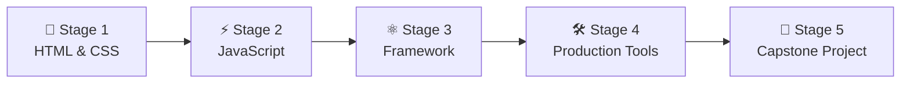

# 🧭 Frontend Developer Career Roadmap

> **Tác giả:** Mr.Rom\
> **Phiên bản:** v2.0.0\
> **Tạo lúc:** 16/05/2026\
> **Cập nhật:** 26/05/2026\
> **Đối tượng:** Đã nắm vững nền tảng máy tính (hoặc hoàn thành Stage 1 của Zero to Coder), muốn theo đuổi hướng lập trình giao diện Web UI/UX\
> **Mức độ:** Junior → Mid (Sẵn sàng ứng tuyển và làm việc thực tế)

---

## 🧭 Tình huống — Bạn đang ở đâu?

Bạn muốn trở thành một Kỹ sư Frontend — người trực tiếp kiến tạo nên giao diện và trải nghiệm mà người dùng nhìn thấy, chạm vào hàng ngày. Nhưng bạn băn khoăn: *"Có phải làm Frontend chỉ là cắt HTML/CSS từ file thiết kế Figma?"*, *"Tại sao lại có quá nhiều công cụ và framework như React, Vue, Angular, Svelte ra mắt liên tục?"*, *"Làm sao để trang web chạy mượt mà trên một chiếc điện thoại cũ lẫn màn hình 4K?"*.

Nhiều người lầm tưởng Frontend là hướng đi "dễ thở" nhất trong IT. **Tuy nhiên, Mr.Rom muốn bạn hiểu rằng: Một Kỹ sư Frontend chuyên nghiệp không chỉ dừng lại ở việc biết kéo thả giao diện. Bạn cần làm chủ tư duy Responsive Web Design (Mobile-First), tối ưu hóa hiệu năng hiển thị trên trình duyệt (Core Web Vitals), quản lý trạng thái (State Management) phức tạp ở phía client và phối hợp nhịp nhàng với Backend thông qua API.**

👉 **Lộ trình Frontend Developer này được thiết kế theo 5 Stage đi từ cơ bản đến chuyên sâu:**

- **Stage 1**: Làm chủ ngôn ngữ cấu trúc HTML và thiết kế phong cách giao diện CSS (Static UI).
- **Stage 2**: Thâu tóm tư duy logic tương tác với ngôn ngữ JavaScript (Interactive UI).
- **Stage 3**: Lựa chọn một Component Framework hiện đại (React) để xây dựng ứng dụng Web đơn trang (SPA).
- **Stage 4**: Sử dụng các công cụ tối ưu hóa, TypeScript, viết kiểm thử tự động và triển khai deploy.
- **Stage 5**: Hoàn thiện dự án Capstone thực tế đạt tiêu chuẩn công nghiệp làm Portfolio.

---

## 🗺️ Tổng quan Lộ trình 5 Stage

| Stage | Kết quả đầu ra |
| --- | --- |
| **Stage 1: HTML & CSS (Giao diện tĩnh)** | Xây dựng được trang landing page tĩnh đẹp đẽ, responsive (Mobile-first) |
| **Stage 2: JavaScript (Tương tác động)** | Thêm logic tương tác, xử lý form, gọi API lấy dữ liệu động từ server |
| **Stage 3: Framework (React hoặc Vue)** | Làm chủ Component và State, xây dựng Single Page Application (SPA) |
| **Stage 4: Công cụ & Tối ưu hóa** | Áp dụng TypeScript, viết unit test, kiểm tra hiệu năng bằng Lighthouse |
| **Stage 5: Dự án Capstone** | 1 dự án Frontend Portfolio hoàn chỉnh chạy live, tối ưu SEO & A11y |

---

## 🎨 Stage 1 — HTML & CSS

> 🎯 *Tạo nền móng vững chắc về cấu trúc trang web chuẩn SEO, cách bố cục giao diện linh hoạt và tư duy Responsive thiết kế.*

### 📖 Câu chuyện dẫn dắt
*"Mọi trang web trên thế giới dù phức tạp đến đâu cũng được dịch thành mã HTML và CSS trên trình duyệt của người dùng. Nếu bạn viết mã HTML vô tổ chức, trang web của bạn sẽ rất khó để máy tìm kiếm (Google) đọc hiểu (SEO kém) và người khuyết tật sử dụng (Accessibility tệ). Hãy học cách viết HTML có ngữ nghĩa (Semantic HTML) trước khi dùng CSS biến nó thành tác phẩm nghệ thuật."*

### 📚 Các bài đọc bắt buộc (MUST-KNOW)
- [ ] [HTML5 Semantic & SEO cơ bản](../../07_web/frontend/html-css/) 🚧 — Cách sử dụng các thẻ `<header>`, `<nav>`, `<article>`, `<section>`, `<footer>` đúng ngữ cảnh.
- [ ] **CSS Layouts:** Làm chủ tuyệt đối CSS Box Model, Flexbox và CSS Grid.
- [ ] **Responsive Design:** Thiết lập Media Queries theo tư duy Mobile-First (thiết kế giao diện điện thoại trước, mở rộng ra tablet và desktop sau).
- [ ] **Modern CSS Utilities:** CSS Variables (custom properties) và làm quen với Utility-first CSS framework: **Tailwind CSS**.

### 🛠️ Setup công cụ
- [ ] [VS Code và Live Server extension](../../02_tools/ide/vs-code.md) để xem thay đổi UI ngay lập tức.
- [ ] Làm quen với Chrome DevTools (Tab Elements, Console) để debug CSS.

### 🧪 Bài tập thực hành Stage 1
- Hoàn thành trò chơi [Flexbox Froggy](https://flexboxfroggy.com/) và [Grid Garden](https://cssgridgarden.com/) để nhớ cú pháp.
- Clone lại giao diện một trang Landing Page tĩnh (ví dụ: Trang chủ của Apple hoặc Stripe) chỉ sử dụng HTML và CSS thuần hoặc Tailwind CSS.

### 🎯 Project thực hành Stage 1
**Trang Portfolio cá nhân tĩnh:** Thiết kế responsive hiển thị đẹp mắt trên cả iPhone và màn hình desktop 27 inch, deploy trực tiếp lên GitHub Pages.

> 🌉 **Cầu nối sang Stage 2**:
> *"Khi đã tự tin dựng giao diện tĩnh đẹp đẽ và responsive trên mọi màn hình, bạn sẽ thấy trang web của mình vẫn đang là một 'bức tranh tĩnh' thiếu sức sống. Làm thế nào để thêm tương tác, bắt sự kiện click, lấy dữ liệu từ server? Hãy cùng bước sang Stage 2: JavaScript!"*

---

## ⚡ Stage 2 — Làm chủ ngôn ngữ JavaScript

> 🎯 *Học sâu về ngôn ngữ lập trình của trình duyệt, cách thao tác với giao diện (DOM) và xử lý bất đồng bộ.*

### 📖 Câu chuyện dẫn dắt
Nhiều người mới thường mắc sai lầm là vội vàng học React/Vue khi chưa nắm vững JavaScript cơ bản. Điều này giống như bạn cố tập lái xe công thức 1 trong khi chưa biết luật giao thông. Khi gặp lỗi runtime hoặc xử lý API bất đồng bộ, bạn sẽ hoàn toàn bế tắc. Hãy dành thời gian làm chủ JavaScript.

### 📚 Các bài đọc bắt buộc (MUST-KNOW)
- [ ] [Cơ bản về JavaScript & Kiểu dữ liệu](../../03_languages/javascript-typescript/) 🚧.
- [ ] **JS ES6+:** Arrow functions, Destructuring, Spread/Rest operators, Template literals.
- [ ] **Xử lý mảng nâng cao:** Thành thạo các hàm `map()`, `filter()`, `reduce()`, `find()`.
- [ ] **Xử lý bất đồng bộ (Asynchronous JS):** Hiểu rõ cơ chế Promise, cú pháp `async/await` và cách gọi API bằng hàm `fetch()`.
- [ ] **DOM Manipulation:** Cách chọn element, thêm/xóa class và bắt sự kiện (Event Listeners).

### 🧪 Bài thực hành
- Viết form đăng nhập bằng JavaScript thuần: kiểm tra định dạng email, mật khẩu tối thiểu 8 ký tự ngay khi người dùng gõ phím.
- Gọi API public lấy thông tin thời tiết (OpenWeatherAPI) và hiển thị kết quả lên giao diện web động.

### 🎯 Project thực hành Stage 2
**Ứng dụng quản lý tài chính Vanilla JS:** Cho phép thêm các khoản thu chi, lưu lại vào LocalStorage của trình duyệt để không bị mất khi F5, vẽ biểu đồ tỉ lệ thu chi đơn giản bằng CSS.

> 🌉 **Cầu nối sang Stage 3**:
> *"Bạn đã biết cách dùng JavaScript để tạo ra các tương tác mượt mà và gọi API. Tuy nhiên, khi ứng dụng phình to với hàng chục trang và hàng trăm nút tương tác, việc tự tay quản lý DOM thủ công bằng Vanilla JS sẽ trở thành một cơn ác mộng. Làm thế nào để tổ chức giao diện theo component tái sử dụng? Hãy bước sang Stage 3: Làm chủ Framework!"*

---

## ⚛️ Stage 3 — Component Framework: React

> 🎯 *Học tư duy phát triển UI theo dạng các mảnh ghép (Component), quản lý dữ liệu tập trung và điều hướng trang web (Routing).*

### 📖 Câu chuyện dẫn dắt
*"React là thư viện UI phổ biến nhất trên thế giới. Nó thay đổi cách bạn tư duy làm giao diện: bạn không đi sửa đổi DOM trực tiếp nữa, bạn định nghĩa các trạng thái (State) của ứng dụng, và React sẽ tự động cập nhật giao diện tương ứng một cách tối ưu. Mọi thứ trên trang web đều là một khối Component có thể tái sử dụng ở nhiều nơi."*

### 📚 Các bài học bắt buộc (MUST-KNOW)
- [ ] [React Core Concepts](../../07_web/frontend/react/) 🚧 — Component, Props, Virtual DOM.
- [ ] **React Hooks:** Hiểu sâu `useState` (quản lý trạng thái), `useEffect` (gọi API/side effects), và `useContext` (truyền dữ liệu toàn cục).
- [ ] **Client-Side Routing:** Sử dụng React Router để tạo ứng dụng nhiều trang mà không cần tải lại toàn bộ trình duyệt.
- [ ] **Quản lý State toàn cục (Global State):** Bắt đầu với Context API, sau đó nâng cấp lên thư viện nhẹ, hiện đại như **Zustand** khi ứng dụng phức tạp hơn.
- [ ] **Data Fetching:** Học cách quản lý trạng thái loading/error khi gọi API bằng thư viện **TanStack Query (React Query)** để tối ưu hóa trải nghiệm người dùng.

### 🧪 Bài thực hành
- Tạo các component cơ bản dùng chung: Nút bấm (Button), Hộp thoại cảnh báo (Modal), Menu thả xuống (Dropdown) hỗ trợ tùy biến giao diện qua Props.
- Viết một Custom Hook (ví dụ `useFetch`) để tự động hóa việc gọi API ở các component khác nhau.

### 🎯 Project thực hành Stage 3
**Trang xem thông tin phim ảnh (Movie Web App):** Sử dụng React Router, gọi API từ The Movie DB, cho phép tìm kiếm phim, lọc theo thể loại và thêm phim yêu thích vào danh sách (sử dụng Zustand lưu vào LocalStorage).

> 🌉 **Cầu nối sang Stage 4**:
> *"Bạn đã xây dựng được ứng dụng web đơn trang (SPA) bằng React. Nhưng làm sao để tự động hóa quy trình đóng gói mã nguồn, viết các bộ kiểm thử chạy tự động để chứng minh code không lỗi, và deploy lên internet cho cả thế giới dùng? Hãy cùng bước sang Stage 4: Production Tools!"*

---

## 🛠️ Stage 4 — Công cụ chuyên nghiệp & Tối ưu hóa

> 🎯 *Trang bị TypeScript để tránh bug lúc gõ code, viết unit test, kiểm tra hiệu năng trình duyệt và deploy lên Cloud.*

### 📚 Các bài học bắt buộc (MUST-KNOW)
- [ ] **Build Tooling:** Làm quen với Vite để khởi tạo dự án cực nhanh, thay thế cho Create React App lỗi thời.
- [ ] **TypeScript cơ bản:** Học cách khai báo kiểu dữ liệu (Types, Interfaces) cho Props và State để phát hiện lỗi ngay trong lúc viết code.
- [ ] **Testing:** Viết Unit Test cho component với Vitest + React Testing Library. Viết E2E Test (kiểm thử đầu-cuối) với Playwright.
- [ ] **Performance & Web Vitals:** Hiểu các chỉ số hiệu năng hiển thị: LCP (tốc độ tải khối nội dung chính), CLS (độ ổn định thị giác của giao diện).
- [ ] **Độ rộng gói Bundle:** Học cách sử dụng lazy loading (`React.lazy()`) để chia nhỏ code (code splitting), giúp trang web tải cực nhanh lần đầu.

### 🧪 Bài thực hành
- Chuyển đổi một dự án React nhỏ từ JavaScript sang TypeScript.
- Chạy Lighthouse audit trên trình duyệt Chrome, phân tích các đề xuất tối ưu hóa ảnh và file CSS/JS.
- Đóng gói ứng dụng React tĩnh và deploy lên Vercel hoặc Netlify (chỉ mất 2 phút qua giao diện GitHub integration).

### 🎯 Project thực hành Stage 4
**Refactor Movie Web App (Stage 3):** Chuyển sang 100% TypeScript, viết test coverage đạt > 60%, thiết lập tự động hóa CI chạy test khi push code, deploy hoàn chỉnh lên Vercel.

> 🌉 **Cầu nối sang Stage 5**:
> *"Tuyệt vời! Bạn đã có đầy đủ 'vũ khí' của một Kỹ sư Frontend chuyên nghiệp. Bước cuối cùng chính là kết hợp tất cả chúng để tạo ra một dự án Capstone thực tế, tinh tế, tối ưu hóa hiệu năng tối đa để ghi điểm tuyệt đối trong CV. Hãy bước vào Stage 5!"*

---

## 🚀 Stage 5 — Dự án Capstone độc lập

> 🎯 *Tự lên ý tưởng, thiết kế UX/UI và hoàn thiện một ứng dụng Frontend chuyên nghiệp chạy live trên internet.*

### 📚 Chọn 1 ý tưởng dự án thực chiến:
- **Trang thương mại điện tử (E-commerce UI):** Trang danh sách sản phẩm (có search, filter, pagination), giỏ hàng chi tiết (thêm/sửa số lượng), trang checkout giả lập tích hợp API thanh toán.
- **Trang quản trị số liệu (Dashboard Analytics):** Trực quan hóa dữ liệu bằng các biểu đồ tương tác (sử dụng thư viện Recharts), cho phép lọc dữ liệu theo ngày/tháng/năm, hỗ trợ chế độ Dark Mode tinh tế.
- **Ứng dụng trò chuyện thời gian thực (Real-time Chat App):** Kết nối WebSocket, hỗ trợ danh sách phòng chat, hiển thị trạng thái đang nhập chữ (typing indicator) và lưu trữ lịch sử tin nhắn.

### 🛠️ Tiêu chuẩn kỹ thuật bắt buộc của dự án Capstone:
- [ ] **Độ phủ kiểm thử:** Có bộ test E2E cho các luồng sử dụng chính (ví dụ: luồng thêm sản phẩm vào giỏ và checkout).
- [ ] **Hiệu năng & Tối ưu:** Lighthouse score đạt > 90 ở mục Performance và Accessibility.
- [ ] **Tài liệu README:** Có ảnh chụp giao diện, link demo live, hướng dẫn chạy local và giải thích cách tổ chức cấu trúc thư mục.

---

## 🧭 Định hướng thăng tiến tiếp theo

Sau khi làm chủ Frontend, bạn có các lựa chọn mở rộng nghề nghiệp:

| Lĩnh vực | Vai trò | Lộ trình liên quan |
|---|---|---|
| **Lập trình ứng dụng di động** | Viết app iOS/Android bằng công nghệ React Native | [`mobile-developer`](./mobile-developer_career-roadmap.md) |
| **Trở thành lập trình viên toàn năng** | Học thêm API, Database để tự làm sản phẩm từ A-Z | [`fullstack-developer`](./fullstack-developer_career-roadmap.md) ✅ |
| **Lập trình game đa nền tảng** | Ứng dụng kỹ thuật vẽ canvas, 3D WebGL hoặc Unity | [`game-developer`](./game-developer_career-roadmap.md) |

---

## 🔄 Hướng dẫn điều chỉnh lộ trình

- **Nếu bạn cảm thấy CSS quá khó căn chỉnh:** Đừng nản lòng, CSS là một kỹ năng cần thực hành nhiều để quen mắt. Hãy tập trung làm chủ Flexbox và CSS Grid trước, sau đó chuyển sang sử dụng Tailwind CSS để viết code nhanh hơn.
- **Về việc chọn Framework:** Nếu công ty bạn nhắm tới yêu cầu Vue 3 thay vì React, hãy học Vue 3. Các khái niệm về Component, Props, State và Routing ở Vue 3 đều tương đồng 90% với React, bạn chỉ mất khoảngđể làm quen với cú pháp mới.

---

## 📌 Nhật ký thay đổi (Changelog)

- **v2.0.0 (26/05/2026)** — **Nâng cấp thành Narrative Master**:
  - Biên soạn lại toàn bộ nội dung theo văn phong kể chuyện định hướng có chiều sâu.
  - Tối ưu hóa các câu bắc cầu logic kết nối mượt mà giữa các Stage.
  - Cập nhật liên kết Git chính xác sang thư mục `02_tools/git/` ✅.
  - Bổ sung định hướng chi tiết về tối ưu hóa Web Vitals (Core Web Vitals) và Accessibility (A11y).
- **v1.0.0 (16/05/2026)** — Khởi tạo cấu trúc lộ trình Frontend cơ bản.
