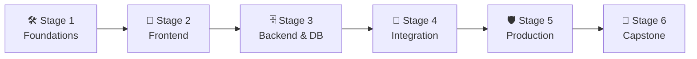

# 🧭 Fullstack Developer Career Roadmap

> **Tác giả:** Mr.Rom\
> **Phiên bản:** v2.0.0\
> **Tạo lúc:** 16/05/2026\
> **Cập nhật:** 26/05/2026\
> **Đối tượng:** Đã có nền tảng lập trình cơ bản, muốn tự tay làm chủ cả giao diện (Frontend) lẫn hệ thống logic (Backend) của ứng dụng\
> **Thời gian ước tính:** ~12 tháng học tập tích cực (full-time) hoặc ~24 tháng (part-time)\
> **Mức độ:** Junior → Mid (Sẵn sàng làm việc độc lập hoặc ứng tuyển startup/freelance)

---

## 🧭 Tình huống — Bạn đang ở đâu?

Bạn muốn trở thành một Fullstack Developer — người lập trình viên đa năng có thể tự tay biến một ý tưởng sơ khai thành một sản phẩm chạy thực tế trên internet từ A-Z. Bạn băn khoăn: *"Học cả Frontend lẫn Backend cùng lúc có quá tải không?"*, *"Làm sao để kết nối hai phần này với nhau một cách an toàn mà không bị lỗi CORS hay rò rỉ token bảo mật?"*, *"Làm thế nào để deploy một ứng dụng gồm nhiều thành phần lên internet một cách tối ưu?"*.

Lập trình Fullstack không đơn thuần là học vẹt một framework Frontend và một framework Backend rồi chắp vá lại. **Mr.Rom muốn nhấn mạnh rằng: Điểm cốt lõi của một Fullstack Developer giỏi là khả năng thấu suốt toàn bộ luồng đi của dữ liệu (Data Flow) — đi từ hành động bấm nút của người dùng trên giao diện React, truyền qua môi trường internet đầy rủi ro (HTTP/CORS), được xử lý nghiệp vụ tại server FastAPI, ghi nhận an toàn vào cơ sở dữ liệu PostgreSQL, và phản hồi ngược lại một cách mượt mà.**

👉 **Lộ trình Fullstack Developer này được thiết kế theo 6 Stage tối ưu để bạn chinh phục mục tiêu:**

- **Stage 1**: Xây dựng nền tảng dòng lệnh, quản lý code và giao thức mạng HTTP.
- **Stage 2**: Làm chủ Frontend với React & TypeScript để xây dựng giao diện ứng dụng.
- **Stage 3**: Xây dựng Backend với FastAPI và thiết kế cơ sở dữ liệu quan hệ PostgreSQL.
- **Stage 4**: Tích hợp hai hệ thống (Frontend ↔ Backend), giải quyết bài toán Authentication và CORS.
- **Stage 5**: Viết kiểm thử tự động, đóng gói Docker và triển khai deploy toàn bộ hệ thống.
- **Stage 6**: Tự tay thiết kế và đưa vào vận hành một dự án Capstone thực tế quy mô lớn.

---

## 🗺️ Tổng quan Lộ trình 6 Stage

| Stage | Thời gian | Kết quả đầu ra |
|---|---|---|
| **Stage 1: Nền tảng (Foundations)** | 1-2 tháng | Thành thạo Linux terminal, Git workflow và giao thức HTTP cơ bản |
| **Stage 2: Frontend (React & TS)** | 2-3 tháng | Dựng được giao diện web SPA đẹp mắt, responsive, lấy data từ API |
| **Stage 3: Backend & Database** | 2-3 tháng | Xây dựng REST API CRUD kết nối cơ sở dữ liệu PostgreSQL |
| **Stage 4: Tích hợp hệ thống** | 1-2 tháng | Connect hoàn chỉnh React với FastAPI, xử lý CORS và JWT Auth |
| **Stage 5: Sẵn sàng cho Production** | 2 tháng | Viết unit test cả 2 bên, đóng gói Docker Compose và deploy cloud |
| **Stage 6: Dự án Capstone** | 1-2 tháng | 1 dự án Fullstack Portfolio hoàn chỉnh chạy live trên internet |

---

## 🛠️ Stage 1 — Nền tảng (Foundations) (1-2 tháng)

> 🎯 *Trang bị bộ công cụ làm việc dòng lệnh, làm chủ Git và hiểu cách thế giới web truyền dữ liệu.*

### 📖 Câu chuyện dẫn dắt
*"Trước khi phân đôi ngả sang làm giao diện hay viết API, bạn phải nói chung một ngôn ngữ của giới kỹ sư: đó là dòng lệnh Linux terminal để điều khiển máy chủ, là Git để lưu trữ và quản lý phiên bản code, và là giao thức HTTP để hiểu cách trình duyệt gửi dữ liệu đi đâu. Skip stage này sẽ khiến bạn liên tục gặp rắc rối với các công cụ phát triển phần mềm sau này."*

### 📚 Các bài đọc bắt buộc (MUST-KNOW)
- [ ] [Làm quen môi trường Terminal](../../01_foundations/computing-environment/lessons/01_basic/00_what-is-terminal.md) ✅
- [ ] [Linux cơ bản (cd, ls, pwd, file operations)](../../04_os/linux/) ✅ — Học cách di chuyển và quản lý tệp tin bằng Terminal.
- [ ] [Luồng làm việc với Git chuyên nghiệp](../../02_tools/git/) ✅ — Nắm vững commit, branch, merge và đồng bộ GitHub.
- [ ] **Giao thức HTTP:** Hiểu rõ HTTP request/response cycle, Methods (GET, POST, PUT, DELETE) và Status Code.

### 🛠️ Setup
- [ ] [VS Code và cấu hình extensions cho Web](../../02_tools/ide/vs-code.md) ✅
- [ ] [Cài đặt Git & cấu hình GitHub](../../02_tools/git/setup/git.md) ✅
- [ ] Cài đặt Node.js LTS (thông qua công cụ quản lý nvm/fnm).

> 🌉 **Cầu nối sang Stage 2**:
> *"Khi đã nắm chắc cách máy tính làm việc và luồng giao tiếp cơ bản qua HTTP, bạn đã sẵn sàng bắt tay vào xây dựng giao diện tương tác đầu tiên ở phía người dùng. Hãy cùng bước sang Stage 2: Frontend!"*

---

## 🎨 Stage 2 — Phát triển Frontend (React & TS) (2-3 tháng)

> 🎯 *Làm chủ HTML/CSS responsive, tư duy JavaScript tương tác và xây dựng Web SPA với React & TypeScript.*

### 📖 Câu chuyện dẫn dắt
Giao diện người dùng (UI) chính là bộ mặt của sản phẩm. Bạn cần học cách xây dựng UI không chỉ đẹp mà còn phải responsive trên mọi thiết bị và tối ưu hóa code bằng cách chia nhỏ thành các Component tái sử dụng của React. Việc bổ sung thêm TypeScript sẽ giúp bạn hạn chế tới 50% lỗi runtime bằng cách ép kiểu dữ liệu chặt chẽ.

### 📚 Các bài học bắt buộc (MUST-KNOW)
- [ ] [HTML & CSS Responsive](../../07_web/frontend/html-css/) 🚧 — CSS Box Model, Flexbox, Grid và framework **Tailwind CSS**.
- [ ] **JavaScript ES6+:** Arrow functions, Destructuring, Async/Await và Fetch API.
- [ ] [React Core & Hooks](../../07_web/frontend/react/) 🚧 — Component, Props, State, `useState`, `useEffect`.
- [ ] **TypeScript cơ bản:** Type annotation, Interfaces để định nghĩa cấu trúc dữ liệu Props/State.
- [ ] **Routing & Form:** Sử dụng React Router để điều hướng trang, React Hook Form + Zod để validate form.

### 🎯 Project thực hành Stage 2
**Movie Browser App:** Ứng dụng xem thông tin phim gọi API từ The Movie DB, cho phép tìm kiếm, lọc theo thể loại, lưu danh sách phim yêu thích và deploy lên Vercel.

> 🌉 **Cầu nối sang Stage 3**:
> *"Ứng dụng React của bạn đã hiển thị rất đẹp mắt và gọi được các API công cộng. Tuy nhiên, để tạo ra một sản phẩm thực sự của riêng mình, bạn cần một bộ não Backend và một kho dữ liệu bền vững do chính bạn kiểm soát. Hãy bước sang Stage 3 để chinh phục Backend!"*

---

## 🗄️ Stage 3 — Phát triển Backend & Database (2-3 tháng)

> 🎯 *Viết API backend bằng FastAPI, thiết kế cơ sở dữ liệu quan hệ PostgreSQL và quản lý dữ liệu hiệu quả.*

### 📖 Câu chuyện dẫn dắt
*"Là lập trình viên Backend, nhiệm vụ của bạn là bảo vệ sự toàn vẹn của dữ liệu và thực thi logic nghiệp vụ. Bạn sẽ học cách thiết kế cơ sở dữ liệu Postgres chuẩn hóa, sử dụng ORM để giao tiếp với DB bằng code Python và viết các endpoint API chuẩn RESTful để chuẩn bị tích hợp với ứng dụng React."*

### 📚 Các bài học bắt buộc (MUST-KNOW)
- [ ] [Nền tảng ngôn ngữ Python](../../03_languages/python/) ✅ — Tập trung sâu vào lập trình hướng đối tượng (OOP) và lập trình bất đồng bộ (`async/await`).
- [ ] [FastAPI cơ bản](../../07_web/backend/python-fastapi/) 🚧 — Router, dependencies injection và validation bằng Pydantic.
- [ ] [Nền tảng SQL & Database Design](../../06_databases/sql-fundamentals/) 🚧 — Thiết kế ERD và viết các truy vấn Join cơ bản.
- [ ] [PostgreSQL & ORM SQLAlchemy](../../06_databases/postgresql/) 🚧 — Tương tác DB qua ORM, viết file migration Alembic để quản lý thay đổi bảng.

### 🎯 Project thực hành Stage 3
**Blog Engine API:** Hệ thống API CRUD bài viết, danh mục và bình luận kết nối database PostgreSQL thực tế, có tài liệu Swagger tự động.

> 🌉 **Cầu nối sang Stage 4**:
> *"Bây giờ bạn đã có hai nửa hoàn chỉnh: giao diện React ở phía client và hệ thống API + Database ở phía server. Làm thế nào để hai nửa này nhận ra nhau, đăng nhập đồng bộ và chia sẻ dữ liệu một cách bảo mật? Hãy bước sang Stage 4: Tích hợp hệ thống!"*

---

## 🔗 Stage 4 — Tích hợp hệ thống (Integration) (1-2 tháng)

> 🎯 *Kết nối Frontend với Backend, giải quyết các lỗi cấu hình mạng CORS, thiết lập cơ chế đăng nhập bảo mật.*

### 📖 Câu chuyện dẫn dắt
Khi kết nối hai ứng dụng chạy ở hai domain khác nhau (ví dụ: React chạy ở port 3000 và FastAPI chạy ở port 8000), bạn sẽ ngay lập tức đụng phải bức tường bảo mật mang tên CORS của trình duyệt. Bạn cần học cách giải quyết triệt để lỗi này, đồng thời xây dựng luồng đăng nhập (Authentication Flow) bảo mật lưu giữ trạng thái đăng nhập qua JWT Token hoặc Cookies.

### 📚 Các bài học bắt buộc (MUST-KNOW)
- [ ] **CORS (Cross-Origin Resource Sharing):** Hiểu rõ cơ chế preflight request và cách cấu hình CORS middleware an toàn trên FastAPI.
- [ ] [Authentication Flow (JWT)](../../12_security/authentication/) 🚧 — Quy trình gửi mật khẩu mã hóa → nhận token JWT → lưu token an toàn ở client (HttpOnly Cookie hoặc LocalStorage) → đính kèm token vào header cho các request sau.
- [ ] **State Synchronization:** Sử dụng TanStack Query (React Query) trên Frontend để tự động cache dữ liệu, sync trạng thái với Backend và xử lý các trạng thái Loading/Error mượt mà.
- [ ] **File Upload:** Xây dựng API upload ảnh (sách, avatar) từ React lên backend và lưu trữ.

### 🎯 Project thực hành Stage 4
**Connect Project:** Kết nối dự án Movie Browser (Stage 2) với Blog Engine API (Stage 3). Thay thế toàn bộ dữ liệu mẫu bằng API của chính bạn, người dùng đăng nhập bằng tài khoản lưu trong Postgres để bình luận và đánh giá phim.

> 🌉 **Cầu nối sang Stage 5**:
> *"Hai phần của bạn đã kết nối thành công thành một ứng dụng thống nhất dưới local. Nhưng làm thế nào để đảm bảo code của bạn không bị lỗi khi sửa đổi, đóng gói tất cả thành một khối để mang đi deploy ở bất kỳ server nào? Hãy bước sang Stage 5: Sẵn sàng Production!"*

---

## 🛡️ Stage 5 — Sẵn sàng cho Production (2 tháng)

> 🎯 *Viết kiểm thử tự động cả hai phía, đóng gói ứng dụng bằng Docker Compose và triển khai deploy lên môi trường đám mây.*

### 📖 Câu chuyện dẫn dắt
Một lập trình viên Fullstack giỏi phải tự biết đưa sản phẩm của mình lên internet một cách chuyên nghiệp. Bạn sẽ học cách đóng gói toàn bộ Frontend, Backend, Database thành các container chạy độc lập bằng Docker Compose. Điều này đảm bảo app chạy ở máy bạn thế nào thì khi deploy lên cloud cũng sẽ chạy giống y hệt như vậy.

### 📚 Các bài học bắt buộc (MUST-KNOW)
- [ ] **Testing:** Viết unit test cho logic React (Vitest) và API FastAPI (`pytest`).
- [ ] [Docker & Docker Compose](../../10_devops/docker/) ✅ — Viết `Dockerfile` tối ưu hóa kích thước image, sử dụng `docker-compose` kết nối 3 service (React, FastAPI, Postgres).
- [ ] **CI/CD:** Thiết lập GitHub Actions tự động kiểm tra cú pháp (Lint) và chạy test mỗi khi push code lên GitHub.
- [ ] **Production Deploy:** Deploy Frontend lên Vercel, deploy API và Database Postgres lên Railway hoặc Fly.io. Học cách quản lý các biến môi trường cấu hình mật (Secrets).

### 🎯 Project thực hành Stage 5
**Dockerized Fullstack Blog:** Đóng gói hoàn chỉnh dự án Stage 4, tích hợp CI/CD tự động chạy test, deploy live lên môi trường cloud với HTTPS bảo mật.

> 🌉 **Cầu nối sang Stage 6**:
> *"Chúc mừng bạn! Bạn đã chinh phục toàn bộ các mảng kỹ năng từ thiết kế UI, viết API, kết nối DB, kiểm thử cho đến deploy. Giờ là lúc thực sự tỏa sáng bằng cách xây dựng một dự án Capstone lớn mang đậm dấu ấn cá nhân để nộp CV. Hãy tiến vào Stage 6!"*

---

## 🚀 Stage 6 — Dự án Capstone độc lập (1-2 tháng)

> 🎯 *Tự thiết kế và lập trình một sản phẩm phần mềm hoàn chỉnh chạy thực tế phục vụ người dùng để làm Portfolio.*

### 📚 Chọn 1 ý tưởng dự án thực chiến:
- **Ứng dụng clone Twitter / X:** Có trang dòng thời gian (Timeline), chức năng Follow, Like, Comment bài viết, cập nhật thông báo thời gian thực (WebSockets).
- **Trang thương mại điện tử tích hợp thanh toán:** Giỏ hàng, trang thanh toán tích hợp cổng thanh toán thực tế (Stripe Sandbox), trang quản lý đơn hàng cho Admin.
- **Hệ thống quản lý dự án (Kiểu Kanban board):** Cho phép tạo dự án, thêm thành viên, kéo thả các thẻ công việc giữa các cột (To do, In Progress, Done) và phân quyền chi tiết.

### 🛠️ Tiêu chuẩn kỹ thuật bắt buộc của dự án Capstone:
- [ ] **Frontend:** React + TypeScript + Tailwind CSS.
- [ ] **Backend:** FastAPI + PostgreSQL + Redis Cache.
- [ ] **Kiểm thử:** Có test suite cho cả Frontend (Vitest/Playwright) và Backend (Pytest).
- [ ] **Vận hành:** Có file Docker Compose, CI/CD tự động và deploy link live chạy thực tế ghi trong file README.

---

## 🧭 Định hướng thăng tiến tiếp theo

Sau khi hoàn thành lộ trình Fullstack, bạn có thể đi sâu hơn theo các hướng:

| Hướng đi | Vai trò | Lộ trình liên quan |
|---|---|---|
| **Chuyên sâu tối ưu hóa giao diện** | Trở thành Master Frontend, tối ưu UX, thiết kế animations phức tạp | [`frontend-developer`](./frontend-developer_career-roadmap.md) |
| **Chuyên sâu thiết kế hệ thống lớn** | Tối ưu hóa Database, thiết kế kiến trúc microservices chịu tải cao | [`backend-developer`](./backend-developer_career-roadmap.md) |
| **Làm chủ hạ tầng đám mây** | Chuyển hẳn sang vận hành hệ thống, tự động hóa hạ tầng (IaC) | [`devops-engineer`](./devops-engineer_career-roadmap.md) ✅ |

---

## 🔄 Hướng dẫn điều chỉnh lộ trình

- **Nếu cảm thấy học cả 2 cùng lúc quá nặng:** Hãy chia nhỏ thời gian. Tập trung 3-4 tháng đầu hoàn thiện Frontend (Stage 1 & 2), sau đó chuyển hẳn sang Backend ở 3-4 tháng tiếp theo (Stage 3). Không nên nhảy qua nhảy lại giữa viết CSS và viết SQL trong cùng một ngày ở giai đoạn mới học.
- **Sử dụng Next.js thay thế:** Nếu bạn muốn học một framework Fullstack all-in-one chạy hoàn toàn bằng JavaScript/TypeScript thay vì tách biệt React + FastAPI, hãy sử dụng Next.js. Tuy nhiên, Mr.Rom khuyên bạn vẫn nên học cách tách biệt Frontend/Backend để hiểu sâu hơn về kiến trúc giao tiếp client-server chuẩn industry.

---

## 📌 Changelog

- **v2.0.0 (26/05/2026)** — **Nâng cấp thành Narrative Master**:
  - Viết lại toàn bộ nội dung sang văn phong kể chuyện định hướng và kết nối logic.
  - Thiết lập các câu bắc cầu logic kết nối mượt mà giữa các Stage.
  - Cập nhật liên kết Git chính xác sang thư mục `02_tools/git/` ✅.
  - Bổ sung định hướng rõ ràng về kết nối CORS, tích hợp JWT Flow và đồng bộ State FE-BE.
- **v1.0.0 (16/05/2026)** — Khởi tạo cấu trúc lộ trình Fullstack cơ bản.
