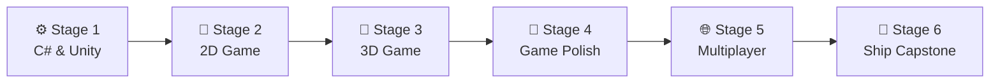

# 🧭 Game Developer Career Roadmap

> **Tác giả:** Mr.Rom\
> **Phiên bản:** v2.0.0\
> **Tạo lúc:** 16/05/2026\
> **Cập nhật:** 26/05/2026\
> **Đối tượng:** Đam mê trò chơi điện tử, muốn tự tay lập trình và phát hành các tựa game 2D/3D của riêng mình\
> **Mức độ:** Junior → Mid (Sẵn sàng ứng tuyển studio game hoặc tự làm game độc lập - Indie Dev)

---

## 🧭 Tình huống — Bạn đang ở đâu?

Bạn muốn trở thành một Game Developer — người trực tiếp kiến tạo nên các thế giới ảo đầy lôi cuốn. Nhưng bạn băn khoăn: *"Nên bắt đầu học bằng Unity (C#) hay Unreal Engine (C++)?"*, *"Có cần phải biết vẽ tranh 3D hoặc phối nhạc mới làm được game?"*, *"Làm thế nào để đưa trò chơi của mình lên Steam hay các kho ứng dụng di động?"*.

Lập trình game là một trong những lĩnh vực đòi hỏi sự kết hợp đa kỹ năng nhất trong CNTT. Bạn không chỉ viết code logic, bạn còn phải làm việc với vật lý, hoạt ảnh (Animation), âm thanh, giao diện người dùng và toán học không gian (Vector, Góc xoay). **Mr.Rom khuyên bạn nên bắt đầu bằng Unity Engine và ngôn ngữ C# vì đây là hệ sinh thái phổ biến nhất thế giới dành cho các nhà phát triển độc lập (Indie Dev), có kho tài liệu khổng lồ và hỗ trợ xuất bản đa nền tảng cực kỳ dễ dàng.**

👉 **Lộ trình Game Developer này gồm 6 Stage đi từ cơ bản đến nâng cao:**

- **Stage 1**: Làm chủ ngôn ngữ C# và các khái niệm cốt lõi của Unity Editor.
- **Stage 2**: Phát triển game 2D (Platformer, Puzzle) để hiểu cơ bản về vật lý và vòng lặp game.
- **Stage 3**: Bước vào không gian 3D, làm quen với ánh sáng, vật liệu và NavMesh AI.
- **Stage 4**: Mài giũa trò chơi (Polish & Juice) thông qua hiệu ứng UI, âm thanh và Particles.
- **Stage 5**: Tìm hiểu lập trình mạng và thiết kế game chơi chung (Multiplayer/Co-op).
- **Stage 6**: Đóng gói hoàn chỉnh, tối ưu hiệu năng và xuất bản game (Ship Game) lên itch.io/Steam.

---

## 🗺️ Tổng quan Lộ trình 6 Stage

| Stage | Kết quả đầu ra |
| --- | --- |
| **Stage 1: C# & Unity Basics** | Làm chủ giao diện Unity Editor, viết script di chuyển vật thể cơ bản |
| **Stage 2: Lập trình Game 2D** | Hoàn thành game 2D Platformer có quái vật AI, lưu màn chơi |
| **Stage 3: Lập trình Game 3D** | Xây dựng game 3D góc nhìn thứ ba, có chiến đấu và NavMesh AI |
| **Stage 4: Polish & Game Feel** | Tích hợp menu UI, âm thanh không gian, camera shake mượt mà |
| **Stage 5: Multiplayer & Network** | Xây dựng game 2 người chơi co-op qua mạng LAN sử dụng Netcode |
| **Stage 6: Đóng gói & Phát hành** | Tối ưu hóa FPS, đóng gói game chạy trên PC/Web, upload lên itch.io |

---

## ⚙️ Stage 1 — C# & Unity Basics

> 🎯 *Unity sử dụng ngôn ngữ C#. Hãy học song song cú pháp C# và kiến trúc Component của Unity.*

### 📖 Câu chuyện dẫn dắt
*"Trước khi tạo ra các pha hành động hoành tráng, bạn phải hiểu cách Unity vận hành. Mọi vật thể trong game đều là một `GameObject`. Hành vi của vật thể được quyết định bởi các `Component` gắn vào nó. Bạn sẽ viết script C# thừa kế lớp `MonoBehaviour` để ra lệnh cho các component này tương tác với nhau."*

### 📚 Các bài đọc bắt buộc (MUST-KNOW)
- [ ] [Nền tảng ngôn ngữ C#](../../03_languages/csharp/) 🚧 — Biến, rẽ nhánh, vòng lặp, lập trình hướng đối tượng (OOP).
- **Unity Editor Interface:** Làm chủ các cửa sổ Scene, Hierarchy, Inspector, Project, Game View.
- **Transform & Vector:** Tọa độ 3D, cách thay đổi vị trí, góc xoay và kích thước vật thể qua code.
- **Game Loop:** Hiểu sự khác biệt giữa `Update` (chạy mỗi frame - vẽ UI, bắt phím) và `FixedUpdate` (chạy theo chu kỳ vật lý cố định).
- [ ] [Git workflow & Git LFS](../../02_tools/git/) ✅ — Sử dụng Git LFS để quản lý các file asset game dung lượng lớn (ảnh, 3D model, âm thanh).

### 🎯 Project thực hành Stage 1
**Roll-a-Ball (Tutorial kinh điển):** Viết script C# điều khiển một quả bóng di chuyển bằng phím WASD, nhặt các đồng xu xoay tròn trên bàn chơi, tính điểm và hiển thị chữ chiến thắng.

> 🌉 **Cầu nối sang Stage 2**:
> *"Khi đã làm chủ được Editor và biết cách viết script di chuyển một khối hộp cơ bản, bạn đã sẵn sàng bước vào thế giới game thực sự. Hãy cùng chuyển sang Stage 2 để xây dựng một trò chơi 2D hoàn chỉnh đầu tiên!"*

---

## 👾 Stage 2 — Phát triển Game 2D

> 🎯 *Học cách làm việc với Sprites, Tilemap, vật lý 2D và máy trạng thái nhân vật.*

### 📖 Câu chuyện dẫn dắt
Game 2D là điểm khởi đầu tuyệt vời vì bạn không cần đau đầu với các trục tọa độ 3D phức tạp hay bài toán camera góc nhìn thứ ba. Bạn sẽ tập trung học cách cắt ghép hoạt ảnh từ các tấm ảnh tĩnh (Sprite Sheet), thiết kế màn chơi bằng ô gạch (Tilemap) và xử lý va chạm vật lý 2D.

### 📚 Các bài học bắt buộc (MUST-KNOW)
- **Sprite & Animation:** Sử dụng Sprite Editor để cắt Sprite Sheet, thiết kế animation bằng cửa sổ Animation và Animator Controller.
- **Tilemap:** Vẽ màn chơi nhanh chóng bằng lưới ô gạch trong Unity.
- **Vật lý 2D (Physics 2D):** Sử dụng `Rigidbody2D` (trọng lực, lực đẩy) và `Collider2D` (phát hiện va chạm, Trigger).
- **State Machine (Máy trạng thái):** Quản lý các trạng thái của nhân vật (Idle, Run, Jump, Fall) để tránh lỗi đè hoạt ảnh.

### 🧪 Bài tập thực hành
- Code clone lại các game đơn giản: Pong (game bóng bàn), Flappy Bird, Tetris.

### 🎯 Project thực hành Stage 2
**2D Platformer Game:** Xây dựng game đi cảnh 2D hoàn chỉnh: nhân vật nhảy vượt chướng ngại vật, có quái vật AI đi tuần tra, hệ thống nhặt vật phẩm hồi máu, và lưu trữ điểm số cao nhất.

> 🌉 **Cầu nối sang Stage 3**:
> *"Game 2D của bạn đã hoạt động rất vui nhộn. Nhưng thế giới game hiện đại còn mở rộng ra không gian ba chiều đầy mê hoặc. Làm thế nào để điều khiển nhân vật góc nhìn thứ ba, thiết kế ánh sáng và trí tuệ nhân tạo (AI) đường đi cho quái vật trong không gian 3D? Hãy bước sang Stage 3!"*

---

## 🧱 Stage 3 — Lập trình Game 3D

> 🎯 *Làm chủ không gian 3D, hệ thống camera Cinemachine, vật liệu (Materials) và AI tìm đường.*

### 📖 Câu chuyện dẫn dắt
*"Bước vào không gian 3D nghĩa là bạn phải tính toán vector 3 chiều, làm việc với các trục xoay Quaternion phức tạp và thiết lập hệ thống ánh sáng. Bạn cũng sẽ sử dụng Cinemachine - công cụ quản lý camera thông minh giúp camera tự động bám theo nhân vật mà không cần viết hàng trăm dòng code toán học phức tạp."*

### 📚 Các bài học bắt buộc (MUST-KNOW)
- **3D Physics & Colliders:** Rigidbody, Box/Mesh Colliders, cơ chế áp dụng lực vật lý.
- **Cinemachine:** Setup camera góc nhìn thứ ba (Third-person follow) bám theo nhân vật mượt mà.
- **Lighting & Materials:** Cấu hình ánh sáng Baked (tính toán trước để tối ưu) vs Realtime (chạy theo thời gian thực), làm quen với Universal Render Pipeline (URP).
- **NavMesh AI:** Thiết lập vùng di chuyển (Bake NavMesh) và viết code cho quái vật tự động tìm đường đuổi theo Player.

### 🎯 Project thực hành Stage 3
**3D Arena Slasher:** Game 3D góc nhìn thứ ba. Người chơi điều khiển nhân vật cầm kiếm di chuyển trong đấu trường, quái vật tự động spawn và đuổi theo tấn công, người chơi có thể bấm chuột để chém quái vật.

> 🌉 **Cầu nối sang Stage 4**:
> *"Game 3D của bạn đã chạy được, nhưng trông nó vẫn khá thô sơ và thiếu sức hút. Để biến một đống code logic khô khan thành một trò chơi mang lại trải nghiệm phấn khích cho người chơi, bạn cần mài giũa đồ họa, âm thanh và cảm giác game. Hãy bước sang Stage 4: Game Polish & Juice!"*

---

## 🎨 Stage 4 — Mài giũa game (Polish & Game Feel)

> 🎯 *Tăng cường trải nghiệm người dùng (UX) thông qua giao diện UI chuyên nghiệp, âm thanh không gian và hiệu ứng hình ảnh.*

### 📖 Câu chuyện dẫn dắt
Sự khác biệt giữa một game sinh viên làm và một game thương mại nằm ở độ "juice" — cảm giác phản hồi của game. Khi nhân vật chém trúng quái vật → màn hình phải khựng lại 0.05 giây (Hitstop), camera rung lên (Camera Shake), máu văng ra (Particle System) và tiếng kiếm chém vang lên (Audio). Những chi tiết nhỏ này tạo nên sự phấn khích cho người chơi.

### 📚 Các bài học bắt buộc (MUST-KNOW)
- **Unity UI (uGUI):** Thiết kế thanh máu (Health bar), bảng điểm, menu dừng game (Pause Menu) hỗ trợ co giãn theo nhiều độ phân giải màn hình.
- **Audio Mixer:** Quản lý âm thanh nhạc nền (BGM) và hiệu ứng (SFX), cấu hình âm thanh 3D (âm thanh to hơn khi đứng gần nguồn phát).
- **VFX & Game Feel:** Sử dụng Particle System để tạo khói, lửa, bụi đất. Sử dụng Post-processing để tạo hiệu ứng ánh sáng rực rỡ (Bloom, Color Grading). Sử dụng thư viện **DOTween** để làm mượt mà chuyển động của UI.

### 🎯 Project thực hành Stage 4
**Juiced Project:** Refactor lại game 2D Platformer ở Stage 2 hoặc game 3D ở Stage 3: Thêm hệ thống menu chính (Main Menu), thanh máu, hiệu ứng camera rung khi nhân vật mất máu, hiệu ứng bụi đất dưới chân khi chạy và nhạc nền mixer.

> 🌉 **Cầu nối sang Stage 5**:
> *"Game của bạn giờ đây chơi cực kỳ đã tay và đã tai. Tuy nhiên, chơi một mình sẽ sớm nhàm chán. Bạn có muốn người chơi có thể co-op cùng bạn bè qua mạng LAN hoặc internet? Hãy cùng bước sang Stage 5: Multiplayer & Networking!"*

---

## 🌐 Stage 5 — Multiplayer & Networking

> 🎯 *Tìm hiểu kiến trúc lập trình mạng trong game, đồng bộ hóa trạng thái vật thể qua internet.*

### 📖 Câu chuyện dẫn dắt
*"Lập trình game chơi chung yêu cầu bạn phải tư duy về độ trễ mạng (Latency). Bạn phải quyết định máy tính nào là máy chủ (Host) làm nguồn chân lý quản lý vị trí của mọi nhân vật, và các máy khách (Clients) sẽ gửi phím bấm lên thế nào, đồng thời dự đoán vị trí nhân vật (Client Prediction) để tránh hiện tượng giật lag."*

### 📚 Các bài học bắt buộc (MUST-KNOW)
- **Network Architectures:** Mô hình Client-Server, Peer-to-Peer (P2P), Client-side Prediction, Lag Compensation.
- **Netcode for GameObjects (NGO):** Thư viện chính thức của Unity dành cho lập trình mạng.
- **Sync Variables & RPCs:** Đồng bộ hóa biến trạng thái qua mạng và cơ chế gọi hàm từ xa (Remote Procedure Calls).

### 🎯 Project thực hành Stage 5
**2D Co-op LAN Game:** Viết một mini game 2D cho phép 2 người chơi kết nối cùng mạng wifi (LAN), cùng điều khiển nhân vật chạy nhảy và cùng bắn mục tiêu tính điểm chung.

> 🌉 **Cầu nối sang Stage 6**:
> *"Tuyệt vời! Bạn đã có một game multiplayer hoàn chỉnh chạy mượt mà. Bước cuối cùng, và cũng là thử thách lớn nhất của mọi nhà phát triển độc lập, là đóng gói, hoàn thiện menu, save/load và phát hành game lên internet cho cả thế giới chơi. Hãy tiến vào Stage 6!"*

---

## 🚀 Stage 6 — Đóng gói & Phát hành Game (Capstone)

> 🎯 *Tối ưu hóa hiệu năng game đạt FPS cao, lưu trữ dữ liệu chơi và phát hành game lên itch.io.*

### 🚀 Ý tưởng dự án Capstone (Chọn 1):
- **2D Roguelike Dungeon Crawler:** Màn chơi sinh ngẫu nhiên (Procedural Generation), có hệ thống nâng cấp thẻ kỹ năng, lưu trữ tiến trình chơi vào file save và có boss fight hoành tráng.
- **3D Tower Defense:** Người chơi đặt các tháp phòng thủ dọc đường đi, quái vật tự động spawn theo đợt (Waves), tích hợp menu nâng cấp tháp và nhạc nền mixer hoàn chỉnh.

### 🛠️ Tiêu chuẩn bắt buộc trước khi phát hành:
- [ ] **Save/Load System:** Lưu trạng thái game (điểm số, màn chơi hiện tại) bằng Json Utility lưu xuống ổ cứng.
- [ ] **Performance Tuning:** Sử dụng công cụ Unity Profiler để tìm nguyên nhân drop FPS (do quá nhiều đa giác - Vertices hoặc do viết code lãng phí bộ nhớ gây Garbage Collector).
- [ ] **Multi-platform Build:** Build game chạy mượt mà trên môi trường WebGL (chơi trực tiếp trên web) hoặc file `.exe` cài đặt trên Windows.
- [ ] **Ship Game:** Thiết lập trang thông tin game trên **itch.io**, đăng tải ảnh chụp màn hình, trailer 30 giây, hướng dẫn chơi và tải file build lên cho mọi người tải về miễn phí.

---

## 🧭 Định hướng thăng tiến tiếp theo

Con đường phát triển của Game Developer:

| Lĩnh vực | Vai trò | Lộ trình liên quan |
|---|---|---|
| **Lập trình viên độc lập** | Tự làm game, bán trên Steam/Mobile Store | Indie Game Developer (Tự chủ) |
| **Kỹ sư đồ họa/Hiệu ứng** | Chuyên viết mã shaders, tối ưu hóa render đồ họa | Technical Artist |
| **Kiến trúc sư Engine Game** | Viết code C++ tối ưu sâu cho nhân đồ họa engine | Game Engine Developer |

---

## 🔄 Hướng dẫn điều chỉnh lộ trình

- **Nếu Unity quá nặng với máy tính của bạn:** Hãy thử sử dụng **Godot Engine** — engine mã nguồn mở siêu nhẹ (chỉ khoảng 100MB), hỗ trợ làm game 2D cực tốt bằng ngôn ngữ GDScript (tương tự Python), giúp bạn rèn luyện tư duy game loop mà không lo máy yếu.
- **Học Game Design:** Đừng chỉ học code. Hãy xem kênh YouTube **Game Maker's Toolkit (GMTK)** để hiểu cách thiết kế cơ chế game (game mechanics) cuốn hút.

---

## 📌 Nhật ký thay đổi (Changelog)

- **v2.0.0 (26/05/2026)** — **Nâng cấp thành Narrative Master**:
  - Viết lại toàn bộ nội dung sang văn phong kể chuyện định hướng có chiều sâu và liên kết chặt chẽ.
  - Thiết lập các câu bắc cầu logic kết nối mượt mượt giữa các Stage.
  - Cập nhật liên kết Git chính xác sang thư mục `02_tools/git/` ✅.
  - Bổ sung định hướng chi tiết về Game Feel, DOTween và Unity Profiler.
- **v1.0.0 (16/05/2026)** — Khởi tạo cấu trúc lộ trình Game Developer cơ bản.
