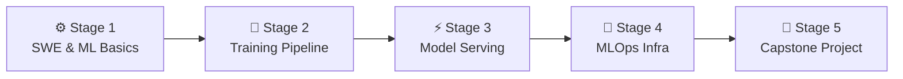

# 🧭 ML Engineer Career Roadmap

> **Tác giả:** Mr.Rom\
> **Phiên bản:** v2.0.0\
> **Tạo lúc:** 16/05/2026\
> **Cập nhật:** 26/05/2026\
> **Đối tượng:** Đã có nền tảng Machine Learning cơ bản (hoặc là Data Scientist), muốn chuyên sâu vào đưa mô hình vào môi trường sản xuất (ML Production & MLOps)\
> **Thời gian ước tính:** ~12 tháng học tập tích cực (full-time) hoặc ~24 tháng (part-time)\
> **Mức độ:** Junior → Mid (Sẵn sàng đảm nhận công việc thực tế)

---

## 🧭 Tình huống — Bạn đang ở đâu?

Bạn muốn trở thành một Machine Learning Engineer (MLE) — người mang các mô hình trí tuệ nhân tạo từ môi trường nghiên cứu (Jupyter Notebook) ra thế giới thực vận hành ở quy mô lớn. Nhưng bạn băn khoăn: *"Tại sao mô hình chạy thử nghiệm đạt độ chính xác 98% trên máy mình nhưng khi deploy lên server lại bị sập?"*, *"Làm sao để tự động hóa quy trình huấn luyện lại khi hành vi người dùng thay đổi?"*, *"Làm thế nào để phục vụ hàng ngàn request dự báo mỗi giây với độ trễ dưới 100ms?"*.

Nhiều người lầm tưởng ML Engineer chỉ là đi chỉnh sửa các siêu tham số (hyperparameters). **Mr.Rom muốn bạn hiểu rằng: ML Engineer là sự giao thoa hoàn hảo giữa Kỹ sư Phần mềm (Software Engineer) và Nhà khoa học Dữ liệu (Data Scientist). Kỹ năng tối thượng của bạn là xây dựng hệ thống MLOps — bao gồm Pipeline huấn luyện có khả năng tái lặp (Reproducible), tối ưu hóa kích thước mô hình (Quantization/ONNX), triển khai Model Serving hiệu năng cao và thiết lập giám sát độ trôi dữ liệu (Data Drift).**

👉 **Lộ trình ML Engineer này được chia làm 5 Stage phát triển kỹ năng:**

- **Stage 1**: Củng cố tư duy Lập trình phần mềm chuẩn mực kết hợp kiến thức Học máy nền tảng.
- **Stage 2**: Xây dựng Pipeline huấn luyện tự động và theo dõi thí nghiệm (Experiment Tracking).
- **Stage 3**: Tối ưu hóa mô hình và triển khai Model Serving API hiệu năng cao.
- **Stage 4**: Thiết lập hệ thống MLOps giám sát độ trôi dữ liệu và tự động huấn luyện lại.
- **Stage 5**: Hoàn thành dự án Capstone ML System chạy thực tế trên Kubernetes.

---

## 🗺️ Tổng quan Lộ trình 5 Stage

| Stage | Thời gian | Kết quả đầu ra |
|---|---|---|
| **Stage 1: SWE & ML Nền tảng** | 2-3 tháng | Viết code Python hướng đối tượng sạch, vững thuật toán ML, biết dùng Docker |
| **Stage 2: Pipeline Huấn luyện** | 2 tháng | Khai tử notebook, đóng gói code training có phân bản dữ liệu DVC |
| **Stage 3: Phục vụ mô hình (Serving)** | 2 tháng | Triển khai API FastAPI bọc model, biên dịch sang ONNX chạy tối ưu |
| **Stage 4: Kiến trúc MLOps** | 2-3 tháng | Tích hợp hệ thống đăng ký Model Registry, giám sát độ trôi dữ liệu |
| **Stage 5: Dự án Capstone** | 2 tháng | 1 hệ thống ML phục vụ thực tế tự động hóa 100% |

---

## ⚙️ Stage 1 — ML Basics & Software Engineering (2-3 tháng)

> 🎯 *Kỹ sư ML trước hết phải là một kỹ sư phần mềm giỏi viết code sạch và biết đóng gói container.*

### 📖 Câu chuyện dẫn dắt
*"Một file code Jupyter Notebook hỗn loạn dài 1000 dòng không bao giờ được phép đưa lên production. SRE sẽ từ chối deploy nó ngay lập tức. Bạn phải học cách cấu trúc code sạch, viết các class hướng đối tượng (OOP), viết unit test đầy đủ cho các hàm xử lý dữ liệu và sử dụng Docker để đóng gói môi trường chạy mô hình ổn định."*

### 📚 Các bài đọc bắt buộc (MUST-KNOW)
- [ ] [Python nâng cao (OOP, Type Hints)](../../03_languages/python/) ✅
- [ ] [Luồng làm việc với Git chuyên nghiệp](../../02_tools/git/) ✅
- [ ] [Cơ bản về Machine Learning & Deep Learning](../../13_ai-ml/ml-fundamentals/) 🚧 (bài ML Fundamentals) + [Deep Learning](../../13_ai-ml/deep-learning/) 🚧.
- **PyTorch Basics:** Khởi tạo tensor, thiết kế kiến trúc mạng nơ-ron đơn giản.
- [ ] [Docker cơ bản (Đóng gói ứng dụng)](../../10_devops/docker/) ✅
- **Testing:** Viết test suite bằng thư viện `pytest`.

### 🎯 Project thực hành Stage 1
**Dockerized PyTorch Training Script:** Viết script Python hướng đối tượng để huấn luyện một mô hình phân loại ảnh đơn giản bằng PyTorch, có viết Unit Test cho hàm tiền xử lý ảnh và đóng gói toàn bộ quy trình huấn luyện vào Docker.

> 🌉 **Cầu nối sang Stage 2**:
> *"Khi đã thành thạo việc viết code sạch đóng gói mô hình huấn luyện cơ bản, bạn sẽ nhận ra việc chạy các khối code ad-hoc trong Jupyter Notebook rất dễ bị mất dấu vết dữ liệu và không thể tự động hóa. Làm thế nào để cấu trúc một pipeline huấn luyện chuyên nghiệp có thể tái lặp? Hãy bước sang Stage 2: Training Pipeline & Experiment Tracking!"*

---

## 🔄 Stage 2 — Pipeline huấn luyện & Theo dõi thí nghiệm (2 tháng)

> 🎯 *Xây dựng quy trình huấn luyện có thể tái lặp 100% ở bất kỳ đâu và quản lý lịch sử các lần chạy thử nghiệm.*

### 📖 Câu chuyện dẫn dắt
Làm AI là quá trình thử nghiệm liên tục. Hôm nay bạn đổi siêu tham số này, ngày mai bạn đổi tập dữ liệu khác. Nếu không có công cụ quản lý, bạn sẽ sớm quên mất: *"File model đạt 95% độ chính xác tuần trước được huấn luyện bằng tập dữ liệu nào và cấu hình ra sao?"*. Stage này giúp bạn giải quyết việc đó bằng cách phân bản dữ liệu và ghi nhật ký tự động.

### 📚 Các bài đọc bắt buộc (MUST-KNOW)
- **Data Version Control (DVC):** Công cụ quản lý phiên bản của dữ liệu lớn (giống như Git nhưng chuyên dành cho file dữ liệu Terabyte).
- **Experiment Tracking:** Sử dụng MLflow hoặc Weights & Biases để tự động lưu lại các tham số, biểu đồ loss/accuracy của mọi lần chạy.
- **Config Management:** Sử dụng **Hydra** để quản lý các file cấu hình huấn luyện dưới dạng YAML.

### 🧪 Bài thực hành
- Sử dụng DVC để bám vết sự thay đổi của tập dữ liệu ảnh qua 3 phiên bản khác nhau.
- Viết training script kết nối với MLflow để tự động vẽ biểu đồ độ chính xác và lưu file model (.pth) lên Model Registry của MLflow mỗi khi kết thúc huấn luyện.

### 🎯 Project thực hành Stage 2
**Reproducible Training Pipeline:** Xây dựng một module Python huấn luyện tự động cấu hình qua Hydra, theo dõi chỉ số qua MLflow và phân bản dữ liệu qua DVC.

> 🌉 **Cầu nối sang Stage 3**:
> *"Pipeline huấn luyện của bạn đã cho ra lò những file model (.bin/.pth) chất lượng có lịch sử theo dõi chi tiết. Nhưng làm thế nào để bọc file model này vào một web service chạy ổn định dưới dạng API chịu tải cao cho Frontend gọi? Hãy bước sang Stage 3: Model Serving & API Optimization!"*

---

## ⚡ Stage 3 — Triển khai Model Serving & Tối ưu hóa API (2 tháng)

> 🎯 *Phục vụ mô hình thông qua API HTTP/gRPC với độ trễ cực thấp dưới tải nặng.*

### 📖 Câu chuyện dẫn dắt
*"Một mô hình AI chạy trong môi trường production phải phản hồi kết quả gần như tức thời. Nếu người dùng phải đợi 2 giây để nhận được gợi ý sản phẩm, họ sẽ bỏ đi. Bạn cần học cách bọc mô hình vào sau API FastAPI, biên dịch mô hình sang định dạng ONNX chạy nhanh hơn, và thực hiện load test hệ thống dưới tải nặng."*

### 📚 Các bài học bắt buộc (MUST-KNOW)
- **Model Serving Options:** FastAPI (cho các ứng dụng cơ bản), TorchServe (chuyên dụng PyTorch) hoặc Triton Inference Server (scale lớn chịu tải cao).
- **Model Optimization (Tối ưu hóa mô hình):** Biên dịch mô hình sang định dạng ONNX, áp dụng kỹ thuật lượng tử hóa (Quantization - chuyển từ float32 sang int8 để giảm kích thước model và tăng tốc chạy).
- **Inference Patterns:** Batch Inference (xử lý dự báo hàng loạt theo mẻ) vs Online Inference (trả kết quả ngay lập tức).

### 🧪 Bài thực hành
- Xây dựng API FastAPI bọc mô hình PyTorch, validate input bằng Pydantic.
- Biên dịch mô hình sang định dạng ONNX, viết code benchmark so sánh thời gian phản hồi (latency) trước và sau khi tối ưu.
- Sử dụng công cụ **k6** hoặc Locust chạy load test API đạt 500 requests mỗi giây.

> 🌉 **Cầu nối sang Stage 4**:
> *"API phục vụ mô hình của bạn đã chạy cực kỳ nhanh và tối ưu hóa bộ nhớ. Nhưng trong thực tế, hành vi của người dùng và dữ liệu bên ngoài sẽ thay đổi liên tục theo thời gian khiến chất lượng mô hình đi xuống (Model Decay). Làm thế nào để tự động hóa việc giám sát và kích hoạt huấn luyện lại? Hãy chuyển sang Stage 4: MLOps & Orchestration!"*

---

## 🤖 Stage 4 — Hạ tầng MLOps chuyên nghiệp (2-3 tháng)

> 🎯 *Thiết kế chu kỳ khép kín cho hệ thống ML: tự động hóa CI/CD, giám sát chất lượng và tự động huấn luyện lại.*

### 📖 Câu chuyện dẫn dắt
Sự khác biệt lớn nhất giữa DevOps truyền thống và MLOps là: code chạy đúng không có nghĩa là mô hình chạy đúng. Dữ liệu thực tế thay đổi (ví dụ: thói quen mua sắm thay đổi sau đại dịch) sẽ khiến mô hình đưa ra các dự báo sai lệch (Data Drift). Bạn cần thiết lập hệ thống tự động phát hiện độ lệch này để kích hoạt luồng tự động huấn luyện lại mô hình mới.

### 📚 Các bài học bắt buộc (MUST-KNOW)
- [ ] [CI/CD Pipelines cho ML](../../10_devops/ci-cd/) 🚧 — Tự động chạy test dữ liệu, test code và deploy model mới khi vượt qua bài kiểm tra chất lượng.
- **Model Monitoring:** Giám sát các chỉ số độ lệch dữ liệu (Data Drift) và độ lệch mô hình (Concept Drift) bằng thư viện Evidently.
- [ ] [Kubernetes Basics cho ML](../../10_devops/kubernetes/) 🚧 — Deploy model phục vụ chịu tải lớn.
- [ ] [Apache Airflow điều phối luồng ML](../../14_data-engineering/airflow-and-orchestration/) 🚧.

### 🎯 Project thực hành Stage 4
**Continuous Retraining Pipeline:** Xây dựng hệ thống Airflow định kỳ kiểm tra chất lượng model -> Nếu độ chính xác thực tế giảm dưới 90% -> Tự động chạy DAG huấn luyện lại với dữ liệu mới -> Đăng ký bản mới lên MLflow -> Tự động chạy test và deploy bản mới lên Kubernetes.

> 🌉 **Cầu nối sang Stage 5**:
> *"Chúc mừng bạn! Bạn đã nắm giữ toàn bộ bức tranh MLOps từ thu thập dữ liệu, huấn luyện, đăng ký model cho đến deploy K8s và giám sát. Giờ là lúc đưa tất cả các kỹ năng đó vào một dự án Capstone ML System thực chiến để khẳng định năng lực với nhà tuyển dụng. Hãy bước sang Stage 5!"*

---

## 🚀 Stage 5 — Dự án Capstone độc lập (2 tháng)

> 🎯 *Tự thiết kế và đưa vào vận hành một hệ thống ML System thực tế tự động hóa hoàn chỉnh.*

### 🚀 Ý tưởng dự án Capstone tốt nghiệp:
- **Real-time Credit Card Fraud Detection:** Hệ thống phát hiện gian lận thẻ tín dụng real-time. Ingest dữ liệu giao dịch liên tục qua Kafka -> PySpark preprocessing -> Gọi model serving API dự báo gian lận với độ trễ < 50ms -> Lưu vết kết quả -> Có dashboard giám sát tỉ lệ gian lận và cảnh báo Data Drift tự động.

---

## 🧭 Định hướng thăng tiến tiếp theo

Cơ hội mở rộng sự nghiệp của ML Engineer rất đa dạng:

| Lĩnh vực | Vai trò | Lộ trình liên quan |
|---|---|---|
| **Ứng dụng AI tạo sinh (LLM)** | Xây dựng chatbot, tác tử thông minh cho doanh nghiệp | [`ai-engineer`](./ai-engineer_career-roadmap.md) ✅ |
| **Xây dựng Data Pipelines lớn** | Chuyên tâm làm sạch và phân phối dữ liệu thô | [`data-engineer`](./data-engineer_career-roadmap.md) ✅ |
| **Thiết kế Platform phục vụ AI** | Xây dựng IDP chuyên dụng cho data science chạy GPU | [`platform-engineer`](./platform-engineer_career-roadmap.md) |

---

## 🔄 Hướng dẫn điều chỉnh lộ trình

- **Nếu bạn là một Data Scientist chuyển sang:** Hãy skip phần thuật toán cơ bản ở Stage 1 và dành 90% thời gian học code OOP, Git, Docker, Kubernetes và các công cụ MLOps.
- **Nếu bạn là một Backend/DevOps chuyển sang:** Hãy đi chậm ở Stage 1 để hiểu các thuật toán ML cơ bản và PyTorch trước khi chuyển sang làm serving ở Stage 3.
- **Đọc sách gối đầu giường:** Cuốn sách **Designing Machine Learning Systems (Chip Huyen)** là cẩm nang bắt buộc phải đọc đối với mọi kỹ sư ML.

---

## 📌 Changelog

- **v2.0.0 (26/05/2026)** — **Nâng cấp thành Narrative Master**:
  - Viết lại toàn bộ nội dung sang văn phong kể chuyện định hướng có chiều sâu và liên kết chặt chẽ.
  - Thiết lập các câu bắc cầu logic kết nối mượt mà giữa các Stage.
  - Cập nhật liên kết Git chính xác sang thư mục `02_tools/git/` ✅.
  - Bổ sung định hướng cụ thể về MLOps, ONNX Optimization và Data Drift Monitoring.
- **v1.0.0 (16/05/2026)** — Khởi tạo cấu trúc lộ trình ML Engineer cơ bản.
