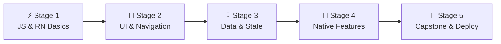

# 🧭 Mobile Developer Career Roadmap

> **Tác giả:** Mr.Rom\
> **Phiên bản:** v2.0.0\
> **Tạo lúc:** 16/05/2026\
> **Cập nhật:** 26/05/2026\
> **Đối tượng:** Đã có kiến thức lập trình cơ bản (ưu tiên JavaScript), muốn phát triển ứng dụng di động chạy trên iOS và Android\
> **Mức độ:** Junior → Mid (Sẵn sàng ứng tuyển và làm việc thực tế)

---

## 🧭 Tình huống — Bạn đang ở đâu?

Bạn muốn trở thành một Mobile Developer — người tạo nên những ứng dụng mượt mà chạy trực tiếp trên chiếc điện thoại nằm trong túi của hàng tỷ người. Nhưng bạn băn khoăn: *"Nên học lập trình thuần Native (học Swift cho iOS và Kotlin cho Android) hay học Cross-platform (React Native, Flutter)?"*, *"Làm sao để giao diện hiển thị đúng trên hàng ngàn kích cỡ màn hình thiết bị khác nhau?"*, *"Làm thế nào để đưa ứng dụng lên chợ ứng dụng App Store và Play Store?"*.

Lập trình di động có những đặc thù rất khác so với lập trình web. Điện thoại bị giới hạn về pin, RAM, CPU và kết nối mạng có thể chập chờn bất cứ lúc nào. **Mr.Rom đề xuất bạn bắt đầu bằng React Native (Cross-platform) vì nó cho phép bạn sử dụng cùng một codebase JavaScript/TypeScript và tư duy React để build app cho cả iOS và Android, giúp rút ngắn thời gian học tập và phát triển.**

👉 **Lộ trình Mobile Developer này được chia thành 5 Stage khoa học:**

- **Stage 1**: Củng cố JavaScript hiện đại và làm quen với bộ khung React Native cơ bản cùng công cụ Expo.
- **Stage 2**: Làm chủ thiết kế giao diện di động (Layout) và cơ chế điều hướng màn hình (Navigation).
- **Stage 3**: Quản lý trạng thái dữ liệu (State) và thiết kế ứng dụng hỗ trợ ngoại tuyến (Offline-First).
- **Stage 4**: Tương tác với phần cứng thiết bị (Camera, định vị GPS, sinh trắc học và thông báo đẩy).
- **Stage 5**: Hoàn thành dự án Capstone, đóng gói ứng dụng qua EAS và đẩy lên chợ App Store/Play Store.

---

## 🗺️ Tổng quan Lộ trình 5 Stage

| Stage | Kết quả đầu ra |
| --- | --- |
| **Stage 1: JS & React Native Basics** | Cài đặt giả lập thành công, viết được ứng dụng Hello World bằng Expo |
| **Stage 2: Giao diện & Điều hướng** | Dựng được app nhiều màn hình, di chuyển mượt mà qua các Tab/Drawer |
| **Stage 3: Dữ liệu & Offline Support** | Gọi API lấy dữ liệu, lưu dữ liệu offline bằng AsyncStorage/SQLite |
| **Stage 4: Tương tác phần cứng di động** | Tích hợp Camera chụp ảnh, định vị GPS bản đồ và gửi Push Notification |
| **Stage 5: Capstone & Triển khai** | Đóng gói hoàn chỉnh dự án và phát hành qua TestFlight / Google Play |

---

## ⚡ Stage 1 — JS & React Native Basics

> 🎯 *React Native sử dụng JavaScript và tư duy Component. Hãy làm chủ nền tảng trước khi viết app.*

### 📖 Câu chuyện dẫn dắt
*"Trước khi tạo ra giao diện di động, bạn phải hiểu cách React Native render giao diện. Khác với Web dùng các thẻ HTML (`
`, ``), React Native map trực tiếp code của bạn sang các view gốc (Native Views) của hệ điều hành thông qua các thẻ `<View>` và `<Text>`. Chúng ta sẽ bắt đầu một cách dễ thở nhất thông qua công cụ **Expo CLI**."*

### 📚 Các bài đọc bắt buộc (MUST-KNOW)
- [ ] [JavaScript ES2020+ nâng cao](../../03_languages/javascript-typescript/) 🚧 — Khai báo biến, Arrow functions, Array methods, Async/Await.
- **React Basics:** State, Props, Vòng đời Component và React hooks.
- [ ] [React Native là gì](../../08_mobile/react-native/) 🚧 — Cơ chế Bridge hoạt động giữa JS Thread và Native Thread.

### 🛠️ Setup môi trường
- Cài đặt Node.js LTS trên máy tính.
- Cài đặt ứng dụng **Expo Go** trên điện thoại thật để quét mã QR chạy thử code trực tiếp.
- Setup iOS Simulator (chỉ dành cho máy Mac chạy Xcode) hoặc Android Emulator (thông qua Android Studio) để test app local.

### 🎯 Project thực hành Stage 1
**Tip Calculator App:** Ứng dụng tính tiền tip đơn giản. Cho phép nhập số tiền hóa đơn, phần trăm tip, tự động tính toán số tiền cần trả và chia đều cho số người.

>  puente **Cầu nối sang Stage 2**:
> *"Khi đã tự tin chạy được ứng dụng Hello World trên mô phỏng điện thoại, bạn sẽ thấy ứng dụng của mình chỉ có một màn hình đơn điệu. Làm thế nào để điều hướng qua lại giữa các màn hình, thiết kế thanh menu tinh tế và đảm bảo hiển thị đẹp trên mọi kích thước màn hình? Hãy bước sang Stage 2: UI & Navigation!"*

---

## 📱 Stage 2 — Thiết kế giao diện & Điều hướng

> 🎯 *Làm chủ bố cục Flexbox di động, SafeAreaView và thiết kế luồng chuyển trang (Navigation).*

### 📖 Câu chuyện dẫn dắt
Bố cục Flexbox trong React Native mặc định xếp theo chiều dọc (column) — khác hoàn toàn so với Web (row). Bạn cũng phải học cách bảo vệ giao diện của mình không bị che khuất bởi "tai thỏ" (SafeAreaView) hay bị bàn phím ảo đẩy lệch (KeyboardAvoidingView). Điều hướng trang là thành phần sống còn giúp dẫn dắt người dùng đi qua luồng sử dụng của app.

### 📚 Các bài học bắt buộc (MUST-KNOW)
- **Flexbox Mobile:** Thuộc tính `flexDirection`, `justifyContent`, `alignItems` trên mobile.
- **SafeAreaView & Layout:** Tránh tai thỏ, phần khuyết màn hình và quản lý trạng thái bàn phím ảo.
- **React Navigation:** Thư viện điều phối trang phổ biến nhất. Làm chủ Stack Navigation (đi sâu vào chi tiết), Tab Navigation (thanh menu chân trang) và Drawer Navigation (menu trượt).
- **UI Libraries:** Làm quen với các bộ thư viện giao diện như React Native Paper hoặc Tamagui để thiết kế nhanh.

### 🎯 Project thực hành Stage 2
**Movie Browser UI:** Thiết kế app xem phim gồm trang danh sách phim (sử dụng Tab Navigation) và trang chi tiết phim (sử dụng Stack Navigation). Cấu hình chế độ sáng/tối (Dark Mode) cho app.

>  puente **Cầu nối sang Stage 3**:
> *"Trang giao diện của bạn đã rất đẹp mắt và di chuyển mượt mà. Tuy nhiên, nó vẫn chưa có dữ liệu thực tế và mọi cài đặt sẽ biến mất khi người dùng tắt app. Làm sao để gọi API lấy dữ liệu và lưu giữ thông tin người dùng ngay cả khi không có mạng? Hãy chuyển sang Stage 3: Data & State Management!"*

---

## 🗄️ Stage 3 — Quản lý dữ liệu & Trạng thái ngoại tuyến

> 🎯 *Gọi API backend mượt mà và lưu trữ dữ liệu dưới máy (AsyncStorage) để hỗ trợ chế độ Offline.*

### 📖 Câu chuyện dẫn dắt
*"Điện thoại là thiết bị di động, người dùng có thể đi vào thang máy hoặc vùng mất sóng. Một ứng dụng di động tốt không được hiện màn hình lỗi trắng xóa khi mất mạng. Bạn phải thiết kế ứng dụng theo chuẩn Offline-First: lưu dữ liệu tạm xuống máy, hiển thị dữ liệu cũ cho người dùng xem trước và đồng bộ lại khi có mạng."*

### 📚 Các bài học bắt buộc (MUST-KNOW)
- **Data Fetching:** Sử dụng TanStack Query (React Query) để tự động hóa việc cache dữ liệu gọi từ API và tự động fetch lại khi có mạng (network reconnect).
- **Global State:** Sử dụng **Zustand** để quản lý trạng thái toàn cục của ứng dụng.
- **Local Storage:** Sử dụng AsyncStorage (lưu key-value đơn giản) hoặc SQLite / MMKV (lưu dữ liệu lớn, tốc độ cao) trực tiếp trên điện thoại.
- **Form Handling:** Validate dữ liệu người dùng nhập bằng React Hook Form kết hợp thư viện Zod.

### 🎯 Project thực hành Stage 3
**Offline Note-taking App:** Ứng dụng ghi chú cá nhân. Cho phép thêm, sửa, xóa các ghi chú, tự động lưu lại vào SQLite/MMKV của điện thoại. Khi có kết nối mạng, tự động đồng bộ hóa các ghi chú này lên server backend qua API.

>  puente **Cầu nối sang Stage 4**:
> *"Ứng dụng của bạn giờ đây đã có 'trí nhớ' và tự động sync dữ liệu. Nhưng điều làm nên sự khác biệt thực sự của một ứng dụng di động so với web là khả năng tương tác trực tiếp với phần cứng của thiết bị và gửi thông báo trực tiếp cho người dùng. Hãy chuyển sang Stage 4: Native Features & Hardware Access!"*

---

## 🔌 Stage 4 — Tương tác phần cứng thiết bị

> 🎯 *Tích hợp Camera, GPS định vị bản đồ, gửi Push Notification và sinh trắc học bảo mật.*

### 📖 Câu chuyện dẫn dắt
Đây là lúc ứng dụng di động của bạn phát huy sức mạnh vượt trội so với Web. Bạn sẽ viết code yêu cầu người dùng cấp quyền truy cập máy ảnh để chụp ảnh avatar, dùng GPS để lấy tọa độ vị trí hiện tại hiển thị lên bản đồ và gửi các thông báo đẩy (Push Notifications) để lôi kéo người dùng quay lại app.

### 📚 Các bài học bắt buộc (MUST-KNOW)
- **Expo SDK Hardware:** Sử dụng `expo-image-picker` để chọn ảnh từ thư viện hoặc chụp ảnh bằng camera.
- **Location & Maps:** Sử dụng `expo-location` lấy tọa độ kinh độ/vĩ độ hiện tại và hiển thị lên bản đồ Google Maps/Apple Maps bằng thư viện `react-native-maps`.
- **Push Notifications:** Thiết lập gửi thông báo đẩy cục bộ (Local Notifications) hoặc qua server Firebase Cloud Messaging (FCM).
- **Biometric Authentication:** Sử dụng Face ID / Touch ID để đăng nhập nhanh qua thư viện `expo-local-authentication`.
- **Animations:** Tạo các hiệu ứng chuyển động mượt mà bằng thư viện **React Native Reanimated**.

### 🎯 Project thực hành Stage 4
**Travel Diary App:** Ứng dụng nhật ký du lịch. Cho phép người dùng tạo một bài viết nhật ký, chụp ảnh bằng camera của điện thoại và tự động gắn vị trí GPS hiện tại (tên thành phố/tọa độ) hiển thị trực quan trên bản đồ của bài viết đó.

>  puente **Cầu nối sang Stage 5**:
> *"Tuyệt vời! Bạn đã làm chủ hầu hết các tính năng phần cứng và chuyển động mượt mà của điện thoại. Giờ là lúc kết nối toàn bộ chúng vào một dự án Capstone hoàn chỉnh, đóng gói và submit lên App Store / Play Store để bất kỳ ai cũng có thể tải về. Hãy tiến vào Stage 5!"*

---

## 🚀 Stage 5 — Capstone Project & Phát hành

> 🎯 *Tự phát triển một ứng dụng hoàn chỉnh và đưa lên TestFlight (iOS) / Internal Testing (Android).*

### 🚀 Ý tưởng dự án Capstone (Chọn 1):
- **Workout Tracker (Theo dõi thể thao):** Tích hợp bản đồ GPS vẽ lại quãng đường chạy bộ của người dùng, đo thời gian chạy, tính lượng calo tiêu thụ và hiển thị thông báo khích lệ hàng ngày.
- **Expense Tracker (Quản lý chi tiêu):** Chụp ảnh hóa đơn mua hàng (camera), tự động phân tích lưu dữ liệu chi tiêu, vẽ biểu đồ chi tiết (sử dụng thư viện vẽ chart mobile) và xuất báo cáo CSV.

### 🛠️ Quy trình đóng gói và phát hành bắt buộc:
- Cấu hình Icon cho app và màn hình khởi động (Splash Screen).
- Sử dụng công cụ **EAS Build** (Expo Application Services) để đóng gói app thành file `.ipa` (cho iOS) hoặc `.apk` / `.aab` (cho Android) trên server cloud của Expo.
- Upload ứng dụng lên Apple TestFlight và Google Play Console (môi trường Internal Test) để gửi link cho bạn bè cài đặt thử nghiệm trên điện thoại thật.

---

## 🧭 Định hướng thăng tiến tiếp theo

Từ React Native, bạn có thể thăng tiến theo các hướng:

| Lĩnh vực | Vai trò | Lộ trình liên quan |
|---|---|---|
| **Chuyên sâu Native iOS pure** | Học ngôn ngữ Swift và framework SwiftUI | Lập trình viên iOS chuyên nghiệp |
| **Chuyên sâu Native Android pure**| Học ngôn ngữ Kotlin và framework Jetpack Compose | Lập trình viên Android chuyên nghiệp |
| **Lập trình viên toàn năng (Full-stack)** | Học thêm Node.js / FastAPI để tự viết API cho app | [`fullstack-developer`](./fullstack-developer_career-roadmap.md) ✅ |

---

## 🔄 Hướng dẫn điều chỉnh lộ trình

- **Nếu bạn không có máy tính Mac (chỉ có Windows/Linux):** Bạn vẫn có thể học và lập trình React Native bình thường. Sử dụng Expo CLI kết hợp ứng dụng Expo Go trên điện thoại iPhone/Android thật để test code. Tuy nhiên, việc build file `.ipa` cuối cùng để submit lên App Store của Apple sẽ yêu cầu server cloud EAS của Expo (hỗ trợ build cloud miễn phí).
- **Học thêm Flutter:** Nếu bạn thấy Flutter (sử dụng ngôn ngữ Dart) phổ biến hơn ở các công ty mục tiêu của bạn, hãy chuyển hướng sang Flutter. Tư duy Component, Navigation, State và gọi Native Features của Flutter tương đồng 90% với React Native.

---

## 📌 Nhật ký thay đổi (Changelog)

- **v2.0.0 (26/05/2026)** — **Nâng cấp thành Narrative Master**:
  - Viết lại toàn bộ nội dung sang văn phong kể chuyện định hướng có chiều sâu và liên kết chặt chẽ.
  - Thiết lập các câu bắc cầu logic kết nối mượt mà giữa các Stage.
  - Cập nhật liên kết Git chính xác sang thư mục `02_tools/git/` ✅.
  - Bổ sung định hướng chi tiết về Expo CLI, EAS Build và Offline-first patterns.
- **v1.0.0 (16/05/2026)** — Khởi tạo cấu trúc lộ trình Mobile Developer cơ bản.
