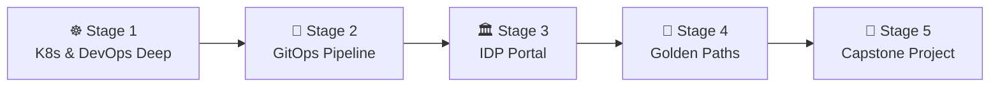

# 🧭 Platform Engineer Career Roadmap

> **Tác giả:** Mr.Rom\
> **Phiên bản:** v2.0.0\
> **Tạo lúc:** 16/05/2026\
> **Cập nhật:** 26/05/2026\
> **Đối tượng:** Đã có kinh nghiệm làm DevOps/SRE, muốn chuyển hướng xây dựng nền tảng và tối ưu hóa trải nghiệm nhà phát triển (Developer Experience - DX)\
> **Thời gian ước tính:** ~10-12 tháng học tập tích cực (full-time)\
> **Mức độ:** Mid → Senior (Lộ trình chuyên sâu yêu cầu nền tảng vận hành vững chắc)

---

## 🧭 Tình huống — Bạn đang ở đâu?

Bạn muốn trở thành một Platform Engineer — vai trò đang bùng nổ mạnh mẽ nhất trong thế giới vận hành hạ tầng hiện đại. Nhưng bạn băn khoăn: *"Platform Engineer thực chất khác gì DevOps hay SRE truyền thống?"*, *"Làm sao để giảm tải gánh nặng công nghệ cho lập trình viên mà không làm họ mất quyền kiểm soát hệ thống?"*, *"Làm thế nào để một lập trình viên mới vào công ty tự tạo database, tự deploy app chỉ trong 5 phút mà không cần mở ticket nhờ DevOps cấu hình?"*.

Trong kỷ nguyên đám mây (Cloud Native), lập trình viên đang bị "quá tải nhận thức" (Cognitive Load). Họ vừa phải lo logic code, vừa phải học Docker, Kubernetes, Helm, Terraform, cấu hình IAM của AWS, viết pipeline CI/CD... **Mr.Rom muốn nhấn mạnh rằng: Platform Engineer sinh ra để giải quyết nỗi đau đó. Bạn không chỉ đi deploy code cho họ. Bạn là người xây dựng Internal Developer Platform (IDP) — Cổng dịch vụ nội bộ tự phục vụ (Self-service), cung cấp các "Đường đi trải vàng" (Golden Paths) giúp lập trình viên tự tạo hạ tầng nhanh nhất và an toàn nhất.**

👉 **Lộ trình Platform Engineer này sẽ đưa bạn đi qua 5 Stage phát triển kỹ năng:**

- **Stage 1**: Củng cố sâu kiến thức điều phối container Kubernetes và hạ tầng Terraform.
- **Stage 2**: Làm chủ kỹ nghệ GitOps để đồng bộ hóa hạ tầng tự động từ mã nguồn.
- **Stage 3**: Thiết kế Cổng thông tin dịch vụ nội bộ IDP sử dụng Backstage/Port.
- **Stage 4**: Xây dựng các mẫu tự động hóa (Golden Paths) giảm thiểu thời gian onboarding.
- **Stage 5**: Hoàn thành dự án Capstone IDP quy mô lớn cho doanh nghiệp.

---

## 🗺️ Tổng quan Lộ trình 5 Stage

| Stage | Thời gian | Kết quả đầu ra |
|---|---|---|
| **Stage 1: Nền tảng DevOps & K8s Deep** | 2-3 tháng | Làm chủ nâng cao Kubernetes, viết Custom Resource Definitions (CRDs) |
| **Stage 2: Quy trình GitOps** | 2 tháng | Đồng bộ hóa tự động K8s cluster thông qua ArgoCD hoặc Flux |
| **Stage 3: Cổng dịch vụ IDP** | 2 tháng | Dựng thành công Service Catalog trung tâm quản lý mọi microservices |
| **Stage 4: Golden Paths & Templates** | 2 tháng | Viết mẫu template tự động khởi tạo và cấu hình dự án chỉ bằng 1 PR |
| **Stage 5: Dự án Capstone** | 2 tháng | 1 hệ thống IDP hoàn chỉnh cho phép dev tự đăng ký và deploy tự trị |

---

## ☸️ Stage 1 — DevOps & Kubernetes Deep (2-3 tháng)

> 🎯 *Platform Engineer cần hiểu Kubernetes ở mức độ sâu sắc nhất của một kiến trúc sư hệ thống.*

### 📖 Câu chuyện dẫn dắt
*"Trước khi muốn che giấu đi sự phức tạp của Kubernetes để giúp đội Dev dễ dùng hơn, bạn phải là người làm chủ sự phức tạp đó. Bạn cần hiểu cách viết các K8s Operators để định nghĩa các tài nguyên riêng (Custom Resources), viết Helmfile để quản lý nhiều chart và biết cách viết code cấu hình hạ tầng Terraform chuẩn chỉ."*

### 📚 Các bài đọc bắt buộc (MUST-KNOW)
- [ ] [Lộ trình DevOps Engineer](./devops-engineer_career-roadmap.md) ✅ — Hoàn thành trọn vẹn kỹ năng Kubernetes và IaC Terraform.
- [ ] **Custom Resource Definitions (CRD) & Operators:** Học cách mở rộng Kubernetes API, viết các Controller đơn giản (sử dụng Kubebuilder hoặc KOPF).
- [ ] [Terraform & Helm nâng cao](../../10_devops/iac/) 🚧 — Quản lý cấu hình hạ tầng và đóng gói app ở quy mô lớn.

> 🌉 **Cầu nối sang Stage 2**:
> *"Khi đã làm chủ được các khối gạch hạ tầng Docker, Kubernetes và Terraform, bạn sẽ thấy việc yêu cầu đội Dev tự viết file manifest K8s hay tự chạy cấu hình là một gánh nặng lớn gây chậm trễ. Làm thế nào để tự động hóa hoàn toàn luồng deploy thông qua Git? Hãy cùng bước sang Stage 2: GitOps!"*

---

## 🔄 Stage 2 — Kỹ nghệ GitOps (2 tháng)

> 🎯 *Khai báo hạ tầng dưới dạng mã nguồn khai báo và đồng bộ tự động kéo (Pull-based CD).*

### 📖 Câu chuyện dẫn dắt
Sử dụng script để đẩy code deploy (Push-based CD) rất dễ bị trôi cấu hình (Drift) giữa thực tế và mã nguồn. GitOps thay đổi tư duy này bằng cách đặt toàn bộ trạng thái mong muốn của hệ thống vào Git. Một công cụ chạy trong Kubernetes (như ArgoCD) sẽ liên tục so sánh: *"Thực tế đang chạy có giống như file cấu hình trên Git không?"* và tự động kéo cấu hình mới nhất về cập nhật.

### 📚 Các bài đọc bắt buộc (MUST-KNOW)
- [ ] [Khái niệm GitOps & ArgoCD](../../10_devops/gitops/) 🚧 — Hiểu mô hình Pull-based CD và cấu trúc App-of-Apps pattern.
- **Sealed Secrets / External Secrets Operator:** Cách quản lý mật khẩu, khóa API an toàn trên Git (mã hóa bất đối xứng trước khi push lên GitHub).
- **Progressive Delivery:** Kỹ thuật phát hành ứng dụng an toàn qua Canary Deployment, Blue/Green Deployment sử dụng Argo Rollouts.

### 🎯 Project thực hành Stage 2
**ArgoCD Multi-Environment Setup:** Cấu hình ArgoCD quản lý 3 môi trường Dev, Staging, Production cho một ứng dụng, tự động đồng bộ khi merge PR và quản lý Secret an toàn thông qua HashiCorp Vault.

> 🌉 **Cầu nối sang Stage 3**:
> *"Hạ tầng của bạn đã tự động đồng bộ qua Git. Nhưng đối với lập trình viên, họ vẫn phải tự tay viết các file YAML K8s phức tạp để khai báo ứng dụng. Làm thế nào để giấu đi sự phức tạp này phía sau một giao diện catalog trực quan? Hãy chuyển sang Stage 3: Xây dựng Internal Developer Platform (IDP)!"*

---

## 🏛️ Stage 3 — Cổng dịch vụ Internal Developer Platform (2 tháng)

> 🎯 *Tập hợp mọi dịch vụ, tài liệu và mối quan hệ hệ thống vào một Cổng thông tin trung tâm.*

### 📖 Câu chuyện dẫn dắt
Một lập trình viên mới vào công ty thường mất 2 tuần chỉ để hỏi han: *"Service này của ai quản lý?"*, *"Tài liệu API đọc ở đâu?"*, *"Xem log ứng dụng này ở kênh nào?"*. Platform Engineer giải quyết việc này bằng cách dựng một giao diện Portal trung tâm (IDP) gom tất cả thông tin lại một nơi, hỗ trợ tự phục vụ.

### 📚 Các bài đọc bắt buộc (MUST-KNOW)
- **IDP Concepts:** Tìm hiểu mô hình tổ chức Team Topologies (Platform Team phục vụ Stream-aligned Team).
- **Spotify Backstage (Open Source IDP):** Cổng portal tiêu chuẩn công nghiệp giúp quản lý Service Catalog và viết plugins.
- **Crossplane (IaC Cloud Native):** Dịch vụ giúp dev tạo database (AWS RDS) trực tiếp bằng cách viết file cấu hình Kubernetes thay vì dùng Terraform.

### 🧪 Bài thực hành
- Cài đặt Backstage local và import các repository của bạn vào Service Catalog.
- Kết nối plugin ArgoCD và Kubernetes vào Backstage để lập trình viên có thể xem trực tiếp trạng thái pod đang chạy mà không cần gõ lệnh kubectl.

### 🎯 Project thực hành Stage 3
**Service Catalog Portal:** Dựng cổng thông tin Backstage quản lý 5 microservices, hiển thị rõ sơ đồ quan hệ phụ thuộc (dependencies), tài liệu API và thông tin liên hệ của nhóm sở hữu.

> 🌉 **Cầu nối sang Stage 4**:
> *"Bạn đã dựng thành công cổng thông tin Catalog quản lý mọi dịch vụ. Tuy nhiên, Catalog chỉ là nơi hiển thị. Khi lập trình viên muốn tạo một dự án mới hoàn toàn, làm thế nào để họ tự động có sẵn repo, pipeline CI/CD và môi trường deploy chỉ bằng vài nút bấm? Hãy chuyển sang Stage 4: Thiết lập Golden Paths & Templates!"*

---

## 📐 Stage 4 — Đường đi trải vàng (Golden Paths) & Templates (2 tháng)

> 🎯 *Thiết lập luồng tự phục vụ khởi tạo dự án nhanh chóng, tuân thủ đúng chuẩn bảo mật và kiến trúc của công ty.*

### 📖 Câu chuyện dẫn dắt
*"Golden Path là con đường dễ đi nhất cho nhà phát triển. Bạn viết sẵn một Software Template (ví dụ 'FastAPI Microservice'). Khi Dev click nút 'Tạo mới' trên Portal → Hệ thống tự sinh code mẫu → Tự tạo GitHub repo → Tự setup CI/CD pipeline → Tự tạo database -> Tự cấu hình ArgoCD. Chỉ mất 2 phút, Dev đã có một môi trường chạy live sẵn sàng viết code mà không cần tự tay setup hạ tầng từ đầu."*

### 📚 Các bài học bắt buộc (MUST-KNOW)
- **Backstage Software Templates (Scaffolder):** Sử dụng các file template YAML để tự động hóa các bước gõ lệnh khởi tạo.
- **Scaffolding Tools:** Làm quen với Cookiecutter hoặc Yeoman để viết sinh cấu trúc code mẫu (scaffolding).
- **Cost Showback & FinOps:** Tích hợp hiển thị chi phí server ước tính của từng dự án lên Portal để Dev nâng cao ý thức tiết kiệm tài nguyên Cloud.

### 🎯 Project thực hành Stage 4
**Golden Path "One-Click Service Setup":** Viết template Backstage cho phép lập trình viên nhập tên dự án và ngôn ngữ → Hệ thống tự động tạo repo, thiết lập CI/CD, tạo database PostgreSQL trên Cloud qua Crossplane và deploy trang Hello World lên Kubernetes.

> 🌉 **Cầu nối sang Stage 5**:
> *"Bạn đã có đầy đủ linh hồn của Platform Engineering: từ điều phối K8s, GitOps tự động cho đến cổng portal tự phục vụ. Giờ là lúc kết hợp tất cả để tạo dựng một nền tảng IDP hoàn chỉnh phục vụ cho toàn bộ doanh nghiệp. Hãy bước sang Stage 5: Capstone Project!"*

---

## 🚀 Stage 5 — Dự án Capstone độc lập (2 tháng)

> 🎯 *Xây dựng và đưa vào vận hành một hệ thống Internal Developer Platform (IDP) hoàn chỉnh quy mô lớn.*

### 🚀 Ý tưởng dự án Capstone:
- **Enterprise-ready IDP:** Thiết lập cổng Backstage hoàn chỉnh tích hợp xác thực SSO (Google/GitHub Auth) -> Sử dụng Crossplane để quản lý tài nguyên AWS -> Dựng hệ thống GitOps qua ArgoCD -> Cung cấp 3 Software Templates (React frontend, FastAPI backend, Node.js API) -> Tích hợp hệ thống theo dõi chi phí (Kubecost) và hiển thị trực tiếp lên portal cho lập trình viên.

---

## 🧭 Định hướng thăng tiến tiếp theo

Platform Engineer là nấc thang cao của kỹ sư vận hành hạ tầng:

| Sau lộ trình này, bạn có thể thăng tiến lên... | Vai trò |
|---|---|
| **Staff / Principal Platform Engineer** | Thiết kế kiến trúc nền tảng cho tập đoàn lớn hàng ngàn kỹ sư |
| **Developer Experience (DX) Manager** | Quản lý đội ngũ chuyên tâm cải thiện hiệu suất làm việc của dev |

---

## 🔄 Hướng dẫn điều chỉnh lộ trình

- **Nếu Backstage quá nặng và phức tạp:** Hãy bắt đầu với **Port** (getport.io) — một nền tảng IDP thương mại có gói miễn phí, hỗ trợ kéo thả cấu hình cực kỳ nhanh, giúp bạn hiểu tư duy thiết kế trước khi tự code/custom Backstage bằng TypeScript.
- **Đọc sách gối đầu giường:** Cuốn sách **Team Topologies** là cẩm nang bắt buộc phải đọc để hiểu cách tổ chức Platform Team hiệu quả trong doanh nghiệp.

---

## 📌 Changelog

- **v2.0.0 (26/05/2026)** — **Nâng cấp thành Narrative Master**:
  - Biên soạn lại toàn bộ nội dung theo văn phong kể chuyện định hướng có chiều sâu.
  - Thiết lập các câu bắc cầu logic kết nối mượt mà giữa các Stage.
  - Cập nhật liên kết Git chính xác sang thư mục `02_tools/git/` ✅.
  - Bổ sung định nghĩa chuẩn xác về Cognitive Load, Golden Paths và vai trò của Crossplane.
- **v1.0.0 (16/05/2026)** — Khởi tạo cấu trúc lộ trình Platform Engineering cơ bản.
