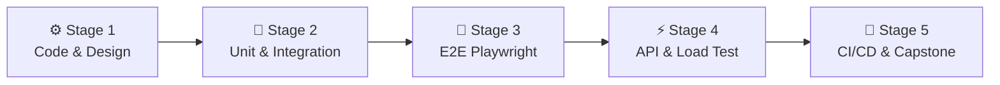

# 🧭 QA Engineer Career Roadmap

> **Tác giả:** Mr.Rom\
> **Phiên bản:** v2.0.0\
> **Tạo lúc:** 16/05/2026\
> **Cập nhật:** 26/05/2026\
> **Đối tượng:** Muốn trở thành Kỹ sư Kiểm thử Tự động hóa hiện đại (Automation QA / SDET), không đi theo hướng kiểm thử thủ công (Manual QA) truyền thống\
> **Mức độ:** Junior → Mid (Sẵn sàng thiết kế và vận hành các bộ khung test tự động)

---

## 🧭 Tình huống — Bạn đang ở đâu?

Bạn muốn trở thành một Kỹ sư QA (Đảm bảo Chất lượng) — người giữ chốt chặn cuối cùng cho chất lượng sản phẩm trước khi đến tay người dùng. Nhưng bạn băn khoăn: *"Nghề QA có phải chỉ là đi click chuột thủ công tìm lỗi (Manual Test)?"*, *"Nên chọn học ngôn ngữ nào: Java, Python hay JavaScript để viết test tự động?"*, *"Làm sao để kịch bản test tự động chạy giả lập trình duyệt y hệt như người dùng thật mà không bị gián đoạn hay báo lỗi giả?"*.

Trong kỷ nguyên phát triển phần mềm hiện đại, manual tester truyền thống đang dần được thay thế bởi vai trò **SDET (Software Development Engineer in Test)**. **Mr.Rom muốn nhấn mạnh rằng: QA hiện đại không đi sau dọn rác cho Dev. Bạn viết code để tự động hóa toàn bộ quy trình kiểm thử. Kỹ năng cốt lõi của bạn là nắm vững Kim tự tháp kiểm thử (Test Pyramid), thiết kế kịch bản test thông minh, làm chủ công cụ giả lập trình duyệt (Playwright), kiểm thử API và chạy Load Test đánh giá hiệu năng.**

👉 **Lộ trình QA Automation này gồm 5 Stage thực chiến:**

- **Stage 1**: Xây dựng nền tảng tư duy thiết kế test case và kỹ năng lập trình (Python/JS).
- **Stage 2**: Kiểm thử cấp độ thấp: viết Unit Test và Integration Test trực tiếp trên mã nguồn.
- **Stage 3**: Kiểm thử giao diện người dùng đầu-cuối (E2E UI Testing) sử dụng công cụ Playwright.
- **Stage 4**: Kiểm thử hiệu năng hệ thống (Load Testing) và kiểm thử API tự động.
- **Stage 5**: Tích hợp các bộ test tự động vào pipeline CI/CD và hoàn thiện Capstone Project.

---

## 🗺️ Tổng quan Lộ trình 5 Stage

| Stage | Kết quả đầu ra |
| --- | --- |
| **Stage 1: Nền tảng lập trình & Test** | Làm chủ Python/JS cơ bản, hiểu cấu trúc Kim tự tháp Test |
| **Stage 2: Unit & Integration Test** | Viết test logic code đạt độ phủ coverage > 80% cho dự án |
| **Stage 3: E2E UI Test (Playwright)** | Viết kịch bản tự động mở trình duyệt click chọn, điền form |
| **Stage 4: API & Performance Testing** | Viết test schema API, chạy load test đo RPS/Latency qua k6 |
| **Stage 5: CI/CD & Capstone Project** | Tự động chạy test suite khi push code, xuất báo cáo trực quan |

---

## ⚙️ Stage 1 — Lập trình & Tư duy Thiết kế Test Case

> 🎯 *Kỹ sư QA Automation trước hết phải là một lập trình viên. Bạn cần vững code và tư duy thiết kế ca kiểm thử.*

### 📖 Câu chuyện dẫn dắt
*"Trước khi bắt tay vào viết script chạy test tự động, bạn phải học cách thiết kế một ca kiểm thử (Test Case) thông thái. Nếu tư duy thiết kế test case của bạn tệ, bạn sẽ viết ra những kịch bản test tự động lặp đi lặp lại vô ích hoặc bỏ sót các lỗi biên nghiêm trọng. Chúng ta sẽ bắt đầu bằng việc học ngôn ngữ Python (hoặc JavaScript) kết hợp với các kỹ thuật phân tích biên kinh điển."*

### 📚 Các bài đọc bắt buộc (MUST-KNOW)
- [ ] [Nền tảng ngôn ngữ Python](../../03_languages/python/) ✅ hoặc [JavaScript](../../03_languages/javascript-typescript/) 🚧.
- [ ] [Làm chủ dòng lệnh Terminal và Git](../../02_tools/git/) ✅ — Quản lý mã nguồn test của bạn trên GitHub.
- **Test Design Techniques:** Phân tích giá trị biên (Boundary Value Analysis), phân vùng tương đương (Equivalence Partitioning) và bảng quyết định (Decision Table).
- **Test Pyramid:** Hiểu cấu trúc kim tự tháp kiểm thử: Unit Test (nhiều nhất, nhanh nhất) -> Integration Test -> E2E Test (ít nhất, chậm nhất).
- **AAA Pattern (Arrange-Act-Assert):** Chuẩn cấu trúc của mọi đoạn code test.

> 🌉 **Cầu nối sang Stage 2**:
> *"Khi đã nắm được tư duy phân chia các tầng test và biết viết code cơ bản, bạn đã sẵn sàng đi từ chân kim tự tháp: viết các bài test nhỏ nhất, chạy nhanh nhất trực tiếp trên code logic. Hãy bước sang Stage 2: Unit & Integration Testing!"*

---

## 🧪 Stage 2 — Unit & Integration Testing

> 🎯 *Viết code test logic của ứng dụng, mock các dịch vụ ngoài và kiểm thử tích hợp cơ sở dữ liệu.*

### 📖 Câu chuyện dẫn dắt
Unit Test giúp lập trình viên phát hiện lỗi ngay khi vừa viết xong một hàm nhỏ. Integration Test kiểm tra xem khi kết hợp hàm đó với cơ sở dữ liệu thực tế thì có chạy đúng không. Bạn sẽ học cách viết các bộ test chạy cực nhanh, cách sử dụng các đối tượng giả lập (Mocking) để cô lập kiểm thử mà không cần gọi API thật.

### 📚 Các bài học bắt buộc (MUST-KNOW)
- **Test Frameworks:** Làm chủ thư viện `pytest` (cho Python) hoặc Vitest/Jest (cho JavaScript).
- **Fixtures:** Cách thiết lập môi trường trước khi chạy test (Setup) và dọn dẹp dữ liệu sau khi test xong (Teardown).
- **Mocking:** Kỹ thuật làm giả dữ liệu trả về của các dịch vụ bên ngoài (như làm giả API thời tiết) để test không bị phụ thuộc.
- **Code Coverage:** Đo lường độ bao phủ code (tỷ lệ phần trăm dòng code được test đi qua, mục tiêu đạt > 80%).

### 🎯 Project thực hành Stage 2
**Test Suite for CRUD App:** Viết bộ test suite bằng `pytest` đạt coverage > 80% cho một ứng dụng quản lý sách, sử dụng `testcontainers` để chạy một database PostgreSQL thật trong Docker phục vụ việc chạy integration test.

> 🌉 **Cầu nối sang Stage 3**:
> *"Bạn đã biết cách kiểm thử từng hàm logic cô lập và kết nối DB. Tuy nhiên, để đảm bảo toàn bộ hệ thống hoạt động hoàn hảo dưới góc nhìn của khách hàng trên trình duyệt thực tế, bạn cần giả lập các thao tác bấm nút, điền form của người dùng. Hãy chuyển sang Stage 3: E2E & UI Testing với Playwright!"*

---

## 📱 Stage 3 — E2E & UI Testing với Playwright

> 🎯 *Viết mã nguồn giả lập trình duyệt thật, tương tác với giao diện và chống hiện tượng test chạy chập chờn (flaky tests).*

### 📖 Câu chuyện dẫn dắt
*"Trước đây, Selenium là ông vua của mảng UI Testing. Nhưng trong thế giới web hiện đại, Playwright (phát triển bởi Microsoft) đã vươn lên trở thành tiêu chuẩn mới nhờ tốc độ cực nhanh, cơ chế tự động đợi (Auto-wait) giúp hạn chế tối đa việc test bị lỗi do trang web tải chưa kịp, và khả năng chạy test song song trên nhiều trình duyệt khác nhau."*

### 📚 Các bài đọc bắt buộc (MUST-KNOW)
- **Playwright Core:** Cách chọn phần tử (Locators), thực hiện hành động (Actions: click, fill, hover) và so sánh kết quả (Assertions).
- **Page Object Model (POM):** Mô hình thiết kế code test chuẩn mực: chia mỗi trang web thành một Class để dễ bảo trì khi giao diện thay đổi.
- **Trace Viewer:** Công cụ ghi lại video, ảnh chụp và network logs của quá trình test giúp debug tìm lỗi cực nhanh khi kịch bản test bị fail.
- **Visual Regression Testing:** So sánh hình ảnh giao diện pixel-by-pixel để phát hiện lỗi giao diện bị vỡ.

### 🧪 Bài tập thực hành
- Viết kịch bản Playwright giả lập luồng: Mở trang web bán hàng → Tìm kiếm sản phẩm → Thêm vào giỏ → Điền thông tin thanh toán → Xác nhận đơn hàng thành công.
- Cấu hình chạy test song song trên cả 3 trình duyệt Chrome, Firefox và Safari.

### 🎯 Project thực hành Stage 3
**E2E Test Suite for E-commerce:** Viết bộ kịch bản test UI gồm 20 kịch bản khác nhau cho một trang web bán hàng thực tế áp dụng mô hình thiết kế POM.

> 🌉 **Cầu nối sang Stage 4**:
> *"Kịch bản test giao diện của bạn đã chạy rất mượt. Nhưng giao diện chỉ là bề nổi. Mọi dữ liệu đều được xử lý qua API backend và hệ thống có thể bị sập nếu có quá nhiều người dùng cùng truy cập một lúc. Làm sao để test API tự động và đánh giá khả năng chịu tải? Hãy chuyển sang Stage 4: API & Performance Testing!"*

---

## ⚡ Stage 4 — API & Performance Testing

> 🎯 *Kiểm thử tự động các endpoints API và chạy giả lập hàng ngàn người dùng để kiểm tra giới hạn chịu tải.*

### 📖 Câu chuyện dẫn dắt
Giao diện có thể thay đổi liên tục, nhưng hợp đồng dữ liệu API thì phải cực kỳ ổn định. Bạn cần viết code để kiểm thử tự động các API xem có trả về đúng định dạng dữ liệu (JSON Schema) và đúng mã lỗi không. Ngoài ra, bạn sẽ học cách dùng công cụ **k6** để chạy Load Test nhằm trả lời câu hỏi: *"Hệ thống có sập khi 1000 người dùng cùng ấn nút mua hàng một lúc không?"*.

### 📚 Các bài học bắt buộc (MUST-KNOW)
- **API Automation Testing:** Sử dụng `pytest` kết hợp thư viện `httpx` (hoặc Supertest cho Node) để gửi request, validate JSON Schema và JWT Token bảo mật.
- **Load Testing với k6:** Viết kịch bản load test bằng JavaScript bằng công cụ **k6** để giả lập các cấp độ tải (Stress Test, Spike Test).
- **Chỉ số hiệu năng:** Hiểu rõ các thông số RPS (Request per second), Latency (độ trễ p50, p95, p99) và Error Rate.

### 🎯 Project thực hành Stage 4
**API & Load Test Suite:** Viết bộ API test tự động gồm 30 kịch bản bao phủ các API Đăng nhập, Đăng bài, Bình luận. Đồng thời viết kịch bản k6 chạy stress test API Đăng nhập lên 500 RPS và viết báo cáo chỉ ra điểm nghẽn hiệu năng của server.

> 🌉 **Cầu nối sang Stage 5**:
> *"Bạn đã có đầy đủ các bộ test từ unit, E2E cho đến API và tải hiệu năng. Bước cuối cùng để trở thành một SDET thực thụ là đưa toàn bộ các bài test này vào pipeline CI/CD chạy hoàn toàn tự động mỗi khi dev push code mới và hiển thị báo cáo trực quan. Hãy bước sang Stage 5: CI/CD & Capstone Project!"*

---

## 🚀 Stage 5 — CI/CD Integration & Capstone Project

> 🎯 *Tích hợp chạy test tự động trong pipeline GitHub Actions và hoàn thành Capstone Project.*

### 🚀 Ý tưởng dự án Capstone tốt nghiệp:
- **Enterprise Test Automation Framework:** Xây dựng một bộ khung test tự động hoàn chỉnh cho một ứng dụng Web SaaS. Tích hợp chạy E2E UI test (Playwright) + API test + Load test (k6) -> Cấu hình chạy song song trên GitHub Actions CI/CD -> Tự động xuất báo cáo Allure Report lên trang GitHub Pages sau mỗi lần chạy.

---

## 🧭 Định hướng thăng tiến tiếp theo

Cơ hội sự nghiệp của kỹ sư kiểm thử tự động:

| Lĩnh vực | Vai trò | Lộ trình liên quan |
|---|---|---|
| **Chuyên gia thiết kế khung test** | Thiết kế chiến lược test cho toàn doanh nghiệp lớn | Test Architect (Senior) |
| **Vận hành hạ tầng tích hợp** | Chuyên sâu về CI/CD, tự động hóa hạ tầng | [`devops-engineer`](./devops-engineer_career-roadmap.md) ✅ |
| **Kiểm thử bảo mật (Pentest)** | Tìm kiếm lỗ hổng bảo mật, hack thử nghiệm hệ thống | [`security-engineer`](./security-engineer_career-roadmap.md) ✅ |

---

## 🔄 Hướng dẫn điều chỉnh lộ trình

- **Nếu bạn là Manual QA muốn chuyển hướng:** Tuyệt đối không skip Stage 1. Hãy dành nhiều thời gian để học tốt lập trình Python hoặc JavaScript trước khi bắt đầu học các công cụ test. Không biết code thì không thể làm Automation QA.
- **Nên chọn Python hay JavaScript/TypeScript?** Cả hai đều rất tốt. Nếu bạn hướng tới làm việc với các team Web hiện đại sử dụng React/Node, hãy chọn JavaScript/TypeScript. Nếu bạn thích cú pháp ngắn gọn và hướng tới các mảng data/backend, hãy chọn Python.

---

## 📌 Nhật ký thay đổi (Changelog)

- **v2.0.0 (26/05/2026)** — **Nâng cấp thành Narrative Master**:
  - Viết lại toàn bộ nội dung sang văn phong kể chuyện định hướng có chiều sâu và liên kết chặt chẽ.
  - Thiết lập các câu bắc cầu logic kết nối mượt mà giữa các Stage.
  - Cập nhật liên kết Git chính xác sang thư mục `02_tools/git/` ✅.
  - Bổ sung định hướng chi tiết về vai trò SDET, công cụ Playwright, k6 và Allure Report.
- **v1.0.0 (16/05/2026)** — Khởi tạo cấu trúc lộ trình QA Engineer cơ bản.
