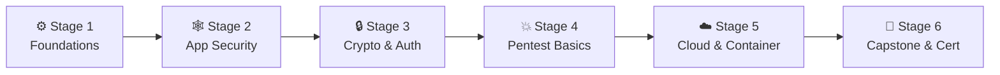

# 🧭 Security Engineer Career Roadmap

> **Tác giả:** Mr.Rom\
> **Phiên bản:** v2.0.0\
> **Tạo lúc:** 16/05/2026\
> **Cập nhật:** 26/05/2026\
> **Đối tượng:** Đã nắm vững nền tảng Linux, mạng máy tính và lập trình cơ bản, muốn chuyên sâu vào an toàn thông tin, bảo mật ứng dụng và hạ tầng Cloud\
> **Thời gian ước tính:** ~12 tháng học tập tích cực (full-time) hoặc ~24 tháng (part-time)\
> **Mức độ:** Junior → Mid (Sẵn sàng đảm nhận công việc bảo mật trong doanh nghiệp)

---

## 🧭 Tình huống — Bạn đang ở đâu?

Bạn muốn trở thành một Security Engineer (Kỹ sư Bảo mật) — người gác cổng bảo vệ toàn bộ tài sản số của doanh nghiệp trước các cuộc tấn công của hacker. Nhưng bạn băn khoăn: *"Có phải làm bảo mật là chỉ đi hack dạo (Pentesting) như phim ảnh?"*, *"Học mật mã học toán có khó lắm không?"*, *"Làm thế nào để xây dựng một hệ thống phòng thủ vững chắc không thể bị xâm nhập?"*.

Thế giới an toàn thông tin (Cybersecurity) vô cùng rộng lớn. Nhiều người mới bị cuốn hút bởi các kỹ thuật tấn công (Red Team / Hacker mũ trắng). **Tuy nhiên, Mr.Rom muốn nhấn mạnh rằng: Hơn 90% công việc của một Security Engineer trong doanh nghiệp thực tế tập trung vào phòng thủ (Blue Team) — bao gồm Bảo mật ứng dụng (Application Security), Bảo mật đám mây (Cloud Security) và tự động hóa rà quét bảo mật trong quy trình phát triển phần mềm (DevSecOps). Bạn học cách tấn công chỉ để hiểu cách phòng thủ hiệu quả nhất.**

👉 **Lộ trình Security Engineer này được chia làm 6 Stage cực kỳ chuyên sâu:**

- **Stage 1**: Củng cố sâu nền tảng dòng lệnh Linux, mạng máy tính và kỹ năng viết script tự động hóa.
- **Stage 2**: Làm chủ bảo mật ứng dụng Web thông qua danh mục lỗ hổng kinh điển OWASP Top 10.
- **Stage 3**: Chinh phục thế giới Mật mã học (Cryptography) và các cơ chế xác thực người dùng (Authentication).
- **Stage 4**: Thực hành các kỹ thuật Pentesting cơ bản và sử dụng các công cụ rà quét lỗ hổng.
- **Stage 5**: Bảo mật hạ tầng đám mây Cloud (AWS) và ảo hóa Container (Docker/Kubernetes).
- **Stage 6**: Hoàn thành dự án Capstone thực tế và chinh phục các chứng chỉ bảo mật uy tín.

---

## 🗺️ Tổng quan Lộ trình 6 Stage

| Stage | Thời gian | Kết quả đầu ra |
|---|---|---|
| **Stage 1: Nền tảng bảo mật** | 2 tháng | Làm chủ Linux shell, phân tích các gói tin mạng, viết script Python |
| **Stage 2: Bảo mật ứng dụng Web** | 2 tháng | Hiểu rõ và biết cách vá 10 lỗ hổng bảo mật hàng đầu của OWASP |
| **Stage 3: Mật mã & Xác thực** | 1-2 tháng | Tự thiết kế luồng JWT Auth an toàn, hiểu cơ chế mã hóa AES/RSA |
| **Stage 4: Pentest cơ bản** | 2-3 tháng | Sử dụng Burp Suite đánh giá an toàn hệ thống, tham gia các lab CTF |
| **Stage 5: Cloud & Container Security**| 2 tháng | Quét lỗ hổng image Docker, cấu hình AWS IAM Least Privilege |
| **Stage 6: Capstone & Chứng chỉ** | 1-2 tháng | Hoàn thành báo cáo đánh giá bảo mật, thi đỗ chứng chỉ Security+ |

---

## ⚙️ Stage 1 — Nền tảng cốt lõi (Foundations) (2 tháng)

> 🎯 *Bạn phải hiểu rõ cách hệ thống và mạng máy tính vận hành dưới local trước khi muốn tấn công hay bảo vệ nó.*

### 📖 Câu chuyện dẫn dắt
*"Security Engineer là người phải nhìn thấu hệ thống. Bạn không thể phát hiện cổng mạng bị rò rỉ nếu không hiểu cơ chế bắt tay 3 bước của TCP. Bạn không thể ngăn chặn malware chạy ngầm nếu không biết cách Linux quản lý các tiến trình. Stage này giúp bạn xây dựng nền móng kỹ thuật vững chắc bằng dòng lệnh và gói tin mạng."*

### 📚 Các bài đọc bắt buộc (MUST-KNOW)
- [ ] [Linux cơ bản đến nâng cao](../../04_os/linux/) ✅ — Quản lý tiến trình, phân quyền file, giám sát logs hệ thống.
- [ ] [Mạng máy tính chuyên sâu](../../05_networking/) 🚧 — TCP/IP, phân giải DNS, định tuyến Subnet, giao thức HTTP/HTTPS và cơ chế bắt tay SSL/TLS.
- [ ] [Lập trình Python](../../03_languages/python/) ✅ — Học viết các script tự động hóa quét mạng hoặc khai thác lỗ hổng.
- [ ] [Luồng làm việc với Git](../../02_tools/git/) ✅.

### 🎯 Project thực hành Stage 1
Setup một máy ảo Kali Linux trên máy tính cá nhân. Thực hành sử dụng các dòng lệnh cơ bản để dò quét cổng dịch vụ mở (nmap) và lắng nghe traffic mạng (tcpdump) trên một máy ảo khác.

> 🌉 **Cầu nối sang Stage 2**:
> *"Khi đã làm chủ được dòng lệnh Linux, hiểu sâu về gói tin mạng và biết viết script tự động hóa, bạn đã sẵn sàng đối mặt với chiến trường bảo mật đầu tiên: Bảo mật ứng dụng. Hãy cùng bước sang Stage 2 để chinh phục OWASP Top 10!"*

---

## 🕸️ Stage 2 — Bảo mật ứng dụng (OWASP Top 10) (2 tháng)

> 🎯 *Làm chủ 10 lỗ hổng bảo mật ứng dụng phổ biến nhất thế giới. Hiểu rõ cả cơ chế tấn công lẫn cách viết code vá lỗi.*

### 📖 Câu chuyện dẫn dắt
OWASP Top 10 là danh mục chuẩn mực mà mọi lập trình viên và kỹ sư bảo mật phải thuộc lòng. Bạn sẽ học cách một hacker lợi dụng lỗi SQL Injection để lấy sạch database của công ty, hay dùng Cross-Site Scripting (XSS) để lấy trộm cookie đăng nhập của khách hàng. Điểm khác biệt của một Security Engineer giỏi là bạn biết chỉ ra dòng code lỗi và viết code vá lại đúng chuẩn.

### 📚 Các bài đọc bắt buộc (MUST-KNOW)
- [ ] [OWASP Top 10 Vulnerabilities](../../12_security/owasp-top-10/) 🚧 — Các lỗ hổng Injection, Broken Authentication, Sensitive Data Exposure, XSS, CSRF, SSRF.
- **SQL Injection:** Cơ chế tấn công qua chuỗi nhập liệu và cách vá bằng cách sử dụng Parameterized Queries (Prepared Statements).
- **XSS & CSRF:** Cơ chế chèn mã độc JavaScript và cách phòng chống qua HTTPOnly cookies, CSRF tokens.

### 🧪 Bài tập thực hành
- Cài đặt lab thực hành **DVWA (Damn Vulnerable Web App)** bằng Docker local. Thực hành khai thác từ mức độ dễ đến khó cho từng lỗ hổng.
- Hoàn thành các bài tập thực hành miễn phí tại **PortSwigger Web Security Academy**.

### 🎯 Project thực hành Stage 2
**Security Code Audit:** Tìm kiếm một thư viện web mã nguồn mở nhỏ trên GitHub, tự thực hiện rà soát code bằng tay (manual code review) để tìm ra 3 lỗ hổng bảo mật, viết báo cáo giải thích lỗi và mở Pull Request vá lỗi cho dự án đó.

> 🌉 **Cầu nối sang Stage 3**:
> *"Bạn đã biết cách phát hiện và vá các lỗ hổng giao diện và API phổ biến. Tuy nhiên, linh hồn của bảo mật nằm ở việc bảo vệ dữ liệu và xác thực người dùng. Làm thế nào để mã hóa thông tin an toàn và xây dựng hệ thống đăng nhập không thể bị bẻ khóa? Hãy bước sang Stage 3: Cryptography & Authentication!"*

---

## 🔒 Stage 3 — Mật mã học & Xác thực người dùng (1-2 tháng)

> 🎯 *Hiểu sâu toán học mật mã ứng dụng và thiết kế luồng đăng nhập phân quyền tuyệt đối an toàn.*

### 📖 Câu chuyện dẫn dắt
*"Mật mã học là tấm khiên bảo vệ mọi dữ liệu truyền đi trên internet. Bạn không cần phải là một nhà toán học xuất sắc để chứng minh thuật toán, nhưng bạn phải biết khi nào nên dùng mã hóa đối xứng (AES) để lưu file nhanh, khi nào dùng mã hóa bất đối xứng (RSA/ECC) để trao đổi khóa bảo mật, và cách bọc token JWT an toàn."*

### 📚 Các bài học bắt buộc (MUST-KNOW)
- [ ] [Mật mã học ứng dụng (Cryptography)](../../12_security/cryptography/) 🚧 — Phân biệt Hashing (bcrypt, argon2 - một chiều) vs Encryption (đối xứng/bất đối xứng - hai chiều), chữ ký số (Digital Signatures).
- [ ] [Thiết kế luồng xác thực (Authentication)](../../12_security/authentication/) 🚧 — Luồng Session-based vs Token-based (JWT), cơ chế bảo vệ token HttpOnly.
- **OAuth 2.0 & OIDC:** Cơ chế đăng nhập qua bên thứ ba (như Đăng nhập bằng Google), hiểu rõ luồng Authorization Code Flow với PKCE.

### 🧪 Bài thực hành
- Viết code Python thực hiện mã hóa và giải mã file bằng thuật toán AES-GCM.
- Viết script Python tự sinh JWT Token, ký mã hóa bằng khóa private RSA và xác thực token ở server bằng khóa public.

> 🌉 **Cầu nối sang Stage 4**:
> *"Hiểu rõ về mật mã học và cơ chế xác thực giúp bạn thiết kế hệ thống cực kỳ an toàn trên lý thuyết. Nhưng để kiểm chứng xem hệ thống có thực sự chống chịu được các cuộc tấn công thực tế hay không, bạn phải tự tay thực hiện quy trình Pentest chuyên nghiệp. Hãy cùng chuyển sang Stage 4: Pentest Basics!"*

---

## 💥 Stage 4 — Kỹ thuật kiểm thử xâm nhập (Pentest Basics) (2-3 tháng)

> 🎯 *Làm chủ các công cụ của hacker chuyên nghiệp để kiểm tra sức mạnh của hệ thống phòng thủ một cách có đạo đức.*

### 📖 Câu chuyện dẫn dắt
Kiểm thử xâm nhập (Pentesting) là quy trình tấn công giả lập được cấp phép. Bạn sẽ sử dụng **Burp Suite** để chặn và sửa đổi các request gửi đi từ trình duyệt, dùng **sqlmap** để quét tự động lỗi SQLi và dùng **Wireshark** để phân tích gói tin mạng. Mọi hoạt động hack ở stage này phải tuân thủ nghiêm ngặt tính đạo đức và chỉ thực hiện trong môi trường lab hoặc chương trình Bug Bounty.

### 📚 Các bài học bắt buộc (MUST-KNOW)
- [ ] [Quy trình Pentest chuẩn hóa (Methodology)](../../12_security/pentesting-fundamentals/) 🚧 — Reconnaissance (dò tìm thông tin) -> Scanning (quét cổng) -> Exploitation (khai thác) -> Post-exploitation -> Reporting.
- **Burp Suite:** Công cụ intercept proxy số một thế giới dành cho pentest web.
- **Dò quét tự động:** Masscan/Nmap (quét cổng dịch vụ), sqlmap (khai thác SQLi).

### 🛠️ Labs thực hành
- Tham gia học tập theo lộ trình trên **TryHackMe** (khuyên dùng phòng Pre-Security và Web Fundamentals).
- Thực hành giải các bài CTF (Capture The Flag) trên trang **PicoCTF** để rèn luyện tư duy sáng tạo.

### 🎯 Project thực hành Stage 4
**Black-box Pentest Report:** Thực hiện pentest một máy ảo chứa sẵn lỗi bảo mật (tải từ VulnHub), viết báo cáo Pentest Report ghi rõ các bước khai thác chiếm quyền root (Privilege Escalation) kèm hình ảnh minh chứng và các bước vá lỗi cụ thể.

> 🌉 **Cầu nối sang Stage 5**:
> *"Bạn đã có tư duy và kỹ năng của một pentester thực thụ. Tuy nhiên, trong thời đại số hóa, các hệ thống không còn chạy trên server vật lý truyền thống nữa mà chuyển dịch sang Cloud và Containers (Docker/K8s). Đây chính là hai bề mặt tấn công lớn nhất hiện nay. Hãy bước sang Stage 5: Cloud & Container Security!"*

---

## ☁️ Stage 5 — Bảo mật đám mây Cloud & Container (2 tháng)

> 🎯 *Hardening cấu hình AWS Cloud và xây dựng quy trình bảo mật chuỗi cung ứng container.*

### 📖 Câu chuyện dẫn dắt
*"Hơn 80% các vụ hack cloud thành công không phải do lỗ hổng 0-day phức tạp, mà là do cấu hình sai (Misconfiguration) của con người — như để lộ S3 Bucket công khai hoặc phân quyền tài khoản IAM quá rộng. Bạn cần học cách xây dựng chính sách bảo mật đám mây chặt chẽ và quét lỗ hổng của các image Docker trước khi cho phép chạy lên Kubernetes."*

### 📚 Các bài học bắt buộc (MUST-KNOW)
- [ ] [Bảo mật đám mây AWS Cloud Security](../../12_security/cloud-security/) 🚧 — IAM Least Privilege policies, auditing logs bằng AWS CloudTrail, phát hiện xâm nhập bằng GuardDuty.
- [ ] [Bảo mật ảo hóa Container Security](../../12_security/container-security/) 🚧 — Sử dụng công cụ **Trivy** hoặc Snyk để quét lỗ hổng bảo mật trong các thư viện Docker Image.
- **Kubernetes Security:** Cấu hình Network Policies (chỉ cho phép pod app gọi pod DB), runtime monitoring bằng Falco.

### 🎯 Project thực hành Stage 5
**Securing the Pipeline:** Thiết lập workflow GitHub Actions tự động quét Docker Image bằng Trivy mỗi khi build code -> Nếu phát hiện lỗi bảo mật nghiêm trọng (CRITICAL) -> Tự động dừng build và gửi cảnh báo về Telegram của đội bảo mật.

> 🌉 **Cầu nối sang Stage 6**:
> *"Chúc mừng bạn! Bạn đã nắm giữ toàn bộ các mảng kiến thức từ bảo mật code, mật mã học, pentest cho đến bảo mật đám mây và container. Bước cuối cùng chính là hoàn thành một dự án Capstone thực tế quy mô doanh nghiệp và thi lấy chứng chỉ bảo mật uy tín để chính thức ứng tuyển. Hãy bước vào Stage 6!"*

---

## 🚀 Stage 6 — Capstone Project & Chứng chỉ bảo mật (1-2 tháng)

> 🎯 *Đóng gói Portfolio với dự án bảo mật thực tế và ôn thi chứng chỉ CompTIA Security+.*

### 🚀 Ý tưởng dự án Capstone (Chọn 1):
- **Continuous Compliance Scanner (SIEM setup):** Thiết lập hệ thống giám sát log tập trung (sử dụng Wazuh hoặc ELK Stack) cho một cụm máy chủ, cấu hình phát hiện tự động các hành vi quét cổng nmap hoặc cố gắng SSH đoán mật khẩu để tự động kích hoạt chặn IP (firewall ban) và gửi tin nhắn cảnh báo.
- **Application Threat Modeling:** Thực hiện phân tích mô hình đe dọa (Threat Modeling theo chuẩn STRIDE) cho một kiến trúc ứng dụng SaaS thực tế, chỉ ra 10 mối đe dọa tiềm ẩn và thiết lập kế hoạch giảm thiểu (Mitigation Plan).

### 📚 Ôn thi chứng chỉ bảo mật:
- Chứng chỉ **CompTIA Security+** là entry-cert được công nhận toàn cầu, giúp bạn có hệ thống từ vựng và tư duy bảo mật chuẩn chỉnh để vượt qua vòng hồ sơ HR dễ dàng.
- (Optional) Nếu định hướng đi theo ngách Pentest sâu, hãy chuẩn bị lộ trình học và thi chứng chỉ thực hành **OSCP (Offensive Security Certified Professional)**.

---

## 🧭 Lộ trình phát triển sự nghiệp tiếp theo

Các nhánh chuyên sâu của Security Engineer:

| Lĩnh vực | Vai trò | Lộ trình liên quan |
|---|---|---|
| **Chuyên gia Pentest / Red Team** | Tấn công giả lập chuyên nghiệp, tìm lỗ hổng cho tập đoàn lớn | Penetration Tester |
| **Kỹ sư bảo mật sản phẩm** | Làm việc với Dev để thiết kế kiến trúc code an toàn | Application Security Engineer |
| **Tự động hóa bảo mật hạ tầng** | Tích hợp bảo mật vào pipeline DevOps | DevSecOps Engineer ✅ |

---

## 🔄 Hướng dẫn điều chỉnh lộ trình

- **Tuyệt đối tuân thủ Đạo đức Nghề nghiệp (Ethics):** Mr.Rom đặc biệt nhắc nhở bạn không bao giờ thử nghiệm các kỹ thuật tấn công lên bất kỳ website hay hệ thống nào mà không có sự cho phép bằng văn bản của chủ sở hữu. Mọi hành vi vi phạm pháp luật sẽ hủy hoại sự nghiệp của bạn vĩnh viễn.
- **Học thông qua cộng đồng:** Hãy tham gia các chương trình Bug Bounty (như HackerOne, Bugcrowd) để đọc các báo cáo lỗi được công bố công khai của các hacker hàng đầu. Đây là nguồn học tập thực tế và cập nhật nhất.

---

## 📌 Changelog

- **v2.0.0 (26/05/2026)** — **Nâng cấp thành Narrative Master**:
  - Viết lại toàn bộ nội dung sang văn phong kể chuyện định hướng có chiều sâu và liên kết chặt chẽ.
  - Thiết lập các câu bắc cầu logic kết nối mượt mà giữa các Stage.
  - Cập nhật liên kết Git chính xác sang thư mục `02_tools/git/` ✅.
  - Bổ sung định hướng chi tiết về OWASP Top 10, PortSwigger Academy, Trivy và mô hình STRIDE.
- **v1.0.0 (16/05/2026)** — Khởi tạo cấu trúc lộ trình Security Engineer cơ bản.
