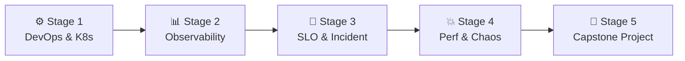

# 🧭 SRE (Site Reliability Engineer) Career Roadmap

> **Tác giả:** Mr.Rom\
> **Phiên bản:** v2.0.0\
> **Tạo lúc:** 16/05/2026\
> **Cập nhật:** 26/05/2026\
> **Đối tượng:** Đã có kinh nghiệm làm DevOps hoặc Backend, muốn chuyên sâu vào độ tin cậy hệ thống và đo lường giám sát (Observability)\
> **Thời gian ước tính:** ~10 tháng học tập tích cực (full-time) hoặc ~20 tháng (part-time)\
> **Mức độ:** Mid → Senior (Lộ trình này yêu cầu đã có kinh nghiệm nền tảng từ trước)

---

## 🧭 Tình huống — Bạn đang ở đâu?

Bạn muốn trở thành một Site Reliability Engineer (SRE) — người gác cổng tối cao cho sự ổn định của hệ thống. Nhưng bạn băn khoăn: *"SRE thực sự khác gì DevOps?"*, *"Làm sao để biết hệ thống hoạt động ổn định hay không một cách khoa học thay vì đoán mò?"*, *"Hệ thống gặp sự cố lớn vào đêm 30 Tết thì quy trình xử lý của các tập đoàn lớn diễn ra thế nào?"*.

Google định nghĩa: *"SRE là những gì xảy ra khi bạn yêu cầu một kỹ sư phần mềm thiết kế một đội ngũ vận hành hệ thống"*. **Mr.Rom muốn bạn hiểu rằng: SRE không chỉ đơn thuần là trực gác server. SRE giải quyết các bài toán vận hành bằng tư duy viết code. Bạn sẽ chịu trách nhiệm định lượng độ tin cậy thông qua các chỉ số SLO, xây dựng hệ thống đo lường giám sát (Observability) ba trụ cột, tự động hóa phản ứng sự cố và chủ động phá hủy hệ thống để tìm lỗ hổng (Chaos Engineering).**

👉 **Lộ trình SRE này sẽ đưa bạn đi qua 5 Stage phát triển năng lực chuyên sâu:**

- **Stage 1**: Củng cố nền tảng DevOps và vận hành điều phối container.
- **Stage 2**: Xây dựng hệ thống đo lường giám sát toàn diện (Observability Stack).
- **Stage 3**: Định lượng độ ổn định (SLO/SLI) và thiết lập quy trình ứng phó sự cố chuyên nghiệp.
- **Stage 4**: Kiểm thử hiệu năng (Performance Tuning) và chủ động tiêm lỗi (Chaos Engineering).
- **Stage 5**: Hoàn thành dự án Capstone tự thiết kế và vận hành nền tảng Observability.

---

## 🗺️ Tổng quan Lộ trình 5 Stage

| Stage | Thời gian | Kết quả đầu ra |
|---|---|---|
| **Stage 1: Nền tảng DevOps & K8s** | 2-3 tháng | Vững vàng Docker, Kubernetes, Linux nâng cao và mạng máy tính |
| **Stage 2: Observability (Đo lường)** | 2-3 tháng | Dựng thành công hệ thống thu thập Metrics, Logs, Traces cho ứng dụng |
| **Stage 3: SLO & Ứng phó sự cố** | 2 tháng | Định nghĩa SLO, thiết lập cảnh báo theo tốc độ tiêu hao (Burn Rate) |
| **Stage 4: Hiệu năng & Chaos** | 1-2 tháng | Profile code tìm điểm nghẽn, giả lập sập mạng, sập node để kiểm chứng |
| **Stage 5: Dự án Capstone** | 2 tháng | 1 nền tảng Observability + Incident Management tự động hoàn chỉnh |

---

## ⚙️ Stage 1 — Nền tảng DevOps & Kubernetes (2-3 tháng)

> 🎯 *SRE cần một nền tảng vận hành hạ tầng container cực kỳ vững chắc trước khi đi sâu vào độ tin cậy.*

### 📖 Câu chuyện dẫn dắt
*"Bạn không thể tối ưu hóa hoặc giám sát một thứ mà bạn không biết nó hoạt động thế nào. SRE phải là người hiểu Kubernetes sâu sắc nhất trong team. Bạn cần biết chính xác cách network traffic đi qua các lớp pod, service, ingress, và cách kernel Linux quản lý bộ nhớ để phát hiện các lỗi sập server do hết RAM (Out of Memory - OOM)."*

### 📚 Các bài đọc bắt buộc (MUST-KNOW)
- [ ] [Lộ trình DevOps Engineer](./devops-engineer_career-roadmap.md) ✅ — Hoàn thành tối thiểu từ Stage 1 đến Stage 4 (Linux, Mạng, Docker, Kubernetes).
- [ ] **Mạng máy tính chuyên sâu:** Sử dụng `tcpdump`, `wireshark` để debug gói tin mạng, phân tích độ trễ kết nối TCP.
- [ ] **Linux Kernel Basics:** Hiểu cách quản lý cgroups, namespaces của Docker và cách systemd quản lý các tiến trình ngầm.

> 🌉 **Cầu nối sang Stage 2**:
> *"Khi đã sở hữu nền tảng vận hành container chắc chắn, bạn sẽ nhận ra: Chạy được ứng dụng lên Kubernetes mới chỉ là bước khởi đầu. Làm thế nào để biết hệ thống đang 'khỏe mạnh' hay đang 'âm thầm' phát sinh lỗi ở bên trong? Hãy cùng chuyển sang Stage 2: Làm chủ Observability!"*

---

## 📊 Stage 2 — Làm chủ Observability (3 Trụ Cột) (2-3 tháng)

> 🎯 *Xây dựng mắt thần cho hệ thống: thu thập chỉ số (Metrics), ghi nhận nhật ký (Logs) và bám vết cuộc gọi API (Traces).*

### 📖 Câu chuyện dẫn dắt
Giám sát truyền thống (Monitoring) chỉ báo cho bạn biết: *"Server đã sập!"*. Đo lường hiện đại (Observability) giúp bạn trả lời câu hỏi: *"Tại sao ứng dụng lại chậm bất thường chỉ đối với các user đăng nhập từ Safari vào lúc 9 giờ tối?"*. Để làm được điều này, bạn phải kết hợp nhuần nhuyễn 3 trụ cột dữ liệu.

### 📚 Các bài đọc bắt buộc (MUST-KNOW)
- [ ] [Giám sát & Observability](../../10_devops/observability/) 🚧 — Các khái niệm cơ bản.
- [ ] **Metrics (Chỉ số):** Prometheus (thu thập chỉ số) và Grafana (vẽ biểu đồ trực quan). Học ngôn ngữ truy vấn PromQL để tính toán tỉ lệ lỗi, độ trễ API.
- [ ] **Logs (Nhật ký tập trung):** Cú pháp ghi log có cấu trúc dạng JSON và cách gom log tự động bằng Grafana Loki hoặc ELK Stack (Elasticsearch, Logstash, Kibana).
- [ ] **Traces (Bám vết phân tán):** Sử dụng **OpenTelemetry** và Jaeger để theo dõi luồng đi của một request đi qua nhiều microservices khác nhau.
- [ ] **Alerting:** Thiết lập Alertmanager gửi cảnh báo khẩn cấp tới Slack, Telegram hoặc PagerDuty.

### 🧪 Bài thực hành
- Tích hợp thư viện Prometheus Client vào ứng dụng FastAPI của bạn để đo lường số lượng request và độ trễ.
- Thiết kế Grafana Dashboard hiển thị **4 Golden Signals** (Độ trễ - Latency, Lưu lượng - Traffic, Tỉ lệ lỗi - Errors, Độ bão hòa - Saturation).
- Cấu hình OpenTelemetry trace cuộc gọi từ Frontend React qua API FastAPI xuống Database Postgres.

### 🎯 Project thực hành Stage 2
**Observability Stack:** Deploy hệ thống Prometheus + Loki + Tempo + Grafana giám sát một ứng dụng microservices chạy trên Docker Compose.

> 🌉 **Cầu nối sang Stage 3**:
> *"Hệ thống giám sát của bạn đã thu thập đầy đủ dữ liệu từ RAM, CPU cho đến các trace của API. Tuy nhiên, nếu bạn nhận được hàng trăm cảnh báo (alerts) mỗi ngày một cách vô ích, bạn sẽ rơi vào trạng thái 'kiệt sức vì cảnh báo' (alert fatigue). Làm thế nào để định nghĩa độ tin cậy thực tế theo trải nghiệm của người dùng và thiết lập quy trình xử lý sự cố khoa học? Hãy bước sang Stage 3!"*

---

## 🎯 Stage 3 — Chỉ số ổn định (SLO) & Ứng phó sự cố (2 tháng)

> 🎯 *Lấy người dùng làm trung tâm để định lượng độ tin cậy hệ thống và xây dựng quy trình ứng phó sự cố không đổ lỗi.*

### 📖 Câu chuyện dẫn dắt
*"Một hệ thống không cần thiết phải đạt độ tin cậy 100% vì chi phí để duy trì nó là cực kỳ đắt đỏ. SRE phải xác định một lượng lỗi chấp nhận được gọi là Ngân sách lỗi (Error Budget). Chúng ta chỉ gửi cảnh báo đánh thức kỹ sư trực đêm khi ngân sách lỗi này bị tiêu hao quá nhanh (Burn Rate Alerting), giúp đội ngũ tập trung vào những sự cố thực sự ảnh hưởng đến khách hàng."*

### 📚 Các bài đọc bắt buộc (MUST-KNOW)
- **Định lượng độ tin cậy:** Định nghĩa SLI (Chỉ số đo lường thực tế), SLO (Mục tiêu mong muốn đạt được), SLA (Cam kết pháp lý với khách hàng).
- **Error Budget (Ngân sách lỗi):** Cách tính toán và quản lý ngân sách lỗi. Mối quan hệ giữa Error Budget và tốc độ phát hành tính năng mới của đội Dev.
- **Incident Response (Ứng phó sự cố):** Quy trình Acknowledge (Xác nhận) → Mitigate (Giảm thiểu thiệt hại trước) → Resolve (Tìm gốc rễ sửa lỗi sau).
- **Blameless Post-mortem:** Văn hóa viết báo cáo sự cố không đổ lỗi cá nhân, tập trung vào việc cải thiện hệ thống để lỗi không lặp lại.

### 🧪 Bài thực hành
- Thiết lập cảnh báo dựa trên tốc độ tiêu hao ngân sách lỗi (Error Budget Burn Rate) bằng Prometheus rules.
- Giả lập một sự cố (ví dụ database bị ngắt kết nối), thực hiện quy trình ứng phó theo vai trò Incident Commander và viết báo cáo sự cố (Post-mortem) chi tiết.

### 🎯 Project thực hành Stage 3
**SLO & Game Day Simulation:** Tổ chức một buổi giả lập sự cố thực tế trên Staging, đội ngũ ứng phó theo runbook sẵn có, viết tài liệu post-mortem và cập nhật lại playbooks.

> 🌉 **Cầu nối sang Stage 4**:
> *"Bạn đã biết cách định lượng độ tin cậy và ứng phó sự cố một cách chuyên nghiệp. Tuy nhiên, cách tốt nhất để đối phó với sự cố là chủ động tìm ra nó trước khi khách hàng phát hiện ra. Làm sao để tìm điểm nghẽn hiệu năng của ứng dụng dưới tải nặng, và chủ động phá hủy để kiểm tra sức chịu đựng của hệ thống? Hãy chuyển sang Stage 4: Performance & Chaos Engineering!"*

---

## 💥 Stage 4 — Tối ưu hiệu năng & Kỹ thuật hỗn loạn (Chaos) (1-2 tháng)

> 🎯 *Tìm kiếm điểm giới hạn của hệ thống qua Load Test và chủ động tiêm lỗi để kiểm chứng độ bền vững.*

### 📖 Câu chuyện dẫn dắt
Hệ thống của bạn có thể chạy rất tốt với 100 người dùng, nhưng liệu nó có sập khi lượng truy cập tăng gấp 100 lần trong ngày mở bán Black Friday? Chaos Engineering (Kỹ thuật hỗn loạn) là phương pháp tiêm các lỗi ngẫu nhiên (sập máy chủ, ngắt kết nối mạng, nghẽn CPU) trực tiếp vào môi trường Staging/Production để chứng minh hệ thống có khả năng tự phục hồi (resilience).

### 📚 Các bài đọc bắt buộc (MUST-KNOW)
- **Load Testing:** Sử dụng công cụ hiện đại như **k6** (viết bằng JS) hoặc Locust (viết bằng Python) để chạy load test, stress test hệ thống.
- **Application Profiling:** Sử dụng các công cụ profiling (như py-spy, pprof) để tìm dòng code hoặc query database chạy chậm gây nghẽn CPU.
- **Chaos Engineering Principles:** Triết lý thiết kế hệ thống chịu lỗi của Netflix, cơ chế hoạt động của Chaos Mesh hoặc Litmus trên Kubernetes.

### 🧪 Bài thực hành
- Viết kịch bản load test bằng k6 giả lập 5000 users đồng thời truy cập API login.
- Cấu hình Chaos Mesh trên local K8s cluster để tự động kill ngẫu nhiên các pod của ứng dụng và kiểm chứng xem Kubernetes có tự tạo lại Pod mới mà không làm gián đoạn trải nghiệm của người dùng hay không.

> 🌉 **Cầu nối sang Stage 5**:
> *"Bây giờ, bạn đã thấu suốt toàn bộ lý thuyết và kỹ năng thực tế của một SRE. Hãy kết hợp tất cả các mảnh ghép này: hạ tầng Terraform, Kubernetes, hệ thống giám sát và các kịch bản chaos test thành một giải pháp Capstone hoàn chỉnh. Hãy bước sang Stage 5!"*

---

## 🚀 Stage 5 — Dự án Capstone độc lập (2 tháng)

> 🎯 *Tự thiết kế và vận hành một nền tảng giám sát đo lường đạt tiêu chuẩn doanh nghiệp lớn.*

### 🚀 Ý tưởng dự án Capstone (Chọn 1):
- **SLO-Driven Alerting Platform:** Thiết kế hệ thống tự động đọc cấu hình SLO từ file YAML (sử dụng công cụ Sloth), tự động sinh ra các rules cảnh báo Prometheus và hiển thị biểu đồ theo dõi Error Budget còn lại trực quan trên Grafana.
- **Automated Chaos & Recovery Suite:** Thiết lập hệ thống tự động chạy kịch bản chaos test (tiêm lỗi mạng) hàng tuần trên cluster K8s, tự động ghi nhận xem hệ thống mất bao lâu để tự phục hồi, và tự động gửi báo cáo hiệu năng lên Slack.

---

## 🧭 Định hướng thăng tiến tiếp theo

Sau khi đạt cấp độ SRE thực chiến, bạn có các nhánh phát triển cao hơn:

| Lĩnh vực | Vai trò | Lộ trình liên quan |
|---|---|---|
| **Kỹ sư nền tảng nội bộ** | Xây dựng công cụ giúp Dev tự vận hành hệ thống nhanh | [`platform-engineer`](./platform-engineer_career-roadmap.md) |
| **Kiến trúc sư đám mây chuyên sâu** | Thiết kế hệ thống phân tán toàn cầu chịu tải cực lớn | [`cloud-engineer`](./cloud-engineer_career-roadmap.md) ✅ |
| **Chuyên gia bảo mật hạ tầng** | Chuyên sâu về bảo mật container và hệ thống mạng đám mây | [`security-engineer`](./security-engineer_career-roadmap.md) |

---

## 🔄 Hướng dẫn điều chỉnh lộ trình

- **Không có môi trường server lớn để thực hành:** Đừng lo lắng. Toàn bộ các công cụ như Prometheus, Grafana, Jaeger, Loki và Chaos Mesh đều có thể chạy hoàn hảo trên máy tính cá nhân của bạn thông qua Docker Compose hoặc Minikube (Kubernetes local). Mindset thiết kế SLO và xử lý sự cố hoàn toàn giống nhau bất kể quy mô server.
- **Đọc sách gối đầu giường:** SRE là lộ trình rất nặng về tư duy. Mr.Rom khuyên bạn nên đọc cuốn **Site Reliability Engineering (Google)** bản PDF miễn phí trực tuyến. Đây là cuốn sách định hình toàn bộ ngành SRE trên thế giới.

---

## 📌 Changelog

- **v2.0.0 (26/05/2026)** — **Nâng cấp thành Narrative Master**:
  - Viết lại toàn bộ nội dung sang văn phong dẫn chuyện có chiều sâu và liên kết chặt chẽ.
  - Thiết lập các câu bắc cầu logic kết nối mượt mà giữa các Stage.
  - Cập nhật liên kết Git chính xác sang thư mục `02_tools/git/` ✅.
  - Bổ sung định hướng rõ ràng về thiết lập SLO/SLI, Alerting Burn Rate và Chaos Mesh.
- **v1.0.0 (16/05/2026)** — Khởi tạo cấu trúc lộ trình SRE cơ bản.
