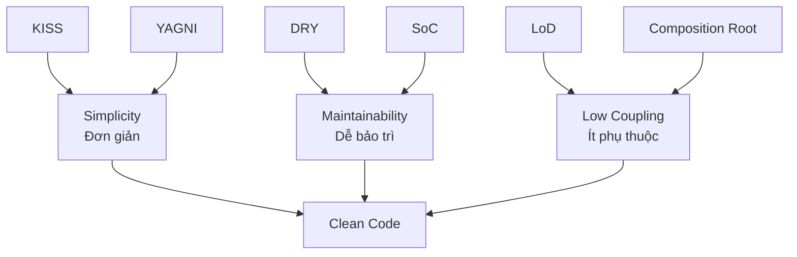

# 🏗️ Design Principles — Nguyên tắc thiết kế phần mềm

> `[BEGINNER → INTERMEDIATE]` ⭐ `[MUST-KNOW]` — Không phụ thuộc ngôn ngữ
> Đây là những nguyên tắc nền tảng giúp code dễ đọc, dễ bảo trì, và dễ mở rộng.

---

## Tại sao cần Design Principles?

Hãy tưởng tượng bạn xây nhà. Nếu không theo nguyên tắc kiến trúc (móng vững, tường thẳng, mái không dột), ngôi nhà sẽ:
- **Sụp đổ** khi thêm tầng (tính năng mới)
- **Không sửa được** vì thay đổi 1 chỗ → hỏng 10 chỗ khác
- **Không ai hiểu** thiết kế, kể cả chính bạn sau 3 tháng

Design Principles là **nguyên tắc kiến trúc cho code**. Chúng không phải luật cứng nhắc, mà là **la bàn** chỉ hướng khi đưa ra quyết định thiết kế.

```
Code không có principles:            Code có principles:
┌─────────────────────┐              ┌──────────┐ ┌──────────┐
│   GOD CLASS         │              │ UserSvc  │ │ OrderSvc │
│   (làm mọi thứ)    │     →        │ (users)  │ │ (orders) │
│   5000 dòng         │              └──────────┘ └──────────┘
│   200 methods       │              ┌──────────┐ ┌──────────┐
│   "sửa 1 chỗ       │              │ AuthSvc  │ │ EmailSvc │
│    hỏng 10 chỗ"    │              │ (auth)   │ │ (notify) │
└─────────────────────┘              └──────────┘ └──────────┘
```

---

## 1. DRY — Don't Repeat Yourself

**DRY (Đừng lặp lại chính mình)** là nguyên tắc đầu tiên mọi developer nên học. Mỗi **piece of knowledge** chỉ nên tồn tại ở **đúng 1 nơi** trong hệ thống.

### Tại sao lặp code nguy hiểm?

Khi bạn copy-paste logic, mỗi lần sửa bug phải tìm và sửa **tất cả các bản copy**. Quên 1 bản → bug tồn tại, hệ thống không nhất quán.

```python
# ❌ SAI: Logic tính giá trùng lặp ở 3 nơi
class OrderPage:
    def get_total(self, items):
        total = sum(item.price * item.quantity for item in items)
        if total > 100:
            total *= 0.9  # Giảm 10% cho đơn > 100
        tax = total * 0.08
        return total + tax

class CartPage:
    def get_total(self, items):
        total = sum(item.price * item.quantity for item in items)
        if total > 100:
            total *= 0.9  # Copy-paste từ OrderPage
        tax = total * 0.08
        return total + tax
# Nếu thay đổi rule giảm giá → phải sửa 3 chỗ!
```

```python
# ✅ ĐÚNG: Logic tính giá ở 1 nơi duy nhất
class PricingService:
    DISCOUNT_THRESHOLD = 100
    DISCOUNT_RATE = 0.10
    TAX_RATE = 0.08
    
    @staticmethod
    def calculate_total(items: list) -> float:
        subtotal = sum(item.price * item.quantity for item in items)
        if subtotal > PricingService.DISCOUNT_THRESHOLD:
            subtotal *= (1 - PricingService.DISCOUNT_RATE)
        tax = subtotal * PricingService.TAX_RATE
        return subtotal + tax

# OrderPage và CartPage đều gọi PricingService.calculate_total()
```

Khi thay đổi rule giảm giá, chỉ cần sửa **1 nơi** — `PricingService`. Mọi nơi khác tự động có behavior mới.

### Khi nào DRY quá mức?

```python
# ❌ Over-DRY: Gộp 2 thứ KHÁC NHAU chỉ vì trùng cú pháp
def process(data, type):
    if type == "user":
        validate_user(data)
        save_user(data)
        send_welcome_email(data)
    elif type == "product":
        validate_product(data)
        save_product(data)
        update_inventory(data)

# ✅ Giữ tách riêng — 2 domain khác nhau, logic sẽ diverge theo thời gian
def process_user(data): ...
def process_product(data): ...
```

> **Quy tắc "Rule of Three":** Chỉ refactor khi thấy pattern lặp **3 lần trở lên**. 2 lần có thể chỉ là trùng hợp.

---

## 2. KISS — Keep It Simple, Stupid

**KISS (Giữ cho đơn giản)** nhắc nhở rằng **đơn giản là đỉnh cao của phức tạp**. Code tốt nhất là code mà người khác đọc lần đầu đã hiểu ngay.

### Over-engineering là gì?

Over-engineering là viết code phức tạp hơn mức cần thiết — thường vì "phòng xa" cho tương lai chưa rõ ràng.

```python
# ❌ Over-engineered: Factory + Strategy + Observer cho... gửi email
class NotificationFactory:
    _strategies = {}
    _observers = []
    
    @classmethod
    def register(cls, channel, strategy):
        cls._strategies[channel] = strategy
    
    @classmethod
    def create(cls, channel):
        return cls._strategies[channel]()

class EmailStrategy(NotificationStrategy):
    def send(self, message):
        for observer in NotificationFactory._observers:
            observer.before_send(message)
        # ... gửi 1 cái email
        for observer in NotificationFactory._observers:
            observer.after_send(message)
```

```python
# ✅ KISS: Gửi email thì... gửi email
import smtplib

def send_email(to: str, subject: str, body: str):
    """Send a simple email notification."""
    msg = f"Subject: {subject}\n\n{body}"
    with smtplib.SMTP("smtp.gmail.com", 587) as server:
        server.starttls()
        server.login("app@company.com", os.environ["EMAIL_PASSWORD"])
        server.sendmail("app@company.com", to, msg)
```

Khi app cần gửi qua SMS, Slack, push notification → lúc đó mới refactor thêm abstraction. Đừng "đón đầu" nhu cầu chưa có.

### KISS trong architecture

```
❌ Startup mới có 100 users → deploy 12 microservices + Kafka + Redis + K8s

✅ Startup mới có 100 users → 1 monolith + PostgreSQL + deploy trên VPS

→ Scale lên khi CẦN, không scale vì SỢ
```

---

## 3. YAGNI — You Ain't Gonna Need It

**YAGNI (Bạn sẽ không cần đâu)** bổ sung cho KISS: **không viết code cho feature chưa có yêu cầu**. Premature abstraction (trừu tượng sớm) tốn thời gian và tạo complexity không cần thiết.

```python
# ❌ YAGNI violation: "Biết đâu sau này cần multi-currency"
class Price:
    def __init__(self, amount, currency="USD"):
        self.amount = amount
        self.currency = currency
    
    def convert_to(self, target_currency):
        rate = CurrencyExchangeService.get_rate(self.currency, target_currency)
        return Price(self.amount * rate, target_currency)
    
    def __add__(self, other):
        if self.currency != other.currency:
            other = other.convert_to(self.currency)
        return Price(self.amount + other.amount, self.currency)

# Nhưng app hiện tại CHỈ dùng VND... 
```

```python
# ✅ YAGNI: Viết cho hiện tại
def calculate_total(items: list) -> int:
    """Calculate total price in VND."""
    return sum(item.price * item.quantity for item in items)

# Khi CÓ yêu cầu multi-currency → refactor
```

> **"The best code is code you don't have to write."** — Mỗi dòng code thêm vào là burden phải maintenance.

---

## 4. Separation of Concerns (SoC) — Tách biệt mối quan tâm

**SoC** là nguyên tắc chia hệ thống thành các phần, mỗi phần **chỉ xử lý 1 mối quan tâm** (concern). Thay đổi logic hiển thị không ảnh hưởng logic nghiệp vụ, và ngược lại.

### MVC — Ví dụ kinh điển

```
┌─────────────┐     ┌──────────────┐     ┌─────────────┐
│    View      │ ←── │  Controller  │ ──→ │    Model    │
│  (Hiển thị)  │     │  (Điều phối) │     │  (Dữ liệu)  │
│              │     │              │     │              │
│  HTML/CSS/JS │     │  Routes,     │     │  Business    │
│  Templates   │     │  Handlers    │     │  logic, DB   │
└─────────────┘     └──────────────┘     └─────────────┘
```

### Layered Architecture

```python
# ❌ SAI: Mọi thứ trộn lẫn trong 1 function
@app.post("/api/orders")
def create_order(request):
    # Validation (concern 1)
    if not request.json.get("items"):
        return {"error": "No items"}, 400
    
    # Business logic (concern 2)
    total = sum(i["price"] * i["qty"] for i in request.json["items"])
    if total > 1000:
        total *= 0.9
    
    # Database (concern 3)
    db.execute("INSERT INTO orders (total) VALUES (?)", (total,))
    
    # Notification (concern 4)
    send_email(request.json["email"], "Order confirmed!")
    
    return {"status": "ok"}, 201
```

```python
# ✅ ĐÚNG: Tách concern vào layers
# --- Layer 1: Controller (HTTP handling) ---
@app.post("/api/orders")
def create_order(request):
    data = OrderSchema.validate(request.json)  # Validation layer
    order = order_service.create(data)          # Business layer
    return {"order_id": order.id}, 201

# --- Layer 2: Service (Business logic) ---
class OrderService:
    def create(self, data: dict) -> Order:
        order = Order(items=data["items"])
        order.apply_discount()
        self.order_repo.save(order)
        self.notifier.send_confirmation(order)
        return order

# --- Layer 3: Repository (Data access) ---
class OrderRepository:
    def save(self, order: Order):
        self.db.execute("INSERT INTO orders ...")
```

Mỗi layer chỉ biết về layer **ngay dưới nó**. Controller không biết database, Service không biết HTTP.

---

## 5. Law of Demeter — "Chỉ nói chuyện với bạn bè trực tiếp"

**Law of Demeter (LoD)** hay **Principle of Least Knowledge**: một object chỉ nên gọi method của:
- Chính nó
- Parameter được truyền vào
- Object mà nó tạo ra
- Properties/fields trực tiếp của nó

Không nên "xuyên qua" chuỗi object: `a.getB().getC().doSomething()`.

```python
# ❌ SAI: Train wreck — vi phạm Law of Demeter
def get_customer_city(order):
    return order.get_customer().get_address().get_city()
    # order biết về customer, customer biết address, address biết city
    # → order PHẢI biết cả 3 cấp cấu trúc

# Khi thay đổi Address class → phải sửa TẤT CẢ code gọi chuỗi này
```

```python
# ✅ ĐÚNG: Delegate — mỗi object tự xử lý
class Order:
    def get_shipping_city(self) -> str:
        return self.customer.get_city()

class Customer:
    def get_city(self) -> str:
        return self.address.city

# Caller chỉ cần: order.get_shipping_city()
# Khi Address thay đổi → chỉ sửa Customer class
```

Lợi ích: giảm **coupling** (sự phụ thuộc), thay đổi internal structure không break code bên ngoài.

---

## 6. Composition Root — Nối ghép dependency ở 1 nơi

**Composition Root** là nơi duy nhất trong application mà bạn **wiring** (nối) tất cả dependencies lại. Thay vì mỗi class tự tạo dependency, chúng **nhận dependency từ bên ngoài** (Dependency Injection).

```python
# ❌ SAI: Mỗi class tự tạo dependency
class OrderService:
    def __init__(self):
        self.db = PostgresDatabase()          # Hard-coded
        self.mailer = SmtpMailer()            # Hard-coded
        self.logger = FileLogger("order.log") # Hard-coded

# Không thể test OrderService mà không có DB + SMTP thật!
```

```python
# ✅ ĐÚNG: Dependency Injection
class OrderService:
    def __init__(self, db: Database, mailer: Mailer, logger: Logger):
        self.db = db
        self.mailer = mailer
        self.logger = logger

# --- Composition Root (main.py hoặc app factory) ---
def create_app():
    # Nơi DUY NHẤT quyết định dùng implementation nào
    db = PostgresDatabase(os.environ["DB_URL"])
    mailer = SmtpMailer(os.environ["SMTP_HOST"])
    logger = FileLogger("order.log")
    
    order_service = OrderService(db, mailer, logger)
    return App(order_service=order_service)

# --- Test: dễ dàng mock ---
def test_order_service():
    db = FakeDatabase()
    mailer = FakeMailer()
    logger = NullLogger()
    
    service = OrderService(db, mailer, logger)
    service.create_order(...)
    assert db.saved_orders == 1
```

Composition Root giúp:
- **Testability**: mock/fake dễ dàng
- **Flexibility**: đổi PostgreSQL → MySQL chỉ sửa 1 chỗ
- **Visibility**: nhìn vào Composition Root biết app dùng gì

---

## 7. Tổng hợp — Bảng tóm tắt

| Nguyên tắc | Một câu tóm tắt | Khi vi phạm sẽ... |
|---|---|---|
| **DRY** | Mỗi logic chỉ ở 1 nơi | Sửa 1 bug phải tìm N chỗ |
| **KISS** | Đơn giản nhất có thể | Code phức tạp không cần thiết, khó đọc |
| **YAGNI** | Không code cho tương lai chưa rõ | Tốn thời gian, tăng complexity |
| **SoC** | Mỗi module 1 trách nhiệm | Thay đổi 1 thứ → break nhiều thứ |
| **LoD** | Chỉ nói chuyện với bạn trực tiếp | Coupling cao, refactor khó |
| **Composition Root** | Wire dependencies ở 1 nơi | Khó test, khó thay đổi |

### Mối quan hệ giữa các nguyên tắc



### Thứ tự ưu tiên khi mâu thuẫn

Đôi khi các nguyên tắc **mâu thuẫn** nhau (ví dụ: DRY muốn gom code, nhưng SoC muốn tách). Ưu tiên theo thứ tự:

1. **KISS** — Đơn giản trước
2. **SoC** — Tách trách nhiệm rõ
3. **DRY** — Gom code trùng (nhưng chỉ khi cùng "reason to change")
4. **YAGNI** — Tránh over-engineering

---

## Gotchas — Những lỗi thường gặp

| # | ❌ Sai | ✅ Đúng | Giải thích |
|---|--------|---------|------------|
| 1 | DRY mọi thứ trông giống nhau | Chỉ DRY khi **cùng reason to change** | Code giống nhau nhưng domain khác → giữ tách |
| 2 | KISS = code ít dòng nhất | KISS = code dễ **đọc** nhất (có thể dài hơn) | Dồn 5 logic vào 1 dòng ≠ đơn giản |
| 3 | Design patterns ở mọi nơi | Patterns khi CẦN, không phải vì "ngon" | Simple function tốt hơn Strategy pattern chỉ có 1 strategy |
| 4 | Premature abstraction | Abstraction khi thấy pattern lặp 3+ lần | Abstract quá sớm → abstraction sai |
| 5 | God class "tiện" | Tách theo SoC | 1 class 2000 dòng = technical debt |

---

## Bài tập thực hành

- [ ] **Bài 1 (Dễ):** Tìm và sửa DRY violation trong 1 project cá nhân. Documment trước/sau.
- [ ] **Bài 2 (Trung bình):** Refactor 1 function 100+ dòng thành nhiều functions theo SoC. Mỗi function làm đúng 1 việc.
- [ ] **Bài 3 (Khó):** Tạo app CRUD đơn giản với Composition Root. Controller → Service → Repository. Viết test với mock repository.
- [ ] **Bài 4 (Trung bình):** Tìm ví dụ Law of Demeter violation trong codebase và fix bằng delegation.

---

## Tài nguyên thêm

- [Clean Code (Robert C. Martin)](https://www.oreilly.com/library/view/clean-code/9780136083238/) — "Bible" của clean code
- [The Pragmatic Programmer (Hunt & Thomas)](https://pragprog.com/titles/tpp20/the-pragmatic-programmer-20th-anniversary-edition/) — DRY, Orthogonality
- [Refactoring (Martin Fowler)](https://refactoring.com/) — Kỹ thuật cải thiện code
- [SOLID Design Principles Explained](https://stackify.com/solid-design-principles/) — Mở rộng từ SoC → SOLID
- [99 Bottles of OOP (Sandi Metz)](https://sandimetz.com/99bottles) — Khi nào abstract, khi nào không
