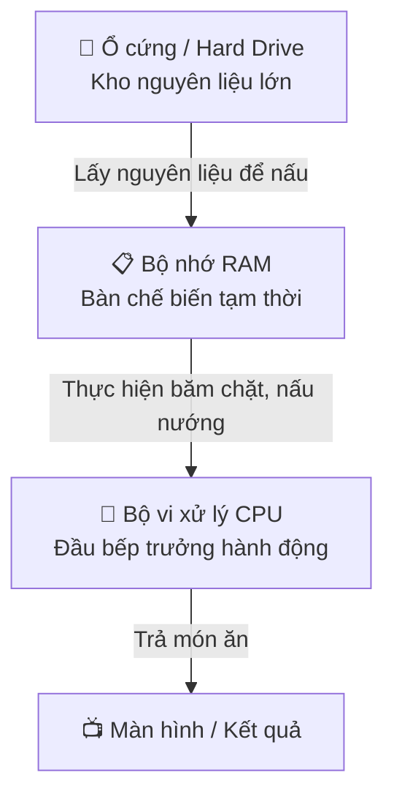
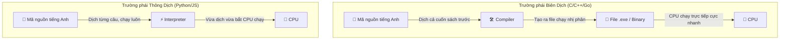

# 🎓 Máy tính hoạt động thế nào? — Từ dòng điện đến dòng code

> **Tác giả:** Mr.Rom\
> **Phiên bản:** v1.0.0\
> **Tạo lúc:** 26/05/2026\
> **Cập nhật:** 26/05/2026\
> **Level:** Basic\
> **Tags:** [MUST-KNOW]\
> **Thời lượng đọc:** ~15 phút\
> **Prerequisites:** Không có (bài đầu tiên cho người mới bắt đầu)

> 🎯 *Trước khi bắt tay học lập trình, bạn cần hiểu thực sự "chiếc hộp sắt" trước mặt bạn hoạt động như thế nào. Bài này giúp bạn hiểu từ dòng điện nhị phân 0 và 1, cấu trúc phần cứng CPU/RAM, đến cách mã nguồn (code) của bạn được biên dịch thành mệnh lệnh cho máy tính chạy.*

---

## 🎯 Sau bài này bạn sẽ

- [ ] Hiểu rõ bản chất vì sao máy tính chỉ hiểu hệ nhị phân `0` và `1`
- [ ] Hình dung trực quan vai trò của **CPU**, **RAM** và **Ổ cứng (Hard Drive)** qua ẩn dụ
- [ ] Phân biệt được sự khác nhau giữa **Trình biên dịch (Compiler)** và **Trình thông dịch (Interpreter)**
- [ ] Hiểu được con đường đi của một dòng code: từ khi bạn gõ trên bàn phím đến khi máy tính hiển thị kết quả

---

## Tình huống — Bạn mở một ứng dụng và...

Bạn nhấn đúp chuột vào biểu tượng VS Code hoặc trò chơi game yêu thích trên màn hình. Trong chưa đầy 3 giây, ứng dụng mở ra mượt mà. 

Bạn đã bao giờ tự hỏi: **Điều gì thực sự xảy ra bên trong chiếc máy tính ở những giây ngắn ngủi đó?**
- Làm thế nào mà một đống vi mạch silicon khô khan lại có thể hiển thị giao diện đẹp đẽ, xử lý chữ viết và hình ảnh của bạn?
- Tại sao người ta lại bảo máy tính chỉ hiểu hai con số `0` và `1`? Nếu nó ngốc nghếch thế, làm sao nó chạy được các AI thông minh như ChatGPT hay Cursor?
- Khi bạn viết dòng chữ `print("Hello World")`, chiếc máy tính làm cách nào để biến dòng chữ tiếng Anh đó thành hành động cụ thể trên màn hình?

Nếu bạn bắt đầu học lập trình mà bỏ qua những câu hỏi này, bạn giống như một người tập lái xe mà không hề biết bên dưới nắp ca-pô có động cơ. Hãy cùng Mr.Rom mở chiếc "nắp ca-pô" của máy tính ra để khám phá nhé!

---

## 1️⃣ Tại sao máy tính chỉ hiểu hai con số 0 và 1?

Bản chất của mọi thiết bị điện tử, bao gồm cả siêu máy tính hiện đại nhất, đều được xây dựng từ hàng tỷ công tắc siêu nhỏ gọi là **Transistor (bóng bán dẫn)**. 

Hãy tưởng tượng chiếc máy tính của bạn giống như một thành phố khổng lồ với hàng tỷ bóng đèn:
- **Tắt (Không có dòng điện chạy qua)**: đại diện cho trạng thái **`0`**
- **Bật (Có dòng điện chạy qua)**: đại diện cho trạng thái **`1`**

Vì transistor chỉ có 2 trạng thái vật lý (Bật/Tắt), máy tính bắt buộc phải sử dụng **hệ nhị phân (Binary)** — hệ đếm chỉ dùng hai chữ số `0` và `1` để biểu diễn mọi thông tin trên thế giới. Mỗi số `0` hoặc `1` này được gọi là **1 Bit** (đơn vị thông tin nhỏ nhất). 

Khi chúng ta ghép nhiều bit lại với nhau, máy tính bắt đầu hiểu được các khái niệm phức tạp hơn:
- **Ghép 8 bit** → Tạo thành **1 Byte**. Một byte có thể biểu diễn 256 giá trị khác nhau (đủ để đại diện cho một chữ cái trong bảng chữ cái Latinh, ví dụ chữ `A` được máy tính hiểu là `01000001`).
- **Ghép hàng triệu byte (Megabyte - MB)** → Ta có được một bài hát MP3.
- **Ghép hàng tỷ byte (Gigabyte - GB)** → Ta có được một bộ phim độ phân giải cao hoặc một phần mềm đồ họa nặng.

Hiểu được cách máy tính số hóa mọi thứ thành hệ nhị phân rồi, ta sẽ xem "bộ ba quyền lực" nào trong máy tính chịu trách nhiệm xử lý các con số này.

---

## 2️⃣ Bộ ba quyền lực phần cứng: CPU, RAM và Ổ cứng

Để chạy được bất kỳ chương trình nào, máy tính luôn cần sự phối hợp nhịp nhàng của ba linh kiện cốt lõi: CPU, RAM và Ổ cứng. 

Để dễ hình dung nhất, **Mr.Rom mời bạn bước vào một căn bếp nhà hàng**:

### 🪞 Ẩn dụ căn bếp đời thường:
- **Ổ cứng (SSD / HDD)** giống như **Kho nguyên liệu khổng lồ** của nhà hàng. Kho này chứa tất cả thực phẩm, gia vị (chính là toàn bộ phần mềm, game, hệ điều hành được cài trên máy). Ưu điểm của kho là rất lớn và **không bị mất đồ khi đóng cửa** (tắt máy, dữ liệu vẫn an toàn). Nhược điểm là đi vào kho lấy đồ rất mất thời gian (tốc độ đọc/ghi chậm).
- **RAM (Random Access Memory)** giống như **Chiếc bàn chế biến** ngay cạnh bếp nấu. Khi đầu bếp muốn nấu món "VS Code", anh ta không thể ôm cả cái kho nguyên liệu được. Anh ta sẽ chạy vào kho, lấy đúng các nguyên liệu cần thiết thảy lên bàn chế biến RAM để thao tác cho nhanh. Ưu điểm của bàn RAM là tốc độ lấy đồ cực nhanh. Nhược điểm là bàn có hạn (RAM 8GB, 16GB) và **khi dọn quán tắt điện là bàn trống trơn** (tắt máy là RAM mất hết dữ liệu).
- **CPU (Central Processing Unit)** chính là **Người đầu bếp trưởng**. Anh ta đứng trực tiếp ở bếp nấu, lấy nguyên liệu từ bàn chế biến RAM, thực hiện các hành động băm, chặt, xào, nấu (tính toán, xử lý logic) với tốc độ hàng tỷ phép tính mỗi giây để cho ra món ăn hoàn chỉnh.

### Chuyện gì xảy ra khi bạn nhấn đúp chuột mở VS Code?
1. Đầu bếp **CPU** nhận lệnh mở app.
2. CPU chạy vào kho **Ổ cứng**, xúc toàn bộ mã nguồn của app VS Code ném lên bàn chế biến **RAM**. (Đây là lý do bạn phải chờ 1-2 giây để app load — thời gian bốc xếp dữ liệu).
3. Khi app đã nằm gọn trên **RAM**, đầu bếp **CPU** bắt đầu đọc các dòng lệnh nhị phân của app và thực thi tính toán liên tục để hiển thị giao diện lên màn hình cho bạn làm việc.

---

## 3️⃣ Làm sao dòng code của bạn biến thành hành động của máy tính?

Lập trình viên viết mã nguồn bằng các ngôn ngữ bậc cao (như Python, C++, Go, JavaScript) để con người dễ đọc và dễ hiểu. Nhưng như đã nói ở trên, đầu bếp CPU của máy tính chỉ hiểu duy nhất hệ nhị phân `0` và `1`.

Làm sao để bắc cầu qua khoảng trống khổng lồ này? Chúng ta cần một **người phiên dịch**.

Trong thế giới công nghệ, có hai trường phái phiên dịch chính: **Biên dịch (Compiler)** và **Thông dịch (Interpreter)**.

### 🛠️ Trình biên dịch (Compiler) — Dịch trước, chạy sau
- **Cách hoạt động**: Trình biên dịch đọc toàn bộ mã nguồn bạn viết, dịch sạch sẽ từ đầu đến cuối để tạo ra một file thực thi độc lập chứa toàn mã máy `0` và `1` (Ví dụ file `.exe` trên Windows hoặc binary trên Linux). Sau đó, bạn chỉ cần mang file này cho CPU chạy trực tiếp mà không cần mang theo mã nguồn gốc nữa.
- **Ẩn dụ**: Giống như bạn dịch nguyên một cuốn sách tiếng Anh sang tiếng Việt rồi in ra bán. Người đọc Việt Nam mua về đọc trực tiếp cực nhanh, không cần biết cuốn sách gốc tiếng Anh trông thế nào.
- **Tiêu biểu**: Ngôn ngữ C, C++, Go, Rust.
- **Ưu điểm**: Tốc độ chạy siêu nhanh vì máy tính chạy trực tiếp mã máy, không mất thời gian dịch lại khi chạy.

### ⚡ Trình thông dịch (Interpreter) — Vừa dịch vừa chạy
- **Cách hoạt động**: Trình thông dịch không dịch trước toàn bộ. Khi bạn nhấn nút chạy chương trình, nó sẽ đọc dòng code thứ 1, dịch sang mã máy rồi bắt CPU chạy ngay; xong dòng 1 mới chuyển sang đọc dòng 2, dịch và chạy tiếp. Mã nguồn gốc của bạn bắt buộc phải có mặt trong suốt quá trình chạy.
- **Ẩn dụ**: Giống như một phiên dịch viên cabin tại hội nghị. Diễn giả nói đến đâu, phiên dịch viên dịch đuổi theo đến đó.
- **Tiêu biểu**: Python, JavaScript, Ruby.
- **Ưu điểm**: Cực kỳ linh hoạt, viết code xong chạy thử được ngay không mất thời gian build (biên dịch), dễ sửa lỗi (debug) từng dòng. Nhược điểm là tốc độ chạy chậm hơn biên dịch vì vừa chạy vừa phải tốn công dịch đuổi.

---

## 💡 Cạm bẫy thường gặp (Pitfalls)

### ❌ Lầm tưởng: Máy tính tự nhiên thông minh
- **Triệu chứng**: Bạn nghĩ rằng máy tính có tư duy như con người, tự hiểu bạn muốn làm gì.
- **Bản chất**: Máy tính thực ra cực kỳ ngốc nghếch. Nó chỉ là một cỗ máy tính toán số học khổng lồ thực thi máy móc hàng tỷ phép tính cộng trừ nhân chia và so sánh logic (`0` và `1`). Mọi sự thông minh bạn thấy (kể cả AI) đều là do con người thiết lập các thuật toán toán học vô cùng tinh vi phía sau để hướng dẫn máy tính xử lý.

### ❌ Lầm tưởng: Hết RAM là mất hết dữ liệu trên ổ cứng
- **Triệu chứng**: Khi bạn đang gõ tài liệu Word mà máy đột ngột tắt nguồn (hoặc sập nguồn điện), bạn bật lại thấy mất file chưa lưu. Bạn hoảng sợ nghĩ rằng ổ cứng bị hỏng.
- **Bản chất**: Dữ liệu bạn đang viết dở nằm trên **RAM** (bàn chế biến tạm thời). Khi sập nguồn, RAM bị xóa sạch. Nhưng toàn bộ các file cũ bạn đã nhấn nút **Save (Lưu)** thì đã được cất vào **Ổ cứng** (Kho nguyên liệu) an toàn, không hề bị ảnh hưởng. Hãy tập thói quen bấm `Ctrl + S` (hoặc `Cmd + S` trên Mac) thường xuyên để cất đồ từ bàn RAM vào kho ổ cứng nhé!

---

## 🧠 Câu hỏi ôn tập (Self-check)

**Q1. Tại sao RAM có tốc độ đọc ghi cực nhanh nhưng người ta không dùng RAM để làm ổ cứng lưu trữ mọi dữ liệu luôn?**

💡 Đáp án

Vì hai lý do cốt lõi:
1. **RAM là bộ nhớ tạm thời (Volatile memory)**: RAM bắt buộc phải có dòng điện để giữ trạng thái dữ liệu. Khi bạn tắt máy hoặc mất điện, toàn bộ dữ liệu trên RAM sẽ biến mất hoàn toàn. Nếu lưu hệ điều hành hay tài liệu trên RAM, bạn sẽ mất trắng mọi thứ mỗi lần tắt máy.
2. **Chi phí chế tạo**: RAM đắt hơn ổ cứng SSD/HDD rất nhiều lần tính trên mỗi Gigabyte dung lượng.

**Q2. Trình thông dịch (Interpreter) và Trình biên dịch (Compiler) khác nhau cơ bản nhất ở điểm nào?**

💡 Đáp án

Điểm khác biệt cơ bản nhất là **thời điểm dịch mã nguồn**:
- **Compiler**: Dịch toàn bộ mã nguồn thành mã máy một lần duy nhất trước khi chạy, tạo ra file thực thi độc lập (exe/binary).
- **Interpreter**: Vừa chạy vừa dịch mã nguồn từng dòng một (dịch đuổi), bắt buộc phải có mã nguồn gốc khi chạy.

---

## 📚 Glossary (Từ điển thuật ngữ)

| Thuật ngữ EN | Dịch / Hiểu tiếng Việt | Giải thích ngắn |
|---|---|---|
| **Binary** | Hệ nhị phân | Hệ đếm chỉ dùng hai chữ số 0 và 1 để biểu diễn thông tin |
| **Bit** | Bit (đơn vị nhỏ nhất) | Đại diện cho 1 bóng bán dẫn bật (1) hoặc tắt (0) |
| **Byte** | Byte | Nhóm 8 bit đứng liền nhau, đủ để đại diện cho 1 ký tự |
| **CPU** | Bộ vi xử lý trung tâm | Bộ não của máy tính, chịu trách nhiệm tính toán và điều hành |
| **RAM** | Bộ nhớ truy cập ngẫu nhiên | Bàn làm việc tạm thời có tốc độ cực nhanh, mất dữ liệu khi mất điện |
| **SSD / HDD** | Ổ cứng lưu trữ | Kho chứa dữ liệu lâu dài của máy tính, không mất dữ liệu khi mất điện |
| **Compiler** | Trình biên dịch | Bộ dịch toàn bộ code sang mã máy trước khi chạy |
| **Interpreter** | Trình thông dịch | Bộ dịch code sang mã máy từng dòng một khi đang chạy |

---

## 🔗 Liên kết & Tài nguyên

### Bài tiếp theo trong lộ trình
- [Bản đồ ngành CNTT — Bạn đang ở đâu?](../../industry-landscape/lessons/01_basic/00_what-is-it-industry.md)
- [Terminal là gì & các lệnh Linux đầu tiên](../../computing-environment/lessons/01_basic/00_what-is-terminal.md)

### Tài nguyên ngoài nên xem
- [Video: How Computers Work (Code.org)](https://www.youtube.com/playlist?list=PLzdnOPI1iJNcsDrewIlpsG75rji30gpJK) — Loạt video cực kỳ trực quan về máy tính.
- [Sách: Code — The Hidden Language of Computer Hardware and Software](https://www.goodreads.com/book/show/44882.Code) — Cuốn sách huyền thoại giải thích từ con số 0 về phần cứng và phần mềm.
