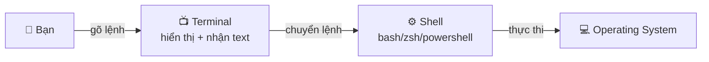

# 🎓 Terminal là gì? — Cánh cửa back door của máy tính

> **Tác giả:** Mr.Rom\
> **Phiên bản:** v2.1.0\
> **Tạo lúc:** 16/05/2026\
> **Cập nhật:** 21/05/2026\
> **Level:** Basic\
> **Tags:** [MUST-KNOW]\
> **Thời lượng đọc:** ~10 phút\
> **Prerequisites:** Không cần

> 🎯 *Bài INTRO — chỉ giới thiệu terminal/shell là gì + cách mở. **KHÔNG dạy lệnh chi tiết** (dành cho các bài 01, 02, 03 kế tiếp).*

## 🎯 Sau bài này bạn sẽ

- [ ] Hiểu **Terminal**, **Shell**, **Command** khác nhau như thế nào
- [ ] Mở được terminal trên máy mình (Mac / Linux / Windows)
- [ ] Đọc được cấu trúc **prompt** ($, %, #)
- [ ] Biết bước kế tiếp là học những lệnh gì (lộ trình)

---

## Tình huống — tutorial bảo bạn gõ lệnh, bạn không biết gõ ở đâu

Bạn đang follow tutorial Python online. Bước 1 ghi: *"Mở terminal, gõ `pip install requests`."*

Bạn ngơ. **Terminal ở đâu?** Máy bạn có app gì tên "Terminal" không? Mở rồi thì gõ ra sao? Vì sao tutorial không nói "click vào Settings → Install package"?

→ Mọi tutorial dev (Python, Node, Docker, K8s...) đều giả định bạn **biết terminal**. Không biết = không follow được bất kỳ tutorial nào. Đây là lý do **terminal là bài học #0 trước khi học code**.

Bài này dạy: terminal là gì, mở ở đâu (Mac/Linux/Win), đọc prompt thế nào — đủ để **bắt đầu follow mọi tutorial**.

---

## 1️⃣ Vì sao coder phải học terminal (dù GUI đang dùng tốt)?

Bạn vẫn dùng máy tính tốt qua GUI (chuột + cửa sổ). Vậy vì sao coder phải học terminal?

| Lý do | GUI | Terminal |
|---|---|---|
| Tạo 1 folder | Click chuột phải → New | 1 lệnh, 1 giây |
| Tạo 100 folder cùng lúc | Lặp 100 lần | 1 lệnh |
| Đổi tên 50 file `.txt` → `.md` | Vô vọng | 1 vòng lặp |
| Chạy chương trình bạn vừa code | Không có cách | `python my-app.py` |
| Cài thư viện Python | Không có | `pip install requests` |
| Kết nối server xa | Phần mềm riêng | `ssh user@server.com` |

→ **Terminal cho phép automation + scale**. Coder không click 100 lần — viết 1 lệnh chạy 100 lần.

Ngoài ra, **hầu hết hướng dẫn online dùng terminal** — bạn buộc phải đọc hiểu để follow tutorial, bug fix, install tool.

---

## 2️⃣ Vậy Terminal thực sự là gì?

**Định nghĩa chính thức**: Terminal là **chương trình** cho phép bạn gõ **lệnh dạng text** để điều khiển máy tính. Sau khi gõ lệnh + Enter, hệ điều hành thực thi và in kết quả ra màn hình.

**🪞 Ẩn dụ đời thường**: *Terminal giống như **cánh cửa back door** của máy tính. GUI là cửa chính đẹp đẽ — ai cũng vào được. Terminal là cửa sau — chỉ "nhân viên" (coder) mới dùng, nhưng nhanh và mạnh hơn rất nhiều. Bạn nói "đem 100 thùng hàng" qua cửa sau (1 lệnh), không phải đi 100 lần cửa chính.*

### Terminal vs Shell vs Command — phân biệt

Đây là 3 thuật ngữ hay bị nhầm:



| Thuật ngữ | Vai trò | Ví dụ |
|---|---|---|
| **Terminal** | Cái cửa sổ đen có chữ — chỉ hiển thị + nhận text | iTerm2, Terminal.app, Windows Terminal, Warp |
| **Shell** | Phần mềm "phiên dịch" — đọc lệnh bạn gõ, hiểu, chạy | `bash`, `zsh`, `fish`, `PowerShell` |
| **Command** | Lệnh cụ thể bạn gõ | `ls`, `cd`, `mkdir` |

→ **Terminal** chỉ là khung hiển thị. **Shell** là phần mềm thực sự xử lý. **Command** là cái bạn gõ.

> 💡 Bài này (+ các bài lesson kế tiếp) dùng từ "terminal" theo nghĩa rộng (gộp cả 3) cho beginner dễ hiểu. Sau khi quen, bạn sẽ phân biệt được.

### Cấu trúc 1 prompt

Khi mở terminal, bạn thấy thứ trông như:

```
rom@macbook ~/Desktop $
```

| Phần | Ý nghĩa |
|---|---|
| `rom` | User name (tên đăng nhập) |
| `macbook` | Hostname (tên máy) |
| `~/Desktop` | Folder hiện tại (`~` = home folder của user) |
| `$` | **Prompt** — báo "shell sẵn sàng nhận lệnh" |

Bạn chỉ cần gõ lệnh **SAU dấu `$`** (hoặc `%` với zsh, hoặc `#` nếu là root) rồi Enter.

> ⚠️ *Khi đọc hướng dẫn online, thấy `$ ls`, đừng gõ dấu `$` — đó là prompt, không phải lệnh.*

---

## 3️⃣ Cách mở terminal trên 3 OS

| Hệ điều hành | Cách mở |
|---|---|
| **macOS** | `Cmd + Space` → gõ "Terminal" → Enter. Hoặc cài [iTerm2](https://iterm2.com/) (đẹp hơn). Sâu hơn: 🛠️ [Tool guide terminal emulators](../../../../02_Tools/terminal-emulators/) (chưa có) — so sánh iTerm/Kitty/Alacritty/Warp |
| **Linux (Ubuntu)** | `Ctrl + Alt + T` |
| **Windows** | Cài [Windows Terminal](https://aka.ms/terminal) từ Microsoft Store → mở. Hoặc dùng [Git Bash](https://gitforwindows.org/) (kèm Git) |

Sau khi mở, bạn thấy prompt giống §2 ở trên.

**Thử nghiệm**: gõ 1 lệnh đầu tiên (sẽ học chi tiết ở bài kế tiếp):

```bash
pwd
```

Output mẫu:

```
/Users/rom
```

→ Đó là folder hiện tại bạn đang đứng. Chúc mừng — bạn vừa chạy lệnh terminal đầu tiên! 🎉

---

## 🗺️ Lộ trình học tiếp theo

Sau khi mở được terminal, học **lệnh Linux/Unix** ở folder `04_OS/linux/` (đây là lệnh hệ điều hành, không phải shell-tool feature — xem Blueprint v0.5 §3.2ter):

| # | Bài | Học gì | Vị trí |
|---|---|---|---|
| 01 | [Linux Navigation](../../../../04_OS/linux/lessons/01_basic/01_navigation.md) | `pwd`, `ls`, `cd`, paths | `04_OS/linux/` |
| 02 | [Linux File Operations](../../../../04_OS/linux/lessons/01_basic/02_file-operations.md) | `mkdir`, `touch`, `cp`, `mv`, `rm` | `04_OS/linux/` |
| 03 | [Linux View File Content](../../../../04_OS/linux/lessons/01_basic/03_view-file-content.md) | `cat`, `less`, `head`, `tail` | `04_OS/linux/` |
| 04 | Text search & pipes (chưa có) | `grep`, `find`, `|`, `>` | `04_OS/linux/` (sẽ có) |
| 05 | Process management (chưa có) | `ps`, `kill`, `top` | `04_OS/linux/` (sẽ có) |

Sau khi vững lệnh Linux, học **shell-as-tool features** ở chính folder này:

| # | Bài | Học gì |
|---|---|---|
| 01 | Choosing a shell (chưa có) | bash vs zsh vs fish — so sánh, chọn |
| 02 | Aliases (chưa có) | Tạo lệnh tắt cá nhân |
| 03 | Prompt customization (chưa có) | PS1, Oh My Zsh, Powerlevel10k |
| 04 | Shell scripting intro (chưa có) | Variables, if, for trong shell script |

→ Đủ kỹ năng cho Stage 1 [Zero-to-Coder Roadmap](../../../../00_Roadmaps/career/zero-to-coder_career-roadmap.md).

---

## 📚 Glossary

| EN | VN | Giải thích |
|---|---|---|
| Terminal | Cửa sổ dòng lệnh | Chương trình hiển thị + nhận lệnh text |
| Shell | Phiên dịch lệnh | Phần mềm đọc lệnh + chuyển cho OS thực thi (bash/zsh/...) |
| Command | Lệnh | Câu lệnh cụ thể bạn gõ (vd `ls`, `cd`) |
| CLI | Giao diện dòng lệnh | Command Line Interface — đối nghịch với GUI |
| GUI | Giao diện đồ hoạ | Graphical User Interface — chuột + cửa sổ |
| Prompt | Dấu nhắc | Ký tự `$` hoặc `%` báo shell sẵn sàng nhận lệnh |
| Path | Đường dẫn | Vị trí 1 file/folder trong filesystem (vd `/Users/rom/Desktop`) |
| Home | Thư mục nhà | Folder cá nhân của user, ký hiệu `~` |
| Working directory | Thư mục đang làm việc | Folder hiện tại bạn đang đứng |

---

## 🔗 Liên kết & Tài nguyên

### Bài liên quan

| Hướng | Bài |
|---|---|
| ⬅️ Bài trước | (đây là bài đầu tiên) |
| ➡️ Bài tiếp | [Linux Navigation](../../../../04_OS/linux/lessons/01_basic/01_navigation.md) — bắt đầu học lệnh Linux ở `04_OS/linux/` |
| 🧭 Roadmap | [Zero to Coder — Stage 1](../../../../00_Roadmaps/career/zero-to-coder_career-roadmap.md#stage-1--tools-tối-thiểu-2-3-tuần) |
| 🛠️ Setup terminal app | [Tool guide terminal emulators](../../../../02_Tools/terminal-emulators/) — cài iTerm2/Kitty/Alacritty/Warp (chưa có) |

### Tài nguyên ngoài

- [The Missing Semester (MIT)](https://missing.csail.mit.edu/) — khoá miễn phí terminal/shell/tooling
- [Learn Shell (interactive)](https://www.learnshell.org/) — học trong browser

---

## 📌 Changelog

- **v2.1.0 (21/05/2026)** — **Move** từ `02_Tools/shell/lessons/01_basic/` → `01_Foundations/computing-environment/lessons/01_basic/`. Lý do: terminal/shell là **concept tính toán nền tảng**, thuộc Foundations chứ không phải Tools. Tool guide cho từng terminal emulator (iTerm/Kitty/...) ở `02_Tools/terminal-emulators/`. Update 2 internal refs từ `../../setup/terminal-apps.md` (cũ, không tồn tại) sang `../../../../02_Tools/terminal-emulators/`. Sweep 6 external refs sang path mới.
- **v2.0.0 (21/05/2026)** — Restructure theo writing-style v0.5.1:
  - Mở bằng **tình huống follow tutorial Python**, tutorial bảo "mở terminal" mà beginner không biết terminal ở đâu
  - Headers đổi: `1️⃣ (WHY)` / `2️⃣ Terminal là gì (WHAT)` / `3️⃣ Cách mở (HOW)` → câu hỏi/mô tả tự nhiên ("Vì sao coder phải học terminal?", "Vậy Terminal thực sự là gì?", "Cách mở terminal trên 3 OS")
  - Content kỹ thuật KHÔNG đổi
- **v1.1.0 (16/05/2026)** — Cập nhật lộ trình: link tới `04_OS/linux/` cho 3 bài lệnh (đã move ra theo Blueprint v0.5 §3.2ter — 02_Tools KHÔNG chứa lệnh OS). Folder này (`02_Tools/shell/`) giờ focus shell-as-tool.
- **v1.0.0 (16/05/2026)** — Bản đầu tiên. Tách từ `00_terminal-fundamentals.md` (gộp intro + lesson) → INTRO only. Quy ước phân biệt Intro vs Lesson chi tiết theo `_Blueprint/02_folder-structure.md` §3.0.
