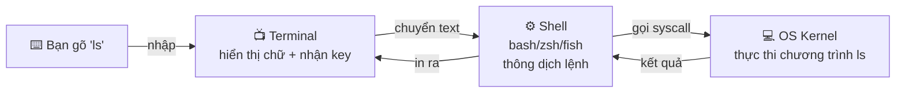

# 🎓 Shell là gì? — Bash vs Zsh vs Fish

> **Tác giả:** Mr.Rom\
> **Phiên bản:** v1.0.0\
> **Tạo lúc:** 23/05/2026\
> **Cập nhật:** 23/05/2026\
> **Level:** Basic\
> **Tags:** [MUST-KNOW]\
> **Thời lượng đọc:** ~12 phút\
> **Prerequisites:** [00_what-is-terminal.md](./00_what-is-terminal.md) — đã mở được terminal

> 🎯 *Tiếp bài terminal: hiểu **shell là gì** (khác terminal ra sao), 3 shell phổ biến (bash/zsh/fish), cách check shell đang dùng, khi nào nên đổi. KHÔNG dạy customize shell chi tiết (xem [02_Tools/shell/](../../../../02_Tools/shell/) chưa có).*

## 🎯 Sau bài này bạn sẽ

- [ ] Phân biệt rõ **Terminal**, **Shell**, **Command** (3 lớp khác nhau)
- [ ] Hiểu vì sao có **nhiều loại shell** (bash, zsh, fish, sh)
- [ ] Biết shell hiện tại bạn đang dùng là gì
- [ ] Hiểu khi nào nên đổi shell (và khi nào không nên)
- [ ] Đọc được file `~/.bashrc` / `~/.zshrc` — biết nó để làm gì

---

## Tình huống — "bash", "zsh" ở khắp nơi mà bạn không biết là gì

Sau bài 00, bạn đã mở được terminal. Mọi tutorial Python/Docker/Git bạn đang follow đều nói:

> *"Mở terminal, **thêm vào `~/.bashrc`** dòng này..."*
> *"Lệnh này cần **bash 5.0+**, kiểm tra với `bash --version`..."*
> *"Nếu dùng **zsh**, đặt vào `~/.zshrc` thay vì `~/.bashrc`..."*

Bạn ngơ. **bash** là gì? **zsh** là gì? Có phải tên terminal? Trong bài 00 ta đã học terminal — sao giờ lại có bash/zsh? Có phải mỗi cái là 1 terminal khác nhau?

→ **KHÔNG**. Terminal và Shell là **2 lớp khác nhau**. Bài này giải thích sự khác biệt + 3 loại shell phổ biến + cách bạn check shell mình đang dùng.

---

## 1️⃣ Vậy Shell thực sự là gì?

**Trả lời tình huống**: Khi bạn gõ `ls` vào terminal:
- **Terminal** chỉ là cái cửa sổ hiển thị text + nhận input từ bàn phím.
- **Shell** là chương trình thật sự **đọc** lệnh `ls`, hiểu nó, gọi OS chạy `ls`, lấy kết quả, đưa lại terminal hiển thị.



| Lớp | Vai trò | Ví dụ |
|---|---|---|
| **Terminal** | Cửa sổ hiển thị + bàn phím I/O | Terminal.app (Mac), iTerm, GNOME Terminal, Windows Terminal |
| **Shell** | Đọc lệnh text → gọi OS chạy | **bash**, **zsh**, **fish**, sh, dash, ksh, PowerShell |
| **Command** | Chương trình thực thi cụ thể | `ls`, `cd`, `python`, `git` |

🪞 **Ẩn dụ**: Terminal giống **cái điện thoại** (thiết bị nhận tiếng). Shell giống **người phiên dịch** (nghe tiếng Việt → dịch sang ngôn ngữ máy). Command là **lệnh thực sự** bạn muốn máy làm. Cùng 1 điện thoại có thể đổi phiên dịch khác (bash → zsh).

**Về kỹ thuật**: Shell là 1 **chương trình** chạy trong terminal. Nó có 1 *prompt* (vd `$`, `%`, `>`), đọc lệnh dòng-dòng, thông dịch (interpret), gọi system call để chạy command, in kết quả. Mỗi shell có **syntax riêng** cho biến, vòng lặp, if/else.

---

## 2️⃣ Tại sao có nhiều shell? — bash, zsh, fish, sh

Câu hỏi tự nhiên: tại sao không có **1 shell duy nhất**? Trả lời ngắn: lịch sử + sở thích.

```
1971 — sh (Bourne Shell) — bản đầu của Unix
1989 — bash (Bourne Again Shell) — GNU rewrite, mở rộng sh
1990 — zsh (Z Shell) — thừa kế bash + thêm nhiều tính năng
2005 — fish (Friendly Interactive Shell) — viết lại từ đầu, hiện đại
```

### So sánh 3 shell phổ biến 2026

| Tiêu chí | bash | zsh ⭐ | fish |
|---|---|---|---|
| **Tuổi** | 1989 | 1990 | 2005 |
| **Default ở đâu** | Linux đa số distro, WSL, Git Bash | **macOS từ 2019** (Catalina+) | (cài thủ công) |
| **POSIX-compliant** | ✅ | ✅ (mostly) | ❌ (cố tình khác) |
| **Auto-complete** | Cơ bản | ⭐ Thông minh | ⭐⭐ Cực thông minh (gợi ý từ history) |
| **Syntax highlighting** | (qua plugin) | (qua plugin oh-my-zsh) | ⭐ Built-in |
| **Customize prompt** | `PS1=...` (cú pháp khó) | `PS1=...` + Powerlevel10k | Built-in (đẹp sẵn) |
| **Scripting (.sh)** | ⭐ Universal — script chạy mọi nơi | OK (tương thích bash phần lớn) | ❌ Cú pháp khác — không chạy được script bash |
| **Plugin manager** | (không nhiều) | ⭐ Oh My Zsh, Prezto, Zinit | Fisher, Oh My Fish |
| **Phù hợp ai** | Server, CI/CD, script production | Dev daily (Mac/Linux), beginner | Người ghét cấu hình, muốn đẹp ngay |

### Khuyến nghị 2026

| Bạn là... | Pick |
|---|---|
| 🟢 **Beginner trên Mac** | **zsh** (default từ 2019, không cần đổi) |
| 🟢 **Beginner trên Linux** | **bash** (default đa số distro) hoặc cài zsh nếu thích |
| 🟡 **Viết script production / DevOps** | **bash** — universal nhất, mọi server có |
| 🟠 **Muốn đẹp + không cấu hình** | **fish** — nhưng nhớ: script `.sh` viết bash không chạy được trong fish |
| 🔵 **Power user customize sâu** | **zsh** + Oh My Zsh + Powerlevel10k (xem `02_Tools/shell/` chưa có) |

> 💡 **Nguyên tắc**: dùng **zsh** cho daily work (terminal interactive), dùng **bash** cho script (đặt `#!/bin/bash` đầu file). Đây là cách 80% dev làm 2026.

---

## 3️⃣ Shell hiện tại bạn đang dùng là gì?

Mở terminal, gõ:

```bash
echo $SHELL
```

3 kết quả phổ biến:

| Output | Bạn đang dùng |
|---|---|
| `/bin/zsh` | zsh (Mac default 2019+) |
| `/bin/bash` | bash (Linux default, Mac trước 2019) |
| `/usr/bin/fish` hoặc `/opt/homebrew/bin/fish` | fish (đã cài thủ công) |

Hoặc check version:

```bash
bash --version    # nếu bash
zsh --version     # nếu zsh
fish --version    # nếu fish
```

### Đổi shell — `chsh`

Nếu muốn đổi default shell (vd Linux đang bash, muốn chuyển zsh):

```bash
# 1. Cài shell mới (nếu chưa có)
sudo apt install zsh   # Ubuntu
brew install zsh       # Mac (đã có sẵn từ 2019)

# 2. Xem đường dẫn shell mới
which zsh
# /usr/bin/zsh

# 3. Đổi default shell
chsh -s /usr/bin/zsh

# 4. Đóng terminal mở lại → giờ default là zsh
echo $SHELL
# /usr/bin/zsh ✓
```

> ⚠️ **Đừng đổi shell vội** ở máy production. Đổi default shell ảnh hưởng script chạy auto. Trên máy dev cá nhân thì OK.

---

## 4️⃣ File config — `~/.bashrc`, `~/.zshrc` là gì?

Đây là chỗ tutorial bảo bạn "thêm dòng này vào `~/.bashrc`".

```
~/.bashrc       ← config cho bash (Linux đa số dùng)
~/.bash_profile ← config bash (Mac trước 2019)
~/.zshrc        ← config cho zsh (Mac từ 2019+)
~/.config/fish/config.fish ← config cho fish
```

**Nội dung file config** thường có:
- **Alias** — đặt tên ngắn cho lệnh dài (vd `alias gs='git status'`)
- **Environment variable** — biến môi trường (vd `export PATH=...`)
- **Prompt customize** — đẹp hơn mặc định
- **Startup commands** — chạy mỗi khi mở terminal

```bash
# Ví dụ ~/.zshrc đơn giản
export PATH="$HOME/.local/bin:$PATH"
alias ll='ls -lah'
alias gs='git status'
alias gp='git push'

# Theme oh-my-zsh
ZSH_THEME="robbyrussell"
plugins=(git docker kubectl)
source $ZSH/oh-my-zsh.sh
```

> 💡 **Sau khi sửa file**, gõ `source ~/.zshrc` (hoặc đóng-mở terminal) để apply.

→ Customize chi tiết shell (alias, theme, plugin) → đi đào sâu ở [`02_Tools/shell/`](../../../../02_Tools/shell/) (chưa có content).

---

## 💡 Pitfall thường gặp

### ❌ Pitfall: Viết script `.sh` bằng fish syntax

```fish
# Script fish — KHÔNG chạy trên bash/sh
for i in (seq 1 5)
    echo $i
end
```

- **Triệu chứng**: chạy `bash myscript.sh` báo lỗi cú pháp
- **Lý do**: fish có syntax khác bash (vd `set var value` thay `var=value`)
- **Cách tránh**: dùng bash cho script (`#!/bin/bash` đầu file). Fish cho **interactive** thôi.

### ❌ Pitfall: Quên `source` sau khi sửa `.zshrc`

```bash
# Thêm alias mới vào .zshrc
echo "alias gs='git status'" >> ~/.zshrc

# Thử gọi alias
gs
# zsh: command not found: gs ❌
```

- **Lý do**: shell chỉ đọc `.zshrc` lúc khởi động. Sửa file xong, shell hiện tại không tự load lại.
- **Cách fix**: chạy `source ~/.zshrc` hoặc đóng-mở terminal.

### ❌ Pitfall: Đổi default shell trên server production

```bash
chsh -s /bin/fish   # ❌ Đừng làm vậy ở server
```

- **Hậu quả**: script cron/systemd đang ghi `bash script.sh` có thể behavior khác. Login vào server qua SSH với shell khác → break automation.
- **Cách tránh**: server giữ bash. Customize chỉ ở **user** dùng (alias, prompt) qua `.bashrc`, không đổi default shell.

### ✅ Best practice: bash cho script, zsh cho daily

- Script tự động hoá → đầu file ghi `#!/bin/bash` — chạy được mọi nơi
- Terminal daily — zsh + plugin → đẹp + năng suất

---

## 🧠 Self-check

**Q1.** Terminal và Shell khác nhau thế nào? Cho 1 ví dụ cụ thể.

<details>
<summary>💡 Đáp án</summary>

- **Terminal** = cửa sổ hiển thị (Terminal.app, iTerm, Windows Terminal). Nó chỉ nhận key input và in text ra màn hình. KHÔNG hiểu lệnh.
- **Shell** = chương trình chạy bên trong terminal, đọc lệnh text, gọi OS chạy.

**Ví dụ**: Mở iTerm trên Mac (terminal). Bên trong iTerm, mặc định chạy zsh (shell). Bạn có thể `bash` để switch sang bash trong cùng iTerm — vẫn cùng terminal, đổi shell.

</details>

**Q2.** Bạn dùng Mac OS 2024. Mặc định shell là gì? Làm sao check?

<details>
<summary>💡 Đáp án</summary>

**zsh** (Mac mặc định zsh từ Catalina 10.15 năm 2019).

Check:
```bash
echo $SHELL
# /bin/zsh
```

</details>

**Q3.** Script `deploy.sh` viết cho bash. Bạn đổi default shell sang fish. Chạy `./deploy.sh` được không?

<details>
<summary>💡 Đáp án</summary>

**Vẫn được**, NẾU đầu script có `#!/bin/bash` (shebang).

Shebang nói OS: "chạy file này bằng `/bin/bash`" — không phụ thuộc default shell của user. Đây là lý do mọi script tốt phải có shebang ở dòng đầu.

Nếu KHÔNG có shebang + bạn gõ `bash deploy.sh` → vẫn chạy bash. Nếu chỉ gõ `./deploy.sh` không shebang → fish sẽ thử thông dịch theo cú pháp fish → lỗi.

</details>

---

## ⚡ Cheatsheet

| Mục đích | Lệnh |
|---|---|
| Xem shell đang dùng | `echo $SHELL` |
| Xem version shell | `bash --version` / `zsh --version` |
| Switch tạm sang shell khác (1 session) | `bash` / `zsh` / `fish` |
| Đổi default shell | `chsh -s /bin/zsh` |
| List shell đã cài | `cat /etc/shells` |
| Reload config | `source ~/.zshrc` (hoặc `~/.bashrc`) |
| Xem file config zsh | `cat ~/.zshrc` |

---

## 📚 Glossary

| EN | VN | Giải thích |
|---|---|---|
| Shell | Vỏ / Shell | Chương trình thông dịch lệnh trong terminal |
| Bash | (giữ nguyên) | Bourne Again Shell, default Linux đa số distro |
| Zsh | Z Shell | Default macOS từ 2019, mạnh hơn bash |
| Fish | Friendly Interactive Shell | Shell modern, syntax khác bash |
| POSIX | (giữ nguyên) | Chuẩn lệnh Unix — script POSIX chạy được mọi shell tuân chuẩn |
| Shebang | (giữ nguyên) | Dòng `#!/bin/bash` đầu file script, chỉ định interpreter |
| Prompt | (giữ nguyên) | Ký tự đầu dòng (`$`, `%`, `>`) báo shell đang chờ lệnh |
| Alias | Bí danh | Tên ngắn thay tên dài (vd `alias ll='ls -la'`) |
| `~/.bashrc` | File config bash | Chạy mỗi khi mở bash interactive |
| `~/.zshrc` | File config zsh | Chạy mỗi khi mở zsh interactive |

---

## 🔗 Liên kết & Tài nguyên

### Bài liên quan trong kho

| Hướng | Bài |
|---|---|
| ⬅️ Bài trước | [00_what-is-terminal.md](./00_what-is-terminal.md) — Terminal là gì |
| ➡️ Bài tiếp | [02_filesystem-concept.md](./02_filesystem-concept.md) — chưa có |
| 🛠️ Customize shell sâu | [02_Tools/shell/](../../../../02_Tools/shell/) — aliases, oh-my-zsh, powerlevel10k (chưa có) |
| 🛠️ Cài terminal emulator đẹp | [02_Tools/terminal-emulators/](../../../../02_Tools/terminal-emulators/) (chưa có) |
| 📚 Lệnh shell cụ thể (pwd/ls/cd) | [`04_OS/linux/lessons/01_basic/`](../../../../04_OS/linux/lessons/01_basic/) |

### Tài nguyên ngoài

- [Bash manual (chính thức)](https://www.gnu.org/software/bash/manual/) — đầy đủ nhất
- [Zsh docs](https://zsh.sourceforge.io/Doc/) — chính thức
- [Fish documentation](https://fishshell.com/docs/current/) — thân thiện beginner
- [Oh My Zsh](https://ohmyz.sh/) — framework customize zsh phổ biến nhất
- [Bash Pitfalls](http://mywiki.wooledge.org/BashPitfalls) — cảnh báo lỗi thường gặp khi viết script
- [Shellcheck](https://www.shellcheck.net/) — tool kiểm tra lỗi script bash online

---

## 📌 Changelog

- **v1.0.0 (23/05/2026)** — Bản đầu tiên. Tiếp Terminal intro: phân biệt Terminal/Shell/Command (3 lớp + diagram), so sánh bash/zsh/fish (bảng 10 tiêu chí), khuyến nghị theo profile, cách check + đổi shell, intro file config (`.bashrc`/`.zshrc`), pitfall + self-check + cheatsheet.
