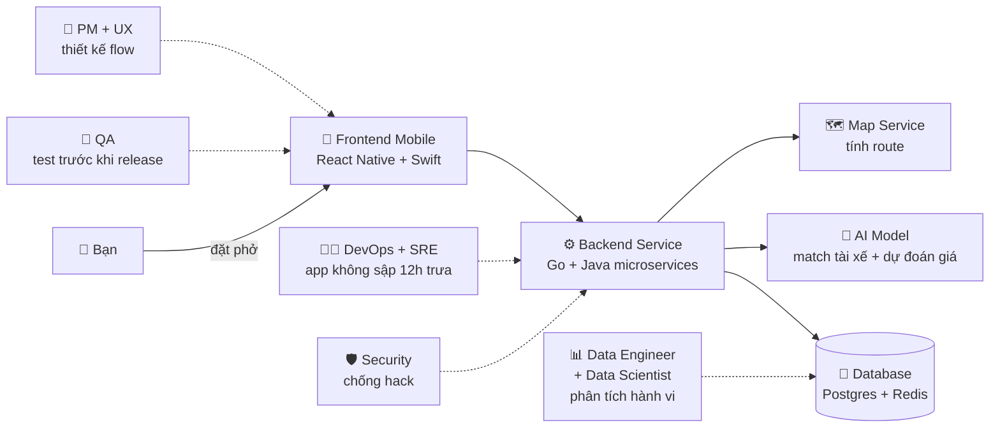
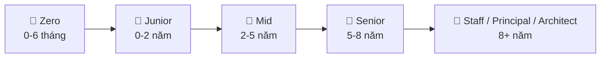

# 🎓 Ngành IT là gì? Bản đồ các nhánh cho người mới

> **Tác giả:** Mr.Rom\
> **Phiên bản:** v1.0.0\
> **Tạo lúc:** 19/05/2026\
> **Cập nhật:** 19/05/2026\
> **Level:** Basic\
> **Tags:** [MUST-KNOW]\
> **Thời lượng đọc:** ~20 phút\
> **Prerequisites:** Không cần — bài này dành cho người chưa biết gì về IT

> 🎯 *Trước khi bước chân vào IT, bạn cần "đứng cao" để thấy cả bức tranh — ngành này có những nghề gì, mỗi nghề làm gì, lương ra sao, học gì để làm được. Bài này dẫn bạn đi 1 vòng bản đồ — để khi pick career roadmap không bị bốc đại.*

## 🎯 Sau bài này bạn sẽ

- [ ] Hiểu "ngành IT" **KHÔNG phải 1 nghề** mà là 8-12 nghề rất khác nhau
- [ ] Vẽ được bản đồ các nhánh chính + đầu ra mỗi nhánh
- [ ] So sánh được 4 nhánh "hot" cho beginner (lương, độ khó, tương lai)
- [ ] Phân biệt được 3 loại role: coder, không-coder, hybrid
- [ ] Tự pick được 1-2 nhánh quan tâm để đào sâu ở career roadmap

---

## Tình huống — 1 buổi sáng của bạn

7h sáng, Apple Watch của bạn rung — app *Sleep Cycle* (viết bằng **Swift**) báo "ngủ ngon 7h12 phút".

Bạn mở Facebook lướt vài tin — feed Facebook gồm:
- **Frontend** viết bằng **React** (giao diện bạn nhìn thấy)
- **Backend** viết bằng **PHP + Hack** (xử lý đăng nhập, lưu post)
- **AI model** rank thứ tự bài hiện ra (Python + PyTorch)
- **Database** lưu billion post (MySQL + Cassandra)

Đói rồi — mở **Grab** đặt phở. App Grab thật sự là 1 **hệ thống khổng lồ**:

→ Tất cả những người trên đều **làm IT**. Nhưng họ làm những việc cực kỳ khác nhau. Một frontend dev và một DevOps engineer trong cùng team Grab **gần như không hiểu chi tiết công việc của nhau** — chỉ biết bên kia "lo phần đó".

Đây là điểm beginner hay nhầm: nghĩ *"ngành IT"* là 1 nghề. Thực ra nó là cả 1 **bản đồ** gồm 8-12 nhánh rất khác biệt.

---

## 1️⃣ Vậy ngành IT là gì?

Trước khi đi sâu, đặt 1 định nghĩa nhanh cho gọn.

**Trả lời tình huống trên**: IT là mọi nghề liên quan đến **xử lý thông tin bằng máy tính** — từ viết code, vận hành server, phân tích dữ liệu, bảo mật, đến thiết kế UX. Mỗi người trong "đội Grab" ở trên đang đảm nhiệm 1 phần của bức tranh đó.

🪞 **Ẩn dụ**: ngành IT giống như **ngành Y** — đều "liên quan đến sức khoẻ", nhưng:
- Bác sĩ phẫu thuật ≠ Dược sĩ ≠ Y tá ≠ Kỹ thuật viên X-quang ≠ Quản lý bệnh viện
- Mỗi người có chuyên môn riêng, học khác nhau, kỹ năng khác nhau
- Họ phối hợp để chữa bệnh — nhưng không ai làm việc của người kia

IT cũng vậy. *"Tôi học IT"* nghe rất rộng — bằng *"tôi học Y"* — bạn cần nói cụ thể *học IT để làm gì*.

**Về kỹ thuật**, IT bao gồm 5 mảng lớn:

| Mảng | Bao gồm |
|---|---|
| Software | Web, mobile, desktop, embedded — tất cả thứ ta cài/dùng |
| Hardware | Chip, server, IoT — thứ vật lý |
| Data | Lưu trữ, xử lý, phân tích thông tin |
| Networking | Kết nối, truyền tải dữ liệu |
| Security | Bảo vệ tất cả thứ trên khỏi attack |

Trong 5 mảng trên, mảng **Software (Phát triển phần mềm)** là mảng phổ biến nhất, có nhu cầu tuyển dụng khổng lồ nhất và cũng chính là mảng mà hầu hết người mới (beginner) hướng tới khi bước chân vào IT.

### 🎬 Vậy Phát triển phần mềm (Software Development) thực sự là gì?

Phát triển phần mềm là quá trình thiết kế, xây dựng và vận hành các ứng dụng, hệ thống và dịch vụ số — từ chiếc ứng dụng nhỏ nhắn trên điện thoại, website thương mại điện tử bạn lướt hàng ngày, đến những hệ thống ngân hàng khổng lồ xử lý hàng triệu giao dịch mỗi giây. Đây là nơi bạn dùng tư duy logic và những dòng code để giải quyết các bài toán thực tế.

🪞 **Ẩn dụ**: Hãy hình dung xây dựng một phần mềm giống hệt như **xây một tòa nhà cao tầng**:
- Cần có **Kiến trúc sư (Architect)** để vẽ bản thiết kế tổng quan và chọn vật liệu phù hợp.
- Cần có **Thợ xây (Developer / Programmer)** để gõ từng dòng code vững chãi dựng nên các bức tường, căn phòng.
- Cần có **Thợ điện nước (DevOps / SRE)** để đi đường ống hạ tầng, kéo cáp, đảm bảo tòa nhà có điện nước vận hành êm ái, trơn tru.
- Cần có **Người kiểm định (QA / Tester)** để kiểm tra xem cửa có kẹt, tường có nứt, điện có rò rỉ trước khi bàn giao nhà cho cư dân.

Trong thế giới phần mềm, tùy theo sở thích và thế mạnh, bạn có thể chọn làm **Frontend** (thiết kế những gì người dùng nhìn thấy và tương tác trực tiếp), **Backend** (xử lý logic, tính toán và lưu trữ dữ liệu phía sau), **DevOps** (vận hành máy chủ và tự động hóa hệ thống), hoặc **Data/AI** (thu thập dữ liệu và huấn luyện trí tuệ nhân tạo).

→ Bản đồ 8-12 nhánh ở §3 dưới là cách thị trường chia nhỏ các mảng này thành **vai trò công việc cụ thể**.

---

## 2️⃣ Vì sao đáng theo IT? (số liệu Việt Nam 2025-2026)

Trước khi đi sâu vào từng nhánh, ta xem thị trường đang nói gì.

| Chỉ số | Giá trị |
|---|---|
| Nhân lực IT Việt Nam hiện tại | ~530,000 người |
| Thiếu hụt mỗi năm | ~150,000 - 200,000 người |
| Lương fresher (mới ra trường, 0-1 năm) | 12-25 triệu VND/tháng |
| Lương mid (3-5 năm) | 30-60 triệu VND/tháng |
| Lương senior (7+ năm) | 70-150 triệu VND/tháng |
| Top tech lead / staff / principal | 200-500+ triệu VND/tháng |
| Làm outsource cho công ty nước ngoài | gấp 1.5-3x mức trong nước |
| Làm fulltime remote cho công ty US/EU | $60k - $200k/năm (gấp 5-10x mức VN) |

**3 lý do ngành này còn dư cầu**:

1. **Số hoá lan rộng** — ngân hàng, bệnh viện, trường học, nông nghiệp, logistics... tất cả đang chuyển lên phần mềm. Mỗi ngành đều cần dev.
2. **Việt Nam là điểm outsource lớn** — Nhật, Mỹ, Singapore, Hàn thuê dev VN nhiều vì giá rẻ + tiếng Anh OK. Kinh tế nội địa không tăng thì outsource vẫn ổn.
3. **AI tăng năng suất, không thay thế dev** (hiện tại) — Claude/Copilot làm dev mỗi người làm việc 2x, nhưng yêu cầu thị trường cũng tăng 3-5x → ngành vẫn thiếu người.

> ⚠️ **Lưu ý**: số liệu trên là *trung bình thị trường*. Bạn ngồi nhà chơi game thì vẫn 0đ. Lương cao chỉ đến nếu bạn **có skill thật + biết tự tìm việc tốt**.

---

## 3️⃣ Bản đồ 8 nhánh chính + 4 nhánh phụ

```mermaid
graph TD
    IT[🌐 Ngành IT]
    IT --> DEV[💻 Phát triển phần mềm<br/>Development]
    IT --> INFRA[⚙️ Vận hành + Hạ tầng<br/>Operations]
    IT --> DATA[📊 Dữ liệu<br/>Data]
    IT --> AI[🤖 AI / ML]
    IT --> SEC[🛡️ Bảo mật<br/>Security]
    IT --> NONCODE[🎨 Vai trò non-code<br/>PM, UX, QA]

    DEV --> BE[Backend Dev]
    DEV --> FE[Frontend Dev]
    DEV --> FS[Fullstack Dev]
    DEV --> MOB[Mobile Dev]
    DEV --> GAME[Game Dev]
    DEV --> EMB[Embedded / IoT]
    DEV --> BC[Blockchain]

    INFRA --> DO[DevOps Engineer]
    INFRA --> SRE[SRE Engineer]
    INFRA --> CLOUD[Cloud Engineer]
    INFRA --> PLAT[Platform Engineer]

    DATA --> DE[Data Engineer]
    DATA --> DA[Data Analyst]
    DATA --> DS[Data Scientist]

    AI --> MLE[ML Engineer]
    AI --> AIE[AI Engineer<br/>LLM/RAG]
    AI --> RES[AI Researcher]

    SEC --> SE[Security Engineer]
    SEC --> PEN[Penetration Tester]

    NONCODE --> PM[Product Manager]
    NONCODE --> UX[UX/UI Designer]
    NONCODE --> QA[QA / SDET]
    NONCODE --> TPM[Technical PM]
```

### Bảng tổng quan 12 vai trò phổ biến

| # | Vai trò | Làm gì (1 dòng) | Code nhiều? | Khó vào? | Lương VN (mid) |
|---|---|---|---|---|---|
| 1 | **Backend Developer** | Viết API + xử lý dữ liệu phía server | ✅✅✅ | Trung bình | 35-65M |
| 2 | **Frontend Developer** | Build UI/UX trên trình duyệt | ✅✅✅ | Trung bình | 30-55M |
| 3 | **Fullstack Developer** | Cả FE + BE | ✅✅✅ | Cao (rộng) | 40-70M |
| 4 | **Mobile Developer** | App iOS/Android | ✅✅✅ | Trung bình | 35-65M |
| 5 | **DevOps Engineer** | Tự động hoá deploy + vận hành | ✅✅ | Khó (rộng) | 40-75M |
| 6 | **SRE Engineer** | Đảm bảo app không sập + observability | ✅✅ | Khó | 45-80M |
| 7 | **Data Engineer** | Pipeline dữ liệu, warehouse | ✅✅✅ | Trung bình | 40-70M |
| 8 | **Data Scientist** | Phân tích + ML model | ✅✅✅ | Khó (cần toán) | 40-80M |
| 9 | **AI Engineer (LLM)** | Build app LLM, RAG, agent | ✅✅✅ | Khó (mới) | 50-100M |
| 10 | **Security Engineer** | Bảo mật hệ thống, pentest | ✅✅ | Khó | 45-85M |
| 11 | **QA Engineer (SDET)** | Test automation | ✅✅ | Dễ vào | 25-50M |
| 12 | **Product Manager** | Định hướng sản phẩm, prioritize | ❌ | Khó (mềm) | 40-90M |

> 💡 Số lương trên là **dải trung bình mid (3-5 năm exp) ở thị trường VN 2026**. Senior có thể gấp 2x. Làm cho công ty Mỹ/Sing có thể gấp 3-5x.

---

## 4️⃣ So sánh 4 nhánh "hot" cho beginner cân nhắc

Đây là 4 nhánh **thường được người mới chọn nhất**. So sánh trực tiếp để bạn cân nhắc.

| Tiêu chí | Backend Dev | Frontend Dev | Data Engineer | DevOps |
|---|---|---|---|---|
| **Thời gian học (0 → entry)** | 9 tháng FT | 9 tháng FT | 10 tháng FT | 10 tháng FT |
| **Ngôn ngữ chính** | Python/Go/Java/Node | JS/TS + React | Python + SQL | Python + Bash + YAML |
| **Toán cần?** | Ít | Rất ít | Trung bình | Ít |
| **Sáng tạo / nghệ thuật?** | Trung bình (kiến trúc) | Cao (UI/UX) | Thấp (kỹ thuật) | Thấp (vận hành) |
| **Trực quan ngay (thấy kết quả)?** | Vừa | ⭐ Rất trực quan | Thấp | Vừa |
| **Tính ổn định việc làm** | ⭐ Rất cao | Cao | ⭐ Rất cao | ⭐ Rất cao |
| **Áp lực on-call (3h sáng)?** | Vừa | Thấp | Thấp | ⭐ Cao |
| **Có thể remote / WFH?** | ⭐ Dễ | ⭐ Dễ | Dễ | Vừa (đôi khi cần access prod) |
| **Trần lương (cao nhất có thể tới)** | $300k | $250k | $400k | $350k |

### Pick theo profile bạn

| Bạn là... | Pick |
|---|---|
| Thích logic + giải bài toán + ổn định | **Backend** |
| Thích thiết kế + thấy kết quả ngay + UI đẹp | **Frontend** |
| Thích con số + phân tích + ít stress | **Data Engineer** |
| Thích "vọc" + nhiều công cụ + adrenaline | **DevOps** |
| Chưa rõ + muốn linh hoạt | **Fullstack** (rộng, đổi nhánh dễ) |
| Cuồng AI + theo kịp hot trend | **AI Engineer** (mới, rủi ro cao) |

---

## 5️⃣ Trong IT, KHÔNG phải ai cũng "code"

Đây là điểm beginner hay bỏ sót.

| Loại role | Code nhiều? | Ví dụ |
|---|---|---|
| **Coder thuần** | ✅✅✅ 80-100% | Backend dev, Frontend dev, Mobile dev, ML engineer |
| **Hybrid** | ✅✅ 30-70% | DevOps, SRE, Data analyst, Security engineer |
| **Non-coder** | ❌ < 20% | Product Manager, UX Designer, Technical Writer, Scrum Master |

🪞 **Ẩn dụ**: trong 1 đội bóng đá có **tiền đạo** (coder thuần — ghi bàn = ship code), **tiền vệ** (hybrid — vừa thủ vừa công), và **HLV/medic/quản lý** (non-coder — không xuống sân nhưng quyết kết quả).

→ Nếu bạn không thích code 8h/ngày, **vẫn có chỗ trong IT** — role non-coder lương vẫn cao (Senior PM ~80-150M ở VN).

---

## 6️⃣ Lộ trình chung — từ zero đến chuyên gia

Mọi nhánh đều có 5 stage tương tự:

| Stage | Đặc điểm | Lương VN |
|---|---|---|
| 🥚 **Zero-to-Coder** | Học cơ bản — terminal, git, 1 ngôn ngữ, 1 project portfolio | 0 (chưa đi làm) |
| 🐣 **Junior** | Làm task được giao, sửa bug nhỏ, học khung công ty | 12-25M |
| 🐥 **Mid** | Tự chủ task lớn, design feature, mentor junior | 30-60M |
| 🦅 **Senior** | Design hệ thống, lead team nhỏ, code review chính | 70-120M |
| 👑 **Staff/Principal** | Quyết kiến trúc lớn, ảnh hưởng nhiều team, tech strategy | 150-500M+ |

→ Vào IT 1 năm đầu, bạn ở **Zero/Junior**. Đừng vội so với senior. 5-7 năm bền bỉ mới tới Mid-Senior.

---

## 7️⃣ Hiểu lầm phổ biến

| ❌ Hiểu lầm | ✅ Sự thật |
|---|---|
| "IT cần giỏi Toán" | Sai phần lớn nhánh. Chỉ Data Scientist / ML Researcher / Game Dev cần toán nhiều. Backend/Frontend/DevOps chỉ cần toán cấp 3 |
| "Bằng đại học là bắt buộc" | Sai. Nhiều dev tự học (bootcamp, online). Portfolio + skill quan trọng hơn bằng cấp ở phần lớn công ty. *Trừ* mảng AI Research yêu cầu PhD |
| "IT = ngồi gõ code 8h" | Sai. Thực tế: code ~30-50% thời gian, còn lại là meeting, design, review, debug, viết doc |
| "AI sẽ thay thế dev" (2026) | Chưa. AI tăng năng suất 2-3x nhưng thị trường cũng mở rộng. Junior khó hơn, mid+ vẫn thiếu |
| "Càng già càng khó kiếm việc" | Sai nếu bạn lên Senior+. Nhiều CTO/Staff Engineer 40-50 tuổi vẫn cực hot |
| "Phải giỏi tiếng Anh native" | Sai. Đọc-hiểu doc EN là đủ. Giao tiếp tiếng Anh chỉ cần thiết khi muốn remote cho công ty nước ngoài |
| "Học là biết — biết là kiếm tiền liền" | Sai. Cần 3-6 tháng làm project portfolio + apply 20-50 chỗ mới có offer đầu |

---

## 8️⃣ Soft skill — quan trọng không kém code

Skill kỹ thuật đưa bạn vào ngành. Soft skill đưa bạn lên cao.

| Soft skill | Vì sao quan trọng |
|---|---|
| **Tự học** | Tech đổi 6 tháng 1 lần — không tự update là tụt hậu |
| **Viết / nói rõ ràng** | Code đúng + giải thích được = senior. Code đúng nhưng không giải thích = junior |
| **Hỏi đúng câu** | Stack Overflow + GPT chỉ trả lời chính xác khi câu hỏi rõ |
| **Quản lý thời gian** | 8h/ngày làm việc không thì bug deadline. Pomodoro + Calendar block |
| **Empathy với user / teammate** | Code "đúng" nhưng UX khó dùng = thất bại. Hiểu user > kỹ thuật cao |
| **Chấp nhận sai + sửa nhanh** | Không có dev nào không bug prod. Quan trọng là rollback + post-mortem |
| **Tiếng Anh đọc-hiểu** | 95% doc + 80% material học là EN |

---

## 9️⃣ Bắt đầu từ đâu?

Sau bài này, **3 step tiếp theo**:

### Step 1 — Bạn đã có nền code chưa?

- ❌ Chưa từng code dòng nào → đi roadmap [`zero-to-coder`](../../../../00_Roadmaps/career/zero-to-coder_career-roadmap.md) trước (~6 tháng FT). Học logic + 1 ngôn ngữ + git + 1 project portfolio.
- ✅ Đã code cơ bản → chọn 1 nhánh chuyên sâu ngay (xem Step 2).

### Step 2 — Pick 1 career roadmap chuyên sâu

| Bạn quan tâm... | Roadmap |
|---|---|
| Build web app + API | [`backend-developer`](../../../../00_Roadmaps/career/backend-developer_career-roadmap.md) |
| UI đẹp, animation, design | [`frontend-developer`](../../../../00_Roadmaps/career/frontend-developer_career-roadmap.md) |
| Cả 2 + indie hacker | [`fullstack-developer`](../../../../00_Roadmaps/career/fullstack-developer_career-roadmap.md) |
| App mobile iOS/Android | [`mobile-developer`](../../../../00_Roadmaps/career/mobile-developer_career-roadmap.md) |
| Infra, automation, deploy | [`devops-engineer`](../../../../00_Roadmaps/career/devops-engineer_career-roadmap.md) |
| Reliability + observability | [`sre-engineer`](../../../../00_Roadmaps/career/sre-engineer_career-roadmap.md) |
| Platform / Internal Developer Platform | [`platform-engineer`](../../../../00_Roadmaps/career/platform-engineer_career-roadmap.md) |
| AWS / GCP / Azure | [`cloud-engineer`](../../../../00_Roadmaps/career/cloud-engineer_career-roadmap.md) |
| Pipeline dữ liệu, warehouse | [`data-engineer`](../../../../00_Roadmaps/career/data-engineer_career-roadmap.md) |
| Phân tích dữ liệu + ML | [`data-scientist`](../../../../00_Roadmaps/career/data-scientist_career-roadmap.md) |
| ML production (MLOps) | [`ml-engineer`](../../../../00_Roadmaps/career/ml-engineer_career-roadmap.md) |
| LLM, RAG, AI Agent | [`ai-engineer`](../../../../00_Roadmaps/career/ai-engineer_career-roadmap.md) |
| Cybersecurity, pentest | [`security-engineer`](../../../../00_Roadmaps/career/security-engineer_career-roadmap.md) |
| Test automation | [`qa-engineer`](../../../../00_Roadmaps/career/qa-engineer_career-roadmap.md) |
| Unity, indie game | [`game-developer`](../../../../00_Roadmaps/career/game-developer_career-roadmap.md) |
| Smart contract, Web3 | [`blockchain-developer`](../../../../00_Roadmaps/career/blockchain-developer_career-roadmap.md) |

### Step 3 — Chưa chắc chọn gì?

- Đọc 2-3 career roadmap mình thấy hứng → cái nào *đọc xong còn muốn đi tiếp* = đúng nhánh
- Hoặc thử mỗi nhánh **1 tutorial 4-8h** (YouTube full) — cảm giác *"cuốn"* sẽ chỉ đường
- Hoặc xin coffee 30 phút với 1 dev đang làm nhánh đó — hỏi thẳng *"công việc thường ngày làm gì, ghét nhất cái gì, vui nhất khi nào"*

> 💡 **Đừng pick theo lương cao nhất** — burnout 6 tháng là bỏ. Pick theo *thứ mình thực sự không chán làm 5 năm tới*.

---

## 💡 Pitfall thường gặp

### ❌ Pitfall: học quá rộng trước khi đi sâu

- **Triệu chứng**: 6 tháng học chút Python, chút React, chút Docker, chút SQL — không project hoàn chỉnh nào.
- **Nguyên nhân**: sợ "chọn sai nhánh" nên không commit.
- **Cách tránh**: pick 1 nhánh trong 1-2 tuần. Sai cũng không sao — đổi sau 3-6 tháng vẫn được. Việc commit quan trọng hơn việc chọn đúng từ đầu.

### ❌ Pitfall: tutorial hell

- **Triệu chứng**: xem 100h video Udemy, chưa tự code 1 project nào.
- **Nguyên nhân**: video "hiểu" nhưng tay chưa "biết". Hiểu ≠ biết làm.
- **Cách tránh**: cứ mỗi video 1h → 2h tự build cái tương tự không nhìn lại video.

### ✅ Best practice: chọn nhánh theo "việc thường ngày"

- **Vì sao**: lương + hype thay đổi. Việc thường ngày bạn làm 8h thì khó thay đổi.
- **Cách áp dụng**: hỏi 1 senior nhánh đó "1 ngày của anh/chị làm gì cụ thể". Nghe thấy ngán → skip. Nghe thấy thú → đi tiếp.

---

## 🧠 Self-check

**Q1.** Trong "đội Grab" ở phần tình huống mở bài, ai là người chịu trách nhiệm khi app sập lúc 12h trưa giờ cao điểm?

💡 Đáp án

**SRE Engineer** (hoặc DevOps Engineer ở công ty nhỏ chưa tách SRE). Đây là người trực on-call, monitoring metric, scale up khi traffic tăng đột biến. Backend dev viết code có thể đã viết app đúng — nhưng đảm bảo app **chạy được** ở scale là job của SRE/DevOps.

**Q2.** Bạn nghe người ta nói "học IT cần giỏi Toán". Câu này đúng hay sai? Đúng/sai cho nhánh nào?

💡 Đáp án

**Sai phần lớn**. Toán chỉ thực sự cần nhiều ở 3 nhánh: Data Scientist / ML Engineer / ML Researcher (cần thống kê + đại số tuyến tính + giải tích), Game Dev (cần đại số tuyến tính 3D + vật lý), và Embedded/IoT (cần điện tử + tín hiệu). Còn Backend / Frontend / DevOps / Mobile / QA / PM... chỉ cần toán cấp 3 hoặc thậm chí ít hơn.

**Q3.** Bạn có ngân sách thời gian 6 tháng full-time để vào ngành IT. Nên học rộng (chút Python + chút React + chút Docker) hay học sâu 1 nhánh (vd: chỉ Backend Python)?

💡 Đáp án

**Học sâu 1 nhánh**. 6 tháng vừa đủ để đi từ zero → có 1 project portfolio + apply junior. Học rộng sẽ ra ngoài kia "biết chút chút" — không công ty nào tuyển. Nếu pick sai nhánh thì sau 6 tháng vẫn có nền (logic, git, test) để chuyển — không mất gì.

**Q4.** Một Senior Frontend Developer ở Việt Nam (7 năm exp) có thể kiếm bao nhiêu nếu làm remote cho công ty US?

💡 Đáp án

**$80k - $180k/năm** (~165 - 380 triệu VND/tháng). Senior ở VN làm cho US thường ở khoảng giữa: $100k-$150k. So với làm cho công ty VN cùng level (~70-120M/tháng) thì gấp 2-3x. Đây là lý do nhiều dev VN target market global từ năm 3-5 sự nghiệp.

---

## 📚 Glossary

| EN | VN | Giải thích |
|---|---|---|
| Backend | Phần ngầm | Phần xử lý dữ liệu phía server, user không thấy trực tiếp |
| Frontend | Phần giao diện | Phần user nhìn thấy + tương tác (trên trình duyệt / mobile) |
| Fullstack | Cả 2 phía | Làm cả Backend lẫn Frontend |
| DevOps | (giữ EN) | "Development + Operations" — kết hợp dev + vận hành infra |
| SRE | Site Reliability Engineer | Đảm bảo hệ thống "live", đo SLO/SLA |
| MLOps | ML Operations | DevOps cho ML model |
| LLM | Large Language Model | Mô hình ngôn ngữ lớn (GPT, Claude, Gemini) |
| RAG | Retrieval-Augmented Generation | Pattern LLM + truy xuất dữ liệu ngoài |
| Pentest | Penetration Testing | Test bằng cách "hack" hệ thống mình |
| SDET | Software Dev Engineer in Test | QA biết code, automation test |
| Outsource | (giữ EN) | Làm thuê cho công ty nước ngoài qua agency VN |
| Freelance | Tự do | Tự nhận hợp đồng, không gắn 1 công ty |
| Remote | Làm xa | Làm từ nhà / nơi khác công ty |
| On-call | Trực sự cố | Sẵn sàng fix nếu app sập ngoài giờ |
| Post-mortem | Phân tích sau sự cố | Họp sau khi sửa lỗi để tránh lần sau |
| Burnout | Kiệt sức | Làm quá nhiều, mất hứng thú, năng suất giảm |

---

## 🔗 Liên kết & Tài nguyên

### Bài tiếp theo trong kho

- 🥚 [Zero-to-coder roadmap](../../../../00_Roadmaps/career/zero-to-coder_career-roadmap.md) — nếu chưa code dòng nào
- 🗺️ [00_Roadmaps README](../../../../00_Roadmaps/) — danh sách 17 career roadmap đầy đủ
- 📚 [Computational Thinking](../../computational-thinking/) (chưa có) — kỹ năng tư duy giải bài toán bằng máy tính
- 📚 [Version Control](../../version-control/git/) ✅ — git concept (6 bài bạn story arc)

### Tài nguyên ngoài (đáng đọc)

- [Roadmap.sh](https://roadmap.sh) — visual roadmap cho 20+ nghề IT (tiếng Anh)
- [VietnamWorks IT Salary Report 2026](https://www.vietnamworks.com) — báo cáo lương ngành (tiếng Việt)
- [Stack Overflow Developer Survey](https://survey.stackoverflow.co/) — global survey nghề dev
- [TopDev VietNam IT Market](https://topdev.vn/) — số liệu thị trường VN
- [Hacker News "Who's Hiring"](https://news.ycombinator.com/jobs) — job board global
- [r/cscareerquestions](https://reddit.com/r/cscareerquestions) — hỏi đáp career
- *"The Phoenix Project"* — Gene Kim (sách) — DevOps mindset qua tiểu thuyết
- *"The Pragmatic Programmer"* — Hunt & Thomas — kinh điển cho dev mọi nhánh

---

## 📌 Changelog

- **v1.0.0 (19/05/2026)** — Bản đầu tiên. 9 section + tình huống mở bài + ẩn dụ "ngành Y" + bản đồ 8 nhánh chính + 4 nhánh phụ + so sánh 4 nhánh hot cho beginner + lộ trình 5 stage zero-to-principal + 7 hiểu lầm phổ biến + 7 soft skill + link sang 17 career roadmap.
