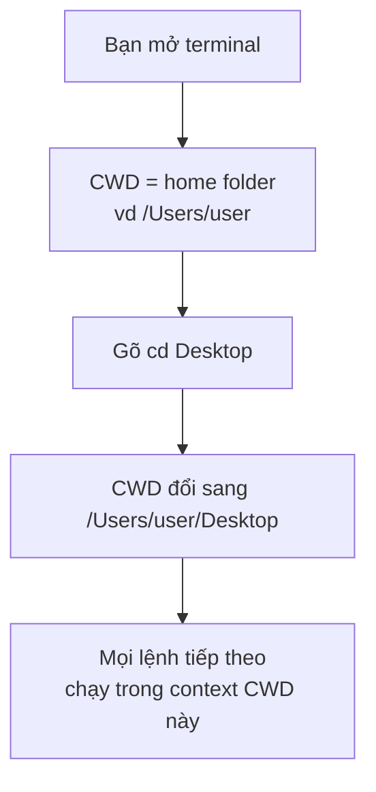

# 🎓 Filesystem concept — `/`, `~`, `.`, `..`, working directory

> **Tác giả:** Mr.Rom\
> **Phiên bản:** v1.0.0\
> **Tạo lúc:** 23/05/2026\
> **Cập nhật:** 23/05/2026\
> **Level:** Basic\
> **Tags:** [MUST-KNOW]\
> **Prerequisites:** [00_what-is-terminal.md](./00_what-is-terminal.md), [01_what-is-shell.md](./01_what-is-shell.md)

> 🎯 *Bài CONCEPT — hiểu **filesystem ngầm ra sao**: root, path, working directory, hidden file, symlink. **KHÔNG dạy lệnh** (lệnh `pwd`/`ls`/`cd` xem [`04_os/linux/lessons/01_basic/01_navigation.md`](../../../../04_os/linux/lessons/01_basic/01_navigation.md)). Bài này dạy bạn HIỂU `/etc`, `~`, `.`, `..` thực sự là gì.*

## 🎯 Sau bài này bạn sẽ

- [ ] Vẽ được cây filesystem 3 OS (Linux/Mac/Windows) + chỉ khác biệt
- [ ] Phân biệt **Absolute path** (`/etc/nginx`) vs **Relative path** (`./config`)
- [ ] Hiểu **Working Directory** — vì sao luôn "đứng ở 1 chỗ"
- [ ] Đọc 5 ký hiệu đặc biệt: `/`, `~`, `.`, `..`, `-`
- [ ] Hiểu **hidden files** — vì sao `.git`, `.env` ẩn
- [ ] Biết **symbolic link** là gì (concept)
- [ ] Đọc được output của `ls -la` (cột permission `rwxr-xr-x`)

---

## Tình huống — tutorial bảo "cd /etc/nginx" mà bạn không biết `/etc` là gì

Bạn follow tutorial deploy Nginx. Bước 3 ghi: *"cd vào `/etc/nginx/conf.d/`, sửa file `default.conf`."*

Bạn gõ:
```bash
cd /etc/nginx/conf.d/
```

OK lệnh chạy. Nhưng:
1. `/etc` là **folder gì**? Sao nó ở **gốc** chứ không phải trong home (`/Users/user`)?
2. Tutorial khác lại bảo *"sửa `~/.zshrc`"* — `~` nghĩa là gì? `.` đầu file `.zshrc` để làm gì?
3. Tutorial khác nữa: *"copy `./config.json` sang `../backups/`"* — `./` vs `../` khác gì?

Tất cả là **ký hiệu filesystem chuẩn Unix** — học 1 lần dùng cả đời. Bài này dạy bạn HIỂU những ký hiệu này, không chỉ thuộc lòng.

→ Hiểu xong, bạn đọc bất kỳ tutorial nào cũng không bối rối với path nữa.

---

## 1️⃣ Vậy filesystem thực sự là gì?

**Trả lời tình huống**: filesystem là cách OS **tổ chức file/folder** thành cây có gốc (root). `/etc` là **folder hệ thống** ở ngay sát gốc — chỗ chứa config của mọi service. `~` là **shortcut** đến home folder của user hiện tại.

🪞 **Ẩn dụ**: filesystem giống **cây gia phả lộn ngược**. Gốc ở **trên cùng** (root `/`), nhánh **toả xuống dưới** (folder con, cháu, chắt). Mỗi file/folder có **địa chỉ duy nhất** từ gốc xuống (`/Users/user/Desktop/myapp/main.py` = "đi từ gốc → Users → user → Desktop → myapp → file main.py").

### Filesystem 3 OS — khác biệt cốt lõi

Linux, Mac, Windows có cách tổ chức file khác nhau ở 5 điểm. Tutorial dev online đa số viết kiểu Linux/Mac → cần biết để biết đâu cần "dịch" sang Windows:

| | **Linux** | **macOS** | **Windows** |
|---|---|---|---|
| **Root** | `/` (forward slash) | `/` (giống Linux — BSD Unix) | `C:\` (mỗi ổ là 1 root riêng) |
| **Separator** | `/` | `/` | `\` (backslash) hoặc `/` |
| **Home** | `/home/<user>` | `/Users/<user>` | `C:\Users\<user>` |
| **Case-sensitive** | ✅ Có (mặc định) | ❌ Không (mặc định APFS) | ❌ Không |
| **File ẩn** | Prefix `.` (vd `.git`) | Prefix `.` | Attribute "Hidden" (set qua Properties) |

→ **Linux + Mac gần giống nhau** (cả 2 là Unix-like). **Windows khác hẳn**. Hầu hết tutorial dev viết theo chuẩn Unix → cần biết.

### Cây filesystem Linux/Mac (chuẩn)

```
/                          ← ROOT — gốc cao nhất
├── bin/                   ← binary cốt lõi (ls, cat, cp...)
├── etc/                   ← CONFIG hệ thống (nginx, ssh, ...)
├── home/                  ← (Linux) home folder của user
│   └── rom/               ← = ~  (Linux user)
│       ├── Desktop/
│       ├── Documents/
│       ├── projects/
│       │   └── myapp/
│       └── .zshrc         ← file ẩn
├── Users/                 ← (Mac) home folder của user
│   └── rom/               ← = ~  (Mac user)
├── usr/                   ← chương trình cài thêm (gần như /bin nhưng layer 2)
│   ├── local/             ← Homebrew cài vào đây (Mac)
│   └── bin/
├── var/                   ← VARIABLE — log, mail, cache
│   └── log/
├── opt/                   ← (optional) phần mềm 3rd-party
└── tmp/                   ← temp files, reboot là mất
```

→ **Hiểu vài folder hệ thống**: `/etc` (config), `/var/log` (log), `/usr/local/bin` (chương trình Homebrew). Nhiều bug deploy là vì ghi nhầm vào folder không đúng.

---

## 2️⃣ Path là gì? — Absolute vs Relative

Path = "đường dẫn" tới 1 file/folder. **2 cách viết**:

### Absolute path (tuyệt đối)

Bắt đầu bằng `/` — đi từ **gốc** xuống. Hoạt động mọi nơi, không phụ thuộc bạn đang đứng đâu.

```
/Users/user/Desktop/myapp/main.py
```

→ Đọc: "Từ ROOT → Users → user → Desktop → myapp → file main.py".

**Khi nào dùng**: tutorial, script production, paths trong config file.

### Relative path (tương đối)

KHÔNG bắt đầu bằng `/` — đi từ **chỗ bạn đang đứng** (working directory).

```
./config.json          ← file config.json TRONG folder hiện tại
../backups/            ← folder backups Ở CẤP CHA
src/utils/helper.py    ← từ folder hiện tại, vào src/utils/, lấy helper.py
```

→ Đọc: phụ thuộc bạn đang ở đâu. Nếu đang ở `/Users/user/myapp/`:
- `./config.json` = `/Users/user/myapp/config.json`
- `../backups/` = `/Users/user/backups/`

**Khi nào dùng**: trong script chia sẻ, code (import statement), `git add` file, quick navigate.

### So sánh nhanh

Bảng dưới tóm tắt 6 điểm khác biệt giữa 2 cách viết path. Đọc cột "Khi nào dùng" để biết tình huống nào pick cái nào:

| | Absolute | Relative |
|---|---|---|
| Bắt đầu bằng | `/` | KHÔNG `/` (hoặc `./`, `../`) |
| Phụ thuộc working dir? | ❌ Không | ✅ Có |
| Ví dụ | `/etc/nginx/conf.d/` | `./conf.d/`, `../`, `src/` |
| Khi nào dùng | Script production, tutorial, config | Code, import, dev daily |
| Ưu | Rõ ràng, không nhầm | Ngắn, dễ chia sẻ project |
| Nhược | Dài, phụ thuộc máy | Phụ thuộc "đứng ở đâu" |

> 💡 **Nguyên tắc**: trong code (Python import, JS require) → relative. Trong script bash/shell → ưu tiên absolute để chạy đúng mọi lúc.

---

## 3️⃣ 5 ký hiệu đặc biệt phải nhớ

Khi đọc path trong tutorial, bạn sẽ gặp 5 ký hiệu lặp đi lặp lại. Nhớ ý nghĩa của chúng giúp đỡ "đoán mò" mỗi lần thấy `~`, `.`, `..`:

| Ký hiệu | Tên | Nghĩa | Ví dụ |
|---|---|---|---|
| `/` | Root / Separator | Gốc cao nhất HOẶC dấu ngăn folder | `/etc/nginx` |
| `~` | Tilde | Home folder user hiện tại | `~/Desktop` = `/Users/user/Desktop` |
| `.` | Dot | Folder HIỆN TẠI (working dir) | `./config.json` |
| `..` | Double dot | Folder CHA (lên 1 cấp) | `../backups/` |
| `-` | Dash | Folder VỪA RỜI (toggle như "Back") | `cd -` |

### Ví dụ thực tế

Cách tốt nhất để nắm các ký hiệu này là **luyện đọc**. Tưởng tượng bạn đang ở folder `/Users/user/projects/myapp/src/`. Diễn dịch mỗi lệnh `cd` xem dẫn đến đâu:

| Lệnh | Nghĩa absolute |
|---|---|
| `cd ~` | → `/Users/user` (home) |
| `cd ~/Desktop` | → `/Users/user/Desktop` |
| `cd ..` | → `/Users/user/projects/myapp/` (lên 1 cấp) |
| `cd ../..` | → `/Users/user/projects/` (lên 2 cấp) |
| `cd ./tests` | → `/Users/user/projects/myapp/src/tests/` |
| `cd /` | → `/` (về gốc) |
| `cd -` | → folder vừa rời (toggle) |

🪞 **Ẩn dụ giao thông**:
- `/` = quốc lộ chính (đi từ TP HCM ra Hà Nội — chính xác đến km)
- `~` = "đường về nhà" (mọi nơi đều dẫn về nhà bạn)
- `.` = "ở đây"
- `..` = "lùi 1 bước"
- `-` = "quay lại chỗ vừa rời" (như Back trình duyệt)

---

## 4️⃣ Working Directory — bạn LUÔN đứng ở 1 chỗ

Khi shell mở, bạn **luôn ở 1 folder cụ thể** — gọi là **Working Directory** (CWD = Current Working Directory).



### Vì sao CWD quan trọng?

Mỗi lệnh shell **chạy trong context CWD**:

```bash
# Đang ở /Users/user
ls                       # liệt kê file trong /Users/user
python main.py           # tìm main.py trong /Users/user — nếu không có → lỗi
cat config.json          # tìm config.json trong /Users/user
```

→ **Cùng 1 lệnh, kết quả khác** khi CWD khác. Đây là lý do tutorial luôn bảo *"cd vào folder X TRƯỚC khi chạy lệnh"*.

🪞 **Ẩn dụ**: CWD giống **vị trí của con trỏ chuột trên Finder/Explorer**. Bạn click vào folder nào → "đứng" ở đó → mọi action (tạo file mới, paste...) đều xảy ra ở folder đó.

### Lệnh đọc + đổi CWD

> 💡 Lệnh cụ thể (`pwd` đọc CWD, `cd` đổi CWD) xem chi tiết ở [`04_os/linux/lessons/01_basic/01_navigation.md`](../../../../04_os/linux/lessons/01_basic/01_navigation.md).

---

## 5️⃣ Hidden files — vì sao `.git`, `.env` ẩn?

File/folder bắt đầu bằng `.` (dot) là **hidden** — `ls` mặc định KHÔNG hiển thị.

```bash
ls          # → Desktop  Documents  projects
ls -a       # → .  ..  .bashrc  .git  .ssh  Desktop  Documents  projects
```

### Vì sao có file ẩn?

4 lý do chính. Hiểu để biết khi vào folder của 1 project, "đống" file `.git`/`.vscode`/`.env` ẩn nghĩa là gì:

| Loại | Ví dụ | Mục đích |
|---|---|---|
| Config tự động | `.bashrc`, `.zshrc`, `.gitconfig` | Tránh "ô nhiễm" view chính của user |
| Folder metadata | `.git`, `.vscode`, `.idea` | Folder kỹ thuật của tool, không phải code |
| Credentials | `.env`, `.npmrc` (chứa token) | Bí mật — không show "vô tình" |
| Cache | `.next/`, `.cache/`, `.DS_Store` | File sinh ra, không cần hiển thị |

🪞 **Ẩn dụ**: file ẩn giống **ngăn kéo trong tủ** — vẫn ở đó, nhưng đóng lại để không thấy lộn xộn khi nhìn vào tủ. Mở (`ls -a`) khi cần.

> ⚠️ **CẢNH BÁO**: `.env` chứa credentials (DB password, API key) → KHÔNG được commit vào git. Đây là **lỗi #1 leak credentials trên GitHub**. Luôn thêm `.env` vào `.gitignore`.

### File ẩn vs Folder ẩn

```
.bashrc       ← file ẩn (config)
.git/         ← folder ẩn (metadata git)
.ssh/         ← folder ẩn (SSH keys)
.vscode/      ← folder ẩn (VS Code settings của project)
```

Cùng quy tắc: bắt đầu `.` → ẩn, bất kể file hay folder.

---

## 6️⃣ Permissions concept — `rwxr-xr-x` nghĩa là gì?

Mỗi file/folder Linux/Mac có **permissions** — quyền truy cập. `ls -l` show:

```
-rwxr-xr-x  1 user  staff   542 May 16 main.py
```

Phần đầu `-rwxr-xr-x` chia 4 nhóm:

```
-          rwx          r-x          r-x
type    owner        group        others
```

| Vị trí | Ý nghĩa |
|---|---|
| `-` đầu | Type: `-` file, `d` directory, `l` symlink |
| `rwx` | Owner (chủ sở hữu): read + write + execute |
| `r-x` | Group: read + execute, KHÔNG write |
| `r-x` | Others (mọi user khác): read + execute |

| Ký tự | Nghĩa |
|---|---|
| `r` | Read — đọc nội dung |
| `w` | Write — sửa/xóa |
| `x` | Execute — chạy (với folder = vào được) |
| `-` | Không có quyền đó |

🪞 **Ẩn dụ**: Mỗi file có **3 nhóm chìa khoá**: chủ nhà (owner), gia đình (group), khách (others). Mỗi nhóm có thể có 3 chìa: cửa trước (read), cửa sửa (write), cửa chạy (execute).

> 💡 Bài này chỉ giới thiệu **concept**. Học `chmod` để đổi permissions → xem `04_os/linux/lessons/02_intermediate/03_permissions.md` (chưa có).

---

## 7️⃣ Symbolic Link — file shortcut

**Symlink** (symbolic link) = file đặc biệt **trỏ đến** file/folder khác. Giống shortcut trên Windows hoặc alias trên Mac.

```
ls -l /usr/local/bin/python
lrwxr-xr-x  1 user  staff   34 May 16 /usr/local/bin/python -> /opt/homebrew/bin/python3.11
```

| Phần | Ý nghĩa |
|---|---|
| `l` đầu | Type = symlink |
| `->` | "Trỏ đến" |
| `/opt/homebrew/bin/python3.11` | Target thật sự |

### Khi dùng symlink?

- **Multi-version** — `python` symlink tới `python3.11` (đổi link là đổi version)
- **Tiện access** — `~/Documents/myapp` symlink tới `~/projects/myapp/` để vào nhanh
- **Dotfiles management** — `~/.zshrc` symlink tới `~/dotfiles/.zshrc` (quản version qua git)

> 💡 Lệnh tạo symlink: `ln -s <target> <link-name>` — xem chi tiết ở `04_os/linux/` (chưa có).

---

## 💡 Cạm bẫy thường gặp & Best practice

### ❌ Cạm bẫy: Lẫn lộn `~` với root `/`

```bash
cd ~         # → /Users/user (home — đúng)
cd /         # → / (root hệ thống — gốc cao nhất)
```

- **Triệu chứng**: muốn về home gõ `cd /` → bị về root, hoảng vì thấy `bin`, `etc`, `var`...
- **Nhớ**: `~` = home (folder của bạn). `/` = root (cao nhất, folder hệ thống).

### ❌ Cạm bẫy: Quên CWD → chạy lệnh sai context

```bash
# Đang ở /Users/user (chưa cd vào project)
git add .            # ❌ add file trong home, không phải project
```

- **Cách tránh**: trước mọi lệnh quan trọng → `pwd` check CWD.

### ❌ Cạm bẫy: Commit `.env` lên public repo

```bash
git add .            # ❌ add cả file `.env` chứa API key
git commit -m "init"
git push             # ❌ leak credentials lên GitHub!
```

- **Hậu quả**: bots GitHub scan + dùng API key của bạn → bill AWS $$$ trong 1 đêm
- **Cách tránh**: TRƯỚC `git init`, tạo `.gitignore` chứa `.env`. Hoặc dùng `git add <file>` cụ thể thay `git add .`.

### ❌ Cạm bẫy: Path có space chưa escape

```bash
cd My Documents/     # ❌ shell hiểu là cd "My" rồi báo lỗi "Documents/ not found"
```

- **Cách tránh**: bọc trong quote hoặc escape:
  ```bash
  cd "My Documents/"
  cd My\ Documents/
  ```
- **Tốt hơn**: đặt tên folder KHÔNG space (`my-documents/`).

### ✅ Best practice: Mỗi project có folder riêng + `.gitignore` ngay từ đầu

Khi bắt đầu 1 project mới, tạo folder riêng đặt ở `~/projects/<tên-project>/`. Trong folder phải có **`.gitignore`** ngay từ đầu — file này khai báo "đừng git track những file này" (vd: `.env` chứa password, `node_modules/` quá to). Cấu trúc tham khảo:

```
~/projects/
├── myapp/
│   ├── .git/           ← git track lịch sử
│   ├── .gitignore      ← KEY — khai báo bỏ qua .env, node_modules, ...
│   ├── .env            ← bị ignored ✓ (an toàn không commit lộ)
│   ├── src/            ← code thực
│   └── README.md
└── other-app/
```

### ✅ Best practice: Tránh để file trên Desktop

Nhiều người mới hay save mọi thứ vào Desktop. Desktop **không nên** là chỗ làm việc:

- Mỗi file trên Desktop được Finder/Explorer render → máy chậm khi nhiều file
- File scatter, khó tìm
- Backup cloud (iCloud, OneDrive) đẩy hết → ăn dung lượng

→ **Pattern khuyến nghị**: `~/projects/` cho code, `~/Documents/` cho doc, `~/Downloads/` cho file tạm. Desktop chỉ chứa shortcut/alias.

---

## 🧠 Tự kiểm tra (Self-check)

**Q1.** Path `/etc/nginx/conf.d/default.conf` là absolute hay relative? Đọc nó nghĩa là gì?

<details>
<summary>💡 Đáp án</summary>

**Absolute** (bắt đầu bằng `/`).

Đọc: "Từ root `/` → folder `etc` → folder `nginx` → folder `conf.d` → file `default.conf`".

Path này luôn trỏ đến cùng 1 chỗ bất kể bạn đang đứng ở đâu trong terminal.

</details>

**Q2.** Bạn đang ở `/Users/user/projects/myapp/`. Gõ `cd ../../Desktop`. Bạn đến folder nào?

<details>
<summary>💡 Đáp án</summary>

`/Users/user/Desktop`

Phân rã:
- `..` → lên 1 cấp = `/Users/user/projects/`
- `..` → lên 1 cấp nữa = `/Users/user/`
- `Desktop` → vào folder Desktop = `/Users/user/Desktop`

</details>

**Q3.** Vì sao folder `.git` bắt đầu bằng `.`?

<details>
<summary>💡 Đáp án</summary>

`.git` là **folder metadata** của Git — chứa toàn bộ database commit, branches, config. Đây là folder **kỹ thuật**, không phải code project, nên đặt tên ẩn để:
1. KHÔNG "ô nhiễm" view khi `ls` xem code
2. Báo hiệu "đừng động vào" (xoá `.git` = mất history)

Quy tắc Unix: prefix `.` = ẩn mặc định. Tool tự động dùng quy tắc này để đặt folder/file của mình (`.git`, `.vscode`, `.idea`, `.cache`...).

</details>

**Q4.** Permissions `-rw-r--r--` nghĩa là gì?

<details>
<summary>💡 Đáp án</summary>

| Phần | Ý nghĩa |
|---|---|
| `-` đầu | File (không phải folder) |
| `rw-` | Owner: read + write, KHÔNG execute |
| `r--` | Group: chỉ read |
| `r--` | Others: chỉ read |

→ Đây là permissions phổ biến cho **file text/config**: chủ sửa được, người khác chỉ đọc. Không phải executable (không có `x`).

</details>

---

## ⚡ Cheatsheet — Path symbols

| Ký hiệu | Ý nghĩa | Ví dụ |
|---|---|---|
| `/` | Root | `/etc/nginx/` |
| `~` | Home user hiện tại | `~/Documents` |
| `.` | Folder hiện tại (CWD) | `./script.sh` |
| `..` | Folder cha (lên 1 cấp) | `../config/` |
| `-` | Folder vừa rời | `cd -` |
| `*` | Wildcard (mọi file) | `*.py` (mọi file .py) |
| `?` | Wildcard 1 ký tự | `file?.txt` (file1.txt, fileA.txt) |
| `**` | Recursive wildcard (zsh, bash globstar) | `**/*.py` (mọi .py mọi cấp) |

| Permission | Nghĩa |
|---|---|
| `r` | Read (4) |
| `w` | Write (2) |
| `x` | Execute (1) |
| `-` | Không có |
| `rwx` | 7 (full) |
| `rw-` | 6 (read+write) |
| `r-x` | 5 (read+execute) |
| `r--` | 4 (read only) |

---

## 📚 Từ Điển Thuật Ngữ (Glossary)

| EN | VN | Giải thích |
|---|---|---|
| Filesystem | Hệ thống file | Cách OS tổ chức file/folder thành cây |
| Root | Gốc | Folder cao nhất (`/` trên Unix, `C:\` trên Windows) |
| Path | Đường dẫn | Địa chỉ tới file/folder |
| Absolute path | Đường dẫn tuyệt đối | Bắt đầu bằng `/` (Unix) hoặc `C:\` (Win) |
| Relative path | Đường dẫn tương đối | Không bắt đầu bằng `/` |
| Working directory (CWD) | Thư mục làm việc | Chỗ shell "đang đứng" |
| Home directory | Thư mục home | `/home/<user>` Linux, `/Users/<user>` Mac, `C:\Users\<user>` Win |
| Tilde `~` | Dấu ngã | Shortcut → home folder |
| Hidden file | File ẩn | Bắt đầu bằng `.`, `ls` mặc định không show |
| Permissions | Quyền truy cập | `rwxr-xr-x` = read/write/execute cho owner/group/others |
| Owner | Chủ sở hữu | User tạo ra file |
| Symlink | Liên kết tượng trưng | File trỏ đến file/folder khác (shortcut) |
| Wildcard | Ký tự đại diện | `*`, `?`, `**` — match nhiều file |

---

## 🔗 Liên kết & Tài nguyên

### Bài liên quan trong kho

| Hướng | Bài |
|---|---|
| ⬅️ Bài trước | [01_what-is-shell.md](./01_what-is-shell.md) — Shell concept |
| ➡️ Bài tiếp | [03_process-and-pid.md](./03_process-and-pid.md) — chưa có |
| 📚 Lệnh `pwd`/`ls`/`cd` cụ thể | [`04_os/linux/lessons/01_basic/01_navigation.md`](../../../../04_os/linux/lessons/01_basic/01_navigation.md) |
| 📚 Lệnh `mkdir`/`cp`/`mv`/`rm` | [`04_os/linux/lessons/01_basic/02_file-operations.md`](../../../../04_os/linux/lessons/01_basic/02_file-operations.md) |
| 📚 Git `.gitignore` (tránh leak `.env`) | [`02_tools/git/lessons/01_basic/01_init-and-first-commit.md`](../../../../02_tools/git/lessons/01_basic/01_init-and-first-commit.md) §3 |

### 🌐 Tài nguyên tham khảo khác

- [Filesystem Hierarchy Standard (FHS)](https://refspecs.linuxfoundation.org/FHS_3.0/fhs/index.html) — chuẩn cấu trúc Linux `/etc`, `/var`, `/usr`...
- [Apple Filesystem Programming Guide](https://developer.apple.com/library/archive/documentation/FileManagement/Conceptual/FileSystemProgrammingGuide/FileSystemOverview/FileSystemOverview.html) — macOS specifics
- [Bash: Pathname Expansion](https://www.gnu.org/software/bash/manual/html_node/Filename-Expansion.html) — wildcards chi tiết
- [Permissions calculator](https://chmodcommand.com/) — convert `rwxr-xr-x` ↔ `755`

---

## 📌 Nhật ký thay đổi (Changelog)

- **v1.0.0 (23/05/2026)** — Bản đầu tiên. Cluster basic computing-environment 3/6 bài. Cover: filesystem 3 OS, absolute vs relative path, 5 ký hiệu đặc biệt (`/`, `~`, `.`, `..`, `-`), Working Directory concept với mermaid, hidden files, permissions `rwxr-xr-x`, symlink, 4 pitfall + 4 self-check + cheatsheet wildcard/permission.
- **v1.1.0 (24/05/2026)** — Thêm 4 lead-in trước bảng (filesystem 3 OS, Absolute vs Relative, 5 ký hiệu, file ẩn), bổ sung ✅ Best practice thứ 2 (tránh save trên Desktop), mở rộng giải thích `.gitignore` rõ hơn.
