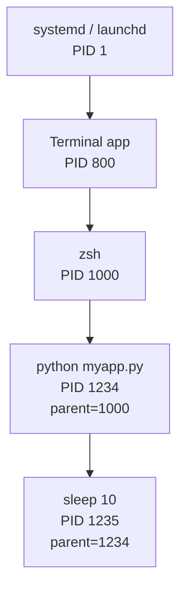
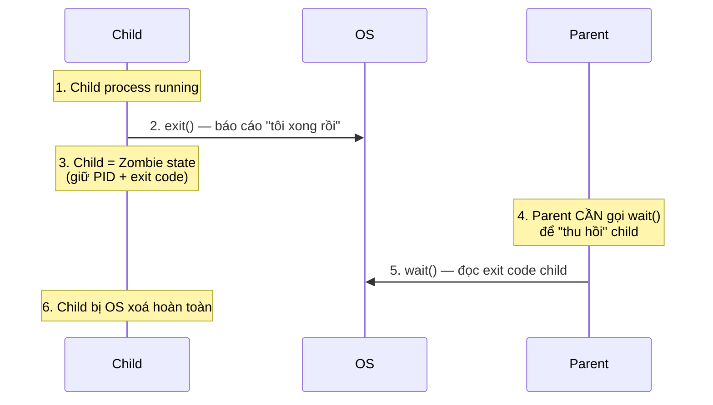

# 🎓 Process & PID concept — Khi máy bạn "chạy" 1 chương trình

> **Tác giả:** Mr.Rom\
> **Phiên bản:** v1.1.0\
> **Tạo lúc:** 23/05/2026\
> **Cập nhật:** 23/05/2026\
> **Level:** Basic\
> **Tags:** [MUST-KNOW]\
> **Thời lượng đọc:** ~15 phút\
> **Prerequisites:** [00_what-is-terminal.md](./00_what-is-terminal.md), [02_filesystem-concept.md](./02_filesystem-concept.md)

> 🎯 *Bài CONCEPT — hiểu **process là gì** + **PID** + **parent/child tree** + **trạng thái** + **signal** (SIGTERM/SIGKILL). KHÔNG dạy lệnh (`ps`/`kill`/`top` cụ thể xem [`04_os/linux/lessons/01_basic/`](../../../../04_os/linux/lessons/01_basic/) — bài chưa có). Bài này dạy bạn HIỂU vì sao có "process zombie", vì sao `Ctrl+C` đôi khi không hoạt động.*

## 🎯 Sau bài này bạn sẽ

- [ ] Phân biệt **Program** (file `.exe`/binary) vs **Process** (instance đang chạy)
- [ ] Hiểu **PID** — định danh duy nhất của process
- [ ] Vẽ được **process tree** parent/child + biết PID 1 là gì
- [ ] Hiểu 4 trạng thái process: Running / Sleeping / Stopped / Zombie
- [ ] Phân biệt **SIGTERM** vs **SIGKILL** — vì sao `Ctrl+C` đôi khi không tắt app
- [ ] Hiểu **Foreground vs Background process** + dấu `&`

---

## Tình huống — Chrome 1 cửa sổ mà thấy 20 process

Bạn mở Chrome, có 5 tab. Mở Activity Monitor (Mac) hoặc Task Manager (Win) hoặc gõ `ps aux | grep Chrome` (Linux/Mac), thấy:

```
Google Chrome                  PID 1234
Google Chrome Helper           PID 1235
Google Chrome Helper (GPU)     PID 1236
Google Chrome Helper (Renderer) PID 1237
Google Chrome Helper (Renderer) PID 1238
Google Chrome Helper (Renderer) PID 1239
Google Chrome Helper (Renderer) PID 1240
...
```

**20 dòng** chỉ cho 1 Chrome 5 tab. Tại sao?

Cùng lúc, bạn chạy `python myapp.py` trong terminal. App treo. Bạn nhấn **Ctrl+C** — app vẫn chạy. Phải gõ `kill -9 <PID>` mới tắt. Vì sao?

→ Cả 2 hiện tượng đều liên quan **process** — concept cốt lõi của mọi OS. Bài này giải thích process là gì, vì sao Chrome tách ra 20 process, vì sao Ctrl+C đôi khi không đủ mạnh.

---

## 1️⃣ Vậy Process thực sự là gì?

**Trả lời tình huống Chrome**: Chrome **đóng gói thành nhiều process** vì kiến trúc multi-process — mỗi tab/extension là 1 process riêng. Tab này crash không chết cả browser. **Mỗi process = 1 instance độc lập** trong RAM, có ID riêng (PID), bộ nhớ riêng.

### Program vs Process — đừng nhầm

Đây là 2 khái niệm rất hay bị trộn lẫn. Hiểu phân biệt giúp bạn debug nhanh hơn khi gặp lỗi "process died" hay "program crashed":

| | **Program** | **Process** |
|---|---|---|
| Là gì | **File** binary/script trên disk | **Instance đang chạy** của program trong RAM |
| Trạng thái | Tĩnh, không "làm gì" | Động, đang execute |
| Ví dụ | File `/usr/bin/python` (50MB) | Bạn chạy `python script.py` → 1 process Python được tạo |
| Quantity | 1 file program | N process có thể chạy cùng từ 1 program (vd 5 tab Chrome = 5 process Chrome Helper) |

🪞 **Ẩn dụ**: Program giống **bản nhạc trên giấy** (tĩnh). Process giống **lúc nhạc đang được biểu diễn** (động). Cùng bản nhạc có thể biểu diễn nhiều lần, nhiều dàn nhạc → nhiều process khác nhau.

### Mỗi process có gì?

Khi OS tạo 1 process, nó cấp:

| Tài nguyên | Mục đích |
|---|---|
| **PID** (Process ID) | Số nguyên định danh duy nhất, vd `1234` |
| **Memory** (RAM) | Stack + Heap + Data + Code — cô lập với process khác |
| **CPU time** | Scheduled bởi OS để có lượt chạy |
| **File descriptors** | Handle các file/socket đang mở |
| **Environment variables** | Bản copy biến môi trường |
| **Working directory** | CWD lúc process khởi chạy |
| **Permissions** | Owner user, group |

→ Process **cô lập** với nhau. Crash process A KHÔNG ảnh hưởng process B. Đây là lý do Chrome chia tab thành nhiều process — 1 tab crash không sập browser.

---

## 2️⃣ PID và Process Tree

**PID** (Process ID) là số nguyên dương duy nhất trong hệ thống. Khi process tạo ra, OS cấp PID mới. Khi process chết, PID có thể tái sử dụng cho process khác sau.

### Parent-Child relationship

Mỗi process (trừ 1) đều có **parent** — process tạo ra nó. Process được tạo gọi là **child**.

```bash
# Bạn mở terminal:
zsh                  PID 1000   (parent = Terminal app)

# Trong terminal gõ:
python myapp.py      PID 1234   (parent = zsh)

# myapp.py tạo subprocess:
# os.system("sleep 10")
sleep                PID 1235   (parent = python myapp.py)
```



### PID 1 — "Tổ tiên của mọi process"

Mỗi hệ điều hành có 1 process đầu tiên (PID 1) khởi động ngay sau kernel boot. Nó là "ông tổ" sinh ra mọi process khác. Tên cụ thể khác nhau giữa các OS:

| OS | PID 1 |
|---|---|
| Linux | `systemd` (modern) hoặc `init` (cũ) |
| macOS | `launchd` |
| Container Docker | App chính trong container (vd `python app.py`) |

→ PID 1 là **process đầu tiên** khi OS boot. Mọi process khác là con/cháu của nó. Khi PID 1 chết → OS crash.

### Tree hiển thị qua `pstree` (lệnh thực tế xem ở `04_os/linux/`)

Linux có lệnh `pstree` vẽ "cây gia phả" process. Output trông như sau (mỗi dòng là 1 nhánh process):

```
systemd(1)─┬─sshd(123)───sshd(456)───zsh(1000)───python(1234)───sleep(1235)
           ├─NetworkManager(124)
           ├─cron(125)
           └─Terminal.app(800)───zsh(1001)
```

🪞 **Ẩn dụ**: Process tree giống **cây gia phả** — PID 1 là tổ tiên, mỗi process sinh con/cháu xuống dưới. Bạn kill 1 process "ông" → cháu chắt có thể bị bỏ rơi (gọi là *orphan process*).

---

## 3️⃣ Trạng thái process — 4 trạng thái chính

Process không phải lúc nào cũng "chạy" — nó có **5 trạng thái** chính trong vòng đời. Khi gõ `ps aux`, cột STAT cho biết mỗi process đang ở trạng thái nào:

| State | Mã (ps) | Ý nghĩa | Ví dụ |
|---|---|---|---|
| **Running** | `R` | Đang chiếm CPU thực sự | Script đang tính loop nặng |
| **Sleeping** (interruptible) | `S` | Chờ event (input, network, timer) | App đang `wait` user click |
| **Uninterruptible Sleep** | `D` | Chờ I/O (disk/network) — KHÔNG bị tín hiệu bẻ gãy | Đọc file lớn từ disk |
| **Stopped** | `T` | Bị suspend (vd `Ctrl+Z`) | Process bạn ấn pause |
| **Zombie** | `Z` | Đã chết nhưng parent chưa "thu hồi" | Parent process bug — không cleanup child |

### Zombie process — vì sao "thây ma"?

Trong các state ở trên, **Zombie** (`Z`) là trạng thái lạ nhất — process đã chết nhưng vẫn nằm trong bảng PID. Tại sao? Diagram dưới mô tả vòng đời gây ra zombie:



**Zombie xảy ra khi**: child đã `exit()` nhưng parent **chưa gọi `wait()`** để đọc exit code. OS giữ entry zombie để báo parent biết "child đã xong" + "exit code là X".

🪞 **Ẩn dụ**: child gửi telegram "Đã xong việc, xác đây" → parent phải nhận + ký nhận → child mới được dọn. Nếu parent bận/quên → zombie nằm đó mãi.

**Vấn đề**: zombie chiếm 1 entry trong process table. Quá nhiều zombie → process table đầy → không tạo được process mới. Đây là **bug nhân danh "fork bomb" hoặc parent buggy**.

**Cách dọn**:
- Bug ở parent → fix parent code (gọi `wait()`)
- Hoặc kill parent → zombie được "adopt" bởi PID 1, PID 1 sẽ dọn

---

## 4️⃣ Signal — Giao tiếp giữa OS và process

**Signal** = "tin nhắn" OS gửi cho process. Có ~30 loại signal trên Unix. 2 cái quan trọng nhất:

### SIGTERM (15) vs SIGKILL (9) — phân biệt CỰC quan trọng

| Signal | Mã số | Ý nghĩa | Process có thể trap? |
|---|---|---|---|
| **SIGTERM** | 15 | "Xin hãy tắt" — gentle request | ✅ Có — process có thể catch, cleanup rồi tắt |
| **SIGKILL** | 9 | "Tắt NGAY" — force quit | ❌ Không — OS tắt trực tiếp, process không biết |
| **SIGINT** | 2 | Interrupt — gửi khi user gõ `Ctrl+C` | ✅ Có |
| **SIGSTOP** | 19 | Pause — `Ctrl+Z` | ❌ Không |
| **SIGCONT** | 18 | Resume từ stop | ✅ Có |
| **SIGHUP** | 1 | Hangup — terminal close | ✅ Có (thường dùng reload config) |

### Vì sao `Ctrl+C` đôi khi KHÔNG tắt app?

Quay lại tình huống mở bài. `Ctrl+C` gửi **SIGINT** (signal 2). Nếu app:
1. **Cleanup tốt** (close DB, save state) → trap SIGINT → cleanup → tắt êm ✅
2. **Bug — vòng lặp vô hạn không kiểm tra signal** → trap nhưng không break → vẫn chạy ❌
3. **Intentional trap để ignore** → có app cố tình ignore SIGINT (vd shell `bash` không tắt khi Ctrl+C) ❌

→ Khi `Ctrl+C` không hoạt động, dùng:

```bash
kill <PID>            # gửi SIGTERM (15) — gentle
kill -9 <PID>         # gửi SIGKILL (9) — force, app không biết
kill -SIGKILL <PID>   # same as -9
```

> ⚠️ **`kill -9` cẩn thận**: app KHÔNG có cơ hội cleanup. Mất data unsaved, DB connection hở, file lock không xoá. Chỉ dùng khi `kill` (SIGTERM) không tác dụng sau ~10s.

🪞 **Ẩn dụ**:
- SIGTERM = gõ cửa lịch sự: "anh ơi, dậy dùm em, tắt máy chút"
- SIGINT = "tôi ấn Ctrl+C, tự hiểu nha" (vẫn nhẹ nhàng)
- SIGKILL = đập cửa, cắt điện luôn — không chờ phản hồi

---

## 5️⃣ Foreground vs Background process

Khi bạn gõ lệnh trong shell, process chạy ở **2 mode**:

### Foreground (default)

```bash
sleep 10
# shell BLOCK 10 giây
# bạn không gõ được gì khác
```

Process foreground **chiếm shell** — terminal chờ nó xong mới nhận lệnh tiếp.

### Background — thêm `&` cuối lệnh

```bash
sleep 100 &
# [1] 12345
# shell trả lại prompt NGAY
# bạn gõ được lệnh khác trong khi sleep chạy ngầm
```

`[1]` là **job number** (số trong shell session). `12345` là PID.

### Chuyển đổi giữa fg/bg

| Lệnh | Tác dụng |
|---|---|
| `<command> &` | Chạy ngay ở background |
| `Ctrl+Z` | Suspend process foreground (state = Stopped) |
| `bg` | Tiếp tục process Stopped ở background |
| `fg` | Đưa process từ background ra foreground |
| `jobs` | List process background trong shell |

### `nohup` + `disown` — chạy tiếp khi đóng terminal

Process bình thường sẽ **chết** khi bạn close terminal (nhận SIGHUP). Để chạy tiếp:

```bash
nohup python long-script.py &
# Output redirect vào nohup.out
# Đóng terminal — process vẫn chạy

# Hoặc:
python long-script.py &
disown      # tách khỏi shell — terminal đóng không kill process
```

> 💡 Modern alternative: `tmux` hoặc `screen` — tạo "session" tách rời terminal. Process chạy mãi, ssh đi/về vẫn còn (xem `02_tools/terminal-emulators/` chưa có).

---

## 6️⃣ Process trong context Docker / Kubernetes

> 💡 Đây là bonus — giúp bạn hiểu chuỗi sau khi học Docker/K8s.

| Context | PID 1 là gì? |
|---|---|
| Linux host | `systemd` (init system) |
| **Docker container** | App **chính** bạn chỉ định trong `CMD` (vd `python app.py`) |
| **K8s Pod** | App chính trong container (mỗi container có process tree riêng) |

→ Docker container chạy **1 process chính** (PID 1 trong namespace của container). Khi PID 1 chết → container chết. Đây là lý do tại sao trong Dockerfile, `CMD ["python", "app.py"]` chính là PID 1 — chết = container restart.

**Pitfall thường gặp với Docker**: app không trap SIGTERM → khi `docker stop` (gửi SIGTERM) → app không cleanup → bị `docker kill` (SIGKILL) sau 10s → mất data.

→ Học chi tiết ở [Docker bộ](../../../../10_devops/docker/) §3 + §4.

---

## 💡 Pitfall thường gặp

### ❌ Pitfall: `kill -9` cho mọi thứ

```bash
kill -9 1234   # ❌ "Cứ -9 cho chắc"
```

- **Hậu quả**:
  - DB transaction nửa chừng → corrupt
  - File lock không xoá → process khác không mở được
  - Network connection rò rỉ
  - State trong memory mất hết (chưa kịp save)
- **Cách tránh**: thử `kill <PID>` (SIGTERM) trước. Đợi 5-10s. Chỉ `-9` nếu thực sự kẹt.

### ❌ Pitfall: Process zombie tích lũy

```bash
ps aux | awk '$8 == "Z" {print}'
# Output: nhiều dòng — zombie tích lũy
```

- **Nguyên nhân**: parent process bug, không gọi `wait()` cleanup child
- **Hậu quả**: process table đầy → không tạo process mới
- **Cách fix**:
  - Restart parent (zombie sẽ được PID 1 adopt + cleanup)
  - Fix code parent: gọi `wait()` sau khi child xong (Python: `subprocess.wait()`)

### ❌ Pitfall: Đóng terminal làm chết process

```bash
python long-training.py &
# Đóng terminal → process chết (SIGHUP)
```

- **Cách tránh**: dùng `nohup`, `disown`, hoặc `tmux`/`screen`

### ❌ Pitfall: Run multiple instance app cùng port

```bash
python app.py &     # PID 1234 listen port 5000
python app.py &     # PID 1235 — ❌ "Address already in use"
```

- **Lý do**: 2 process khác nhau (PID khác) nhưng cố bind cùng port → conflict
- **Cách fix**: `lsof -i :5000` xem PID nào đang chiếm → `kill <PID>` rồi start lại

### ✅ Best practice: Process trong production phải có **graceful shutdown**

```python
import signal
import sys

def cleanup(sig, frame):
    print("Saving state, closing DB...")
    db.close()
    sys.exit(0)

signal.signal(signal.SIGTERM, cleanup)
signal.signal(signal.SIGINT, cleanup)

# Main loop...
```

→ Mọi app production phải catch SIGTERM, cleanup, rồi exit. Đây là chuẩn 12-factor app.

---

## 🧠 Self-check

**Q1.** Bạn chạy `python myapp.py` 3 lần (3 terminal). Có mấy program? Có mấy process?

<details>
<summary>💡 Đáp án</summary>

- **1 program** — file `myapp.py` trên disk
- **3 process** — 3 instance đang chạy độc lập trong RAM, mỗi cái PID riêng, memory riêng, không thấy nhau (trừ khi share qua file/network)

Tương tự: 1 file `chrome.app` trên disk, mở 5 tab → có thể 5+ process.

</details>

**Q2.** `kill <PID>` và `kill -9 <PID>` khác nhau ra sao? Khi nào dùng cái nào?

<details>
<summary>💡 Đáp án</summary>

- **`kill <PID>`** = `kill -15 <PID>` = gửi **SIGTERM**. App nhận, có thể cleanup (close DB, save), rồi tắt. **Đây là cách lịch sự, default.**

- **`kill -9 <PID>`** = gửi **SIGKILL**. OS force kill, app KHÔNG biết, KHÔNG cleanup. Có thể mất data unsaved, file lock rò rỉ.

**Quy tắc**: dùng `kill <PID>` trước. Đợi 5-10s. Nếu process vẫn chạy → mới `kill -9`. KHÔNG dùng `-9` như reflex.

</details>

**Q3.** Process zombie là gì? Nguyên nhân?

<details>
<summary>💡 Đáp án</summary>

**Zombie process** = process đã `exit()` rồi nhưng **chưa được parent thu hồi** (parent chưa gọi `wait()` đọc exit code). OS giữ entry zombie (chỉ PID + exit code, không có memory) để báo parent biết.

**Nguyên nhân**:
- Parent process bug (không gọi `wait()`)
- Parent đang bận / treo

**Hậu quả**: zombie chiếm slot trong process table. Nhiều zombie → process table đầy.

**Cách dọn**:
- Fix parent code
- Kill parent → zombie được PID 1 adopt + cleanup

</details>

**Q4.** Chrome 1 cửa sổ với 5 tab tạo ~10-20 process. Vì sao không dùng **1 process duy nhất**?

<details>
<summary>💡 Đáp án</summary>

**Multi-process architecture** giúp Chrome:
1. **Cô lập crash** — 1 tab crash chỉ chết process tab đó, không sập cả browser
2. **Security sandbox** — mỗi tab/extension chạy với permission hạn chế. Tab độc hại không truy cập được tab khác
3. **Tận dụng multi-core CPU** — mỗi process được OS schedule sang core khác nhau → song song
4. **Quản memory linh hoạt** — đóng 1 tab = OS thu hồi memory ngay (process kết thúc)

Nhược: tốn RAM (mỗi process ~50-200 MB overhead).

→ Đây là pattern của browser modern (Firefox/Edge cũng same). Apps có high reliability requirement (vd Postgres) cũng dùng kiến trúc tương tự.

</details>

---

## ⚡ Cheatsheet

| Mục đích | Lệnh |
|---|---|
| Xem process đang chạy | `ps aux` |
| Xem process tree | `pstree` (Linux) / `pstree -g` |
| Top process theo CPU | `top` hoặc `htop` |
| Tìm PID theo tên | `pgrep <name>` |
| Kill gently | `kill <PID>` |
| Kill hard | `kill -9 <PID>` |
| Kill theo tên | `pkill <name>` |
| Background process | `<cmd> &` |
| Foreground → Background | `Ctrl+Z` rồi `bg` |
| Background → Foreground | `fg` |
| List job background | `jobs` |
| Chạy sau khi đóng terminal | `nohup <cmd> &` hoặc `disown` |
| Xem port nào process nào dùng | `lsof -i :<port>` |

| Signal | Số | Trap được? | Khi dùng |
|---|---|---|---|
| SIGTERM | 15 | ✅ | Tắt gentle, default `kill` |
| SIGKILL | 9 | ❌ | Force kill, last resort |
| SIGINT | 2 | ✅ | Ctrl+C |
| SIGSTOP | 19 | ❌ | Pause |
| SIGCONT | 18 | ✅ | Resume từ stop |
| SIGHUP | 1 | ✅ | Terminal close / reload config |

---

## 📚 Glossary

| EN | VN | Giải thích |
|---|---|---|
| Process | Tiến trình | Instance đang chạy của 1 program trong RAM |
| Program | Chương trình | File binary trên disk (tĩnh) |
| PID | Process ID | Số nguyên định danh duy nhất process |
| Parent / Child | Cha / Con | Mỗi process có 1 parent (trừ PID 1) |
| Process tree | Cây tiến trình | Cấu trúc cây parent-child |
| init / systemd / launchd | (giữ EN) | PID 1 — process đầu tiên khi OS boot |
| Signal | Tín hiệu | "Tin nhắn" OS gửi cho process |
| SIGTERM / SIGKILL | (giữ EN) | Tín hiệu tắt gentle / force |
| Foreground | Tiền cảnh | Process chiếm shell, block input |
| Background | Hậu cảnh | Process chạy ngầm, shell free |
| Zombie | (giữ EN) | Process đã exit nhưng chưa được parent thu hồi |
| Orphan | Mồ côi | Process có parent đã chết → PID 1 adopt |
| Daemon | (giữ EN) | Process chạy ngầm dài hạn (vd `sshd`, `nginx`) |
| Job | Công việc | Process trong shell session (có job number `[1]`, `[2]`...) |
| Graceful shutdown | Tắt êm | App nhận SIGTERM, cleanup, rồi exit |

---

## 🔗 Liên kết & Tài nguyên

### Bài liên quan trong kho

| Hướng | Bài |
|---|---|
| ⬅️ Bài trước | [02_filesystem-concept.md](./02_filesystem-concept.md) — Filesystem concept |
| ➡️ Bài tiếp | [04_env-variables.md](./04_env-variables.md) — chưa có |
| 📚 Lệnh `ps`/`top`/`kill` cụ thể | `04_os/linux/lessons/01_basic/` (chưa có bài process) |
| 🐳 Process trong Docker container | [10_devops/docker/lessons/01_basic/01_images-and-containers.md](../../../../10_devops/docker/lessons/01_basic/01_images-and-containers.md) |

### Tài nguyên ngoài

- [Linux Process Management](https://www.digitalocean.com/community/tutorials/how-to-use-ps-kill-and-nice-to-manage-processes-in-linux) — DigitalOcean guide
- [The Twelve-Factor App — IX. Disposability](https://12factor.net/disposability) — graceful shutdown chuẩn
- [Why use multi-process Chrome?](https://www.chromium.org/developers/design-documents/multi-process-architecture/) — Chromium docs
- [Linux signals cheat sheet](https://man7.org/linux/man-pages/man7/signal.7.html) — man page chính thức

---

## 📌 Changelog

- **v1.1.0 (24/05/2026)** — Apply Blueprint v0.5.4. Thêm 5 lead-in trước bảng/code/diagram (Program vs Process, PID 1, pstree output, 5 trạng thái, Zombie sequence diagram).
- **v1.0.0 (23/05/2026)** — Bản đầu tiên. Cluster basic computing-environment 4/6 bài. Cover: Program vs Process, PID, parent/child tree với mermaid, PID 1 (systemd/launchd/Docker), 4 trạng thái + Zombie, signal (SIGTERM/SIGKILL/SIGINT/SIGSTOP/SIGCONT/SIGHUP), foreground/background + nohup/disown, process trong Docker context, 4 pitfall + 4 self-check + cheatsheet signal table.
