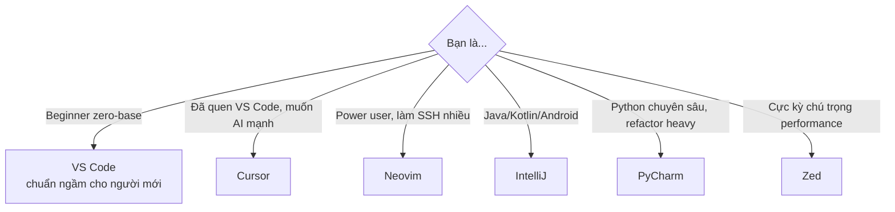

# 📝 Editor (Code Editors / IDEs)

> **Tác giả:** Mr.Rom\
> **Phiên bản:** v0.1.0\
> **Tạo lúc:** 16/05/2026\
> **Cập nhật:** 16/05/2026

> 🎯 *Editor là **công cụ làm việc chính** của coder — mỗi ngày 8h. Chọn editor phù hợp + setup đúng = năng suất tăng 2-3x.*

---

## 🎯 Mục tiêu tổng

- [ ] Chọn được editor phù hợp với bản thân + công việc
- [ ] Cài + cấu hình editor xong trong < 30 phút
- [ ] Biết extension nào cần cài, extension nào skip
- [ ] Thành thạo phím tắt cơ bản (10-20 shortcut hay dùng)
- [ ] Setup debugging + Git workflow trong editor

---

## 📂 Cấu trúc folder

### setup/ — Cài đặt chi tiết từng editor

| Editor | Trạng thái | Link |
|---|---|---|
| ✅ 🌟 [Visual Studio Code](./setup/vs-code.md) | Done | Setup chi tiết 9 section |
| ❌ Cursor | Chưa có | Fork VS Code + AI built-in |
| ❌ Neovim | Chưa có | Vim-based, terminal-native |
| ❌ JetBrains (IntelliJ/PyCharm/...) | Chưa có | IDE chuyên sâu |
| ❌ Zed | Chưa có | Editor mới, viết bằng Rust |
| ❌ Sublime Text | Chưa có | Lightweight, fast |

### lessons/ — Học DÙNG editor

❌ Chưa có (dự kiến: phím tắt, debugging, refactoring, Git in editor, ...)

### exercises/, recipes/

❌ Chưa có

---

## 🚀 Bạn nên chọn editor nào?

| Bạn là... | Recommend |
|---|---|
| 🟢 **Beginner zero-base** | [VS Code](./setup/vs-code.md) — không suy nghĩ |
| 🟡 **Coder 1-3 năm kinh nghiệm** | VS Code → thử Cursor sau 6 tháng |
| 🟠 **Senior, làm Java/Kotlin** | IntelliJ IDEA — IDE chuyên sâu Java |
| 🔵 **Power user thích keyboard** | Neovim (đường học dốc nhưng đáng) |

---

## 🤝 Muốn thêm editor mới?

1. Copy template [`../../_Blueprint/templates/setup_template.md`](../../_Blueprint/templates/setup_template.md)
2. Đặt vào `setup/<editor-name>.md`
3. 9 section bắt buộc (xem template)
4. Cập nhật bảng trên (file này) + [`../../MASTER-CATALOG.md`](../../MASTER-CATALOG.md)

---

## 📌 Changelog

- **v0.1.0 (16/05/2026)** — Skeleton + bài VS Code setup đầu tiên ✅.
