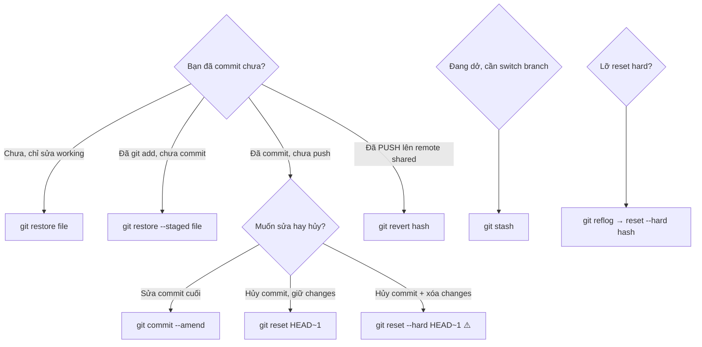

# 🎓 bạn lỡ tay 2h sáng — Undo + Recovery

> **Tác giả:** Mr.Rom\
> **Phiên bản:** v2.1.0\
> **Tạo lúc:** 16/05/2026\
> **Cập nhật:** 24/05/2026\
> **Level:** Basic\
> **Tags:** [MUST-KNOW]\
> **Thời lượng đọc:** ~20 phút\
> **Prerequisites:** [01_init-and-first-commit.md](./01_init-and-first-commit.md), [02_branching-and-merging.md](./02_branching-and-merging.md)

> 🎯 *Tiếp bạn story: 2h sáng, bạn gõ nhầm `git reset --hard`, mất 3 commit của 1 đêm code. Hoảng. Anh senior chỉ nói "đừng panic, Git rất khó mất data thật". Bài này dạy mọi cách "quay lại" — restore/amend/reset/revert/reflog/stash.*

## 🎯 Sau bài này bạn sẽ

- [ ] Quay lại file chưa staged bằng `git restore`
- [ ] Unstage file bằng `git restore --staged`
- [ ] Sửa commit cuối bằng `git commit --amend`
- [ ] Hủy commit bằng `git reset` (3 mode: soft/mixed/hard)
- [ ] Tạo commit "đảo ngược" bằng `git revert`
- [ ] Phục hồi file/branch đã xóa bằng `git reflog`
- [ ] Lưu tạm thay đổi bằng `git stash`

---

## Tình huống — bạn ở giây phút hoảng nhất

2h sáng thứ Bảy. Bạn vừa code 6 tiếng cho feature thanh toán, 3 commit nối nhau:

```
abc123 (HEAD -> feature/payment) feat: integrate Stripe
def456 feat: add payment form UI
ghi789 feat: add payment validation
```

Mắt mờ. Bạn muốn dọn workspace, gõ "trí nhớ cơ":

```bash
git reset --hard HEAD~3   # bỏ 3 commit
```

Enter. Terminal:

```
HEAD is now at xyz000 docs: update README
```

**bạn tê người**. 6 tiếng code — biến mất. Working directory cũng sạch luôn (`--hard` xoá tất). Nhịp tim 120bpm.

Bạn nhắn tin senior:

> *"Anh ơi em vừa `git reset --hard HEAD~3` mất 3 commit cứu em với 😱"*

Anh senior trả lời 30 giây sau:

> *"Đừng panic. Gõ `git reflog`. Git rất khó mất data thật."*

Bạn gõ. 30 giây sau, tất cả 3 commit phục hồi nguyên vẹn. Bài này dạy đúng câu thần chú đó — và 5 lệnh tương tự cho mọi tình huống "lỡ tay".

> 💡 **Sự thật của Git**: data đã commit hầu như không bao giờ mất thật. Git giữ "reflog" — log mọi thao tác di chuyển HEAD — trong **90 ngày**. Trong khoảng đó, mọi commit đều cứu được.

| Tình huống "lỡ tay" | Lệnh giải cứu |
|---|---|
| Sửa file linh tinh, muốn về bản đã commit | `git restore <file>` |
| Đã `git add` nhưng chưa commit, muốn unstage | `git restore --staged <file>` |
| Commit xong nhưng quên file, hoặc message sai | `git commit --amend` |
| Vừa commit nhưng muốn hủy hoàn toàn | `git reset --hard HEAD~1` |
| Đã push commit có bug, muốn "đảo ngược" | `git revert <hash>` |
| **Lỡ `git reset --hard`, mất commit (như bạn)** | `git reflog` + `git reset --hard <hash>` |
| Đang dở thay đổi, cần switch branch gấp | `git stash` |

---

## 1️⃣ Lệnh nào tác động vùng nào? — Mô hình 4 vùng

Bài 01 đã có **3 vùng** (working/staging/repo). Thêm 1 vùng **remote** = 4 vùng tổng:


**Mỗi loại undo** tác động vùng khác nhau:

| Lệnh | Tác động vùng nào |
|---|---|
| `git restore <file>` | Working → bỏ thay đổi chưa staged |
| `git restore --staged` | Staging → unstage (về Working) |
| `git commit --amend` | Local Repo → sửa commit cuối |
| `git reset --soft` | Local Repo → bỏ commit, giữ staged + working |
| `git reset --mixed` (default) | Local Repo + Staging → bỏ commit + unstage, giữ working |
| `git reset --hard` | TẤT CẢ → bỏ commit + unstage + xóa working changes ⚠️ |
| `git revert` | Local Repo → **TẠO** commit mới đảo ngược (an toàn cho remote) |
| `git stash` | Working + Staging → lưu vào "kho tạm" |

> 💡 *Khi nào dùng cái nào?* Phụ thuộc bạn đã `add`/`commit`/`push` chưa. Xem decision tree §3 cuối bài.

---

## 2️⃣ Bắt tay làm cùng bạn — 7 lệnh cứu mạng

### Setup test repo

```bash
cd ~/Desktop
mkdir undo-demo && cd undo-demo
git init
echo "v1" > file.txt
git add file.txt
git commit -m "Initial commit"
```

### 🛠️ 2.1 `git restore` — Bỏ thay đổi chưa staged

Sửa file:

```bash
echo "v2 — đang viết bậy bạ" >> file.txt
cat file.txt
```

```
v1
v2 — đang viết bậy bạ
```

`git status`:

```
modified: file.txt
```

→ Muốn về bản đã commit:

```bash
git restore file.txt
cat file.txt
```

```
v1
```

✅ Đã về bản cũ. **Mọi thay đổi chưa staged bị BỎ — không thể quay lại nữa**.

> ⚠️ `git restore` **mất** thay đổi chưa staged. Cẩn thận!

### 🛠️ 2.2 `git restore --staged` — Unstage

```bash
echo "v3" >> file.txt
git add file.txt
git status
```

```
Changes to be committed:
   modified: file.txt
```

→ Muốn unstage (chuyển về working, không commit):

```bash
git restore --staged file.txt
git status
```

```
Changes not staged for commit:
   modified: file.txt
```

✅ File vẫn còn thay đổi trong working, nhưng không còn staged. **Thay đổi KHÔNG mất**.

### 🛠️ 2.3 `git commit --amend` — Sửa commit cuối

Tình huống: commit xong mới phát hiện quên file, hoặc message sai.

```bash
git add file.txt
git commit -m "Add v3"

# Phát hiện quên 1 file
echo "another" > another.txt
git add another.txt

# Sửa commit cuối (thay vì tạo commit mới)
git commit --amend --no-edit
```

```
[main d4e5f6g] Add v3
 Date: ...
 2 files changed, 2 insertions(+)
```

→ Commit cũ bị **thay** bằng commit mới có thêm `another.txt`. Git log chỉ có 2 commit (Initial + Add v3), không phải 3.

#### Sửa message commit cuối

```bash
git commit --amend -m "Add v3 and another"
```

→ Commit cũ bị thay với message mới.

> ⚠️ **CHỈ amend commit chưa push**. Amend commit đã push = rewrite history → conflict với người khác.

### 🛠️ 2.4 `git reset` — Hủy commit (3 mode)

```bash
# Tạo 3 commit để demo
echo "a" >> file.txt && git commit -am "Commit A"
echo "b" >> file.txt && git commit -am "Commit B"
echo "c" >> file.txt && git commit -am "Commit C"
git log --oneline
```

```
abc123 (HEAD -> main) Commit C
def456 Commit B
ghi789 Commit A
```

#### Reset `--soft` — Bỏ commit, giữ staging + working

```bash
git reset --soft HEAD~1    # bỏ commit cuối
git status
```

```
Changes to be committed:
   modified: file.txt
```

→ Commit C bị hủy. Nhưng changes của C **vẫn ở Staging** — sẵn sàng commit lại.

**Use case**: muốn gộp 2 commit thành 1, hoặc đổi message:

```bash
git reset --soft HEAD~1
git commit -m "Better message"
```

#### Reset `--mixed` (default) — Bỏ commit + unstage, giữ working

```bash
git reset HEAD~1    # = git reset --mixed HEAD~1
git status
```

```
Changes not staged for commit:
   modified: file.txt
```

→ Commit hủy. Changes về **Working** (unstaged). **Default behavior** của `git reset`.

#### Reset `--hard` — XÓA HẾT (⚠️ NGUY HIỂM)

```bash
git reset --hard HEAD~1
git status
```

```
nothing to commit, working tree clean
```

→ Commit hủy. Changes **bị xóa hoàn toàn** (working, staging, repo đều mất). Không quay lại được trừ khi dùng `reflog` (xem §2.7).

> ⚠️ **`--hard` là lệnh "xóa vĩnh viễn"**. Trước khi chạy, luôn `git status` + `git stash` để backup.

#### Reset về commit cụ thể

```bash
git reset --hard abc1234    # về commit có hash này
git reset --hard HEAD~5      # về 5 commit trước
git reset --hard origin/main # về trạng thái remote (vứt mọi commit local chưa push)
```

### 🛠️ 2.5 `git revert` — Đảo ngược commit (an toàn cho remote)

Tình huống: đã `push` commit lỗi lên `main`. KHÔNG được `reset --hard` (sẽ break remote). Thay vào đó:

```bash
git revert HEAD    # tạo commit MỚI đảo ngược commit cuối
```

Git mở editor để nhập message. Sau khi save:

```bash
git log --oneline
```

```
xyz789 (HEAD -> main) Revert "Commit C"
abc123 Commit C
def456 Commit B
ghi789 Commit A
```

→ Commit C **vẫn còn** trong history. Có thêm commit **đảo ngược** changes của C.

**Khác `reset`**:
- `reset` — XÓA commit khỏi history (cần force push, dangerous)
- `revert` — TẠO commit mới đảo ngược (history nguyên vẹn, safe push)

| Tình huống | Dùng | Vì sao |
|---|---|---|
| Commit chưa push | `reset` | Sạch history |
| Commit đã push, branch shared | `revert` | An toàn cho team |
| Commit đã push, branch riêng | Cả 2 đều OK | Tùy |

### 🛠️ 2.6 `git stash` — Lưu tạm thay đổi

Tình huống: đang sửa dở, sếp bắt fix bug urgent ở branch khác.

```bash
# Đang sửa dở file.txt
echo "đang code dở" >> file.txt

# Cần switch branch nhưng không muốn commit dở
git stash
```

```
Saved working directory and index state WIP on main: abc1234 Commit C
```

→ Thay đổi đã được "lưu vào kho". `git status` show clean.

```bash
# Switch branch fix bug
git checkout hotfix
# ... fix bug, commit, switch lại
git checkout main

# Lấy lại stash
git stash pop
```

→ Thay đổi quay về working directory. Có thể tiếp tục code.

#### Stash với message

```bash
git stash push -m "Đang viết feature X dở"
```

#### List stash

```bash
git stash list
```

```
stash@{0}: WIP on main: ...
stash@{1}: On feature: ...
```

#### Apply stash cụ thể

```bash
git stash apply stash@{1}    # apply nhưng KHÔNG xóa khỏi list
git stash pop                 # apply + xóa
git stash drop stash@{0}      # chỉ xóa, không apply
```

### 🛠️ 2.7 `git reflog` — Câu thần chú cứu bạn lúc 2h sáng

Quay lại tình huống bạn ở đầu bài: lỡ `git reset --hard`, 3 commit "biến mất". Đừng panic.

```bash
git reflog
```

```
abc1234 HEAD@{0}: reset: moving to HEAD~1
xyz9876 HEAD@{1}: commit: Commit C   ← commit đã "mất"
abc1234 HEAD@{2}: commit: Commit B
def5678 HEAD@{3}: commit: Commit A
```

→ Git lưu **mọi thao tác di chuyển HEAD** trong reflog. Commit C vẫn có hash, chỉ không có branch trỏ tới.

Quay lại:

```bash
git reset --hard xyz9876
```

✅ Commit C phục hồi!

> 💡 **Reflog là cứu cánh**. Git giữ reflog 90 ngày mặc định. Trong khoảng đó, ít commit nào thực sự "mất".

---

## 3️⃣ Lỡ chỗ nào, fix lệnh nào? — Decision tree



---

## 💡 Pitfall & Best practice

### ❌ Pitfall: `git reset --hard` mất changes chưa commit

```bash
echo "code quan trọng" >> file.txt
git reset --hard HEAD    # ❌ Mất luôn dòng vừa thêm
```

- **Cách tránh**: `git stash` trước khi reset:
  ```bash
  git stash
  git reset --hard HEAD
  git stash pop    # nếu muốn lấy lại
  ```

### ❌ Pitfall: `git push --force` sau `reset` lên branch shared

```bash
git reset --hard HEAD~3
git push --force    # ⚠️ Xóa 3 commit khỏi remote
```

- **Hậu quả**: đồng nghiệp có 3 commit đó → mất, conflict khi pull
- **Cách tránh**: dùng `git revert` thay `reset` cho branch shared (`main`, `develop`)

### ❌ Pitfall: `commit --amend` commit đã push

```bash
git commit --amend -m "fix typo"
git push --force    # ⚠️ Rewrite history
```

- **Hậu quả**: history chia 2 nhánh, đồng nghiệp confused
- **Cách tránh**: amend CHỈ commit chưa push. Đã push → tạo commit mới `fix: typo in commit message`

### ❌ Pitfall: Quên `git stash pop`

```bash
git stash
# ... làm việc khác
# quên pop → 2 tuần sau mới phát hiện stash list dài
```

- **Cách tránh**: thường xuyên `git stash list`. Stash không nên sống quá vài giờ.

### ✅ Best practice: `git status` + `git diff` trước mọi thao tác undo

```bash
# Trước reset, restore, revert — luôn check trước
git status
git diff               # xem thay đổi chưa staged
git diff --staged      # xem thay đổi đã staged
git log --oneline -5   # xem 5 commit gần nhất
```

→ Habit này tránh lỡ tay 99% trường hợp.

### ✅ Best practice: Stash thay vì commit "WIP"

```bash
# ❌ Commit WIP
git commit -m "WIP"

# ✅ Stash
git stash push -m "Feature X dở giữa chừng"
```

→ Stash gọn hơn, không "ô nhiễm" history.

### ✅ Best practice: Backup branch trước khi reset

```bash
# Trước khi git reset --hard nguy hiểm
git branch backup-before-reset
git reset --hard HEAD~5

# Nếu sai → quay lại
git reset --hard backup-before-reset
```

---

## 🧠 Self-check

**Q1.** Khác nhau `git reset --soft`, `--mixed`, `--hard`?

<details>
<summary>💡 Đáp án</summary>

Đều bỏ commit, khác cái "giữ lại":

| Mode | Repo | Staging | Working |
|---|---|---|---|
| `--soft` | Bỏ commit | **Giữ** (vẫn staged) | **Giữ** |
| `--mixed` (default) | Bỏ commit | **Bỏ** (unstage) | **Giữ** |
| `--hard` | Bỏ commit | **Bỏ** | **XÓA** ⚠️ |

Use case:
- `--soft`: gộp commit / sửa message → giữ tất cả changes ở staging
- `--mixed`: hủy commit, sửa lại files trước khi stage lại
- `--hard`: xóa hoàn toàn — DANGER

</details>

**Q2.** Khi nào dùng `git reset` vs `git revert`?

<details>
<summary>💡 Đáp án</summary>

- **`git reset`**: XÓA commit khỏi history. Dùng cho commit **chưa push** (an toàn). Push sau reset cần `--force` → DANGEROUS cho branch shared.

- **`git revert`**: TẠO commit mới đảo ngược. History nguyên vẹn (commit lỗi + commit revert đều có). Dùng cho commit **đã push** lên branch shared — an toàn, không cần force.

Rule of thumb: **chưa push → reset, đã push → revert**.

</details>

**Q3.** Lỡ `git reset --hard` mất commit, làm sao lấy lại?

<details>
<summary>💡 Đáp án</summary>

`git reflog` — xem mọi thao tác di chuyển HEAD (kể cả những thao tác "xóa"):

```bash
git reflog
```

Tìm commit hash của commit đã "mất" → `git reset --hard <hash>` để quay lại.

Git giữ reflog **90 ngày mặc định** → ít khi commit thực sự mất.

</details>

---

## ⚡ Cheatsheet

```bash
# Bỏ thay đổi
git restore <file>             # bỏ unstaged changes
git restore --staged <file>    # unstage (giữ working)
git restore .                  # tất cả file
git checkout -- <file>         # cách cũ (Git <2.23)

# Sửa commit cuối
git commit --amend              # sửa nội dung commit (mở editor)
git commit --amend --no-edit    # add thêm file, giữ message
git commit --amend -m "msg"     # đổi message

# Hủy commit
git reset --soft HEAD~1         # bỏ commit, giữ staging
git reset HEAD~1                # = --mixed (default): bỏ commit + unstage
git reset --hard HEAD~1         # ⚠️ XÓA HẾT — careful
git reset --hard origin/main    # về trạng thái remote

# Đảo ngược commit (safe)
git revert HEAD                 # tạo commit đảo ngược commit cuối
git revert <hash>               # đảo ngược commit cụ thể
git revert --no-commit HEAD~3..HEAD  # đảo ngược 3 commit, gộp 1 commit

# Stash
git stash                       # lưu tạm
git stash push -m "msg"         # lưu kèm message
git stash list                  # xem stash list
git stash pop                   # apply + xóa
git stash apply                 # apply (giữ lại)
git stash drop                  # xóa stash
git stash clear                 # xóa hết

# Reflog
git reflog                      # xem lịch sử thao tác HEAD
git reset --hard HEAD@{2}       # về thao tác cách 2 bước

# Branch backup
git branch backup-X             # tạo branch ở HEAD hiện tại
```

---

## 📚 Glossary

| EN | VN | Giải thích |
|---|---|---|
| Restore | Khôi phục | Bỏ thay đổi, về trạng thái đã commit |
| Amend | Sửa | Sửa commit cuối thay vì tạo commit mới |
| Reset | Đặt lại | Di chuyển HEAD về commit cũ |
| Revert | Đảo ngược | Tạo commit mới đảo ngược commit cũ |
| Stash | Cất tạm | Lưu thay đổi vào "kho tạm" |
| Reflog | Lịch sử ref | Lịch sử mọi thao tác di chuyển HEAD (90 ngày) |
| HEAD~N | (giữ nguyên) | Commit cách HEAD N bước về trước |
| Dangling commit | Commit lơ lửng | Commit không có branch trỏ tới (vẫn truy cập qua reflog) |
| Rewrite history | Viết lại lịch sử | Đổi/bỏ commit đã tồn tại → cần force push |

---

## 🔗 Liên kết & Tài nguyên

### Bài liên quan

| Hướng | Bài |
|---|---|
| ⬅️ Bài trước | [../02_intermediate/02_collaborative-workflows.md](../02_intermediate/02_collaborative-workflows.md) — Đồng nghiệp vào team (Collab) |
| ➡️ Bài tiếp | [01_advanced-recovery-reflog.md](./01_advanced-recovery-reflog.md) — Cứu hộ thảm họa với Reflog |
| 🧪 Thực hành | [lab_git-time-traveler.md](../../exercises/03_advanced/lab_git-time-traveler.md) — Thực hành du hành thời gian |
| 🗺️ Sitemap Git | [Lộ trình chinh phục Git (README)](../../README.md) |

### Tài nguyên ngoài

- [Pro Git Ch.7 — Reset Demystified](https://git-scm.com/book/en/v2/Git-Tools-Reset-Demystified) — hiểu sâu reset
- [Oh Sh*t, Git!](https://ohshitgit.com/) — collection các tình huống "lỡ tay" + cách fix
- [Git Reflog Tutorial](https://www.atlassian.com/git/tutorials/rewriting-history/git-reflog)

---

## 📌 Changelog

- **v2.1.0 (24/05/2026)** — Apply Blueprint v0.5.4 §3.5. Bulk replace fictional character "bạn" → "bạn"/"Bạn"/"Mình" theo context (generic role thay tên riêng tự bịa). Nội dung kỹ thuật giữ nguyên.

- **v2.0.0 (19/05/2026)** — Restructure theo writing-style v0.5.1:
  - Title đổi: "bạn lỡ tay 2h sáng — Undo + Recovery" (gắn vào story)
  - Mở bằng **tình huống bạn 2h sáng** `git reset --hard HEAD~3` mất 3 commit feature payment, nhịp tim 120bpm — anh senior dạy `git reflog`
  - Headers đổi: `1️⃣ Vì sao học Undo (WHY)` / `2️⃣ Mô hình 4 vùng (WHAT)` / `3️⃣ Hands-on (HOW)` / `4️⃣ Decision tree` → câu hỏi tự nhiên ("Lệnh nào tác động vùng nào?", "Bắt tay làm cùng bạn", "Lỡ chỗ nào fix lệnh nào?")
  - §2.7 `git reflog` thêm callback "quay lại tình huống bạn ở đầu bài"
  - Thống nhất giữ Git ở `02_Tools/git/` làm Central Setup Hub và cross-cutting tool
  - Fix relative path depth
- **v1.0.0 (16/05/2026)** — Bản đầu tiên — restore/amend/reset (3 mode)/revert/stash/reflog + decision tree + 6 pitfall/best-practice.
