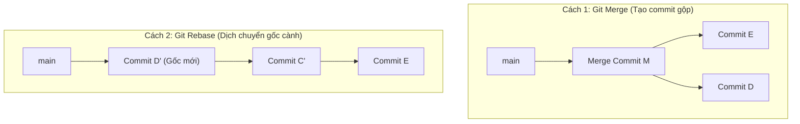

# 🎓 Làm sạch lịch sử Git với Rebase & Cherry-Pick

> **Tác giả:** Mr.Rom\
> **Phiên bản:** v2.0.0\
> **Tạo lúc:** 26/05/2026\
> **Cập nhật:** 26/05/2026\
> **Level:** Advanced\
> **Tags:** [MUST-KNOW]\
> **Thời lượng đọc:** ~20 phút\
> **Prerequisites:** [00_branching-and-merging.md](../02_intermediate/00_branching-and-merging.md), [01_advanced-recovery-reflog.md](./01_advanced-recovery-reflog.md) ✅

> 🎯 *Bài học nghệ thuật lịch sử Git — Khám phá hai công cụ quyền lực tối thượng giúp tái định vị nền tảng nhánh và chọn lọc chính xác các mảnh ghép thay đổi. Bạn sẽ học cách "phẫu thuật thẩm mỹ" cho lịch sử Git bừa bộn trở nên thẳng thớm, đẹp đẽ như một tác phẩm nghệ thuật.*

---

## 🎯 Sau bài này bạn sẽ
- [ ] Hiểu sâu sắc sự khác biệt về bản chất giữa **Rebase** và **Merge**
- [ ] Nắm lòng **Quy tắc vàng của Rebase** để tránh làm phá hỏng lịch sử của cả team
- [ ] Thành thạo kỹ thuật **Interactive Rebase** (`git rebase -i`) để gộp commits (Squash) chuyên nghiệp
- [ ] Biết cách dùng **Cherry-pick** để nhặt chính xác một commit cụ thể từ nhánh khác về máy
- [ ] Tự tin xử lý xung đột phát sinh trong quá trình Rebase

---

## Tình huống — Bãi rác lịch sử commit

Bạn đang làm việc chăm chỉ trong 3 ngày trên nhánh `feature/login`. Trong quá trình viết code, bạn tạo ra hàng loạt commit vụn vặt để lưu vết:
*   `a1b2c3d` `"feat: add login button"`
*   `e4f5g6h` `"fix: fix typo in login css"`
*   `i7j8k9l` `"test: test api key - not working"`
*   `m0n1o2p` `"fix: fix typo again"`
*   `q3r4s5t` `"feat: complete login authentication flow"`

Khi bạn mở `git log` ra, bạn thấy lịch sử trông cực kỳ bừa bộn và xấu xí. Nếu bạn tạo Pull Request merge thẳng đống này vào `main`, đồng nghiệp Senior của bạn chắc chắn sẽ nhíu mày vì lịch sử bị ô nhiễm bởi các commit nháp vô nghĩa.

Đồng thời, ở nhánh chính `main`, các lập trình viên khác cũng đã đẩy thêm 5 commit mới. Nhánh của bạn hiện đang bị lỗi thời so với `main`. 

Làm thế nào để:
1.  **Dọn sạch** đống commit rác, gộp chúng lại thành duy nhất 1 commit sạch đẹp mang tên `"feat: add login authentication and style fixes"`?
2.  **Cập nhật gốc** nhánh của bạn khớp với các thay đổi mới nhất của `main` để sơ đồ lịch sử là một đường thẳng tắp không có các mắt xích merge đan xen?

Đó chính là lúc bạn cần đến **Rebase** và **Cherry-Pick**.

---

## 1️⃣ Bản chất của Rebase — Thay đổi nền móng lịch sử



#### 🪞 Ẩn dụ thực tế:
Hãy tưởng tượng dự án của bạn là một cái cây. Nhánh `main` là thân cây chính, nhánh `feature` của bạn là một cành cây phụ được tách ra từ thân chính ở vị trí tầng 1 (Commit gốc).
*   **Merge (Gộp):** Bạn kéo một sợi dây thép nối đầu cành phụ vào ngọn cây chính. Cành phụ vẫn nằm ở tầng 1, nhưng có một cầu nối sinh ra nối lên ngọn (Tạo Merge Commit). Sơ đồ cây sẽ bắt đầu đan chéo phức tạp.
*   **Rebase (Tái định vị gốc):** Bạn cưa đứt cành phụ của mình tại vị trí tầng 1, mang nó lên tận ngọn cây chính (vị trí commit mới nhất của `main`) và cấy cành phụ vào đó. Toàn bộ cành phụ của bạn giờ đây mọc ra trực tiếp từ ngọn cây, tạo nên một thân cây thẳng tắp hoàn mỹ.

### So sánh Rebase vs Merge

| Đặc tính | Git Merge | Git Rebase |
|---|---|---|
| **Cơ chế** | Tạo ra 1 commit mới gộp 2 nhánh lại. | Viết lại lịch sử bằng cách chuyển toàn bộ commit sang gốc mới. |
| **Tính an toàn** | Cực kỳ an toàn (không thay đổi lịch sử cũ). | Nguy hiểm (viết lại SHA commit, cần dùng cẩn thận). |
| **Sơ đồ lịch sử** | Phức tạp, đan xen hình mạng nhện khi team lớn. | Tuyến tính, thẳng tắp, cực kỳ dễ đọc. |

---

## ⚠️ Quy tắc vàng tối thượng của Rebase!

> [!WARNING]
> **Tuyệt đối KHÔNG BAO GIỜ được Rebase những commit đã được PUSH lên GitHub và đang được người khác dùng chung!**

Khi bạn Rebase, Git thực chất sẽ **xóa bỏ các commit cũ** và **tạo ra các commit mới hoàn toàn** (có mã SHA-1 mới tinh) mặc dù nội dung code giống nhau.

Nếu bạn Rebase một nhánh công cộng (public branch như `main` hoặc `develop`):
1.  Lịch sử trên máy của bạn sẽ bị lệch hoàn toàn so với máy của đồng nghiệp.
2.  Khi đồng nghiệp kéo code về, Git sẽ bị hỗn loạn và tạo ra hàng trăm xung đột nhân bản commit lặp đi lặp lại.
3.  Bạn sẽ bị cả team "lườm nguýt" vì phá hỏng hệ thống kiểm soát phiên bản của tập thể.

**Quy tắc nằm lòng:** *Chỉ Rebase các nhánh tính năng cá nhân (local branch) của bạn trước khi merge vào nhánh chính!*

---

## 3️⃣ Interactive Rebase — Phẫu thuật thẩm mỹ lịch sử

Kỹ thuật mạnh mẽ nhất của Rebase là **Interactive Rebase (`-i`)**, cho phép bạn chủ động tương tác và sắp đặt lại cấu trúc các commit của mình.

### Hướng dẫn 3 bước gộp (Squash) commits bừa bộn:

#### Bước 3.1: Gọi bảng điều khiển tương tác
Giả sử bạn muốn dọn dẹp lại 4 commit gần nhất của mình, gõ lệnh:
```bash
git rebase -i HEAD~4
```

Lúc này, Git sẽ tự động mở trình soạn thảo văn bản mặc định (thường là Vi/Vim hoặc VS Code) hiển thị danh sách 4 commit theo thứ tự từ cũ đến mới:
```
pick a1b2c3d feat: add login button
pick e4f5g6h fix: fix typo in login css
pick i7j8k9l test: test api key - not working
pick m0n1o2p feat: complete login authentication flow

# Rebase HEAD~4 onto xyz123
# Commands:
# p, pick = use commit
# r, reword = use commit, but edit the commit message
# s, squash = use commit, but meld into previous commit
```

#### Bước 3.2: Ra lệnh Squash gộp code
Bạn muốn giữ lại commit đầu tiên (`pick`), và gộp toàn bộ 3 commit rác phía sau vào commit đầu tiên này. Hãy sửa chữ `pick` ở 3 dòng dưới thành `squash` (hoặc viết tắt là `s`):

```
pick a1b2c3d feat: add login button
squash e4f5g6h fix: fix typo in login css
squash i7j8k9l test: test api key - not working
squash m0n1o2p feat: complete login authentication flow
```
*Lưu file và đóng editor lại.*

#### Bước 3.3: Viết lại tin nhắn commit tối thượng
Ngay sau khi đóng editor, Git sẽ tự động mở tiếp một editor thứ hai yêu cầu bạn viết tin nhắn đại diện cho commit gộp khổng lồ này. Hãy xóa hết các dòng nháp đi và viết một tin nhắn Conventional chuẩn mực:

```
feat: implement robust login authentication and styling

- Add responsive login button
- Fix styling typos in login CSS stylesheet
- Clean up test API key configurations
```
*Lưu file và đóng lại.* 

Terminal sẽ hiển thị thông báo Rebase thành công rực rỡ:
```
Successfully rebased and updated refs/heads/feature/login.
```
Gõ `git log --oneline` để hưởng thụ thành quả → 4 commit bừa bộn đã biến mất, nhường chỗ cho duy nhất **1 commit siêu sạch sẽ và chuyên nghiệp!**

---

## 4️⃣ Cherry-Pick — Nghệ thuật chọn lọc quả chín

Đôi khi, bạn không muốn gộp hay rebase cả một nhánh lớn. Bạn chỉ phát hiện ở nhánh của đồng nghiệp Nam có một commit duy nhất (`x9y8z7w`) sửa lỗi bảo mật cực kỳ hay, và bạn muốn **nhặt duy nhất commit đó** đem về nhánh của bạn.

```
Nhánh của Nam: [A] ──> [B (Sửa lỗi bảo mật)] ──> [C]
                         │
                    (Cherry-pick)
                         ▼
Nhánh của bạn: [D] ──> [E] ──> [B' (Nhặt về đây)]
```

#### 🪞 Ẩn dụ thực tế:
Bạn đi siêu thị và chỉ muốn mua một quả táo ngon nhất (commit cụ thể), chứ không muốn mua cả cái cây táo (rebase) hay mua cả giỏ hoa quả hỗn tạp (merge).

#### Cách thực hiện cực kỳ đơn giản:
1.  Truy cập vào nhánh đích của bạn (nhánh muốn nhận commit):
    ```bash
    git checkout feature/my-branch
    ```
2.  Chạy lệnh nhặt quả chín kèm theo mã hash commit của báu vật:
    ```bash
    git cherry-pick x9y8z7w
    ```
Output thực tế hiển thị:
```
[feature/my-branch a4b5c6d] feat: fix security vulnerability in database redirection
 1 file changed, 3 insertions(+), 1 deletion(-)
```
*   **Giải thích output:** Commit `x9y8z7w` đã được sao chép hoàn hảo và dán vào đầu nhánh của bạn với mã định danh cục bộ mới là `a4b5c6d`.

---

## 🧠 Câu hỏi ôn tập (Self-check)

**Q1: Nếu tôi đang Rebase mà gặp Merge Conflict thì quá trình có bị hủy bỏ không? Tôi phải làm thế nào?**
<details>
<summary>💡 Xem giải thích</summary>

Khi gặp conflict trong quá trình Rebase, Git cũng sẽ tạm dừng lại để bạn giải quyết. Quy trình xử lý xung đột Rebase:
1.  Mở file bị conflict ra giải quyết thủ công (chọn code đúng, xóa marker).
2.  Chạy lệnh `git add <tên-file>` để xác nhận đã sửa.
3.  **⚠️ Điểm khác biệt:** KHÔNG gõ `git commit`. Hãy chạy lệnh tiếp tục hành trình rebase:
    ```bash
    git rebase --continue
    ```
*Nếu bạn bị rối loạn và muốn hủy bỏ rebase để về an toàn:* Gõ `git rebase --abort`.

</details>

**Q2: Squash commit bằng Interactive Rebase có ưu điểm gì so với việc Merge thông thường?**
<details>
<summary>💡 Xem giải thích</summary>

Squash giúp dọn sạch bãi rác lịch sử. Thay vì lưu lại hàng chục commit nháp vụn vặt làm loãng thông tin, Squash gom tất cả thành 1 commit logic duy nhất. Lịch sử dự án sẽ cực kỳ trong sạch, giúp người quản trị dự án dễ dàng kiểm duyệt, review và thực hiện khôi phục (revert) khi có lỗi xảy ra sau này.

</details>

---

## 📚 Glossary

| Thuật ngữ | Ý nghĩa kỹ thuật | Ẩn dụ thực tế |
|---|---|---|
| **Rebase** | Tái định vị gốc của các commit hiện tại sang một commit cơ sở mới. | Nhổ cành cây cấy sang gốc cây mới. |
| **Squash** | Hành động gộp nhiều commit cũ thành một commit mới duy nhất. | Ép nhiều mảnh vụn thành một khối thống nhất. |
| **Cherry-Pick** | Sao chép và dán duy nhất một commit cụ thể từ nhánh này sang nhánh khác. | Nhặt một quả táo chín trên cành cây của người khác. |
| **Interactive Mode** | Chế độ tương tác cho phép sửa đổi, gộp, xóa commit trực quan. | Bảng điều khiển phẫu thuật lịch sử. |

---

## 🔗 Liên kết & Tài nguyên

### Bài học & Bài tập liên quan

| Hướng đi | Bài học / Thử thách |
|---|---|
| ⬅️ Bài trước | [01_advanced-recovery-reflog.md](./01_advanced-recovery-reflog.md) — Cứu hộ Reflog |
| 🧪 Thử thách Labs | [lab_git-time-traveler.md](../../exercises/03_advanced/lab_git-time-traveler.md) — Thực hành Reset & Revert sửa sai |
| 🧪 Thử thách Labs | [lab_emergency-reflog-rescue.md](../../exercises/03_advanced/lab_emergency-reflog-rescue.md) — Hồi sinh dữ liệu Reflog |

---

## 📌 Changelog
- **v2.0.0 (26/05/2026)** — Mr.Rom soạn thảo hoàn chỉnh bài học Rebase & Cherry-pick nâng cao, hướng dẫn chi tiết Interactive Rebase (Squash) và các quy tắc an toàn lịch sử theo chuẩn Blueprint v0.2.0.
