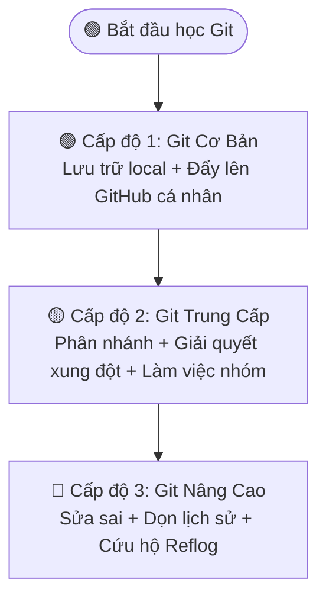

# 🌿 Git & GitHub — Hệ Thống Quản Lý Phiên Bản Thực Chiến

> **Tác giả:** Mr.Rom\
> **Phiên bản:** v3.1.0\
> **Tạo lúc:** 16/05/2026\
> **Cập nhật:** 26/05/2026

> 🎯 *Git là **hệ thống quản lý phiên bản phân tán (Distributed Version Control System)** được sử dụng bởi hơn 90% lập trình viên trên toàn thế giới. Thư mục này chứa lộ trình chinh phục Git từ con số 0 đến chuyên nghiệp, được chia làm 3 phân tầng kỹ năng độc lập, đi kèm hệ thống bài tập trắc nghiệm và thực hành thực chiến.*
>
> 🧭 **Chỉ dẫn cho người học:** Mô-đun kiến thức Git này được thiết kế độc lập. Nếu bạn đang đi theo một Lộ trình sự nghiệp cụ thể (Career Roadmap) tại thư mục `00_roadmaps/`, hãy tập trung chinh phục chặng kỹ năng (Cấp độ) được chỉ định trong Roadmap của bạn, sau đó quay trở lại trang lộ trình đó để tiếp tục cuộc hành trình cá nhân!

---

## 🗺️ Bản Đồ Lộ Trình Chinh Phục Git

---

## 📂 Danh Mục Bài Học & Bài Tập

### 🟢 1. Cấp độ 1: Git Cơ Bản (Dành cho người mới bắt đầu)
*Mục tiêu: Làm quen với việc lưu trữ lịch sử các file đơn giản và đưa lên đám mây.*

| # | Bài Học | Loại | Trạng Thái | Bài Tập & Thực Hành |
|---|---|---|---|---|
| 00 | [What is Git — Bạn mất 1 ngày code cuối tuần](./lessons/01_basic/00_what-is-git.md) | 🌱 Intro | ✅ 🌟 | 📝 [Trắc nghiệm khái niệm](./exercises/01_basic/quiz_basic-concepts.md) |
| 01 | [Init + First Commit — Bạn mở Terminal lần đầu](./lessons/01_basic/01_init-and-first-commit.md) | 🌳 Lesson | ✅ 🌟 | |
| 02 | [Remote & GitHub — Đẩy code lên đám mây (Cơ bản)](./lessons/01_basic/02_remote-and-github-basic.md) | 🌳 Lesson | ✅ 🌟 | 🧪 [Thực hành tạo Portfolio](./exercises/01_basic/lab_my-first-portfolio.md) |

---

### 🟡 2. Cấp độ 2: Git Trung Cấp (Dành cho làm việc nhóm)
*Mục tiêu: Phân nhánh tính năng, giải quyết xung đột khi gộp code, và phối hợp nhóm qua Pull Request.*

| # | Bài Học | Loại | Trạng Thái | Bài Tập & Thực Hành |
|---|---|---|---|---|
| 00 | [Branching & Merging — Bạn thử Google Login an toàn](./lessons/02_intermediate/00_branching-and-merging.md) | 🌳 Lesson | ✅ 🌟 | 📝 [Trắc nghiệm phân nhánh](./exercises/02_intermediate/quiz_branching-and-conflicts.md) |
| 01 | [Resolving Conflicts — Giải quyết xung đột gộp code](./lessons/02_intermediate/01_resolving-conflicts.md) | 🌳 Lesson | ✅ 🌟 | 🧪 [Thực hành gỡ Conflict](./exercises/02_intermediate/lab_conflict-hero.md) |
| 02 | [Collaborative Workflows — Đồng nghiệp join project](./lessons/02_intermediate/02_collaborative-workflows.md) | 🌳 Lesson | ✅ 🌟 | 🧪 [Thực hành làm việc nhóm PR](./exercises/02_intermediate/lab_team-pull-request.md) |

---

### 🔴 3. Cấp độ 3: Git Nâng Cao (Sửa sai & Làm sạch lịch sử)
*Mục tiêu: Sửa sai, phục hồi dữ liệu khẩn cấp và dọn dẹp lịch sử commit chuyên nghiệp.*

| # | Bài Học | Loại | Trạng Thái | Bài Tập & Thực Hành |
|---|---|---|---|---|
| 00 | [Undo & Recovery — Bạn lỡ tay lúc 2h sáng](./lessons/03_advanced/00_undo-and-recovery.md) | 🌳 Lesson | ✅ 🌟 | 🧪 [Thực hành du hành thời gian](./exercises/03_advanced/lab_git-time-traveler.md) |
| 01 | [Advanced Recovery — Cứu hộ thảm họa với Reflog](./lessons/03_advanced/01_advanced-recovery-reflog.md) | 🌳 Lesson | ✅ 🌟 | 🧪 [Thực hành cứu hộ Reflog](./exercises/03_advanced/lab_emergency-reflog-rescue.md) |
| 02 | [Rebase & Cherry-Pick — Làm sạch lịch sử với Rebase & Cherry-Pick](./lessons/03_advanced/02_rebase-and-cherry-pick.md) | 🌳 Lesson | ✅ | |

---

## 🛠️ Thiết lập Môi trường (Setup Guides)
Trước khi bắt đầu, bạn cần cài đặt và cấu hình Git trên máy cá nhân theo hướng dẫn sau:
* 🖥️ **Cài đặt Git 5 OS:** [setup/git.md](./setup/git.md) ✅
* 🔑 **Setup SSH key cho GitHub:** `setup/ssh-key-github.md` ❌ *(Đang soạn thảo)*
* 💻 **Sử dụng GitHub CLI (`gh`):** `setup/github-cli.md` ❌ *(Đang soạn thảo)*

---

## 💡 Khuyến Nghị Công Cụ Học Tập & Tra Cứu
* 🎮 **Học qua trò chơi trực quan:** Sử dụng game [Learn Git Branching](https://learngitbranching.js.org/) để "nhìn thấy" đường đi của các nhánh Git cực kỳ trực quan và sinh động.
* 📖 **Tài liệu tham khảo chính thống:** Đọc cuốn sách [Pro Git tiếng Việt](https://git-scm.com/book/vi/v2) — tài liệu chuẩn hóa và miễn phí từ trang chủ Git.
* 🎨 **Giao diện trực quan thay thế CLI:**
  * Dùng extension **GitLens** hoặc **Git History** tích hợp trực tiếp trong [VS Code setup](../ide/vs-code.md).
  * Sử dụng phần mềm đồ họa [GitHub Desktop](../git-clients/github-desktop.md) dành cho người mới hoặc người lười gõ lệnh CLI.

---

## 📌 Nhật ký thay đổi (Changelog)
- **v3.1.0 (26/05/2026)** — Module Git tập trung dạy Git độc lập từ đầu đến cuối:
  - Gỡ bỏ node Python và các câu chữ liên quan đến lộ trình "Zero-to-Coder" khỏi Git README.
  - Đưa nội dung Git về trạng thái gọn gàng, chỉ tập trung dạy Git cho mọi đối tượng.
- **v3.0.0 (26/05/2026)** — Tái cấu trúc phân tầng Git (Basic / Intermediate / Advanced) và tích hợp bài tập.
- **v2.0.0 (19/05/2026)** — Đưa Git về nhóm nền tảng và chuẩn hoá văn phong.
- **v1.0.0 (16/05/2026)** — Tạo bộ Git cơ bản đầu tiên.
