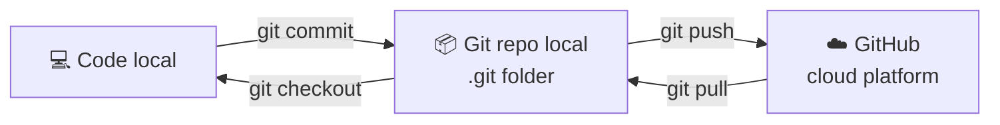
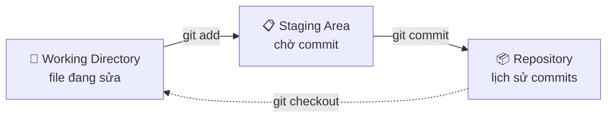
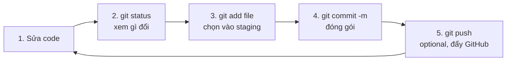

# 🎓 Git là gì? — Máy thời gian cho code của bạn

> **Tác giả:** Mr.Rom\
> **Phiên bản:** v2.0.0\
> **Tạo lúc:** 16/05/2026\
> **Cập nhật:** 24/05/2026\
> **Level:** Basic\
> **Tags:** [MUST-KNOW]\
> **Prerequisites:** Đã [cài Git](../../setup/git.md) ✅

> 🎯 *Bài INTRO — hiểu **Git là gì**, **vì sao mọi coder cần biết**, **mô hình tinh thần** trước khi học lệnh. KHÔNG dạy lệnh chi tiết (sẽ học ở [bài 01](./01_init-and-first-commit.md) trở đi).*

## 🎯 Sau bài này bạn sẽ

- [ ] Hiểu Git là gì + vì sao mọi coder dùng nó hàng ngày
- [ ] Phân biệt rõ **Git** (tool concept) vs **GitHub/GitLab** (platform)
- [ ] Hiểu mô hình **3 vùng**: working directory / staging / repository
- [ ] Hiểu **commit cycle** (workflow lặp lại mỗi ngày)
- [ ] Biết bước kế tiếp là học lệnh gì

---

## Tình huống — tối thứ 6 của bạn

Bạn, junior dev mới đi làm tuần đầu. Tối thứ 6, hoàn thành xong feature đăng nhập, code đang **chạy hoàn hảo**. Sướng quá, đóng máy về cuối tuần.

Sáng thứ 2 quay lại — sếp nói *"feature đăng nhập cũ vẫn ổn, em thử thêm Google login đi"*. Bạn bắt tay viết. 4 tiếng sau...

```
TypeError: Cannot read property 'token' of undefined
```

Code GG login phá luôn login cũ. Bạn thử undo trong VS Code — nhưng đã save + đóng VS Code cả cuối tuần, undo stack mất hết. Tệ hơn: bạn không nhớ chính xác đã sửa những file nào.

→ Bạn phải **viết lại login cũ** từ đầu, mất nguyên ngày làm phí cuối tuần đã code. Lúc nhìn bạn khổ sở, anh senior chỉ buông 1 câu:

> *"Sao em không dùng Git?"*

Câu đó làm bạn nhận ra mình đang code như "không có lưới an toàn". Bạn lên Google. *"Git là gì?"* — và đến đây là lúc bạn sẽ đọc bài này.

---

## 1️⃣ Vậy Git thực sự là gì?

**Trả lời tình huống của bạn**: Git là **lưới an toàn cho code**. Mỗi lần bạn hoàn thành 1 ý tưởng (vd: "login chạy được"), bạn bảo Git *"chụp ảnh"* — đóng gói toàn bộ trạng thái code thành 1 **commit**. Sau này code lỡ hư, bạn quay về commit cũ trong 1 giây. Như bạn: chỉ cần 1 commit "login xong" trước khi bắt đầu thêm Google login → không bao giờ mất 1 ngày work.

🪞 **Ẩn dụ đời thường**: Git giống **máy thời gian cho code**. Mỗi commit là 1 cột mốc — quay về bất kỳ cột mốc nào trong vài giây. Hơn nữa, Git cho phép tạo **nhánh thời gian song song** (branching) — thử idea điên trong nhánh phụ, không ảnh hưởng dòng chính.

**Về kỹ thuật**: Git là một *Distributed Version Control System (DVCS)* — phần mềm theo dõi mọi thay đổi của file/folder theo thời gian, cho phép quay lại version cũ, làm việc nhóm, branching để thử nghiệm. Do Linus Torvalds (cha đẻ Linux) viết năm 2005, hiện 90%+ dev trên thế giới dùng daily.

### Vì sao Git là MUST-KNOW cho mọi nhánh IT?

Không như framework hay ngôn ngữ (Backend dùng Python, Frontend dùng JS, ML dùng Python...), **Git được mọi nhánh dùng**:

| Nhánh | Dùng Git cho |
|---|---|
| Backend / Frontend / Mobile | Quản version code |
| DevOps | GitOps — config = code = version |
| Data Engineer | Quản version SQL, pipeline, DAG |
| Data Scientist / ML | Quản version notebook, experiment, model |
| AI Engineer | Quản prompt, config LLM |
| Security | Audit code change |
| QA | Quản test case, automation script |
| Technical Writer | Quản version doc, sách |

→ **Không học Git = không làm IT được**. Cũng giống không biết bật máy tính.

---

## 2️⃣ Khoan — Git khác GitHub thế nào?

Đây là chỗ 90% beginner nhầm. Đặt thẳng vấn đề:

| | **Git** | **GitHub** |
|---|---|---|
| Bản chất | **Tool / phần mềm** (CLI cài trong máy) | **Website cloud** (github.com) |
| Chạy ở đâu | Máy bạn — local, offline được | Server Microsoft — cần internet |
| Tác giả | Linus Torvalds (2005) | Microsoft (mua từ 2018) |
| Có thay thế? | Mercurial, SVN, Fossil | GitLab, Bitbucket, Gitea, Codeberg |
| Vai trò | **Theo dõi version** code | **Lưu remote + collab + UI** cho Git |
| Phí | Hoàn toàn free open source | Free + paid plans |

🪞 **Ẩn dụ**: Git là **camera chụp ảnh**, GitHub là **Google Photos** lưu cloud. Bạn có thể chụp ảnh mà không upload Google Photos (Git local-only). Nhưng để upload Google Photos, bạn phải có camera trước (cần Git mới push GitHub được).



> 💡 **Bạn có thể dùng Git mà KHÔNG cần GitHub** (project cá nhân local). Nhưng dùng GitHub thì PHẢI có Git. Hiện bài này dạy Git (concept). Tool guide cho [GitHub UI/account/PR](../../../git-clients/github.md) ✅ để riêng.

---

## 3️⃣ Bên dưới Git ngầm chạy ra sao? — Mô hình 3 vùng

Quay lại tình huống đầu bài. Khi bạn sửa file `login.js` và muốn "chụp ảnh" trạng thái này, Git **không chụp tất cả file trong folder ngay** — mà chia thành **3 vùng** rõ rệt:



| Vùng | Là gì | Ẩn dụ |
|---|---|---|
| **Working Directory** | Folder bạn đang làm việc — file trên disk thật | "**Bàn làm việc**" — code đang sửa, đang bừa bộn |
| **Staging Area** (index) | Khu "chờ commit" — file đã chọn để chụp ảnh | "**Khay xếp đồ**" — đồ chuẩn bị đóng hộp |
| **Repository** (.git) | Database lưu mọi commit | "**Tủ kho**" — chứa tất cả "ảnh chụp" lịch sử |

### Ví dụ thực tế — Bạn làm gì với Git

Tình huống: bạn vừa sửa `login.js` và `db.js`, đã chạy test xong, muốn "đóng gói" trạng thái này.

```
Working Directory                Staging Area              Repository (history)
[login.js: đã sửa]               (trống)                   Commit a1b2c3 "init project"
[db.js: đã sửa]                                            
[notes.txt: đã sửa]                                        
```

**Bước 1** — Bạn chỉ muốn đóng gói 2 file `login.js` và `db.js` (file `notes.txt` là ghi chú cá nhân, không muốn lưu):

```bash
git add login.js db.js
```

```
Working Directory                Staging Area              Repository
[login.js: đã sửa]               [login.js staged]         Commit a1b2c3 "init project"
[db.js: đã sửa]                  [db.js staged]            
[notes.txt: đã sửa]              (notes.txt không staged)  
```

**Bước 2** — Bạn commit (đóng gói staging thành 1 ảnh chụp):

```bash
git commit -m "feat: add basic login"
```

```
Working Directory                Staging Area              Repository
[login.js: đã sửa]               (trống)                   Commit a1b2c3 "init project"
[db.js: đã sửa]                                            Commit d4e5f6 "feat: add basic login" ← MỚI
[notes.txt: đã sửa]                                        
```

→ Giờ bạn có **2 cột mốc** trong tủ kho. Có thể tiếp tục thêm Google login mà không sợ — lỗi gì cũng `git checkout d4e5f6` để quay về.

> 💡 *Hiểu được **3 vùng + flow Working → Staging → Repository** là đã **80% Git** rồi. 20% còn lại là branching/merging — sẽ học ở bài 02.*

---

## 4️⃣ Mỗi ngày làm việc trông như thế nào? — Commit cycle

Hiểu 3 vùng rồi, mỗi ngày bạn sẽ lặp lại vòng quay này hàng chục lần:



1. **Sửa code** — viết feature, fix bug, refactor...
2. `git status` — xem Git nhận diện gì thay đổi
3. `git add <file>` — chọn file vào staging
4. `git commit -m "message"` — đóng gói thành 1 commit
5. `git push` — đẩy lên remote (GitHub) — *optional*, để backup + share với team

**Tần suất**: 1 commit mỗi **30 phút - 2 giờ** khi đang code tích cực. Mỗi commit nên là 1 "ý tưởng hoàn chỉnh nhỏ" — "thêm validate email", "fix typo trong README", "refactor function X" — KHÔNG phải "save lúc 3h" (vô nghĩa).

> 💡 *Chi tiết workflow → [bài 01_init-and-first-commit](./01_init-and-first-commit.md).*

---

## 5️⃣ Khái niệm sẽ học chi tiết ở các bài sau

Bài intro này chỉ giới thiệu sơ. Mỗi khái niệm sau có 1 bài học chi tiết riêng:

| Khái niệm | Là gì (1 dòng) | Học sâu ở bài |
|---|---|---|
| **Repository (repo)** | Folder được Git track + thư mục `.git/` ẩn | [01_init-and-first-commit](./01_init-and-first-commit.md) |
| **Commit** | 1 "ảnh chụp" code + metadata (tác giả, time, message) | [01_init-and-first-commit](./01_init-and-first-commit.md) |
| **Branch** | Nhánh phát triển song song — bạn thử Google login mà không phá main | [00_branching-and-merging](../02_intermediate/00_branching-and-merging.md) |
| **Merge** | Gộp 2 branch — sau khi feature xong | [00_branching-and-merging](../02_intermediate/00_branching-and-merging.md) |
| **Conflict** | Khi 2 thay đổi đụng cùng dòng khi merge | [00_branching-and-merging](../02_intermediate/00_branching-and-merging.md) |
| **Remote** | Repo ở server xa (vd GitHub) | [02_remote-and-github-basic](./02_remote-and-github-basic.md) |
| **Push / Pull** | Đẩy / kéo commit giữa local và remote | [02_remote-and-github-basic](./02_remote-and-github-basic.md) |
| **Reset / Revert / Restore** | Undo các kiểu | [00_undo-and-recovery](../03_advanced/00_undo-and-recovery.md) |
| **Rebase / Cherry-pick** | Power user — sửa lịch sử | (advanced, học sau) |

---

## 💡 Câu hỏi beginner hay hỏi

### "Git có giống Dropbox / iCloud không?"

❌ **Không**. Dropbox **tự động sync** mọi thay đổi mỗi vài giây — không có "commit" để chọn cột mốc. Git **có chủ đích** — bạn quyết định khi nào "chụp ảnh", commit có message giải thích, có thể quay về bất kỳ commit nào trong vài giây.

Cụ thể:
- **Dropbox**: file mới nhất luôn ghi đè file cũ. Quay về 30 ngày trước = phải vào history mò.
- **Git**: mỗi commit là 1 ảnh độc lập. `git log` xem toàn bộ lịch sử. `git checkout <hash>` quay về bất kỳ điểm nào.

### "Tôi solo dev, có cần Git không?"

✅ **Có 100%**. 4 lý do:

1. Quay lại version cũ khi đứng giờ — như tình huống ở đầu bài
2. Thử idea trong **branch** riêng, không phá main
3. Lưu lịch sử **lý do** tại sao sửa code (qua commit message)
4. Backup lên GitHub miễn phí + portfolio cho recruiter

### "Git có khó học không?"

🟡 **Phần cơ bản (init/add/commit/push)**: **dễ** — học trong 1-2 ngày làm bài tập.\
🟡 **Phần nâng cao (rebase, cherry-pick, recover dangling commit)**: **lâu hơn** — học khi cần, không vội.\
✅ **Beginner Stage 1**: chỉ cần phần cơ bản — đủ làm 95% công việc daily.

### "Có nên dùng GUI thay CLI?"

🟡 **Cả 2** — không loại trừ nhau:

- **CLI**: hiểu sâu Git, debug tốt, dùng được trên server SSH. Học CLI **trước** để có nền.
- **GUI**: nhanh hơn cho 1 số task (xem history visual, resolve conflict). Cài kèm sau khi đã quen CLI.

→ Bài 01-04 dạy CLI. Tool guide GUI ([GitHub Desktop](../../../git-clients/github-desktop.md), GitKraken — chưa có, Sourcetree — chưa có) tách riêng.

### "Tại sao gọi là 'Git'?"

Linus Torvalds đặt tên này theo nghĩa lóng tiếng Anh: *"git"* = *"thằng ngốc"* / *"thằng không ưa được"*. Linus có câu nổi tiếng: *"I'm an egotistical bastard, and I name all my projects after myself. First Linux, now git."* (Tôi là 1 thằng tự mãn, tôi đặt tên project theo bản thân. Đầu tiên là Linux, giờ là Git.) — tự trêu hài hước.

---

## 🗺️ Lộ trình học tiếp theo

| # | Bài | Học gì | Thời gian |
|---|---|---|---|
| 01 | [Init + First commit](./01_init-and-first-commit.md) | `git init`, `git status`, `git add`, `git commit` — workflow cơ bản | 20 phút |
| 02 | [Remote + GitHub](./02_remote-and-github-basic.md) | `git clone`, `git push`, `git pull`, `git fetch` | 20 phút |
| 03 | [Branching + Merging](../02_intermediate/00_branching-and-merging.md) | `git branch`, `git checkout`, `git merge`, resolve conflict | 25 phút |
| 04 | [Undo + Recovery](../03_advanced/00_undo-and-recovery.md) | `git restore`, `git reset`, `git revert`, recover deleted commit | 25 phút |

→ Học hết 4 bài này là đủ cho **95% công việc daily** của mọi nhánh dev.

---

## 📚 Từ Điển Thuật Ngữ (Glossary)

| EN | VN | Giải thích |
|---|---|---|
| Version Control | Kiểm soát phiên bản | Hệ thống theo dõi mọi thay đổi của file theo thời gian |
| Distributed | Phân tán | Mỗi máy có 1 bản đầy đủ repo (vs Centralized — chỉ server có) |
| Repository (repo) | Kho | Folder được Git track + thư mục `.git/` ẩn |
| Commit | (giữ nguyên) | 1 "ảnh chụp" code tại 1 thời điểm + metadata |
| Working directory | Thư mục làm việc | Folder bạn đang edit file trực tiếp |
| Staging area / Index | Khu vực staging | Vùng chứa file đã chọn để commit |
| Branch | Nhánh | 1 dòng thời gian phát triển song song |
| HEAD | (giữ nguyên) | Con trỏ tới commit hiện tại |
| Remote | Kho từ xa | Repo trên server (GitHub/GitLab/...) |
| Origin | (giữ nguyên) | Tên mặc định của remote chính |
| Clone | Sao chép | Tải bản copy đầy đủ của remote repo về local |
| Push / Pull | Đẩy / Kéo | Đẩy lên / kéo từ remote |
| Conflict | Xung đột | Khi merge có 2 thay đổi đụng cùng dòng |
| Hash / SHA | Mã commit | Chuỗi 40 ký tự định danh duy nhất 1 commit (vd `a1b2c3d...`) |

---

## 🔗 Liên kết & Tài nguyên

### Bài liên quan trong kho

| Hướng | Bài |
|---|---|
| ⬅️ Bài trước | [Setup Git](../../setup/git.md) |
| ➡️ Bài tiếp | [01_init-and-first-commit](./01_init-and-first-commit.md) — workflow đầu tiên |
| 🧠 Trắc nghiệm | [quiz_basic-concepts.md](../../exercises/01_basic/quiz_basic-concepts.md) — Tự kiểm tra nền tảng Git |
| 🗺️ Sitemap Git | [Lộ trình chinh phục Git (README)](../../README.md) |

### Tool guide đào sâu (KHÔNG cần stage này)

| Tool | Khi nào dùng tool guide |
|---|---|
| 🛠️ [GitHub user guide](../../../git-clients/github.md) ✅ | Khi tạo account, setup SSH, dùng PR, GitHub Actions |
| 🛠️ [GitLab user guide](../../../git-clients/gitlab.md) | Nếu company dùng GitLab thay GitHub |
| 🛠️ [GitHub Desktop](../../../git-clients/github-desktop.md) | Beginner muốn GUI thay CLI |
| 🛠️ [So sánh các Git hosting + GUI](../../../git-clients/00_what-is-git-hosting.md) | Khi cần quyết platform/tool dùng |

### 🌐 Tài nguyên tham khảo khác

- [Pro Git Book — tiếng Việt](https://git-scm.com/book/vi/v2) — bible của Git, miễn phí
- [Visualizing Git (interactive)](https://git-school.github.io/visualizing-git/) — xem Git làm gì với mỗi lệnh
- [Oh My Git!](https://ohmygit.org/) — game học Git
- [GitHub Skills](https://skills.github.com/) — interactive course
- [Atlassian Git Tutorials](https://www.atlassian.com/git/tutorials) — visual + tốt cho intermediate
- [Git Immersion](https://gitimmersion.com/) — tutorial từng bước

---

## 📌 Nhật ký thay đổi (Changelog)

- **v2.2.0 (24/05/2026)** — Chuẩn hóa cách xưng hô về người đọc (dùng "bạn" generic), bỏ tên riêng tự bịa. Nội dung kỹ thuật giữ nguyên.

- **v2.0.0 (19/05/2026)** — Viết lại bố cục:
  - Mở bằng **tình huống mất 1 ngày code cuối tuần** dẫn dắt thay vì định nghĩa khô
  - Đổi tiêu đề mục sang **câu hỏi tự nhiên** ("Vậy Git thực sự là gì?", "Khoan — Git khác GitHub thế nào?", "Bên dưới Git ngầm chạy ra sao?")
  - Định nghĩa Git **đến SAU tình huống** — đóng vai "lời giải"
  - Thêm bảng "Vì sao Git là MUST-KNOW cho mọi nhánh IT" — link sang 8 nhánh
  - Thêm câu hỏi mới "Tại sao gọi là 'Git'?" trong FAQ
  - Chuẩn hóa vị trí Git nằm tại `02_tools/git/`
  - Link tool guide GUI (GitHub/GitLab/Desktop) trỏ sang `02_tools/git-clients/` thay vì inline
- **v1.0.0 (16/05/2026)** — Bản đầu tiên.
