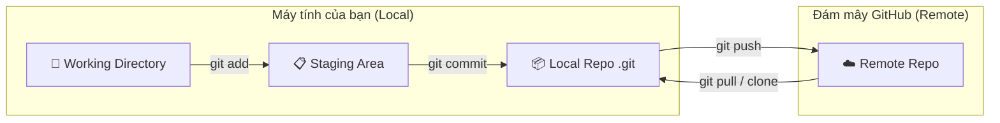

# 🎓 Kết nối GitHub & Đẩy code lên đám mây (Cơ bản)

> **Tác giả:** Mr.Rom\
> **Phiên bản:** v2.0.0\
> **Tạo lúc:** 26/05/2026\
> **Cập nhật:** 26/05/2026\
> **Level:** Basic\
> **Tags:** [MUST-KNOW]\
> **Yêu cầu trước:** [01_init-and-first-commit.md](./01_init-and-first-commit.md) ✅

> 🎯 *Bài học thực chiến — hướng dẫn cách thoát khỏi vùng an toàn "local" để kết nối với đám mây GitHub. Bạn sẽ học cách thiết lập Remote, đẩy (push) dự án đầu tay lên Internet an toàn, giải quyết bài toán xác thực (Authentication) và phòng ngừa cạm bẫy rò rỉ dữ liệu bí mật.*

---

## 🎯 Sau bài này bạn sẽ
- [ ] Phân biệt rõ ràng **Local Repository** (máy cá nhân) và **Remote Repository** (đám mây)
- [ ] Hiểu rõ bản chất của cái tên mặc định **`origin`**
- [ ] Biết cách tạo một repository mới tinh trên GitHub
- [ ] Kết nối thành công Local Git với GitHub bằng 3 phương thức xác thực phổ biến
- [ ] Đẩy (push) thành công dự án local lên GitHub an toàn
- [ ] Biết cách phòng ngừa và ứng cứu khi lỡ tay đẩy file nhạy cảm (`.env`, API Key) lên mạng

---

## Tình huống — Chiếc laptop bốc khói và bài học đắt giá

Bạn vừa code xong một ứng dụng siêu đẹp sau 3 ngày thức đêm. Mọi thứ đã được Git theo dõi (commit) cực kỳ cẩn thận ở máy local. Bạn thở phào nhẹ nhõm, đứng dậy đi pha cốc cà phê. 

Đột nhiên, cốc cà phê trượt tay đổ thẳng vào bàn phím chiếc laptop thân yêu. Tiếng xèo xèo vang lên, màn hình tắt phụt. Sáng hôm sau, thợ sửa máy báo tin buồn: *"Hỏng ổ cứng rồi em ơi, không cứu được dữ liệu đâu."*

```
[🔥 Máy Local hỏng ổ cứng] ───x───> [Mất sạch toàn bộ 3 ngày code của bạn]
```

Bạn rụng rời chân tay. Mặc dù bạn dùng Git rất tốt, nhưng toàn bộ lịch sử Git đó chỉ nằm trên chiếc ổ cứng local đã chết. Lúc này, bạn mới nhận ra một chân lý:

> **Lịch sử Git lưu trữ local rất tốt cho việc sửa sai, nhưng hoàn toàn vô dụng trước tai nạn phần cứng nếu không được sao lưu (backup) lên một máy chủ đám mây từ xa (Remote Server).**

Đó là lý do bạn cần đưa code lên **GitHub** ngay hôm nay.

---

## 1️⃣ Bản chất của Remote Repository — Google Photos cho Code

Như đã giới thiệu ngắn gọn ở bài Intro, để hiểu bản chất của sự đồng bộ này, bạn cần nắm vững mô hình **Local vs Remote**:



🪞 **Ẩn dụ sư phạm dễ hiểu nhất:**
*   **Git Local** giống như **Camera điện thoại** của bạn. Mỗi lần bạn bấm nút chụp (commit), ảnh sẽ được lưu vào bộ nhớ máy. Máy hỏng hoặc mất điện thoại → mất sạch ảnh.
*   **GitHub** giống như dịch vụ **Google Photos (iCloud)**. Bạn chủ động chọn những bức ảnh đẹp nhất để tải lên đám mây (push). Khi đổi điện thoại mới, bạn chỉ cần đăng nhập và tải lại toàn bộ album về (clone/pull).

### Bảng so sánh Local vs Remote

| Đặc tính | Local Repository | Remote Repository (GitHub/GitLab) |
|---|---|---|
| **Nơi lưu trữ** | Ổ cứng máy tính cá nhân của bạn | Máy chủ đám mây (Cloud Server) |
| **Tốc độ thực thi** | Tức thì (micro-giây) vì không cần mạng | Phụ thuộc vào tốc độ đường truyền Internet |
| **Collab (Làm việc nhóm)** | Không thể (chỉ một mình bạn truy cập) | Rất dễ dàng (cho phép cả ngàn người cùng code) |
| **Tính an toàn** | Kém (dễ mất mát do hỏng hóc thiết bị) | Cực cao (hệ thống lưu trữ phân tán, backup liên tục) |

---

## 2️⃣ Origin thực sự là gì?

Khi bạn gõ lệnh đẩy code lên GitHub, bạn thường thấy câu lệnh thần chú này:
```bash
git push -u origin main
```
Nhiều người mới học thuộc lòng lệnh này như một thói quen mà không hiểu **`origin`** là gì. 

> 💡 **Bản chất:** `origin` chỉ đơn giản là một **bí danh (alias / nickname)** đại diện cho đường dẫn URL dài ngoằng của kho chứa từ xa (Remote URL). 

Thay vì mỗi lần đẩy code bạn phải gõ:
```bash
git push https://github.com/romdev/my-first-git-project.git main
```
Bạn chỉ cần khai báo một lần duy nhất: *"Từ nay về sau, đường dẫn `https://github.com/...` sẽ có tên gọi ngắn gọn là `origin`!"*. Lần sau bạn chỉ cần gõ `git push origin main`.

Bạn có thể đặt tên này là `github`, `cloud`, `backup` tùy ý, nhưng **`origin`** là tên mặc định tiêu chuẩn mà Git tự động gán cho bạn.

---

## 3️⃣ Bắt tay vào làm — Đẩy dự án lên GitHub

> 🛠️ **Chuẩn bị:** Đảm bảo máy của bạn đã cài đặt Git và bạn đã đăng ký một tài khoản miễn phí trên [github.com](https://github.com).

### Bước 3.1: Tạo kho chứa (Repository) mới trên GitHub

1.  Đăng nhập vào [github.com](https://github.com).
2.  Nhìn lên góc trên cùng bên phải, click vào dấu **`+`** → Chọn **`New repository`**.
3.  Cấu hình các thông số sau:
    *   **Repository name:** Nhập tên dự án (ví dụ: `my-first-portfolio`).
    *   **Description:** Viết mô tả ngắn (ví dụ: *"Trang Portfolio giới thiệu bản thân đầu tay"*).
    *   **Visibility:** Chọn **Public** (để ai cũng xem được code và làm portfolio tuyển dụng) hoặc **Private** (chỉ mình bạn hoặc người được mời xem được).
    *   ⚠️ **Cực kỳ quan trọng:** **KHÔNG** tích chọn bất kỳ mục nào trong phần *"Initialize this repository with"* (Add a README, Add .gitignore, Choose a license). Vì chúng ta đã có sẵn code ở local, nếu tích chọn sẽ gây lệch lịch sử commit giữa local và remote, dẫn đến lỗi xung đột khi push.
4.  Click nút xanh **`Create repository`**.

Ngay lập tức, GitHub sẽ chuyển bạn đến một trang chứa các hướng dẫn cấu hình. Hãy giữ nguyên trang web đó và mở Terminal lên.

---

### Bước 3.2: Xác thực (Authentication) — Chìa khóa vào cổng GitHub

Vì lý do an ninh, GitHub không cho phép bạn đẩy code ẩn danh. Bạn phải chứng minh *"Tôi chính là chủ sở hữu của tài khoản này"*. Có 3 phương thức xác thực phổ biến nhất hiện nay:

#### 🔐 Cách 1: GitHub CLI (`gh`) — Khuyên dùng cho Beginner
Đây là cách đơn giản và hiện đại nhất, không cần sờ vào mật khẩu hay các khóa mật mã phức tạp.

Gõ lệnh cài đặt GitHub CLI (nếu dùng macOS có Homebrew):
```bash
brew install gh
```

Sau đó chạy lệnh đăng nhập trực quan:
```bash
gh auth login
```

Lúc này, Terminal sẽ hiển thị các câu hỏi tương tác như sau:
```
? What account do you want to log into? GitHub.com
? What is your preferred protocol for Git operations? HTTPS
? Authenticate Git with your GitHub credentials? Yes
? How would you like to authenticate GitHub CLI? Login with a web browser

! First copy your one-time code: A1B2-C3D4
Press Enter to open github.com in your browser... 
```
*   **Giải thích output:** Lệnh `gh auth login` sẽ mở ra một luồng đăng nhập trực quan. Bạn chọn tài khoản `GitHub.com`, giao thức `HTTPS`, đồng ý dùng thông tin đăng nhập và chọn đăng nhập qua Browser. Terminal sẽ cấp cho bạn một mã một lần (One-time code, ví dụ `A1B2-C3D4`). Bạn nhấn Enter, trình duyệt sẽ tự động mở trang xác thực của GitHub, bạn paste mã đó vào và nhấn Approve là đăng nhập thành công 100%!

---

#### 🔑 Cách 2: SSH Key — Khuyên dùng cho chuyên nghiệp & làm việc lâu dài
Phương thức này sử dụng một cặp khóa mật mã (khóa công khai và khóa bí mật) để tự động nhận diện thiết bị của bạn mà không cần đăng nhập lại.

1.  **Tạo cặp khóa SSH mới trên máy tính của bạn:**
    ```bash
    ssh-keygen -t ed25519 -C "email_cua_ban@example.com"
    ```
    *Nhấn Enter liên tục qua các câu hỏi để chọn cấu hình mặc định.*

2.  **Khởi động SSH Agent để quản lý khóa:**
    ```bash
    eval "$(ssh-agent -s)"
    ```
    Output thực tế hiển thị ID tiến trình đang chạy ngầm:
    ```
    Agent pid 54321
    ```
    *   **Giải thích output:** Trạng thái này báo hiệu SSH Agent đã được kích hoạt thành công trên máy của bạn với mã định danh tiến trình (Process ID) là `54321`.

3.  **Thêm khóa bí mật vào SSH Agent:**
    ```bash
    ssh-add ~/.ssh/id_ed25519
    ```

4.  **Copy khóa công khai (Public Key):**
    ```bash
    cat ~/.ssh/id_ed25519.pub
    ```
    Output sẽ in ra một chuỗi mã hóa dài:
    ```
    ssh-ed25519 AAAAC3NzaC1lZDI1NTE5AAAAIKg... email_cua_ban@example.com
    ```
    *Hãy bôi đen và copy toàn bộ chuỗi mã này.*

5.  **Đưa khóa công khai lên GitHub:**
    *   Vào GitHub → Click ảnh đại diện ở góc phải → **`Settings`** → **`SSH and GPG keys`** → Click **`New SSH key`**.
    *   Đặt tiêu đề (Title) đại diện cho máy của bạn (ví dụ: *Macbook Pro M3*).
    *   Dán (Paste) toàn bộ chuỗi khóa đã copy vào ô **`Key`**.
    *   Click **`Add SSH key`** để hoàn tất.

---

### Bước 3.3: Thực thi các lệnh liên kết & Đẩy code

Quay lại Terminal, truy cập vào thư mục dự án local của bạn (thư mục đã có sẵn lịch sử Git ở bài 01):

```bash
cd ~/Desktop/my-first-portfolio
```

#### Lệnh 1: Liên kết Local với URL của GitHub
```bash
git remote add origin https://github.com/your-username/my-first-portfolio.git
```
*(Nếu dùng xác thực SSH ở cách 2, hãy thay bằng đường dẫn SSH dạng: `git@github.com:your-username/my-first-portfolio.git`)*

Kiểm tra xem liên kết đã thành công chưa:
```bash
git remote -v
```
Output thực tế hiển thị các đường dẫn liên kết:
```
origin  https://github.com/your-username/my-first-portfolio.git (fetch)
origin  https://github.com/your-username/my-first-portfolio.git (push)
```
*   **Giải thích output:** Chữ `origin` màu trắng hiển thị song song với hai dòng liên kết `fetch` (tải code về) và `push` (đẩy code đi) xác nhận rằng Local Git đã trỏ đúng tọa độ đến đám mây GitHub.

#### Lệnh 2: Đảm bảo tên nhánh chính là `main`
```bash
git branch -M main
```
*Lệnh này giúp chuyển đổi tên nhánh mặc định từ các phiên bản Git cũ (thường là `master`) sang chuẩn hiện đại nhất là `main`.*

#### Lệnh 3: Đẩy code lên mây lần đầu tiên
```bash
git push -u origin main
```
*   **Giải thích tham số `-u`:** Viết tắt của `--set-upstream`. Tham số này giúp "thiết lập mối quan hệ bền vững" giữa nhánh `main` ở máy local của bạn và nhánh `main` trên GitHub. **Từ lần sau trở đi, mỗi khi code xong, bạn chỉ cần gõ duy nhất lệnh ngắn gọn: `git push` là xong!**

Output thực tế khi push thành công:
```
Enumerating objects: 6, done.
Counting objects: 100% (6/6), done.
Delta compression using up to 8 threads
Compressing objects: 100% (3/3), done.
Writing objects: 100% (6/6), 540 bytes | 540.00 KiB/s, done.
Total 6 (delta 0), reused 0 (delta 0), pack-reused 0
To https://github.com/your-username/my-first-portfolio.git
 * [new branch]      main -> main
branch 'main' set up to track 'origin/main'.
```
*   **Giải thích output:** Trạng thái `Writing objects: 100%` báo hiệu toàn bộ gói dữ liệu chứa code và lịch sử commit của bạn đã được nén và truyền tải thành công qua mạng Internet. Dòng cuối `branch 'main' set up to track 'origin/main'` khẳng định mối quan hệ theo dõi 2 chiều đã được thiết lập hoàn hảo.

F5 lại trang GitHub trên trình duyệt web của bạn → Code của bạn đã nằm kiêu hãnh trên đám mây! 🎉

---

## ⚠️ Cạm bẫy cực kỳ nguy hiểm — Leak thông tin bí mật!

Một trong những thảm họa kinh hoàng nhất của lập trình viên là **vô tình push nhầm các file cấu hình bí mật chứa API keys, mật khẩu database lên GitHub Public**. 

Hacker sử dụng các chương trình quét tự động (bots) chạy liên tục 24/7 để lùng sục các repository public trên GitHub. Chỉ cần bạn vô tình đẩy file `.env` lên mạng 30 giây:

```
[Local .env chứa Stripe API Key] ───git push───> [GitHub Public]
                                                      │
                                            (Quét trong 30 giây)
                                                      ▼
                                         [Hacker rút sạch tiền ví]
```

### Cách phòng vệ tối thượng:
1.  **Luôn tạo file `.gitignore` ngay khi khởi tạo dự án** (`git init`).
2.  Mở file `.gitignore` ra và ghi dòng chữ `.env` vào đó.
3.  Chạy lệnh `git status` để chắc chắn file `.env` không nằm trong danh sách "Untracked files" chờ commit.

### Cách ứng cứu khẩn cấp nếu lỡ tay push lên và bị public:
1.  **Vô hiệu hóa (Rotate) key ngay lập tức:** Hãy lên trang quản trị của dịch vụ (ví dụ: AWS, Stripe, Google) thu hồi khóa cũ và tạo khóa mới. Đây là bước quan trọng nhất vì dữ liệu đã đưa lên mạng coi như đã bị lộ.
2.  **Xóa tệp tin khỏi lịch sử Git:** Dùng công cụ dọn dẹp lịch sử mạnh mẽ như `git-filter-repo` hoặc BFG Repo-Cleaner để xóa sạch dấu vết của tệp tin `.env` trong mọi commit cũ trước đó. Chạy lệnh xóa đơn thuần (`git rm`) không thể cứu bạn vì lịch sử commit cũ vẫn chứa dữ liệu bí mật đó.

---

## 🧠 Tự kiểm tra (Self-check)

**Q1: Nếu tôi sửa đổi code ở máy local nhưng không chạy lệnh `git commit` mà chạy thẳng lệnh `git push` thì code trên GitHub có thay đổi không?**
<details>
<summary>💡 Xem giải thích</summary>

**Hoàn toàn không.** `git push` chỉ đẩy các **commit** đã được đóng gói chính thức trong Local Repository lên đám mây. Nếu bạn sửa code ở Working Directory mà chưa `git add` và `git commit` để tạo "ảnh chụp", Git sẽ báo trạng thái `Everything up-to-date` (Mọi thứ đã được cập nhật) và không có gì được truyền đi cả.

</details>

**Q2: Tên của Remote bắt buộc phải là `origin` hay tôi có thể đặt tên khác?**
<details>
<summary>💡 Xem giải thích</summary>

Bạn hoàn toàn có thể đặt bất kỳ tên gì bạn thích (ví dụ: `git remote add backup-cloud <url>`). Tuy nhiên, `origin` là một quy ước mặc định quốc tế của cộng đồng lập trình viên. Việc giữ tên mặc định giúp các lập trình viên khác khi đọc vào dự án của bạn có thể hiểu ngay lập tức.

</details>

---

## 📚 Từ Điển Thuật Ngữ (Glossary)

| Thuật ngữ | Ý nghĩa kỹ thuật | Ẩn dụ thực tế |
|---|---|---|
| **Remote Repository** | Kho chứa lưu trữ từ xa đặt trên các máy chủ đám mây. | Kho lưu trữ trung tâm của Google Photos. |
| **Origin** | Bí danh mặc định đại diện cho đường dẫn URL của Remote Repository. | Nickname ngắn gọn thay cho địa chỉ nhà dài. |
| **`git push`** | Lệnh đẩy các commit từ Local Repository lên Remote Repository. | Động tác upload ảnh lên Google Photos. |
| **Upstream (`-u`)** | Thiết lập liên kết theo dõi mặc định giữa nhánh local và nhánh remote. | Cài đặt tự động đồng bộ hóa album ảnh của điện thoại. |
| **SSH Key** | Phương thức xác thực an toàn bằng cặp khóa mật mã hóa. | Chìa khóa nhà thông minh tự động nhận dạng chủ nhân. |

---

## 🔗 Liên kết & Tài nguyên

### Bài học & Bài tập liên quan

| Hướng đi | Bài học / Thử thách |
|---|---|
| ⬅️ Bài trước | [01_init-and-first-commit.md](./01_init-and-first-commit.md) — Tạo repo local đầu tiên |
| ➡️ Bài tiếp | [00_branching-and-merging.md](../02_intermediate/00_branching-and-merging.md) — Phân nhánh tính năng an toàn |
| 🧪 Thử thách Labs | [lab_my-first-portfolio.md](../../exercises/01_basic/lab_my-first-portfolio.md) — Xây dựng và đẩy Portfolio lên GitHub |
| 🧠 Trắc nghiệm | [quiz_basic-concepts.md](../../exercises/01_basic/quiz_basic-concepts.md) — Khắc sâu 3 vùng dữ liệu & Quy trình commit |

---

## 📌 Nhật ký thay đổi (Changelog)
- **v2.0.0 (26/05/2026)** — Mr.Rom biên soạn chi tiết toàn bộ bài học lý thuyết về Remote, origin, xác thực an toàn (CLI, SSH) và cạm bẫy rò rỉ dữ liệu nhạy cảm theo chuẩn Blueprint v0.2.0.
